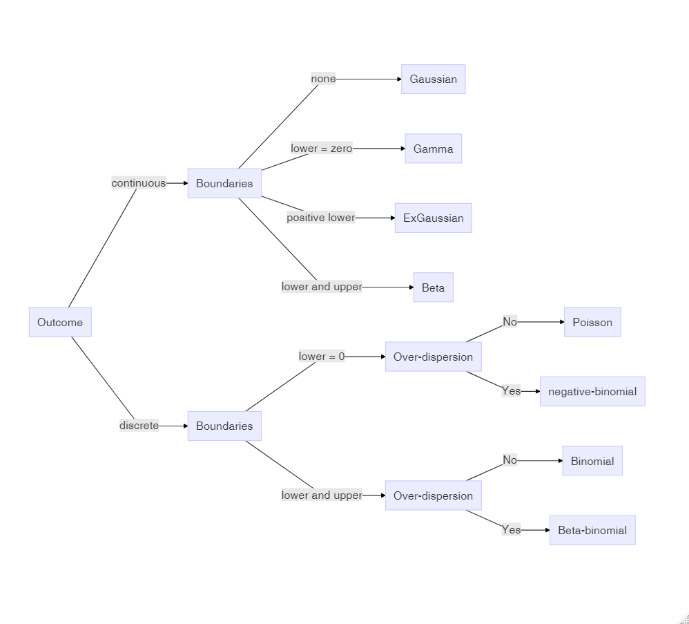

---
output:
  pdf_document: default
  html_document: default
  word_document: default
---
```{r setup, include=FALSE}
knitr::opts_chunk$set(echo = TRUE)
```

# (PART) Abstracts {.unnumbered}

# Introduction

In this chapter I will loosely define the terms of the title: design research, New Statistics and tidy R. Then I give some possible routes through the book, as well as ideas how to use it in the classroom.


# Getting started with R

In this book, we will be using the statistical computing environment R.
R at its core is a programming language that specializes on statistics
and data analysis. Like all modern programming languages, R comes with  
a compiler or interpreter that translates human-writable formal
statements into something a computer understands and can execute. But there is much more: 
R comes with a complete set of *standard packages* that cover common routines in statistical analysis, for
example functions to compute mean and variance, table-like data structures and statistical models.

R is basically a brilliantly designed programming language for Data Science and Statistics. However, many of the
standard packages are an inconsistent and outdated mess. For example, R
comes with a set of commands to import data from various formats (SPSS,
CSV, etc.). Some of these commands produce objects called data.frames,
whereas others return lists of lists. Although one can convert lists
into data frames, it is easier and prevents confusion if all import
functions simply create data frames. 

In the past few years, a single person, Hadley Wickham, has  started an initiative known as the *Tidyverse*. Tidyverse is a setting some new ground rules for dealing with data. 

The result of the new dogma is a fast growing collection of packages that all ground on a coherent and powerful set of principles for data management, and are therefor highly inter-operable. One of the core tidyverse packages is *dplyr* and it introduces a rich, yet intuitive style of data manipulation. 

One of Wickham's first and well-known contributions is the *ggplot*
system for graphics. Ggplot implements a rather abstract framework for data
plots, where all pieces can be combined in a myriad of ways, using a
simple and consistent syntax.


# Elements of Bayesian statistics

As human beings we make our decisions on what has happened to us in the past. For example, we trust a person or a company more, when we can look back at a series of successful transactions. By integrating over all the evidence, we form a view of the world we forage. But, in a variety of situations, the boundaries of the human mind kick in and we make terrible decisions.

The aim of scientific research is to avoid the pitfalls of our minds and act as rational as possible by translating our theory into a formal model of reality, gathering evidence in an unbiased way and weigh the evidence by formal procedures. This weighing of evidence using data essentially is *statistical modeling* and statistical models in this book all produces two sorts of numbers: *magnitude of effects* and *level of certainty*. 

In this chapter the essential concepts of statistics and Bayesian analysis will be introduced from ground up. First we will look at descriptive statistics. In \@ref(bayes-prob-theory) we derive probability from set theory and relative frequencies, before we turn to the the famous Bayes theorem \@ref(bayes-theorem), followed by an introduction to Bayesian thinking \@ref(dynamics-belief).

Section \@ref(statmod) goes into the practical details of modeling. A statistical model is introduced by its two components: the structural part, which typically carries the research question or theory, followed by a rather deep account of the second component of statistical models: the random part.

Despite the matter, I will make minimal use of mathematical formalism. Instead, I use R code as much as possible. 


# Basic Linear models

Linear models answer the question of how one quantitative outcome, say ToT, decreases or increases, when a condition changes. First, I will introduce the most basic LM.
The grand mean model (GMM does not have a single predictors and produces just a single estimate: the grand mean in the population. That can be useful, when there exists an external standard to which the design must adhere to. In R, the GMM has a formula, like this: `ToT ~ 1`. At the example of the GMM, I describe some basic concepts of Bayesian linear models. On the practical side of things, CLU tables are introduced, which is one major work horse to report our results.

The most obvious application of LM comes next: in linear regression models (LRM), a metric predictor (e.g. age) is linked to the outcome by a linear function, such as: $f(x) = \beta_0 + \beta_1x$.
In R, this is: `ToT ~ 1 + age`.
Underneath is a very practical section that explains how simple transformations can make the results of an estimation more clear.
Correlations work in similar situations as LRMs, and it is good to know what the differences and how correlations are linked to linear slope parameters.
I end this section with a warning: the assumption of linearity is limited to a straight line and this is violated not by some, but all possible data.

A very common type of research question is how an outcome changes under different conditions.
In design research this is always the case, when designs are compared.
Expressed as a formula, a *factorial model* looks just like an LRM: `ToT ~ 1 + Design`.
The rest of the section is dedicated to the techniques that make it possible to put a qualitative variable into a linear equation.
Understanding these techniques opens the door to making your own variants that exactly fit your purpose, such as when a factor is ordered and you think of it of as a stairway, rather than treatments.
Finally, we will see how ordered factor models can resolve non-linear relationships, as they appear with learning curves.


# Multi-predictor models

Design researchers are often collecting data under rather wild conditions.
User population of municipal websites, enterprise information systems, cars and consumer products is broad and can therefore be extremely diverse.
At the same time, Designs vary in many attributes, affecting the user in many different ways.
There are many variables in the game, and even more possible relations.
With *multi predictor models* we can examine the simultaneous influence of everything we have recorded.

The first part of the chapter deals with predictors that act independent of each other: 
Section \@ref(mrm) demonstrates how two continuous linear predictors form a surface in a three-dimensional space. Subsequently, we address the case of multi-factorial models (\@ref(mfm)), which are very common in experimental research. In section \@ref(dummy) we have seen how linear models unite factorial with continuous predictors. This lays the ground for combining them into grouped regression models \@ref(grm). 

That being said, in reality it frequently happens that predictors are not acting independent on each other. Rather, the influence of one predictor changes dependent on the value of another predictor. In \@ref(cfxm), conditional effects models will be introduced. As will turn out, by adding conditional effects a linear model is capable of rendering non-linear associations. The final section introduces polynomial regression as a general way to estimate even wildly non-linear relationship between a continuous predictor and the outcome variable.


# Multilevel models


In the previous chapters we have seen several examples of conditional effects: groups of users responding differently to design conditions, such as font size, noise and emerging technology. Dealing with differential design effects seems straight forward: identify the relevant property, record it and add an conditional effect to the model. 

As we will see in this chapter, individual differences can be accounted for and measured accurately without using further predictors. In applied evaluation  studies, what we often really need to know is by *how much* users vary. The key to measuring variation in a population is to create models that operate on the level of participants, in addition to the population level.

The first two sections introduce the basics of estimating multi-level linear models, first introducing intercept-only participant-level effects \@ref(intercept-re) and then slope (or group difference) effects \@ref(slope-re). 

In multi-level linear modeling the levels of the factor, such as individuals, are part of a *population*. What *random effects* do is to assume that factor levels are drawn from an overarching Gaussian distribution. This variance of this distribution is estimated alongside the population-level and participant-level coefficients, which has advantages, as will be discussed in \@ref(pool-shrink). 
We will also return to a the Uncanny Valley, and examine the *universality* of this strange effect \@ref(universality).

Three further sections introduce multi-population multi-level models: In \@ref(non-human-populations) we will use a random effects model with four populations and compare their relative contribution to overall variance in performance. Section \@ref(re_nested) will show how multiple levels can form a  hierarchy and in \@ref(psychometrics) we will see that multi-level models can be employed the development of  *psychometrics tests*, that apply for people. Finally, we will see how to treat tests to compare designs, for which I will coin the term *design-o-metrics* \@ref(designometrix). 


# Generalized Linear Models

In the preceding chapters it was all about specifying an appropriate (and often sophisticated) right-hand side of the regression formula, the predictor term. In this chapter, we will give the outcome variables their due respect. The Gaussian linear model, which we used throughout \@ref(lm) and \@ref(mlm) makes the assumptions of *Linearity*, *Gaussian distribution* of responses and *constant variance*. 

In the next section we will review these assumptions and see that real outcome measures are not Gaussian distributed and that predictors act in a linear way. *Generalized Linear Models* (GLMs) solves some common problems with linearity and gives us more choices on the shape of randomness. 

After we established the elements of the GLM framework \@ref(elements-glm), I will introduce a good dozen  of model families, that leaves little reason to ever fall back to the  Gaussian distributions or data transformations (or non-parametric methods). As we will see, there almost always is a clear candidate that best represents the properties of the outcome variable. Two of the better known GLM families are *Poisson models* for outcome variables that are counted (with no upper limit), like number of errors.  
*Binomial (aka logistic) LM* covers the case of successful task completion in a certain number of trials.

For some other types of outcome variables good defaults have been lacking, such as rating scale responses and ToT measures. Luckily, with recent developments in Bayesian regression engines the choice has become much broader. For RT and ToT, I will suggest exponentially-modified Gaussian *(ExGauss)* models or, to some extent, *Gamma* models. For  rating scales, where responses fall into a few ordered categories, *ordinal logistic regression* is a generally accepted approach, but for (quasi)continuous rating scales I will introduce a rather novel approach, *Beta regression*.

Too many choices can be a burden, but as we will see, most of the time the appropriate model family is obvious. For the impatient readers, here is the recipe: Answer the following three questions about the outcome variable and follow (Figure \@ref(fig:glm-decision)).

1. Is the outcome variable discrete or continuous?
1. What are the lower and upper boundaries of outcome measures?
1. Can we expect over-dispersion?

```{r glm-decision, fig.cap = "Decision chart for Generalized Linear Models", echo = F}

```


```{r echo = F, eval = F}
DiagrammeR::mermaid("
graph TD
S[Measure] -->|continuous| C[Boundaries]
C -->|none| Gaussian[Gaussian]
C -->|lower = zero| Gamma[Gamma]
C -->|positive lower| ExGaussian[ExGaussian]
C -->|lower and upper| Beta[Beta]

S -->|discrete| D[Boundaries]
D -->|lower = 0| OD1[Over-dispersion]
OD1 -->|No| Poisson[Poisson]
OD1 -->|Yes| Negbinom[negative-binomial]

D -->|lower and upper| U[Over-dispersion]
U -->|No| Binomial[Binomial]
U -->|Yes| Betabinom[Beta-binomial]
")
```


# Working with models

In chapters \@ref(lm) and \@ref(mlm), we have seen a marvelous variety of models spawning from just two basic principles, linear combination of multiple effects and Gaussian distribution. Chapter \@ref(glm) further expanded the variety of models, letting us choose response  distributions that sit snug on the outcome variable. This chapter, is dedicated to methods that assess how snug a model is.

We begin with  model criticsm \@ref(model-criticism), where we examine one model at a time and visually explore how well it fits our data. This section only refers to the Gaussian population-level linear models from \@ref(lm), making it a good follow-up for readers who have just worked through that chapter. Graphical methods to assess *goodness-of-fit* and shape of *residuals* will be introduced.

In section \@ref(model-selection) we turn to the comparison of multiple models and we will see that the best model can be defined as the one that creates the most accurate *forecasts*. It turns out that goodness-of-fit is not sufficient for forecasting accuracy, but must be balanced by *model parsimony*. Leave-one-out cross validation \@ref(cross-validation) is a general technique for estimating forecasting accuracy, but is also very computing intensive. In many cases *information criteria* approximate the relative accuracy of models well and are blazing fast. We will see that modern Bayesian information criteria, such as the WAIC, apply to a huge class of models, including all linear and linearized, multi-level and distributional models introduced throughout the book. We will revisit earlier cases and use model selection to justify choices between models, we made earlier in this book.

While the primary aim of model selection in New Statistics is drawing quantitative conclusions from data, in \@ref(testing-theories) and \@ref(bayes-factor) I will show how model selection applies to statistical *hypothesis testing*.

