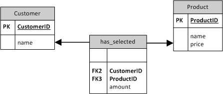
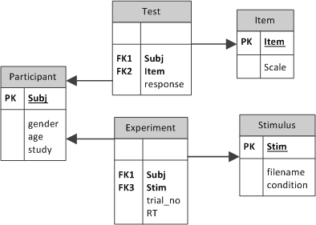

# (PART) Workflow {-}

```{r setup, 	message = FALSE,	warning = FALSE,	include = FALSE}
## The following is for running the script through knitr
purp.mcmc = F
source("RMDR.R")

load_CE(Hugme)

figr <- function(x) x
```


# Data management

## Populations and Entities

## Reshaping data

It will be very convenient to have  a set of clean entity tables at the beginning of the data analysis. Unfortunately, data often arrives in such a tidy form. In particular,  questionnaire responses notoriously arrives in a wide form and psychometricians tend to think in terms of response matrices.

<!-- ... -->


## Encounters and joins


## Rating scale responses

When participants fill out a rating scale, a human sample encounters a set of items. Therefore, we wish two entity tables and a long encounter table. When responses are collected on paper, the best strategy is to create both entity tables, expand them to an empty encounter table and let a student fill it in.

```{r}
attach(Hugme)
```


```{r}
D_resp_input <-
  expand_grid(Part = D_Part$Part, Item = D_Items$Item) %>% 
  mutate(response = "") %>% 
  as_tbl_obs() %>% 
  print()
```

```{r}
detach(Hugme)
```

However, ever more often, researchers use web-based survey software to admininster questionnaires and often demographic variables are gathered along the way. These systems typically output responses in wide format not unsimilar to the following:

```{r}
colnames(R_quest)
```

For the demographic data, there is no repeated measures and we can extract the participant entity table in a straight-forward manner:

```{r}
D_Part <- 
  R_quest %>% 
  select(Part = UserID, Gender, age = Age) %>% 
  as_tbl_obs() %>% 
  print()
```

Notice that there is a reason for the wide format, as the variable Gender has a non-numerical data type. In the long form it is required that all measures are of the same type.

Items are stored wide and reshaping is required, but not sufficient, as item attributes are encoded in the variable names. In this case, two attributes are stored: first, the scale (Geek or NCS). Second, the Geekism scale has been presented a second time (GeekR), in order to assess test-retest reliability. While one could first extract the entity table, it is more practical to start with reshaping and processing the observations table.

The moment of assessment is extracted and put into a separate variable *session* and the GeekR items are renamed. That is a task for *regular expression* pattern matching.

```{r}
D_quest <- 
  R_quest %>% 
  select(Part = UserID, Geek01:Geek34, GeekR01:GeekR34, NCS01:NCS18) %>% 
  gather(Item_raw, response, -Part) %>% 
  mutate(Scale = str_extract(Item_raw, "Geek|NCS"),
         Item_no = str_extract(Item_raw, "\\d{2}"),
         Item = str_c(Scale, Item_no),
         session = if_else(str_detect(Item_raw, "GeekR"), 2, 1 )) %>% 
  select(Part, Item, session, response) %>% 
  as_tbl_obs() %>% 
  print()
  
```

Now, we can extract an entity table `D_Item` that assigns items to their scale:

```{r}
D_Item <- 
  D_quest %>% 
  distinct(Item) %>%
  mutate(Scale = str_extract(Item, "Geek|NCS"))

sample_n(D_Item, 5)
```


The three resulting tables are minimal in that they provide completely distinct information: `D_Part` only contains elementary information on participants, `D_Item` links items to their respective scale and `D_quest` only deals with the encounter of participants and items. It would have been possible to leave the variable Scale in `D_quest` and not even create the entity table. However, this table can be used to store additional information, such as sub-scales or whether an item is reversed.

For the data analysis these tables can be shaped joined together in various ways, depending on the relationships the researcher wants to examine. In the following example,  the researcher wants to examine the test-retest reliability of the geekism scales and the association between Geek and NCS. That is accomplished by joining with `D_Item`, computing the mean score per participant and session and make it wide:

```{r}
D_scores <-
  D_quest %>% 
  left_join(D_Item) %>%
  #filter(Scale == "Geek") %>% 
  group_by(Part, Scale, session) %>% 
  summarize(score = mean(response, na.rm = T)) %>% 
  ungroup() %>% 
  mutate(Scale = str_c(Scale, session)) %>% 
  select(Part, Scale, score) %>% 
  tidyr::spread(Scale, score) 

D_scores %>% 
  select(-Part) %>% 
  cor(use = "complete.obs")

  
```

Another way to put `D_scores` to use is to examine the association between personality scores and demographic variables that are in `D_Part`. For example, are boys really more geeky than girls?

```{r}
D_Part %>% 
  join(D_scores, by = "Part") %>% 
  ggplot(aes(x = Gender, y = Geek1)) +
  geom_boxplot()
```

It seems a little overdone to create a separate entity table for items as the only property is the scale it belongs to. In fact, there is more you can do with it. For example:

+ some scales use reversed  items to prevent automatisms. For the data analysis they have to be aligned and `D_Item` is a good place to keep book of it.
+ Many scales have sub-scales. If that matters, `D_Item` just gains another grouping variable.

There even is a case for going one more level up in abstraction and use an entity table for scales. It frequently  happens that rating scales differ in range (of ordinal response categories). Sometimes ordinal response are coded from 1 to 5, sometimes 1 to 7 and an analogue scales could range from 0 to 1. It is practical, though, to normalize rating scale responses  during the data cleaning process. So, where to store the range? In `D_scales`:

```{r}
D_scales <-
  tribble(~Scale, ~min, ~max,
          "NCS" ,    1,    5,
          "Geek",    1,    7)
```


Returning to the original problem of a hybrid experimental/survey study, what are the entities? Clearly, participants are entities. The second set of entities are the items of personality questionnaires, and the data we can conceive as the *encounter of items and participants* that results in participants-by-items responses.

```{r fig_questionnaire_entity, opts.label = "fig.wide"}
attach(Hugme)

T_some_items <-
  HUG3_resp %>% 
  select(Item, Scale) %>% 
  distinct() %>% 
  filter(Item %in% c("Geek01", "Geek02", "NCS01"))

T_some_part <-
  HUG_part %>% 
  slice(1:3)

T_some_resp <-
  expand.grid(Part = T_some_part$Part,
              Item = T_some_items$Item) %>% 
  left_join(T_some_part) %>% 
  left_join(T_some_items) %>% 
  mutate(rating = round(runif(9, 1,7), 0)) %>% 
  select(Part, Item, Scale, rating)

grid.arrange(
  T_some_part %>% gtable(plot = F),
  T_some_items %>% gtable(plot = F),
  T_some_resp %>% gtable(plot = F),
  layout_matrix = rbind(c(1,3), c(2,3))
)


```


So, according to the ERM framework, we are going to have two separate entity tables, at least. The *participants table* has one row per participant, identified by a unique participant ID, and all singular attributes of participants, like gender, age etc. The *items table* carries the questionnaires. Items are uniquely identified by an ID. When several scales are used, it is recommended to add a separate factor variable assigning an item to a scale. This can creates some redundancy as the item name might already identify the scale. As we will later see, this Scale variable is very useful for calculating the aggregated scores. `r figr("fig_questionnaire_entity")`  gives the smallest possible item table, but further useful information about items can be added as variables, such as: 

+ item text in all used language
+ item labels
+ if an item is reversed or not 
+ the position of an item in the questionnaire
+ any sub scale (or sub sub scale) the item belongs to

Finally, the *questionnaire table* stores the "encounter" between participants and items in the study. In ERM speak it is a *relationship table*, as it borrows entities and their keys from participants and items. The so-called *foreign key* is the combination of participants and items. Like with the entity tables, it is important that every observation (that is a response of one participant to one item) is uniquely identified by the foreign key.

In more complicated cases, the combination of participant and item might not identify every observation uniquely. For example, a preferred method to assess a questionnaires reliability is to repeat the measurement in a second session. If we would use the item table as in `r figr("fig_questionnaire_entity")`, the observations were no longer uniquely identified, as all participants encounter every item twice. As a solution one would simply extend the key of the table by a variable called `session`.

## Modelling experimental responses

Storing experimental data follows the same principles as for questionnaire data. In terms of ERM an experiment is a relationship, the encounter, between participants and experimental stimuli. Consequently, the complete data model will comprise two entity tables, participants and stimuli, and one relationship table for the experiment.  However, depending on the design of the experiment and the nature of stimuli, we can distinguish several variations. These variations regard

1. the identity versus exchangeability of stimuli
2. the research design


```{r fig_experiment_exchangeable_data_model, opts.label = "fig.wide"}
T_exchangeable_between_subj_part <-
  data_frame(Part = as.factor(c(1:3)),
             Gender = c("f","m","m"),
             age = c(23,22,26),
             Group = as.factor(c("gamer", "gamer", "no_gamer")))

T_exchangeable_between_subj_exp <-
  expand.grid(Participant = as.factor(c(1:3)),
              position = 1:3) %>% 
  mutate(waiting_time = runif(9, 10, 60),
         RT = brms::rexgaussian(9, 200, 20, 100))

grid.arrange(T_exchangeable_between_subj_part %>% gtable(plot = F),
             T_exchangeable_between_subj_exp %>% gtable(plot = F),
             ncol = 2)

```
```{r}
detach(Hugme)
```


The model gets just slightly more complex when the experiment comprises a condition. Assume an experiment that examines the difference in vigilance between gamers and non-gamers. As this is a between-subject design, the condition is assigned to the participant table, as is shown in `r figr("fig_experiment_exchangeable_data_model")`. Note that the experiment table only contains the absolute necessary attributes, namely all information that characterizes the encounter itself. Of course, for the data analysis we need a table that contains information on participants as well. A later section will show how to combine and manipulate data from separate tables.

```{r fig_experiment_Stroop, opts.label = "fig.wide"}
T_Stroop_part <-
  data_frame(Part = as.factor(c(1:3)),
             Gender = c("f","m","m"),
             age = c(23,22,26))

T_Stroop_stim <-
  data_frame(Stim = as.factor(1:4),
             Word = c("red", "blue", "wood", "dog"),
             Color = c("red","green","blue", "green"),
             Condition = ifelse(Word == Color, "congruent",
                                ifelse(Word %in% c("red", "green", "blue"), "congruent",
                                       "neutral")))
T_Stroop_exp <-
  expand.grid(Part = as.factor(c(1:3)),
              Stim = as.factor(c(1:4))) %>% 
  mutate(RT = brms::rexgaussian(n(), 200, 20, 100 )) %>% 
  arrange(Part) %>% 
  slice(1:9)

grid.arrange(
  T_Stroop_part %>% gtable(plot = F),
  T_Stroop_stim %>% gtable(plot = F),
  T_Stroop_exp %>% gtable(plot = F),
  layout_matrix = rbind(c(1,3), c(2,3))
)

```


In other experiments stimuli are not exchangeable at all, but have a clear identity. Typically this is the case when stimuli are not strictly designed, but taken from a natural population of stimuli, such as words or statements (from a language) and pictures (of faces, websites, objects etc.). Take as an example, the classic Stroop experiment, where participants respond to the color a word is shown in. A typical finding is that when the word denotes an incongruent color (like the word "yellow" in red letters), then response times are delayed as when the word is congruent or just neutral. Most experimenters would probably just record the condition of presentation (congruent, incongruent or neutral). However, it could be worth the effort to be able to distinguish between words. Imagine in a Stroop experiment the word "wood" were used in the neutral condition. One could then well argue whether this word was neutral, indeed, as trees are associated with green color. Only if the identity of word stimuli is preserved in the data, is this a testable issue, and only then would the experimenter be able to remove the critical trials from the data set.

In the HUG3 experiment, the semantic Stroop task was used to detect whether a person feels attarcted by computers as objects of playful exploration and intellectual challenge. The stimuli were rather complex: first, a picture was shown, then a word was displayed and the participant had to respond to the color. The idea behind the semantic Stroop task is that a strong semnatic association between picture and word would cause a moment of distraction. Delayed responses on pictures of computers followed by words such as "playful" or "challenging" is therefore taken as an indicator for a person's computer enthusiasm (or: geekism).

```{r fig_HUG3_experiment_data_model, opts.label = "fig.wide"}
T_SemStroop_part <-
  data_frame(Part = as.factor(c(1:3)),
             Gender = c("f","m","m"),
             age = c(23,22,26),
             Study = c("psy", "cs", "psy"))

T_SemStroop_word <-
  data_frame(Word_EN = c("mastering", "chic", "useful", "adapting"),
             Word_NL = c("behappen", "vlot", "nuttig", "aanpassen"),
             word_cat = c("geek", "hedonist", "utility", "geek"))


T_SemStroop_prime <-
  data_frame(Prime = c("img001.png", "img002.png", "img003.png", "img004.png"),
             Prime_cat = c("geek", "control", "geek", "neutral"))

T_SemStroop_stim <-
expand.grid(Prime = unique(T_SemStroop_prime$Prime),
            Word_EN = unique(T_SemStroop_word$Word_EN),
            stringsAsFactors = F) %>% 
  slice(c(1,6,9,13)) %>% 
#   left_join(T_SemStroop_prime) %>% 
#   left_join(T_SemStroop_word) %>% 
  mutate(Stim = as.factor(row_number())) %>% 
  select(3,1,2)

T_SemStroop_exp <-
  expand.grid(Part = as.factor(c(1:3)),
              Stim = as.factor(1:4)) %>% 
  arrange(Part) %>% 
  group_by(Part) %>% 
  mutate(position = sample(1:4,4)) %>% 
  ungroup() %>% 
  mutate(RT = brms::rexgaussian(n(), 700, 20, 100 )) %>% 
  arrange(Part, position) %>% 
  slice(1:9)

grid.arrange(
  T_SemStroop_part %>% gtable(plot = F),
  T_SemStroop_word %>% gtable(plot = F),
  T_SemStroop_prime %>% gtable(plot = F),
  T_SemStroop_stim %>% gtable(plot = F),
  T_SemStroop_exp %>% gtable(plot = F),
  layout_matrix = rbind(c(1,2,5), c(3,4,5))
)

```


Both, prime pictures and target words were collected upfront and classified. As shown in `r figr("fig_HUG3_experiment_data_model")`, the data model for this experiment consists of three entity tables (participants, pictures and words), one intermediate relationship table for stimuli and finaqlly the experiment table. As color only plays a minor role (the classic Stroop conditions no longer apply), it is not recorded in the target word table, but is generated during the experiment and could be recorded in the experiment table. Still, we could think of other properties of words to be added, such as word length an familiarity (as potential control variables), or as shown,  translations for another languages.

## Modelling design studies (tbd)

Design studies assess how users respond to designs. Typically, in such a test, users encounter a set of tasks. The situation is similar to that of questionnaires: a participant encounters several tasks, which  may differ in relevant respects, like difficulty, length or how much it triggers frustration.

## Modelling organizational structures (tbd)

## Modelling longitudinal data (tbd)


## Reshaping data

After all data has been imported, we have two data files, that we need to merge and transform for the final analysis. Before we come to that, some more processing is required on the questionnaire data for turning the raw responses into workable scores. All the needed information is stored in the *items table*, which we have to join with the questionnaire data first. Then, we proceed in three steps:

1. reversely coded items are handled
2. scores are rescaled to the interval $[-1;1]$
3. scores are created by averaging over items

The result of the processing chain is a data frame `UC_scores` that contains exactly one score per participant and scale.

*Note* that I am here making the assumption that personality scores are predictors. This is may not be the case if associations between personality factors are studied, or in longitudinal studies.

```{r process_questionnaire, opts.label = "rtut", eval = F}
UC_scores <- 
  UC_resp %>% 
  left_join(UC_items, by = "Item") %>% 
  mutate(response = ((response - minValue) * 2/(maxValue - minValue) - 1) * reverse) %>% 
  group_by(Participant, Scale) %>% 
  summarize(score = mean(response, na.rm = T)) %>% 
  ungroup()

UC_scores %>% sample_n(10)
```

The first operation in the above command chain is `left_join`, which has the effect, that all columns of *UC_items* (Scale, nimValue, maxValue, reverse) are added to *UC_resp*, where they match by Item. `left_join()` is one of several functions for joining tables. A join usually operates on the identifiers that the two input tables have in common, here *Item*. The various join commands differ in how they deal with rows that are present in the one table, but not in the the other. `left_join()` preserves all identities from the left table (first argument or "piped in"), even if they are not present in the  right table. Missing values (`NA`) are used to fill the gaps. Identities that are only present in the right table are being dropped. A `right_join()` does the exact opposite and `full_join()` preserves all identities from both tables. `inner_join()` only uses identities that are present in both tables. `anti_join()` is a useful function for diagnosting errors, because it returns the identities that are not present in both tables.

The second element in the chain is another call to `mutate()`. It uses *minValue* and *maxValue* and *reversed* to normalize all responses to consistently be in the interval $[0;1]$ and have the correct direction. Often, this transformation is more cosmetic, but here it is necessary, as one of the scales (arem) has items with differing ranges.

The subsequent `group_by()` declares a grouping structure on the observations. Here we want to compute the scores as the average on all items per participant, per scale. The `group_by()` is followed by `summarize()`, which computes the mean. The final command `ungroup()` turns the result into a regular data frame, which now has two key variables (Participant, Scale) and the average score. Note the argument `na.rm = T` used with `mean()`. Many commands that summarize a vector of numbers, such as `mean()`, `sum()`, `var()` and `sd()`, play it extremely safe in returning `NA`, when there is a single missing value. That is in so far good behaviour, as it reminds the researcher that missing values are present. The `na.rm = T` argument makes the functions ignore missing values.

After preparing the questionnaire data, we are now left with two data tables *UC_exp* and *UC_resp* that are both organized by one-row-per-observation principle and have the key Participant in common. In general, the further shaping of data depends on the research question and on the choice of a dependent variable. The purpose of the uncanny valley study is to predict the eeriness ratings of morphed faces by the personality and attitude scores. Accordingly, the eeriness ratings are the dependent variable and we leave the structure of the table *UC_exp* intact, while joining in the personality scores.

```{r UC_join_exp_resp, opts.label = "rtut", eval = F}
UC_1 <- 
  UC_exp %>% 
  join(UC_scores, by = "Participant")


```


The process of **data modelling** starts with analyzing a domain of concepts (of interest), by identifying the properties of concepts as well as the relationships between concepts. The results of the analysis is then formalized using one of several possible standards. Most of the time, the formalization is computer-readable or computer executable. Here, I first introduce the formalization approach of Entity-Relationship Modelling and demonstrate how this approach is handled in R, using data frames and data transformations.

In statistical analysis, a good data model has three qualities:
  
  1. efficient and accurate data entry
  2. all information is preserved
  3. efficient reshaping of data for subsequent analyses
  
Let us first consider the task of data entry and further describe what "efficiently and accurately" means here: first of all, data entry is more efficient if you have to type less. In consequence, every datum should be entered only once. That saves key presses and also reduces the risk of erroneous input, hence better accuracy. Furthermore, during the process of data entry, as much information as possible should be preserved. That regards two aspects, one should not do any aggregation during data entry. For example, the individual responses to several items of a scale should be kept and not just summed up. Second, all known, even secondary aspects of the data should be kept, such as the order of responses in an experiment.  Also, relations in the data must be kept. Obviously, the identity of a participant needs to be kept for examining associations. A less obvious example is one should keep detailed information about stimuli and items of rating scales.

Now, consider the following situation: you want to validate a new personality scale using real behavioural measures. By *real* I mean that you are not just correlating the scores with scores from another rating scale, but you predict that the trait at question has impact on how people behave in an experimental task. For example, Schmettow, Mundt & Noordzij (2013) tested whether persons with high need for cognition (NFC) have stronger associations with pictures showing computers with open cases (treatment), as compared to control pictures. This study uses data from three sources: 

1. the experimental data consists of dozens or hundreds of trials per participant with a response (correct/incorrect or RT).
2. the questionnaire data consists of every participants ratings on a numnber of given items
3. demographic data captures the usual variables such as gender, age or level of education

Are you a former SPSS user, perhaps? Then, please, take a moment, a sheet and a pencil, and think about how you would structure the data from the hybrid questionnaire/experimental study. I bet, that you attempted to create *one* table that has one row per participant and is very wide, because you have assigned a column for every item and every trial of the experiment. This is the data format dictated by many of the legacy dialogues in SPSS and other statistical programs. Unfortunately, this format has severe limitations: you can add as many variables that "belong" to participants, e.g. their field of study, but you cannot properly record properties of other entities, such as stimuli or items. To give an almost trivial example: the depicted experiment  used a randomized order for the pictures to occur. There might be training effects, which you may want to control (i.e. add as a covariate to your model). But, in the wide scheme you can either use the order of columns to represent the order of stimulus presentations or the target words, but not both.

Now, I will briefly present a framework for structuring (and using) data that is called *entity relationship modelling (ERM)*. ERM comes from computer science, more specifically the field of databases. In modern software systems, databases contain huge amount of data with often extremely complex relationships. As the name says, the ERM approach handles complex data by decomposition into *entities* and *relationships*. Take as an example, the data base of a company selling products to customers. The data base will contain, at least, two entities: customers and products. In the very moment the customer enters the checkout, there must be a data structure represent the shopping cart. Formally, shopping cart structure relates customers to products, in plain words: "customer x has selected products a and b". Now, returning to the wide format, this would still be possible: you simply had to create a (huge) table with all customers in rows and all (ten thousands) products in columns. To indicate that a customer has selected products a and b, mark the respective cells with 1, and leave all other cells at 0. 

```{r tab_shopping_cart_wide_table, opts.label = "fig.small"}
data.frame(Customer = c("...", "X", "Y", "Z"), 
           Prod_a = c("...", "1", "0", "0"), 
           Prod_b = c("...", "1", "0", "1"),
           Prod_c = c("...", "0", "0", "0"),
           "Prod_..." = c("...", "0", "0", "0")) %>% 
  gtable()

```

However, in this structure it would not be possible to reasonably store the price of the product, or any  other product information. And the problem becomes completely intractable when we consider all the other entities that play a role in the process, for example the fact that the same customer can have different addresses.

So, what is done in data modelling, is that *multiple tables* are being used. Áll classes of entities, customer and product, or participant and stimulus, get their own table. And, what you may find surprising at first, most relationships get their own tables, too. In the shopping cart example, we have two entities, *Customer* and *Product*, and the relationship *has_selected*. As you can see in `r figr("tab_shopping_cart_wide_table")`, properties can be attached to entities, for example, customers have names and products have prices. These properties are called *attributes*. However, there is a twist. Could one not consider the selected products as a property, and use such an attribute? There are theoretical and practical reasons, not to do so. Here, it should suffice to  state the following rule, for when a property is an attribute, and when it is a relationship: first, the property must be expressable as a singular value, such as a number, a piece of text, or a factor level. Second, the value must be literal, in the sense that it does not represent another complex entity. If a property is atomic and literal, it can be added as an attribute to the entity and will later become a column in the respective data table. 

We will return to representation of complex properties, soon. But, first we need to introduce a concept of ERM, that literally ties everything together: *keys* are unique identifier of entities. Because natural names of persons and things are often, but not always unique (think of "John Smith"), most of the time, one chooses a numerical counter as a key, like a customer ID or product number. In ERM, the attribute that uniquely identifies an entity is called the *primary key (PK)*. These keys are used for identification, but also for marking relations between entities. In Figure XY, the relation `has_selected` identifies the customer, as well as the product. These references to entities are called *foreign keys (FK)*. 

By using entities with PK and establishing relations by FK, one avoids any redundancy as much as possible. As a general rule, when instantiating an entity-relationship model, one must create one table per entity and one table per relationship. There is only one exception from this rule, which has to do with the *cardinality* of a relation. The `has_selected` relationship as we have modelled it, allows that several customers select the same product, and that one customer selects multiple products. This is called an *n:m* relationship, which is the most general case. However, other cardinalities exist: consider the entity relationship model of a family tree. This model, will for certain have a entity `person`. But, do we need a seperate table for the relationship `is_child_of`? The answer is: no, because the property is singular, so we could just add it as an attribute, if it were also literal. It is not, which in the context here is just a formal issue. Still, in case of *n:1* relationships, we can add the foreign key directly to the entity. It is just not called an attribute, but a FK. There would be no harm done in terms of adding redundancy.




## Doing it in R

Now that we have seen how to structure data in various research situations, we will see how this works out in R. I will demonstrate the full workflow by example of a hybrid questionnaire/experimental study that explored in how much the *uncanny valley* phenomenon depends on attitude and personality. Participants were asked to fill out five personality scales and completed an experiment, where they rated morphing sequences of faces using items of the eeriness scale.



### Creating and reading data

We start by creating an item table in Excel, using the following structure:

* *Scale* identifies the scale an item belongs to
* *Item* is the item name
* *Label* is a short phrase representing the item content
* *reverse* is set to -1, when an item is reversed, otherwise 1
* *minValue* and *maxValue* give the range of possible responses


Then we read the item table into R, create an empty data frame for the planned 42 participants and write it to an Excel file. In the process, we add a few demographic variables, like  *Gender* and *Age*.

```{r opts.label = "rtut", root.dir = "external_data/UC2/", eval = F}
setwd("external_data/UC2/")
## reading in the items table
UC_items <- 
  read.xlsx(xlsxFile = "UC_items.xlsx")

UC_items %>% 
    slice(c(1:4, 13:16, 23))


## generating the questionnaire table with all participant-item combinations
## and an empty response column
UC_resp <- 
  expand.grid(Participant = 1:42,
              Item = UC_items$Item) %>% 
  arrange(Participant, Item) %>% 
  mutate(response = "")

## printing a random selection of rows for control
UC_resp %>% 
  sample_n(10)

## preparing an Excel file
UC_resp %>% 
  write.xlsx(file = "UC_resp_empty.xlsx")

UC_resp %>% 
  mascutils:::as_tbl_obs.tbl_df()
```


The above code used a few commands for data creation and manipulation that I will now briefly explain. First, `expand.grid(Participant = ..., Item = ...)` creates a long data frame with all possible combinations of the given levels of the given variables (here: Participant, Item). The resulting data frame is then chained into another data transformation command: `arrange` orders a data frame by the given variables (here: Participant, then Item), and outputs the re-arranged data frame. Then, `mutate` adds new variables to the data frame. Often `mutate` is used to alter variables or compute new ones. When creating the empty response table, it is trivially used to newly create the variable for responses, which is manually entered. The full chain, from making the grid to creating the empty response variable is then stored in the variable `UC_resp`

The next command, `sample_n()`, randomly selects a number of rows from a data frame and outputs it as a data frame. Here I used it to illustrate the structure by a few examples observations. The advantage above the more common use of `summary` is that, seeing individual observations hints you at the grouping structure. Even the small sample shown here, its is easily conveyed that observations are "cross-classified" by participants and items, as we wanted it to be. In interactive programming with R, it is highly recommended to frequently do such intermediate checks on the results of computations. Finally, teh data frame is written to an Excel file, using `write.xlsx()` (openxlsx).


The general principle of the above (and all following) code is the *chaining* of commands that read a data frame, do a transformation and output an altered data frame. The chaining of commands is done with magritte operator ` %>% `. Most transformatiomn commands used in this book come from the dplyr/tidyr package bundle. The main idea of these libraries is to provide a comprehensive set of comparably intuitive transformations. Complex tasks can be done by chaining these commands together. In terms of flexibility and productivity this approach is a great improvement over the classic R way of doing things. To give just one example, the following "classic" code would order our data frame by Participants:

```{r old_way_one_liner, opts.label = "rtut.nr", eval = F}
UC_resp[order(UC_resp$Participant),]

```

With dplyr, this just becomes:

```{r new_way_one_liner, opts.label = "rtut.nr", eval = F}
UC_resp %>% arrange(Participant)

```


Before a chain can be established, data frames have to come from somewhere. They are either produced by reading from a file, or creating it to certain rules, such as with  `expand.grid`. In chapter [SIM], we will use a combination of transformation and random number generators to simulate complete data sets. However, the regular case is that data has been stored in a file. `read.xlsx(file, sheet)` is a command from the openxlsx package, that reads a sheet from an Excel file and puts it into a data frame. For a smooth workflow, the researcher should now rename the file to *UC_resp.xlsx* (in order to not accidently overwrite it) and fill in the responses as they arrive. Then the questionnaire is read back into R with:


```{r read_UC_resp, opts.label = "rtut", root.dir = "external_data/UC2/", eval = F}
setwd("external_data/UC2/")
## reading EXcel
UC_resp <-
  read.xlsx("UC_resp.xlsx")
```

While R does not have an own data editor, it can read many different formats. The packages *foreign* and *haven* provide an abundance of methods for reading in other data formats. One commonly used format is comma-separated-value (CSV), which is shown in the code below.

```{r read_UC_resp_CSV, opts.label = "rtut", root.dir = "external_data/UC2/", eval = F}
setwd("external_data/UC2/")
## reading CSV
UC_resp <- 
  read.csv("UC_resp.csv")
```

As described in the data model, the properties of participants are kept with their entity, in a separate table. Assumed, this table (`UC_part`) has been created in SPSS format (.sav), the following code will read it in:

<!-- #44 fix sav file -->

```{r read_UC_part_sav, opts.label = "rtut", root.dir = "external_data/UC2/", eval = F}
setwd("external_data/UC2/")
## reading SPSS
UC_demo <- 
  read.spss("UC_part.sav") %>% 
  mutate(Part = as_factor(Participant))
```

Unfortunately, there are minor incompatibilities between SPSS tables and R data frames that require some extra data cleaning with `mutate()` on the data frame returned by `read_sav()` (from package haven). SPSS knows a data type *labelled vector* which is almost like a factor in R, but not exactly. While a data frame can store such a variable, other functions in R cannot deal with it. The call of `as_factor()` inside `mutate()` converts labelled vectors into real factors.

Experimental data often arrives as CSV files and often already is in the long form, with one row per observation. In the uncanny valley study, the experiment was run in PsychoPy, which generates one file per participant. In R, the following chain of transformation reads in all CSV file to be found in the given directory and combine them into one large data frame. As experimental responses are uniquely identified by the stimulus (a morphed robot face), it is required that the CSV files contain a variable for the Participant identity. Here this is *participant*, which we rename to *Participant* to comply to the rule, that identifier variables are starting with capital letters.

```{r load_raw_experimental, opts.label = "rtut", root.dir = "external_data/UC2/", eval = F}
setwd("external_data/UC2/")
UC_exp <-
  dir(pattern = "csv$", recursive = T) %>>% ## piping a list
    ldply(read.csv) %>% ## appending data frames
	select(Participant  = participant,
				 Item,
				 Stimulus = trialStimulus,
				 presentationTime,
         response = rating.response) %>% 
  filter(!is.na(response)) %>% 
  mutate(Stimulus = str_replace(Stimulus, ".png", "")) %>% 
  separate(Stimulus, c("Face", "morphLevel"))

UC_exp %>% sample_n(10)

```

The code for loading the bunch of CSV files introduces a few new functions that deserve attention. Two commands operate on the filesystem of the computer: `setwd()` sets a new working directory. Here it is used to enter the subdirectory containing the CSV files. Note how `setwd("/..")` is used to go back to the upper directory. The `dir(...)`  command returns a list of all files and subdirectories in the working directory. Here we add two arguments `pattern = "csv$` filters the output, such that only files ending with "csv" are regarded. `recursive = T` searches for files in all sub and sub-sub (etc) directories. This is useful as researchers and experimental programs often organize their data in one directory per participant. Note that the results of `dir()` is not stored as a variable, but piped into the next command: the pipeline operator `%>>%` (from package pipeR) is similar to the magritte operator, but works with lists instead of data frames.

The next command `ldply(read.csv)` picks up the list of csv files from the pipeline. The special thing about `ldply` is that is takes another function, `read.csv()`, as an argument, which does the actual work. `ldply()` is a so-called higher-level function that organizes the call of another function on some data. It is a member of a whole family of --plyr functions (package plyr). The two first letters of the --plyr functions indicates the format of data input and output. Here, this is a list (of file names)  as input and a data frame as output. Internally, `ldply` performs the function argument on every element of the input list, expecting that the function returns a data frame (which `read.csv` does) and stacking all data frames into one.

`ldply` returns a data frame and the chain proceeds with the `select` command (dplyr) that selects the needed columns from the input data frame. It is possible to rename columns on the spot by using assignments, such as `Stimulus = trialStimulus`. The chain proceeds with `filter`, which is the row-wise counterpart, in that it selects observations. Here it is used to filter out missing observations, which in R are coded as `NA`. Finally, we are doing some data manipulation: the stimuli stem from 20 morphing sequences with four morphing levels each. This is indirectly coded in variable Stimulus, which actually is the filename of the stimulus, with the form `<face>.<morphlevel>.png`. By calling `mutate` with the string manipulation command `str_replace` (stringr) we chop off the ".png" file ending. Then `separate` (tidyr) splits the remainders into two new variables, Face and morphLevel. After this final step we have every observation uniquely identified by participant, item, face and morphing level.


### Tipps and tricks


#### As few variables as possible, but no more

Classic R data transforming goes like below and we can make two observations on it:

```{r classic_trafo_chains, opts.label = "rtut.nr"}
data_frame_2 <- transformation_1(data_frame_1)
data_frame_3 <- transformation_1(data_frame_2)
data_frame_i <- transformation_i+1(data_frame_i+1)
```

The first observation is that the syntax is counter-intuitive as the order of terms is output > transformation > input. The second observation is that, with five transformation steps we would create six data frames, that are hanging around in your R environment. You could, of course, re-assign the result of every transformation the same data frame (and then have a lot of fun with debugging your program). Chaining transformations of lists and data frames (pipeR, plyr, dplyr and tidyr) doesn't have these problems:

```{r modern_trafo_chains, opts.label = "rtut.nr"}
data_frame_2 <- 
  data.frame_1 %>% 
  transformation_1() %>% 
  transformation_2() %>% 
  transformation_3()
```

This is almost as intuitive as programming ScratchJR, and one could be tempted to just make the whole data analysis *one chain*. Still, there are good reasons to create *intermediate variables*. As a general rule: a transformation sequence that involves costly operations should stop right after this operation, plus a few trivial data cleaning steps.


Below you see the workflow we have used for un-canning the uncanny valley data.

<!-- #45 fix to work with pdf_document -->

```{r fig_latent_variable_models, opts.label = "fig.small", echo = F, eval = F}
DiagrammeR::grViz('
   digraph rmarkdown {

      apparatus  -> CSV                -> UC_exp    -> UC_1
      data_model -> \"UC_resp.xlsx\" -> UC_resp -> UC_scores -> UC_1
                    \"UC_demo.xlsx\"   -> UC_demo   -> UC_1
      UC_1 -> UC_plot_1
      UC_1 -> UC_plot_2
      UC_1 -> UC_plot_i
      UC_1 -> UC_model_1
      UC_1 -> UC_model_2
      UC_1 -> UC_model_k
      
   }
')
```

                
                
#### Transforming between wide and long format

Before we turn to merging the questionnaire and Let's first begin with an issue that of the questionnaire data: it currently is in its long form, but many statistical routines still require the broad format, like exploratory factor analysis does. The tidyr package provides the command `spread()` to accomplish this. 


It can also be the other way round: you have some legacy questionnaire data, which is coded in the wide format. In this case, there is an antagonist to `spread`, the command `gather`.


#### Grouping variables: factors or strings?


