# (PART) Models {-}

# Linear models {#linear_models}


## Quantification at work: grand mean models

Reconsider Andrew and Jane. They were faced with the problem that potential competitors could challenge the claim "rent a car in 99 seconds" and drag them to court. More precisely, the question was: "will users on average be able ...", which is not about individual users, but the *population mean*. A statistical model estimating just that, we call a *grand mean model* (GMM). The GMM is the most simple of all models, so in a way, we can think of it as the "grandmother of all models". Although its is the simplest of all, it is of useful application in design research; here are a few examples:


+ with medical infusion pump the frequency of decimal input error (giving the tenfold or the tenth of the prescribed dose) must be below a bearable level
+ the checkout process of an e-commerce website must have a a cancel rate not higher than ...
+ the timing of a traffic light must be designed to give drivers enough time to hit the brakes. 

<!-- #15 -->

A GMM predicts the *average* expected level of performance in the population ($\beta_0$). When you want to  predict the achievable IQ score of a totally random and anonymous individual (from this population), the population average (100) is your best guess. However, this best guess is imperfect and chances are low that 100 is the correct guess.


```r
# random IQ sample, rounded to whole numbers
set.seed(42)
N <- 1000
D_IQ <-   tibble(score = rnorm(N, mean = 100, sd = 15),
                 IQ = round(score, 0))

# proportion of correct guesses
pi_100 <- sum(D_IQ$IQ == 100)/N
str_c("Proportion of correct guesses: ", pi_100)
```

```
## [1] "Proportion of correct guesses: 0.031"
```


This best guess is imperfect, for a variety reasons:

1. People differ a lot in intelligence.
2. The IQ measure itself is uncertain. A person could have had a bad day, when doing the test, whereas another person just had more experience with being tested.
3. If test items are sampled from a larger set, tests may still differ a tiny bit.
4. The person is the slum dog millionaire, who by pure coincidence encountered precisely those questions, he could answer.

In a later chapters we will investigate on the sources of randomness [REF MLM]. But, like all other models in this chapter, the GMM is a *Gaussian single-level linear model*. This single level is the *population-level* and as a Gaussian model all unexplained sources of variation are collected in $\sigma$, the *standard error*.  
Formally, a GMM is written as follows, where $\mu_i$ is the *predicted value* of person $i$ and $\beta$ is the grand mean $\beta_0$, which in linear models is referred to as *Intercept*.

$$
\mu_i = \beta_0\\
y_i \sim \textrm{Norm}(\mu_i, \sigma)
$$

R provides its own formula language to specify regression models. This formula language is not very complex, at the same time provides a surprisingly high flexibility for specification of models. The only really odd feature of this formula language is that it represents the intercept $\beta_0$ with `1`. To add to the confusion, the intercept means something different, depending on what type of model is estimated. In GMMs, it is the grand mean, whereas in group-mean comparisons, it is the mean of one reference group [REF CGM] and in linear regression, it is has the usual meaning as in linear equations.


```r
M_IQ <- stan_glm(IQ ~ 1,
                 data = D_IQ)
```


```r
coef(M_IQ)
```


|parameter   |type  |fixef     | center| lower| upper|
|:-----------|:-----|:---------|------:|-----:|-----:|
|Intercept   |fixef |Intercept |   99.6|  98.7| 100.5|
|sigma_resid |disp  |NA        |   15.1|  14.4|  15.8|


So, when estimating the grand mean model, we estimate the intercept $\beta_0$ and the standard error $\sigma$. In R, the analysis of the 99 seconds problem [REF Design Research] unfolds as follows: completion times (ToT) are stored in a data frame, with one observation per row. This data frame is send to the R command `stan_glm` for estimation, using `data = D_1`. <!-- #16 --> The formula of the grand mean model is `ToT ~ 1`. Left of the `~` (*tilde*) operator is the outcome variable. In design research, this often is a performance measure, such as time-on-task, number-of-errors or self-reported cognitive workload. The right hand side specifies the *deterministic part*, containing all measures that are used to predict performance.


```r
attach(Sec99)
```


```r
M_1 <- stan_glm(ToT ~ 1, data = D_1)
```


```r
summary(M_1)
```

```
## 
## Model Info:
## 
##  function:     stan_glm
##  family:       gaussian [identity]
##  formula:      ToT ~ 1
##  algorithm:    sampling
##  priors:       see help('prior_summary')
##  sample:       4000 (posterior sample size)
##  observations: 100
##  predictors:   1
## 
## Estimates:
##                 mean   sd     2.5%   25%    50%    75%    97.5%
## (Intercept)    106.0    3.1   99.9  103.8  106.0  108.1  112.0 
## sigma           31.5    2.3   27.5   29.9   31.3   33.0   36.5 
## mean_PPD       106.0    4.5   97.2  103.0  106.0  109.0  114.9 
## log-posterior -494.3    1.0 -497.1 -494.7 -494.0 -493.6 -493.3 
## 
## Diagnostics:
##               mcse Rhat n_eff
## (Intercept)   0.1  1.0  2711 
## sigma         0.0  1.0  2709 
## mean_PPD      0.1  1.0  3258 
## log-posterior 0.0  1.0  1382 
## 
## For each parameter, mcse is Monte Carlo standard error, n_eff is a crude measure of effective sample size, and Rhat is the potential scale reduction factor on split chains (at convergence Rhat=1).
```


Most of the time a researcher does not want to deal with the posterior directly, but desires a brief summary of location and uncertainty. Coefficient tables like the one shown below serve exactly this purpose. Coefficient tables report the central tendency of every coefficient, which is the best guess for the true magnitude of an effect. Next to that, the spread of the posterior distribution is summarized as 95% credibility  intervals and represent the degree of uncertainty: the less certain an estimate is, the wider is the interval. A 95% credibility interval gives a range of possible values where you can be 95% certain that it contains the true value. A coefficient table is produced by the `coef` command (bayr package):


```r
coef(P_1)
```


|parameter   |type  |fixef     | center| lower| upper|
|:-----------|:-----|:---------|------:|-----:|-----:|
|Intercept   |fixef |Intercept |  106.1|  99.9| 112.1|
|sigma_resid |disp  |NA        |   31.3|  27.5|  36.3|

The `coef` command being used in this book is from the accompanying R package `bayr` and produces publication-ready coefficient tables, showing all parameters in a model. It comes with sibling commands to only show the population-level linear coefficients:


```r
coef(P_1)
```


|parameter   |type  |fixef     | center| lower| upper|
|:-----------|:-----|:---------|------:|-----:|-----:|
|Intercept   |fixef |Intercept |  106.1|  99.9| 112.1|
|sigma_resid |disp  |NA        |   31.3|  27.5|  36.3|

Note that regression engines, such as rstanarm, bring their own version of `fixef`, but these often report the center estimates, only.


```r
rstanarm::fixef(M_1)
```

```
## (Intercept) 
##         106
```

In order to always use the convenient commands from package bayr, it is necessary to load bayr after package rstanarm.


```r
library(rstanarm)
library(bayr)
```


```r
detach(Sec99)
```


<!-- #49 --> A GMM is the simplest linear model and as such makes absolute minimal use of knowledge when doing its predictions. The only thing one knows is that test persons come from one and the same population (humans, users, psychology students). Accordingly, predictions are very inaccurate. From the GM we will depart in two directions. First, in the remainder of this chapter, we will add further predictors to the model, for example age of participants or a experimental conditions. These models will improve our predictive accuracy by using additional knowledge about participants and conditions of testing. In the following chapter on mixed-effects models  [REF MLM], the error term is partitioned into its sources.


### Talking coefficient tables

Reporting a model estimate together with its level of certainty is what makes a statistic *inferential* (rather than merely descriptive). In Bayesian statistics, the posterior distribution is estimated (usually by means of MCMC sampling) and this distribution carries the full information on certainty. If the posterior is widely spread, an estimate is rather uncertain. You may still bet on values close to the center estimate, but you should keep your bid low. Some authors (or regression engines) express the level of certainty by means of the standard error. However, the standard deviation is a single value and has the disadvantage that a single value does not represent non-symmetric distributions well. A better way is to express certainty as limits, a lower and an upper. The most simple method resembles that of the median by using quantiles.

<!-- #19 -->

It is common practice to explain and interpret coefficient tables for the audience. My suggestion of how to *report regression results* is to simply walk through the table row-by-row and for every parameter make *two statements*: 

1. a quantitative statement based on the central tendency
2. an uncertainty statement based on the CIs

 In the present case that would be:

The *intercept*  $\beta_0$ is in the region of 106 seconds, which is pretty off the target of 99 seconds. The certainty is pretty good. At least we can say that the chance of the true mean being 99 seconds or smaller is pretty marginal, as it is not even contained in the 95% CI.

And for $\sigma$: 

The population mean is rather not representative for the observations as the standard error is almost one third of it. We can be pretty certain that this is so.


 <!-- #123 -->
### Likelihood and random term


In formal language, regression models are usually specified by *likelihood functions* and one or more *random terms* (exactly one in linear models). The likelihood represents the common, predictable pattern in the data. Formally, the likelihood establishes a link between *predicted values* $\mu_i$ and predictors. It is common to call predictors with the Greek letter $\beta$ (beta). If there is more than one predictor, these are marked with subscripts, starting at zero. The "best guess" is called the *expected value* and is denoted with $\mu_i$ (mu_i). If you just know that the average ToT is 106 seconds and you are asked to guess the performance of the next user arriving in the lab, the reasonable guess is just that, 106 seconds. 

$$\mu_i = \beta_0$$

Of course, we would never expect this person to use 106 second, exactly. All observed and imagined observations are more or less clumped around the expected value. The *random term* specifies our assumptions on the pattern of randomness. It is given as distributions (note the plural), denoted by the $\sim$ (tilde) operator, which reads as: "is distributed". In the case of linear models, the assumed distribution is always the Normal or *Gaussian distribution*. Gaussian distributions have a characteristic bell curve and depend on two parameters: the mean $\mu$ as the central measure and the standard deviation $\sigma$ giving the spread.


$$y_i \sim N(\mu_i, \sigma_{\epsilon})$$

The random term specifies how all unknown sources of variation take effect on the measures, and these are manifold. Randomness can arise due to all kinds of individual differences, situational conditions, and, last but not least, measurement errors. The Gaussian distribution often is a good approximation for randomness and linear models are routinely used in research. In several classic statistics books, the following  formula is used to describe the GMM (and likewise more complex linear models):

$$
y_i = \mu_i + \epsilon_i\\
\mu_i = \beta_0\\
\epsilon_i \sim \textrm{Norm}(0, \sigma_\epsilon)
$$

First, it is to say, that these two formulas are mathematically equivalent. The primary difference to our formula is that the *residuals $\epsilon_i$*, are given separately. The pattern of residuals is then specified as a single Normal distribution. Residual distributions are a highly useful concept in modelling as they can be used to check a given model. If residuals are such a highly useful concept, the classic formula is more intuitive. The reason for separating the model into likelihood and random term is that it works in more cases. When turning to Generalized Linear Models (GLM) in chapter \@ref(generalized-linear-models), we will use other patterns of randomness, that are no longer additive, like in $\mu_i + \epsilon_i$. As I consider the use of GLMs an element of professional statistical practice, I use the general formula right from the start.


### Working with the posterior distribution

Coefficient tables are the standard way to report regression models. They contain all parameters (or a selection of interest) in rows. For every parameter, the central tendency (center, magnitude, location) is given, and a statement of uncertainty, by convention 95% credibility intervals (CI).


```r
attach(Sec99)
```

The object `M_1`  is the model object created by `stan_glm`. When you call `summary` you get complex listings that represent different aspects of the estimated model. These aspects and more are saved inside the object in a hierarchy of lists. The central result of the estimation is the *posterior distribution (HPD)*. With package Rstanarm, the posterior distribution is extracted as follows:


```r
P_1_wide <- 
  as_tibble(M_1) %>% 
  rename(Intercept = `(Intercept)`)

str(P_1_wide)
```

```
## Classes 'tbl_df', 'tbl' and 'data.frame':	4000 obs. of  2 variables:
##  $ Intercept: num  102 104 103 108 112 ...
##  $ sigma    : num  31.9 30.5 30.2 31.8 33.3 ...
```

The resulting dataframe is a matrix, where each of the 4000 rows is one coordinate  the MCMC walk has visited in a two-dimensional parameter space [REF MCMC]. For the purpose of reporting parameter estimates, we create a *coefficient table*, that 


```r
P_1_wide %>% 
  summarize(center_Intercept = median(Intercept),
            center_sigma = median(sigma),
            lower_Intercept = quantile(Intercept, .025),
            lower_sigma = quantile(sigma, .025),
            upper_Intercept = quantile(Intercept, .975),
            upper_sigma = quantile(sigma, .975))
```


 center_Intercept   center_sigma   lower_Intercept   lower_sigma   upper_Intercept   upper_sigma
-----------------  -------------  ----------------  ------------  ----------------  ------------
              106           31.3              99.9          27.5               112          36.5

Creating coefficient tables from wide posterior objects is awful and repetitive, even when there are just two parameters (some models contain hundreds of parameters). Additional effort would be needed to get a well structured table. The package Bayr can extract posterior distributions, too, but produces a long format. This works approximately like can be seen in the following code, which employs `tidyr::gather` to make the wide Rstanarm posterior long.


```r
P_1_long <- P_1_wide %>%
  tidyr::gather(key = parameter)
  

P_1_long %>%
  sample_n(10) %>% 
  arrange(parameter)
```


parameter    value
----------  ------
Intercept    102.3
Intercept    103.6
Intercept     96.5
sigma         28.1
sigma         34.0
sigma         30.3
sigma         29.9
sigma         37.1
sigma         31.3
sigma         32.1

With long posterior objects, summarizing over the parameters is efficient and straight-forward, in other words: it is tidy.


```r
P_1_long %>% 
  group_by(parameter) %>% 
  summarize(center = median(value),
            lower = quantile(value, .025),
            upper = quantile(value, .975))
```


parameter    center   lower   upper
----------  -------  ------  ------
Intercept     106.0    99.9   112.0
sigma          31.3    27.5    36.5

With the Bayr package, the `posterior` command produces such a long posterior object:


```r
P_1 <- bayr::posterior(M_1)
P_1
```


** tbl_post: 4000 samples in 1 chains


|model |parameter |type  |fixef     | entities|
|:-----|:---------|:-----|:---------|--------:|
|M_1   |Intercept |fixef |Intercept |        1|

When called, the posterior object identifies itself by telling the number of MCMC samples, and the variables contained in the model. In the case here, there is just the intercept (representing the grand mean) and the standard deviation of errors. The following gives a glance on the real structure of the long posterior object. Most essential are the identification of the iteration (and chain), the parameter name and the value. However, there is a lot more information stored along side, much of which we will only use in later chapters.


```r
P_1 %>% 
  as_tibble() %>% 
  filter(!as.logical(iter %% 500)) ## <-- modulo division selects every 500th iteration
```


model   chain    iter   order  parameter     type    nonlin   fixef       re_factor   re_entity    value
------  ------  -----  ------  ------------  ------  -------  ----------  ----------  ----------  ------
M_1     NA        500       2  sigma_resid   disp    NA       NA          NA          NA            30.1
M_1     NA        500       1  Intercept     fixef   NA       Intercept   NA          NA           105.8
M_1     NA       1000       2  sigma_resid   disp    NA       NA          NA          NA            31.2
M_1     NA       1000       1  Intercept     fixef   NA       Intercept   NA          NA           107.5
M_1     NA       1500       2  sigma_resid   disp    NA       NA          NA          NA            27.4
M_1     NA       1500       1  Intercept     fixef   NA       Intercept   NA          NA           102.8
M_1     NA       2000       2  sigma_resid   disp    NA       NA          NA          NA            30.7
M_1     NA       2000       1  Intercept     fixef   NA       Intercept   NA          NA           109.1
M_1     NA       2500       2  sigma_resid   disp    NA       NA          NA          NA            34.0
M_1     NA       2500       1  Intercept     fixef   NA       Intercept   NA          NA           102.8
M_1     NA       3000       2  sigma_resid   disp    NA       NA          NA          NA            32.4
M_1     NA       3000       1  Intercept     fixef   NA       Intercept   NA          NA           104.5
M_1     NA       3500       2  sigma_resid   disp    NA       NA          NA          NA            35.4
M_1     NA       3500       1  Intercept     fixef   NA       Intercept   NA          NA           109.4
M_1     NA       4000       2  sigma_resid   disp    NA       NA          NA          NA            30.0
M_1     NA       4000       1  Intercept     fixef   NA       Intercept   NA          NA           103.0


Note how the two parameters `Intercept` and `sigma` are assigned different parameter types: Effects and Dispersion. That is a generally useful classification made by the command `bayr::posterior`. It allows us to easily produce a coefficient table with just the effects:


```r
par_tab.tbl_post <- function(tbl_post){
  tbl_post %>% 
  group_by(parameter) %>% 
  summarize(center = median(value),
            lower = quantile(value, .025),
            upper = quantile(value, .975))
}
```

<!-- #120 -->


```r
P_1 %>% 
  filter(type == "fixef") %>% 
  par_tab.tbl_post()
```


parameter    center   lower   upper
----------  -------  ------  ------
Intercept       106    99.9     112

That is precisely how the `bayr::fixef` command is implemented. Note that `coef` and `fixef` can be called on the rstanarm model object, directly, which produces the long posterior in the background.


```r
fixef(M_1)
```


|model  |type  |fixef     | center| lower| upper|
|:------|:-----|:---------|------:|-----:|-----:|
|object |fixef |Intercept |    106|  99.9|   112|


### Center and interval estimates

The authors of Bayesian books and the various regression engines have different opinions on what to use as center statistic and credibility limits in a coefficient table. The best known option are: the mean, the median and the mode.


```r
T_1 <- 
  P_1 %>% 
  group_by(parameter) %>% 
  summarize(mean   = mean(value),
            median = median(value),
            mode   = mascutils::mode(value),
            lower = quantile(value, .025),
            upper = quantile(value, .975))
T_1
```


parameter       mean   median    mode   lower   upper
------------  ------  -------  ------  ------  ------
Intercept      106.0    106.0   106.0    99.9   112.0
sigma_resid     31.5     31.3    31.1    27.5    36.5

We observe that for the Intercept it barely matters which center statistic we use, but there are differences for the standard error. We investigate this further by producing a plot with the marginal posterior distributions of $\mu$ and $\sigma$ with mean, median and mode. 


```r
T_1_long <- 
  T_1 %>% 
  gather(key = center, value = value, -parameter)
T_1_long
```


parameter     center    value
------------  -------  ------
Intercept     mean      106.0
sigma_resid   mean       31.5
Intercept     median    106.0
sigma_resid   median     31.3
Intercept     mode      106.0
sigma_resid   mode       31.1
Intercept     lower      99.9
sigma_resid   lower      27.5
Intercept     upper     112.0
sigma_resid   upper      36.5

```r
G_1 <- P_1 %>% 
  ggplot(aes(x = value)) +
  facet_wrap(~parameter, scales = "free_x") +
  geom_density(fill = 1)  + 
  geom_vline(aes(xintercept = value, col = center), data  = T_1_long)

G_1
```


This example demonstrates how the long format posterior works together with the Ggplot graphics engine. A density plot very accurately renders how certainty is distributed over the range of a parameter. In order to produce vertical lines for point estimate and limits, we first make the summary table long, with one value per row. This is not how we would usually like to read it, but it is very efficient for adding  to the plot.

When inspecting the two distributions, it appears that the distribution of Intercept is completely symmetric. For the standard error, in contrast, we note a slight left skewness. This is rather typical for dispersion parameters, as these have a lower boundary. The closer the distribution sits to the boundary, the steeper becomes the left tail.

A disadvantage of the *mean* is that it may change under monotonic transformations. A monotonic transformations is a recoding of a variable $x_1$ into a new variable $x_2$ by a transformation function $\phi$ ($phi$) such that the order of values stays untouched. Examples of monotonic functions are the logarithm ($x_2 = \log(x_1)$), the exponential function ($x_2 = \exp(x_1)$), or simply $x_2 = x_1 + 1$. A counter example is the quadratic function $x_2 = x_1^2$. In data analysis monotonous transformations are used a lot. Especially Generalized Linear Models make use of monotonous link functions to establish linearity \@ref(re-linking-linearity). Furthermore, the mean can also be highly influenced by outliers.

The *mode* of a distribution is its point of highest density. It is invariant under monotonic transformations. It also has a rather intuitive meaning as the most likely value for the true parameter. Next to that, the mode is compatible with classic maximum likelihood estimation. When a Bayesian takes a pass on any prior information, the posterior mode should precisely match the results of a classic regression engine (e.g. `glm`). The main disadvantage of the mode  is that it has to be estimated by one of several heuristic algorithms. These add some computing time and may fail when  the posterior distribution is bi-modal. However, when that happens, you probably have a more deeply rooted problem, than just deciding on a suitable summary statistic.

The *median* of a distribution marks the point where half the values are below and the other half are equal or above. Technically, the median is just the 50% quantile of the distribution. The median is extremely easy and reliable to compute, and it shares the invariance of monotonous transformations. This is easy to conceive: The median is computed by ordering all values in a row and then picking the value that is exactly in the middle. Obviously, this value only changes if the order changes, i.e. a non-monotonous function was applied.

For center estimates I use the posterior median by default, for its simplicity. Researchers who desire downward compatibility with classic regression engines, can easily switch to the mode by using the $estimate$ argument. The following uses the `mode` as a center estimate. <!-- c#81 -->


In this book, *2.5% and 97.5% certainty quantiles* are routinely used to form *95% credibility intervals (CI)*.  Again, another method exists to obtain CIs. Some authors prefer to report the *highest posterior interval (HPD)*, which is the narrowest interval that contains 95% of the probability mass. While this is intriguing to some extent, HPDs are not invariant to monotonic transformations, either.

<!-- #49 -->


The `coef` command by default gives the median and the 2.5% and 97.5% limits. The three parameters have in common that they are quantiles, which are handled by Rs `quantile` command. To demystify the `coef`, here is how you can make a basic coefficient table yourself:


```r
P_1 %>%
  group_by(parameter) %>% 
  summarize(center = quantile(value, 0.5),
         lower  = quantile(value, 0.025),
         upper  = quantile(value, 0.975)) %>% 
  kable()
```


parameter      center   lower   upper
------------  -------  ------  ------
Intercept       106.0    99.9   112.0
sigma_resid      31.3    27.5    36.5


Note that we get CIs for the dispersion parameter $\sigma$, too. Many classic analyses call $\sigma$ are nuisance parameter and ignore it, or they blame high variation between observations for not reaching "significant" certainty for the parameter of interest. Furthermore, classic regression engines don't yield any measures of certainty on dispersion parameters. I believe that understanding the amount of variation is often crucial for design research and several of the examples that follow try to build this case. This is why we should be glad that Bayesian engines report uncertainty on all parameters involved.


### Do the random walk: Markov Chain Monte Carlo sampling {#random_walk}

So far, we have seen how linear models are specified and how parameters are interpreted from standard coefficient tables. While it is convenient to have a standard procedure it turns out very useful to understand how these estimates came  to life. In Bayesian estimation, the *posterior distribution (PD)* is the central point of departure for any such statements. The PD assigns a degree of certainty for every possible combination of parameter values. In the current case, you can ask the PD, where and how certain the population mean and the residual standard error are, but you can also ask: How certain are we that the population mean is smaller than 99 seconds and $\sigma$ is smaller than 10?

In a perfect world, we would know the analytic formula of the posterior and derive statements from it. In most non-trivial cases, though, there is no such formula one can work with. Instead, what the regression engine does is to approximate the PD by a random-walk algorithm called Markov-Chain Monte Carlo sampling (MCMC).

In fact, the `stan_glm` command returns a large object that stores, among others, the full random walk. This random walk represents the posterior distribution  almost directly. The following code extracts the posterior distribution from the regression object and prints it. When calling the new object (class: tbl_post) directly, it provides a compact summary of all variables in the model, in this case the intercept and the residual standard error.


```r
attach(Sec99)
```


```r
P_1 <-  posterior(M_1)
P_1
```


** tbl_post: 4000 samples in 1 chains


|model |parameter |type  |fixef     | entities|
|:-----|:---------|:-----|:---------|--------:|
|M_1   |Intercept |fixef |Intercept |        1|


The 99 second GMM has two parameters and therefore the posterior distribution has three dimensions: the parameter dimensions $\beta_0$, $\sigma$ and the probability density. Three dimensional plots are difficult to put on a surface, but for somewhat regular patterns, a density plot with contour lines does a sufficient job: <!-- #22 -->


```r
P_1 %>% 
  select(chain, iter, parameter, value) %>% 
  spread(parameter, value) %>% 
  ggplot(aes(x = Intercept, y = sigma_resid, fill = ..level..)) +
  stat_density_2d(geom = "polygon") +
  xlim(95, 115) + ylim(25, 40) +
  scale_fill_continuous(name="relative frequency")
```


Let's see how this PD "landscape" actually emerged from the random walk. In the current case, the *parameter space* is two-dimensional, as we have  $\mu$ and $\sigma$. The MCMC procedure starts at a deliberate point in parameter space. At every iteration, the MCMC algorithm attempts a probabilistic jump to another location in parameter space and stores the coordinates. This jump is called probabilistic for two reasons: first, the new coordinates are selected by a random number generator and second, it is either carried out, or not, and that depends on a bet. If the new target is in a highly likely region, it is carried out with a higher chance. This sounds circular, but it provenly works. More specifically, the MCMC sampling approach rests on a general proof, that the emerging frequency distribution converges towards the true posterior distribution. That is called *ergodicity* and it means we can take the *relative frequencies* of jumps into a certain area of parameter space as an approximation for our posterior belief, that the true parameter values fall within this region.

The regression object stores the MCMC results as a long series of positions in parameter space. For any range of interest, it is the relative frequency of visits that represents its certainty. The first 50 jumps of the MCMC random walk are shown in \@ref(99_seconds_random_walk)`. Apparently, the random walk is not fully random, as the point cloud is more dense in the center area. This is where the more probable parameter values lie. One can clearly see how the MCMC algorithm jumps to more likely areas more frequently. These areas become more dense and, finally, the cloud  of visits will approach the contour density plot above. 


```r
G_random_walk <-
  P_1 %>% 
  filter(iter <= 50) %>% 
  select(iter, parameter, value) %>% 
  spread(parameter, value) %>% 
  ggplot(aes(x = Intercept, y = sigma_resid, label = iter)) +
  geom_text() +
  geom_path(alpha = .3) +
  ylab("residual sd") +
  xlab("intercept mu") +
  xlim(95, 115) + ylim(25, 40)

G_random_walk
```

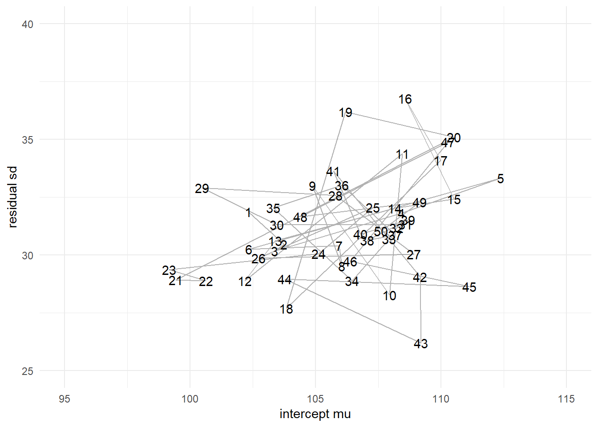


The more complex regression models grow, the more dimensions the PD gets. The linear regression model in the next chapter has three parameter dimensions, which is difficult to visualize. Multi-level models have hundreds of parameters,  which is impossible to intellectually grasp at once. Therefore, it is common to use the *marginal posterior distributions* (MPD), which give the density of one coefficient at time. My preferred geometry for plotting many MPDs is the violin plot, which packs a bunch of densities and therefore can be used when models of many more dimensions.


```r
P_1 %>% 
  ggplot(aes(x = parameter, y = value)) +
  geom_violin() +
  ylim(0, NA)
```


In our example, in \@ref(99_seconds_post) we can spot that the most likely value for average time-on-task is  $106.1$. Both distributions have a certain spread. With a wider PD, far-off values have been visited by the MCMC chain more frequently. The probability mass is more evenly distributed and there is less certainty for the parameter to fall in the central region. In the current case, a risk averse decision maker would maybe take the credibility interval as "reasonably certain".

Andrew and Jane expect some scepticism from the marketing people, and some lack in statistical skills, too. What would be the most comprehensible single number to report? As critical decisions are involved, it seems plausible to report the risk to err: how certain are they that the true value is more than 99 seconds. We inspect the histograms. The MPD of the intercept indicates that the average time-on-task is rather unlikely in the range of 99 seconds or better. But what is the precise probability to err for the 99 seconds statement? The above summary with `fixef()` does not accurately answer the question. The CI gives lower and upper limits for a range of 95% certainty in total. What is needed is the certainty of $\mu \geq 99$. Specific questions deserve precise answers.  And once we have understood the MCMC chain as a frequency distribution, the answer is easy: we simply count how many visited values are larger than 99.  In R, the `quantile` function handles the job:


```r
T_certainty <-
  P_1 %>% 
  filter(parameter == "Intercept") %>%
  summarize(certainty_99s = mean(value >= 99),
            certainty_111s = mean(value >= 111))

kable(T_certainty)
```


 certainty_99s   certainty_111s
--------------  ---------------
         0.986            0.054


It turns out that the certainty for average time-on-task above the 99 is an overwhelming 0.986. The alternative claim, that average completion time is better than 111 seconds, has a rather moderate risk to err (0.054).


```r
detach(Sec99)
```


## Walk the line: linear regression {#linear-regression}

In the previous section we have introduced the mother of all regression models: the grand mean model. It assigns rather coarse predictions, without any real predictors. Routinely, design researchers desire to predict performance based on *metric variables*, such as:

+ previous experience
+ age
+ font size
+ intelligence level and other innate abilities
+ level of self efficiacy, neuroticism or other traits
+ number of social media contacts

To carry out such a research question, the variable of interest needs to be measured next to the outcome variable. And, the variable must vary. You cannot examine the effects of age or font size on reading performance, when all participants are psychology students or you test only one size. Then, for specifying the model, the researcher has to come up with an expectation of how the two are related. Theoretically, that can be any mathematical function, but practically, a *linear function* is often presumed for its simplicity. The following plot shows a variety of linear relations between two variables $x$ and $y$.


```r
mascutils::expand_grid(intercept = c(0, 1, 2),
                       slope = c(-.5, 0, 1.5),
                       x = -3:3) %>%
  arrange(x) %>% 
  mutate(y = intercept + x * slope,
         slope = as.factor(slope)) %>% 
  ggplot(aes(x = x, y = y, color = slope)) +
  geom_line() +
  facet_grid(~intercept)
```


A linear function is a straight line, which is specified by two parameters: *intercept* $\beta_0$ and *slope* $\beta_1$:
$$f(x_1) = \beta_0 + \beta_1x_{1i}$$
The intercept is *"the point where a function graph crosses the x-axis"*, or more formally:

$$f(x_1 = 0) = \beta_0$$

The second parameter, $\beta_1$ is called the *slope*. The slope determines the steepness of the line. When the slope is $1$, the line will rise by this amount when one moves one step to the right.

$$f(x_1 + 1) = \beta_0 + \beta_1x_{1i} + \beta_1$$

There is also the possibility that the slope is zero. In such a case, the predictor has no effect and can be left out. Setting $\beta_1 = 0$ produces a horizontal line, with $y_i$  being constant over the whole range. This shows that The linear regression model (LRM) can be conceived a generalization of the GM model: $\mu_i = \beta_0$.

Linear regression gives us the opportunity to discover how ToT can be predicted by age ($x_1$) in the BrowsingAB case. In this hypothetical experiment,  two designs A and B are compared, but we ignore this for now. Instead we ask: are older people slower when using the internet? Or: is there a linear relationship between age and ToT? The structural and random terms of the LRM are: <!-- #49 -->

$$\mu_i = \beta_0 + \beta_1x_{1i}$$
$$y_i \sim N(\mu_i, \sigma)$$


This literally means: with every year of age, ToT increases by $\beta_1$ seconds. Before we run a linear regression with `stan_glm`, we visually explore the association between age and ToT using a scatter plot. The blue line in the graph is a so called a *smoother*, more specifically a LOESS. A smoother is an estimated line, just as linear function. But, it is way more flexible. Where the linear function is a lever fixed at a pivotal point, LOESS is a pipe cleaner. LOESS shows a more detailed picture of the relation between age and ToT. There is a rise between 20 and 40, followed by a stable plateau, and another rise starting at 60. Actually, that does not look like a straight line, but at least there is steady upwards trend. 


```r
attach(BrowsingAB)
```


```r
G_eda_1 <-
  BAB1 %>%
  ggplot(aes(x = age, y = ToT)) +
  geom_point()+
  geom_smooth(se = F, fullrange = F)

G_eda_1
```

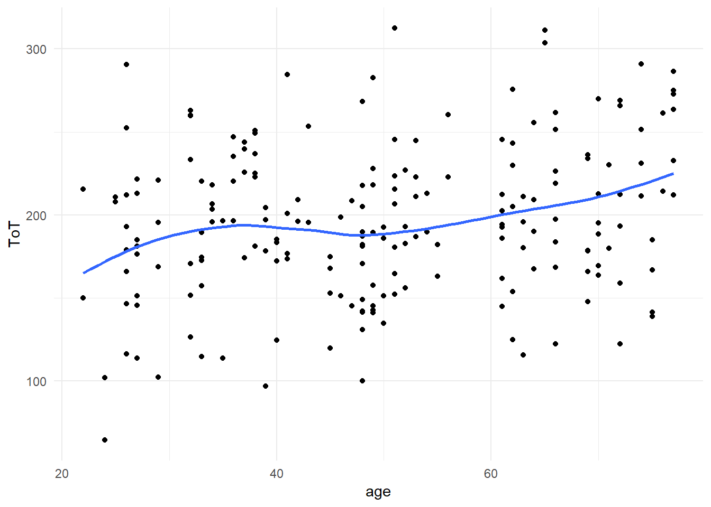

In fact, the BrowsingAB data contains what one could call a psychological model. The effect of age is partly due to farsightedness of participants (making them slower at reading), which more or less suddenly kicks in at a certain range of age. Still, we currently make do with a rough linear approximation. To estimate the model, we  use the `stan_glm` command in much the same way as before, but add the  predictor age. The command will internally check the data type of your variable, which is metric in this case. Therefore, it is treated as a *continuous predictor* (sometimes also called covariate) <!-- #51-->.


```r
M_age <-
  BAB1 %>% 
  stan_glm(ToT ~ 1 + age, 
           data = .)
```


```r
T_age <- fixef(M_age)
T_age
```


|fixef     |  center|   lower|  upper|
|:---------|-------:|-------:|------:|
|Intercept | 164.090| 143.152| 185.18|
|age       |   0.642|   0.234|   1.04|

Is age associated with ToT? The coefficient table tells us that with every year of age, users get $0.64$ seconds slower, which is considerable. It also tells us that the predicted performance at age = 0 is $164.09$.

<!-- #123 -->


### Transforming measures

In the above model, the intercept represents the predicted ToT at `age == 0`, of a newborn. We would never seriously put that forward in a stakeholder presentation, trying to prove  that babies benefit from the redesign of a public website, would we? The prediction is bizarre because we intuitively understand that there is a discontinuity up the road, which is the moment where a teenager starts using public websites. We also realize that over the whole life span of a typical web user, say 12 years to 90 years, age actually is a proxy variable for two distinct processes: the rapid build-up of intellectual skills from childhood to young adulthood and the slow decline of cognitive performance, which starts approximately, when the first of us get age-related far-sightedness. Generally, with linear models, one should avoid making statements about a range that has not been observed. Linearity, as we will see in [REF: debunking], always is an approximation for a process that truly is non-linear.

Placing the intercept where there is no data has another consequence: the estimate is rather uncertain, with a wide 95% CI, $164.09 [143.15, 185.18]_{CI95}$. As a metaphor, think of the data as a hand that holds the a stick, the regression line and tries to push a light switch. The longer the stick, the more difficult is becomes to hit the target.

#### Shifting an centering

*Shifting the predictor* is a pragmatic solution to the problem: "Shifting" means that the age predictor is moved to the right or the left, such that point zero is in a region populated with observations. In this case, two options seem to make sense: either, the intercept is in the region of youngest participants, or it is the sample average, which is then called *centering*. To shift a variable, just subtract the amount of units (years) where you want the intercept to be. The following code produces a shift of -20 and a centering on the original variable age:


```r
BAB1 <-
  BAB1 %>% 
  mutate(age_shft = age - 20,
         age_cntr = age - mean(age))

BAB1 %>% 
  tidyr::gather("predictor", "age", starts_with("age")) %>% 
  ggplot(aes(x = age, y = ToT)) +
  facet_grid(predictor~.) +
  geom_point() +
  geom_smooth(se = F, method = "lm", fullrange = T)
```


By shifting the age variable, the whole data cloud is moved to the left. To see what happens on the inferential level, we repeat the LRM estimation with the two shifted variables:


```r
M_age_shft <- 
  stan_glm(ToT ~ 1 + age_shft, data = BAB1)

M_age_cntr <- 
  stan_glm(ToT ~ 1 + age_cntr, data = BAB1)
```


We combine the posterior distributions into one multi-model posterior and read the *multi-model coefficient table*:


```r
P_age <- 
  bind_rows(posterior(M_age), 
            posterior(M_age_shft), 
            posterior(M_age_cntr))


T_age <- fixef(P_age)
T_age
```


|model      |fixef     |  center|   lower|  upper|
|:----------|:---------|-------:|-------:|------:|
|M_age      |Intercept | 164.090| 143.152| 185.18|
|M_age      |age       |   0.642|   0.234|   1.04|
|M_age_cntr |Intercept | 195.888| 189.843| 202.09|
|M_age_cntr |age_cntr  |   0.641|   0.265|   1.05|
|M_age_shft |Intercept | 176.688| 163.262| 190.25|
|M_age_shft |age_shft  |   0.645|   0.256|   1.04|


When comparing the regression results the shifted intercepts have moved to higher values, as expected. Surprisingly, the simple shift is not exactly 20 years.  This is due to the high uncertainty of the first model, as well as the relation not being exactly linear (see Figure XY). The shifted age predictor has a slightly better uncertainty, but not by much. This is, because the region around the lowest age is only scarcely populated with data. Centering, on the other hand, results in a highly certain estimate, due to the dence data. The slope parameter, however, practically does not change, neither in magnitude nor in certainty.

Shift (and centering) move the scale of measurement and make sure that the intercept falls close (or within) the cluster of observations. Shifting does not change the unit size, which is still years. For most metric predictors that would also not be desireable, as the unit of measurement is natural and intuitive.


#### Rescaling

Most rating scales are not natural units of measure. Most of the time it is not  meaningful to say: "the user experience rating improved by one". The problem has two roots, as I will illustrate by the following four rating scale items:

This product is ...

1. difficult to use `|1 ... X ... 3 ... 4 ... 5 ... 6 ... 7|` easy to use
1. from hell `|-----X----------------------| (10cm)` heavenly
1. neutral `|1 ... X ... 3 ... 4|` uncanny

If you would employ these three scales to assess one and the same product, the data could look like this:


```r
set.seed(42)
Raw_ratings <- 
  tibble(Part = 1:100,
         difficult_easy  = mascutils::rrating_scale(100, 0, .5, 
                                                    ends = c(1,7)),
         heavenly_hell   = mascutils::rrating_scale(100, 0, .2, 
                                                    ends = c(0,10), bin = F),
         neutral_uncanny = mascutils::rrating_scale(100, -.5, .5, 
                                                    ends = c(1,5)))

head(Raw_ratings)
```


 Part   difficult_easy   heavenly_hell   neutral_uncanny
-----  ---------------  --------------  ----------------
    1                5            5.60                 1
    2                4            5.52                 3
    3                4            4.50                 3
    4                5            5.91                 4
    5                4            4.67                 2
    6                4            5.05                 2

In the following, we are comparing the results of these three items. However, they came in the wide format, as you would use to create a correlation table. For a tidy analysis, we first make the data set long. Ratings are now classified by the item they came from. We can produce a grid histogram. 


```r
D_ratings <- 
  Raw_ratings %>%
  gather(key = Item, value = rating, -Part) %>% 
  mascutils:::as_tbl_obs()

D_ratings
```


```r
D_ratings %>% 
  ggplot(aes(x = rating)) +
  facet_grid(Item ~ .) +
  geom_histogram() + xlim(0, 10)
```


The first problem is that rating scales have been designed with different end points. The first step when using different rating scales is shifting the left-end point to zero and dividing by the range of the measure (`upper - lower` boundary). That brings all items down to the range between zero and one. Note how the following tidy code joins in a table that holds the properties of our items. 


```r
D_Items <- tribble(~Item,            ~lower, ~upper,
                   "difficult_easy",  1,      7,
                   "heavenly_hell",   0,     10,
                   "neutral_uncanny", 1,      5)


D_ratings <-
  D_ratings %>% 
  left_join(D_Items, by = "Item") %>% 
  mutate(scaled = (rating - lower)/(upper - lower))
  
D_ratings %>% 
  ggplot(aes(x = scaled)) +
  facet_grid(Item ~ .) +
  geom_histogram(bins = 100) +
  xlim(0,1)
```


This partly corrects the horizontal shift between scales. However, the ratings on the third item still are shifted relative to the other two. The reason is that the first two items have the neutral zone right in the center, whereas the third item is neutraul at its left-end point. The second inconsistency is that the second item uses rather extreme anchors (end point labels), which produces a tight accumulation in the center of the range (with a lot of polite people in the sample, at least). The three scales have been rescaled by their *nominal range*, but they differ in their observed variance. 

*z-transformation* rescales a measure by its  *observed variance*. A set of measures is z-transformed by centering it and scaling it by its own standard deviation.


```r
D_ratings %>% 
  group_by(Item) %>% 
  mutate(zrating = (rating - mean(rating))/sd(rating)) %>% 
#   mascutils::z_score(rating) %>% 
  
  ggplot(aes(x = rating)) +
   facet_grid(Item ~ .) +
   geom_histogram(bins = 100)
```


By z-transformation, the three scales now exhibit the same mean location and the same dispersion. This could be used to combine them into one general score. Note however, that information is lost by this process, namely the differences in location or dispersion. If the research question is highly detailed, such as "Is the design consistently rated low on uncanniness?", this can no longer be answered from the z-transformed variable.

Finally, sometimes researchers use *logarithmic transformation* of outcome measures to reduce what they perceive as pathologies of tha data. In particular, many outcome variables do not follow a Normal distribution, as the random term of linear models assumes, but are left-skewed. Log-transformation often mitigates such problems. However, as we will see in chapter [REF GLM], linear models can be estimated gracefully with a random component that precisely matches the data as it comes. The following time-on-task data is from the IPump study, where nurses have tested two infusion pump interfaces:


```r
attach(IPump)
```


```r
D_pumps %>% 
  mutate(logToT = log(ToT)) %>% 
  select(Design, ToT, logToT) %>% 
  gather(key = Measure, value = value, -Design) %>% 
  ggplot(aes(x = value, color = Design)) +
  facet_wrap(Measure~., scale = "free") +
  geom_density()
```


```r
detach(IPump)
```

Frequently, it is count measures and temporal measures to exhibit non-symmetric error distributions. By log transformation one often arrives at a reasonably  Normal distributed error. However, the natural unit of te measure (seconds) gets lost by the transformation, making it very difficult to report the results in a quantitative manner.


<!-- #53 -->


<!-- #122 -->


### Correlations {#correlations}


LRM render the quantitative relationship between two metric variables. Another commonly known statistic that seems to do something similar is Pearson's  correlation statistic $r$ (@\ref(#associations)). In the following, we will see that a tight connection between correlation and linear coefficients exists, albeit both having their own advantages. For a demonstration, we reproduce the steps on a simulated data set where X and Y are linearly linked:


```r
D_cor <-
  data_frame(x = runif(100, 0, 50),
             y = rnorm(100, x *.2, 3))
```


```r
D_cor %>% 
  ggplot(aes(x = x, y = y)) +
  geom_point() +
  geom_smooth(method = "lm", se = F)
```


Recall, that $r$ is covariance standardized for dispersion, not unsimilar to z-transformation [REF transformations] and that a covariance is the mean squared deviance from the population mean. This is how the correlation is decontaminated from the idiosyncracies of the involved measures, their location and dispersion. Similarly, the slope parameter in a LRM is a measure of association, too. It is agnostic of the overall location of measures since this is captured by the intercept. However, dispersion remains intact.  This ensures that the slope and the intercept together retain information about location, dispersion and association of data, and we can ultimately make predictions. Still, there is a tight relationship between Pearson's $r$ and a slope coefficient $\beta_1$, namely:

$$
r = \beta_1 \frac{sd_X}{sd_Y}
$$

For the sole purpose of demonstration, we here resort to the built-in non-Bayesian command `lm` for doing the regression.


```r
M_cor <- lm(y ~ x, D_cor)
beta_1 <- stats::coef(M_cor)[2]

r <- beta_1 * sd(D_cor$x) / sd(D_cor$y)
r
```

```
##    x 
## 0.66
```

The clue with Pearson's $r$ is that it normalized the slope coefficient by the variation found in the sample. This resembles z-transformation as was introduced in  \@ref(transforming-variables). In fact, when both, predictor and outcome, are z-transformed before estimation, the coefficient equals Pearson's $r$ exactly:


```r
M_z <-
  D_cor %>% 
  mutate(x_z = (x - mean(x))/sd(x),
         y_z = (y - mean(y))/sd(y)) %>% 
  lm(y_z ~ x_z, .)

stats::coef(M_z)[2]
```

```
##  x_z 
## 0.66
```

<!-- #29

Pearson's $r$ spawns from a different school of thinking than Bayesian parameter estimation: analysis of variance (ANOVA). Roughly, this family of methods draws on the idea of dividing the *total variance* of the outcome variable into two components: *explained variance* and *residual variance*. The very formula of the variance parameter reveals its connection to covariance (it is even allowed to say, that variance is the covariance of a variable with itself):

$$
\textrm{Var}_{X} = \frac{1}{n} \sum_{i=1}^n (x_i - E(X))^2
$$
In ANOVA models, when explained variance is large, as compared to residual variance, the F-statistic goes up and stars twinkle behind the p-value. While I am far from promoting any legacy approaches, here, a scale-less measure of association strength bears some intuition in situations, where at least one of the involved variables has no well-defined scale. That is in particular the case, when measuring with rating scales. Measurement theory tells that we may actually transform rating scales fully to our liking, if the order is preserved (ordinal scales). That is a pretty weak criterion and, strictly speaking, forbids the application of linear models (and ANOVA) altogether, where at least sums must be well defined (interval scales).

Not by coincidence, a measure of explained variance, the *coefficient of determination r^2* can be derived as from Pearson's $r$, by simply squaring it. $r^2$ is in the range $[0;1]$ and represents the proportion of variability that is explained by the predictor:


```r
str_c("X explains r^2 = ",round(r^2,2) * 100, " percent of the variance of Y")
```

```
## [1] "X explains r^2 = 44 percent of the variance of Y"
```

To sum it up, Pearson $r$ and $r^2$ are useful statistics to express the strength of an association, when the scale of measurement does not matter or when one desires to compare across scales. Furthermore, correlations can be part of advanced multilevel models which we will treat in 
-->

In regression modelling the use of <!-- #54 --> coefficients allows for predictions made in the original units of measurement. Correlations, in contrast, are unit-less. Still, correlation coefficients play an imortant role  in exploratory data analysis (but also in multilevel models, see @\ref(re_correlations) for the following reasons:

1. Correlations between predictors and responses are a quick and dirty assessment of the expected associations.
2. Correlations between multiple response modalities  (e.g., ToT and number of errors) indicate to what extent these responses can be considered exchangeable.
3. Correlations between predictors should be checked upfront to avoid problems arising from so-called collinearity [REF colinearity].

The following table shows the correlations between measures in the MMN study, where we tested the association between verbal and spatial working memory capacity (Ospan and Corsi tests and performance in a search task on a website (clicks and time).


```r
attach(MMN)

MMN_2 %>% 
  select(Corsi, Ospan.A, Ospan.B, time, clicks) %>% 
  corrr::correlate()
```


rowname    Corsi   Ospan.A   Ospan.B    time   clicks
--------  ------  --------  --------  ------  -------
Corsi         NA     0.177     0.116   0.068    0.137
Ospan.A    0.177        NA     0.876   0.053    0.111
Ospan.B    0.116     0.876        NA   0.060    0.119
time       0.068     0.053     0.060      NA    0.838
clicks     0.137     0.111     0.119   0.838       NA

```r
detach(MMN)
```

These correlations give an approximate picture of associations in the data: 

1. Working memory capacity is barely related to performance.
1. There is a strong correlations between the performance measures.
1. There is a strong correlation between the two predictors Ospan.A and Ospan.B.

<!--30-->

Linear coefficients and correlations both represent associations between measures.  Coefficients preserve units of measuremnent, allowing us to make meaningful quantitative statements. Correlations are re-scaled by the observed dispersion of measures in the sample, making them unit-less. The advantage is that  larger sets of associations can be screened at once and compared easily.


<!-- #30 
Linear models link multiple predictors to an outcome variable. In the MMN case we observed that, by adding another predictor to a model, the strength of the original predictor only changes marginally. That is *not* the general rule as we will see now!

Why is it better to have three legs under a table than four? Because three legs are always stable, no beer coasters needed. Recall basic geometry: the straight connection between two points is called a line (like in regression line). Three points make a triangle. An astonishing property of triangles is that in a three-dimension space they are always flat. There is never bending needed to connect three points.
-->

<!--
Elaborations on Euclidean space, how double linear regression creates flat surfaces and how collinearity reduces this to a line that is unstable.-->


### Endlessly linear

On a deeper level the bizarre age = 0 prediction is an example of a principle <!-- #55 -->, that will re-occur several times throughout this book.

**In an endless universe, everything is finite.**

A well understood fact about LRM is that they allow us to fit a straight line to data. A lesser regarded consequence from the mathematical underpinnings of such models is that this line extends infinitely in both directions. To fulfill this assumption, the outcome variable needs to have an infinite range, too,  $y_i \in [-\infty; \infty]$ (unless the slope is zero). Every scientifically trained person and many lay people know, that even elementary magnitudes in physics are finite: all speeds are limited to $\approx 300.000 km/s$, the speed of light and temperature has a lower limit of -276°C (or 0K). If there can neither be endless acceleration nor cold, it would be daring to assume any psychological effect to be infinite in both directions.

The endlessly linear assumption (ELA) is a central piece of all LRMs. From a formal perspective, the ELA is always violated in a universe like ours. So, should we never ever use a linear model and move on to non-linear models right away? Pragmatically, the LRM often is a reasonably effective approximation. From figure [G_eda_1] we have seen that the increase is not strictly linear, but follows a more complex curved pattern. This pattern might be of interest to someone studying the psychological causes of the decline in performance. For the applied design researcher it probably suffices to summarize the monotonous relationship by the slope coefficient. In \@ref(line-by-line) we will estimate the age effects for designs A and B separately, which lets us compare fairness towards older people.

As has been said, theorists may desire a more detailed picture and see disruptions of linearity as indicators for interesting psychological processes. An uncanny example of theoretical work will be given in polynomial regression. For the rest of us, linear regression is a pragmatic choice, as long as:

1. the pattern is monotonically increasing
1. any predictions stay in the observed range and avoid the boundary regions, or beyond.


### Exercises

1. Examine the linear parameters of model `M_age_rtrn` and derive some impossible predictions, as was done in the previous section.

1. The BAB1 data set contains another outcome variable where the number of clicks was measured until the participant found the desired information. Specify a LRM with age and examine the residual distribution. Is the Normality assumption defendable? What is the difference to home returns, despite both variables being counts?

1. Review the two figures in the first example of [GSR]. The observations are bi-modally distributed, nowhere near Gaussian. After (graphically) applying the model they are well-shaped. What does that tell you about checking residual assumptions before running the model? <!-- #82 -->


## A versus B: Comparison of groups {#CGM}

Another basic linear model is the *comparison of groups* (CGM), which replaces the commonly known analysis of variance (ANOVA). In design research group comparisons are all over the place, for example:

+ comparing designs: as we have seen in the A/B testing scenario
+ comparing groups of people, based on e.g. gender or whether they have a high school degree
+ comparing situations, like whether someone uses an app on the go, or sitting still behind a computer

In order to perform a CGM, a variable is needed that establishes the groups. This is commonly called a *factor*. A factor is a variable that identifies members of groups,   like "A" and "B" or "male" and "female". The groups are called *factor levels*. In the BrowsingAB case, the prominent factor is Design with its levels A and B.

Asking for differences between two (or more) designs is routine in design research. For example, it could occur during an overhaul of a municipal website. With the emerge of e-government, many municipal websites have grown wildly over a decade. What once was a lean (but not pretty) 1990 website has grown into a jungle over time, to the disadvantage for users. The BrowsingAB case could represent the prototype of a novel web design, which is developed and tested via A/B testing at 200 users. Every user is given the same task,  but sees only one of the two designs. The design team is interested in: *Do the two web designs A and B differ in user performance?*

Again, we first take a look at the raw data:


```r
attach(BrowsingAB)
```


```r
BAB1 %>%
  ggplot(aes(x = ToT)) +
  geom_histogram() +
	facet_grid(Design~.)
```

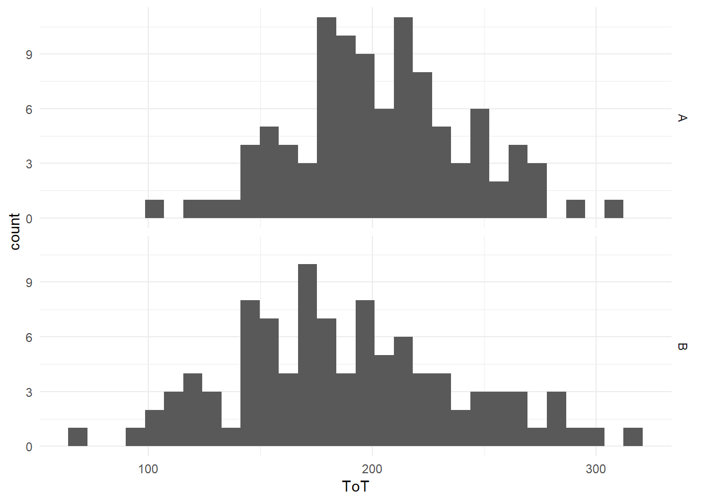

This doesn't look too striking. We might consider a slight advantage for design B, but the overlap is immense. We perform the CGM. Again, this is a two-step procedure:

1. The `stan_glm` command lets you specify a simple formula to express the dependency between one or more predictors (education) and an outcome variable (ToT). It performs the parameter estimation using the method of _Markov-Chain Monte-Carlo Sampling_. The results are stored in a new object `M_Design`.
1. With the `fixef` command the estimates are extracted and can be interpreted.


```r
M_Design <-
  BAB1 %>% 
  stan_glm(ToT ~ 1 + Design, 
           data = .)
```


```r
T_Design <- fixef(M_Design)
T_Design
```


|fixef     | center| lower|  upper|
|:---------|------:|-----:|------:|
|Intercept |    203| 194.7| 212.21|
|DesignB   |    -15| -27.4|  -3.05|


```r
detach(BrowsingAB)
```


The model contains two parameters, the first one being the *intercept*, again. How can you have a "crossing point zero", when there is no line, but just two groups? You can't. When speaking of pure factor models, like the one above or the multifactorial models of the next section, the intercept has a different meaning, it is the *mean of a reference group*. Per default, stan_glm chooses the alphabetically first group label as the reference group, in this case design A. We can therefore say that design A has an average performance of $203.36 [194.7, 212.21]_{CI95}$. 

The second parameter is the effect of "moving to design B". It is given as the *difference to the reference group*. With design B it took users $15.02 [27.36, 3.05]_{CI95}$ seconds less to complete the task. However, this effect appears rather small and there is huge uncertainty about it. It barely justifies the effort to replace design A with B. If the BrowsingAB data set has some exciting stories to tell, the design difference is not it.


### Not stupid: dummy variables {#dummy_variables}

Are we missing anything so far? We have not yet seen the model formula. The CGM is a linear model, but this is not so apparent as it contains a factor, i.e. a non-metric variable. Linear model terms are a sum of products $\beta_ix_i$, but factors cannot just enter such a term. What would be the result of $\mathrm{DesignB} \times\beta_1$?

*Factors* basically answer the question: *What group does the observation belong to?*. This is a label, not a number, and cannot enter the regression formula. *Dummy variables* solve the dilemma by converting factor levels to numbers. A dummy variable represents only one level of a factor, by asking the simple question: *Does this observation belong to group DesignB?*  The answer is yes/no and can be coded by a Boolean variable. For every level, a separate dummy variable is constructed to answer the simple yes/no question of membership. But, can Boolean variables enter arithmetic equations? R at least assumes that this is safe, as they can always be converted to ones and zeros using `as.numeric`. <!-- #56 --> Routinely, we can leave the whole dummy variable business to the linear model engine. Still, it is instructive to do it yourself once.


```r
attach(BrowsingAB)
```


```r
BAB1 <-  BAB1 %>% 
  mutate(d_A = as.numeric(Design == "A"),
         d_B = as.numeric((Design == "B")))
BAB1 %>% 
  select(Obs, Design, d_A, d_B, ToT) %>% 
  sample_n(8) %>% 
  kable()
```


 Obs  Design    d_A   d_B   ToT
----  -------  ----  ----  ----
 109  B           0     1   199
  24  A           1     0   209
  75  A           1     0   211
  65  A           1     0   220
 186  B           0     1   166
 178  B           0     1   235
 148  B           0     1   201
 147  B           0     1   158

Vice versa, numbers in a logical context are always interpreted in complete reverse <!-- #57 -->.

$$ 
v = 1 \mapsto \mathrm{TRUE}\\ v = 0 \mapsto \mathrm{FALSE} 
$$

Boolean variables can be used in all contexts, including numerical and categorical. It is unfortunate that we call them dummies in such a belittling manner, as they are truly bridges between the world of categories and arithmetic. However, if preferred, they can also be called indicator variable, Boolean indicator or binary variable. They identify groups in our data set and switch on or off the effect in the linear term. For a factor G with levels A and B and zero/one-coded dummy variables `d_A` and `d_B`, the likelihood is written as:

$$ 
\mu_i = d_{Ai} \beta_{A} + d_B \beta_{Bi} 
$$

When $d_{Ai}=1, d_{Bi}=0$, the parameter $\beta_A$ is switched on, and $\beta_B$ is switched off. An observation of group A gets the predicted value: $\mu_i = \beta_A$, vice versa for members of group B. All arithmetic commands in R do an implicit typecast when encountering a Boolean variable, e.g. for `sum(TRUE, FALSE, TRUE)` the result is 2. In contrast, regression engines interpret Boolean variables as categorical. Therefore, dummy variables have to be passed on as explicitly numeric to the regression engine. Only when a variable truly consists of zeroes and ones, it will be interpreted as desired. This has been done that with the explicit typecast `as.numeric` above.

Most research deals with estimating effects as differences, and all regression engines quietly assume that what you want is a model with a reference group. When expanding the dummy variables manually, this automatism gets into the way and needs to be switched off explicitly.  In R's linear models formula language, that is done by adding the term `0 +` to the formula.


```r
M_dummy <-
  stan_glm(ToT ~ 0 + d_A + d_B, 
     data = BAB1)
```


```r
fixef(M_dummy)
```


|fixef | center| lower| upper|
|:-----|------:|-----:|-----:|
|d_A   |    203|   194|   213|
|d_B   |    188|   179|   197|

In its predictions, the model `M_dummy` is equivalent to the former model `M_design`, but contains two effects that are exactly the group means. This model we  call an *absolute group means model (AGM)*.

Regression engines expand dummy variables automatically when they encounter a factor. However, when formally specifying the likelihood <!-- #58 -->, dummy variables must be made explicit. When doing an AGM on a factor $x_1$ with $1,...,k$ levels, the likelihood function becomes:

$$\mu_i=d_1 \beta_{1[1]}+...+d_k \beta_{1[k]}$$

In the remainder of the book, we are dealing with more complex models (e.g., multifactorial models in the next section), as well as factors with many levels (random effects in multi-level models \@ref(multilevel-models)). With expanded dummy variables, the likelihood can become unduly long. However, many other textbooks avoid this altogether and the model is unambiguously specified in R's regression formula language.

Up to this point, I have introduced dummy variables at the example of AGMs, where at any moment only one factor level is switched on. A more common CGMs  would have a the following likelihood specification (with a factor of $k$ levels):

$$\mu_i = \beta_0 + d_1 \beta_{1[1]}+...+d_k \beta_{1[k-1]}$$

For a factor with $k$ levels in a CGM with intercept, $k-1$ dummy variables need to be constructed in the way shown above. As all non-reference levels are seen as difference towards the reference, *the reference level is set to always on*. To see that, we extract the dummy variables from the CGM on design with the standard command `model.matrix`. As you can see, for all observations the `(Intercept)` column takes the value `1`, whereas level `DesignB` is switched on and off.


```r
BAB1 %>% 
  select(Part, Design, ToT) %>% 
  cbind(model.matrix(M_Design)) %>% ## <---
  as_data_frame() %>% 
  sample_n(8) %>% 
  kable()
```


 Part  Design    ToT   (Intercept)   DesignB
-----  -------  ----  ------------  --------
  200  B         145             1         1
  116  B         185             1         1
   43  A         190             1         0
   27  A         196             1         0
  156  B         171             1         1
  192  B         151             1         1
  191  B         260             1         1
   25  A         195             1         0


Regression engines take care of factors by automatically expanding the dummy variables under the hood. Still, by understanding the concept we gained additional flexibility in specifying factorial models. One version is to estimate an AGM, which leaves out the intercept. Of course, this can also be done right-away with the formula `ToT ~ 0 + Design`. Later, we will see a very practical application of AGMs, when drawing interaction plots. The second benefit is that we can specify the reference level as we want. It just depends on which dummy variable one sets to always-on. In the next section we will gain even more control over what the effects mean by setting contrasts.


```r
detach(BrowsingAB)
```


### Getting it sharper with contrasts [TBC] {#contrasts}

The default behaviour of regression engines, when encountering a factor, is to select the first level as reference group and estimate all other levels relative to that. This fully makes sense if you are after the effect of a treatment, and is therefore called *treatment contrast*. Treatment contrasts do not have anything special to them. They are just a default of the regression engines, because so many people work experimentally. 

Before we come to an understanding of what contrasts are, let me point out what they are not: In \@ref(dummy_variables) it was mentioned, that the AGM and CGM make exactly the same predictions (even though the formulas differ by the `0+` term). For contrasts, this holds in general. Setting contrasts never changes the predictions $\mu_i$. On the contrary, *contrast changes what the coefficients $\beta_i$ mean*. Recall that in a CGM $\beta_1$ has the meaning of "difference to the reference group", whereas in an AGM it is "the mean of the second group". 

In the following, I will illustrate contrasts that represent two different types of questions:

+ To what extent does a group deviate from the overall mean in the sample?
+	With three ordered factor levels, how large is the rolling effect, i.e. from level 1 to level 2, and the average of 1 and 2 to level 3?

So, how are contrasts set?  Although this is a bit odd, they are neither set by modifications to the regression formula, nor by additional command arguments. Instead, *contrasts are set as attributes of the factor variable*, which we can retrieve and set by the standard command `contrasts`. For example, the variable Education has the three levels "Low", "Middle", "High", in that exact order:


```r
attach(BrowsingAB)
```


```r
levels(BAB1$Education)
```

```
## [1] "Low"    "Middle" "High"
```

```r
contrasts(BAB1$Education) %>% 
  kable()
```

          Middle   High
-------  -------  -----
Low            0      0
Middle         1      0
High           0      1

If you believe to have seen something similar before, you are right. Contrast tables are related to dummy variables (\@ref(dummy_variables)). The column Low is omitted in the contrasts table, due to being the reference level with an always-on intercept. In the previous section I mentioned that you can choose the reference level freely by constructing the dummy variables accordingly. However, that would mean to always bypass the regression engines dummy handling. The package `forcats` provides a set of commands to change the order of levels. In the following code the factor levels are reversed such that High becomes the reference group:


```r
BAB1 <-
  BAB1 %>% 
  mutate(Education_rev = forcats::fct_rev(Education)) # <--
levels(BAB1$Education_rev)
```

```
## [1] "High"   "Middle" "Low"
```

```r
contrasts(BAB1$Education_rev) %>% 
  kable()
```

          Middle   Low
-------  -------  ----
High           0     0
Middle         1     0
Low            0     1


```r
detach(BrowsingAB)
```


If we were running a CGM on `Education_rev`, the intercept would now represent level High. Again, this model would make the very same predictions and residuals. In that respect, it is the same model as before, only the meanings (and values) of the coefficients change and become differences to the level High. 

Sometimes, it is useful to have contrasts other than treatment, as this matches the research question more closely. A plethora of contrasts is known and in the following I will introduce *deviation contrasts* and *successive difference contrasts*.

[Example for deviation coding]

*Successive difference coding (SDC)* applies when one is interested in progressive effects, such as performance gain in a number of sessions. Consider the following research situation: Shortly after the millennium, medical infusion pumps became infamous for killing people. Infusion pumps are rather simple devices that administer medication to a patients body in a controlled manner. Being widely used in surgery and intensive care, development of these devices must comply to national and international regulations. Unfortunately, the regulations of those days almost completely overlooked the human factor. While those devices would always function "as described in the user manual", they contained all kinds of severe violations of user-interface design rules. Just to name few: foil switches with poor haptic feedback, flimsy alphanumeric LCD screenlets and a whole bunch of modes. Imagine a medical devices company has partnered with some renowned research institute to develop the infusion pump of the future. Users got interviewed and observed, guidelines were consulted, prototypes developed, tested and improved. At the end of the process the design was implemented as an interactive simulation. In the meantime, national agencies had reacted as well and regulations now demand a routine user-oriented development cycle. One of the new rules says: "the design must undergo validation testing with trained users".

That means you have to first introduce and train your users to get fluent with the device, then test them. We [REF] thought that the training process itself is of immense importance. Why not test it then already? In the real study we tested everyone three times and traced individual progress. This requires a repeated measures analysis and we are not quite there yet [see LMM].

[TODO: 

+ simulate IPump case, non-repeated 

+ demonstrate succ diff contr 

+ find example for deviation contrasts 

+ Contrasts extend the idea of dummy variables. 

+ Dummy variables become continuous, thereby more flexible in their effects

]


### Sharper on the fly: derived quantities [TBD]

Contrasts are classic in aligning regression estimates with research questions that explore differences. With two groups A and B the following hypotheses of difference can be formed:

    A - 0
    B - 0
    A - B


### Exercises

1. The `simulate` function in case environment BrowsingAB lets you change the residual error (in standard deviations). Simulate three data sets with different residual variance, and estimate them by the same model. See how the uncertainties of effects behave.

1. With BrowsingAB, simulate several data sets of very small sample size. Observe how strongly the composition of education and age varies.

1.	BAB1 contains the variable Education, which separates the participants by three education levels (Low, Middle, High). Construct the dummy variables and run an AGM.

1.	Specify the expanded CGM likelihood for education. Construct the dummy variables and run a regression.

1.	Consider you wanted to use education level High as reference group. Create dummy variables accordingly and run the regression.


## Putting it all together: multi predictor models

Design researchers are often forced to obtain their data under rather wild conditions. Users of municipal websites, consumer products, enterprise information systems and cars can be extremely diverse. At the same time, Designs vary in many attributes, affecting the user in many different ways. There are many variables in the game, and even more possible relations. With *multi predictor models* we can examine the simultaneous influence of everything we have recorded. First, we will see, how to use models with two or more continuous predictors. Subsequently, we address the case of multi-factorial designs. Finally, we will see examples of models, where continuous predictors and factors peacefully co-reside.
 
 


### On surface: multiple regression models 

<!-- #62 -->Productivity software, like word processors, presentation and calculation software or graphics programs have evolved over decades. For every new release, dozens of developers have worked hard to make the handling more efficient and the user experience more pleasant.  Consider a program for drawing illustrations: basic functionality, such as drawing lines, selecting objects, moving or colourizing them, have practically always been there. A user wanting  to draw six rectangles, painting them red and arranging them in a grid pattern, can readily do that using basic functionality.  At a certain point of system evolution, it may have been recognized that this is what users routinely do: creating a grid of alike objects. With the basic functions this is rather repetitive and a new function was created, called "copy-and-arrange". Users may now create a single object, specify rows and columns of the grid and give it a run.

The new function saves time and leads to better results. Users should be very excited about the new feature, should they not? Not quite, as [Carroll in Rosson] made a very troubling observation: adding functionality for the good of efficiency may turn out ineffective in practice, as users have a strong tendency to stick with their old routines, ignoring new functionality right away. This troubling observation has been called the *active user paradox (AUP)*. 

Do all users behave that way? Or can we find users of certain traits that are different? What type of person would be less likely to fall for the AUP? And how can we measure resistance towards the AUP? We did a study, where we explored the impact of two user traits *need-for-cognition (ncs)* and *geekism (gex)* on AUP resistance. To measure AUP resistance we observed users while they were doing drawing tasks. A moderately complex behavioural coding system was used to derive an individual AUP resistance score. Are users with high need-for-cognition and geekism more explorative and resistant to the AUP?


As we will see later, it is preferable to build a model with two simultaneous predictors. For instructive purposes we begin with two separate LRMs, one for each predictor. Throughout the regression models we use z-transformed scores. Neither the personality nor the resistance scores have a natural interpretation, so nothing is lost in translation. 

$$
\mu_i = \beta_0 + \beta_\mathrm{ncs} x_\mathrm{ncs}\\
\mu_i = \beta_0 + \beta_\mathrm{gex} x_\mathrm{gex}
$$


```r
attach(AUP)
M_1 <- 
  AUP_1 %>% 
  stan_glm(zresistance ~ zncs, data = .)

M_2 <- 
  AUP_1 %>% 
  stan_glm(zresistance ~ zgex, data = .)
detach(AUP)
```


\@ref(tab:AUP_coef) shows the two separate effects (`M_1` and `M_2`). Due to the z-transformation of predictors, the intercepts are practically zero. Both personality scores seem to have a weakly positive impact on AUP  resistance.

Next, we estimate a model that regards both predictors simultaneously. For linear models, that requires nothing more than to make a sum of all involved predictor terms (and the intercept). The result is a `multiple regression model (MRM)`:

$$
\mu_i = \beta_0 + \beta_\mathrm{ncs} x_\mathrm{ncs} + \beta_\mathrm{gex} x_\mathrm{gex}
$$

In R's regression formula language, this is similarly straight-forward. The `+` operator directly corresponds with the `+` in the likelihood formula.


```r
attach(AUP)
M_3 <- 
  AUP_1 %>% 
  stan_glm(zresistance ~ zncs + zgex, data = .) #<--

detach(AUP)
```


For the comparison of the three models we make use of a feature of the package bayr: the posterior distributions of arbitrary models can be combined into one multi-model posterior object, by just stacking them upon each other. The coefficient table of such a multi-model posterior gains an additional column that identifies the model:


```r
attach(AUP)

P <-
  bind_rows(posterior(M_1),
            posterior(M_2),
            posterior(M_3))

T_coef_3 <- P %>% 
  posterior() %>%  
  fixef()
T_coef_3
```


|model |fixef     | center|  lower| upper|
|:-----|:---------|------:|------:|-----:|
|M_1   |Intercept |  0.005| -0.308| 0.306|
|M_1   |zncs      |  0.377|  0.054| 0.699|
|M_2   |Intercept | -0.004| -0.312| 0.311|
|M_2   |zgex      |  0.298| -0.029| 0.605|
|M_3   |Intercept |  0.001| -0.306| 0.317|
|M_3   |zncs      |  0.300| -0.090| 0.686|
|M_3   |zgex      |  0.121| -0.273| 0.508|

The intercepts of all three models are practically zero, which is a consequence of the z-transformation. Recall, that the intercept in an LRM is the predicted value, when the predictor is zero. In MRM this is just the same: here, the intercept is the predicted AUP resistance score, for when NCS and GEX are both zero.


When using the two predictors simultaneously, the overall positive tendency remains. However, we observe major and minor shifts: in the MRM, the strength of the geekism score is reduced to less than half: $0.12 [-0.27, 0.51]_{CI95}$. NCS has shifted, too, but lost only little of its original strength: $0.3 [-0.09, 0.69]_{CI95}$. 


For any researcher who has carefully conceived a research question this appears to be a disappointing outcome. In fact, there is a reason for the loss of strength and ignoring this issue will mislead the interpretation of results.

The reason is that the two *predictors are correlated*. In this study, participants who are high on NCS also tend to have more pronounced geekism. \@ref(AUP_corr_predictors) reveals the situation:


```r
G_eda_4 <- 
  AUP_1 %>% 
  ggplot(aes(x = zncs, y = zgex)) +
  geom_point() +
  geom_smooth(method = "lm", se = F) +
  labs(title = str_c("Correlation between ncs and gex: ", 
              round(cor(AUP_1$zncs, AUP_1$zgex), 2)))

G_eda_4
```

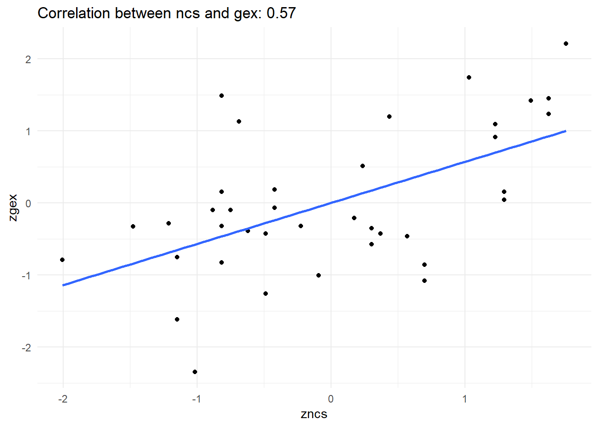

```r
detach(AUP)
```


Participants with a higher NCS also tend to score higher on geekism. Is that surprising? Actually, it is not. People high on NCS love to think. Computers are a good choice for them, because these are complicated devices that make you think. (Many users may even agree that computers help you think, for example when analyzing your data with R.) In turn, geekism is a positive attitude towards working with computers in sophisticated ways, which means such people are more resistant towards the AUP.

[NCS: love to think] --> [GEX: love computers] --> [resist AUP]

When such a causal chain can be established, some researchers speak of a *mediating variable* GEX.
Although a bit outdated [REF], *mediator analysis is correct when the causal direction of the three variables is known*. Then, a so-called step-wise regression is performed to find the pure effects. (A better alternative is structural equation modelling, SEM). 

Unfortunately, in the situation here, the causal direction is partly ambiguous. We can exclude that the resistance test has influenced the personality scores, because of the order of apperance in the study. But, causally speaking, geekism may well preceed NCS. For example, computers reward you for thinking hard and, hence, you get used to it and make it your lifestyle. If you like thinking hard, then you probably also like the challenge that was given in the experiment.

[GEX: love computers] --> [NCS: love to think] --> [resist AUP]

In the current case, we can not distinguish between these two competing theories with this data alone. This is a central problem in empirical research. An example, routinely re-iterated in social science methods courses is the observation that people who are more intelligent tend to  consume more fresh vegetables. Do carrots make us smart? Perhaps, but it is equally plausible that eating carrots is what smart people do.

The issue is that a particular direction of causality can only be established, when all reverse directions can be excluded. Behavioural science reseachers know of only two ways to do so: 

1. By the *arrow of time*, it is excluded that a later event caused a preceding one. In the AUP study, there is no doubt that filling  out the two personality questionnaires cause the behaviour in the computer task, because of the temporal order.
2. In *strictly controlled experiments*, participants are assigned to the conditions, randomly. That has (virtually) happened in the BrowsingAB case, which gives it an unambiguous causal direction. This was not so, if participants had been allowed to choose themselves which design to test.  

To come back to the AUP study: There is no way to establish a causal order of predictors. The correct procedure is to regard the predictors simultaneously (not step-wise), as in model `M_3`. This results in a redistribution of the overall covariance and the predictors are *mutually controlled*. In `M_2` the effect of GEX was promising at first, but then became spurious in the simultaneous model. Most of the strength was just borrowed from NCS by covariation. The model suggests that loving-to-think has a considerably stronger association with AUP resistance than loving-computers.

That *may* suggest, but not prove, that geekism precedes NCS, as in a chain of causal effects, elements that are closer to the final outcome (AUP resistance) tend to exert more salient influence. But, without further theorizing and experimenting this is weak evidence of causal order.

The readers of a paper on geekism, NCS and the AUP will probably be more impressed by the (still moderate) effects in the separate models we had run, initially. The reason why one should not do that is that separate analyses suggest that the predictors are independent. To illustrate this at an extreme example, think of a study where users were asked to rate their agreement with an interface by the following two questions, before ToT is recorded:

1. Is the interface beautiful?
2. Does the interface have an aesthetic appearance?

Initial separate analyses show strong effects for both predictors. Still, it would not make sense to give the report the title: "Beauty and aesthetics predict usability". Beauty and aesthetics are practically synonyms. For Gex and NCS this may be not so clear, but we cannot exclude the possibility that they are linked to a common factor, perhaps a third trait that makes people more explorative, no matter whether it be thoughts or computers.

So, what to do if two predictors correlate strongly? First, we always report just a single model. Per default, this is the model with both predictors simultaneously. The second possibility is to use a disciplined method of *model selection* \@ref(model_selection) and remove the predictor (or predictors) that does not actually contribute to prediction. The third possibility is, that the results with both predictors become more interesting when including interaction effects \@ref(interaction_effects)


### Crossover: multifactorial models [TBC]

The only necessary precondition for statistical control is that you recorded the influencing variable. This has happened in the BrowsingAB study: the primary research question regarded the design difference, but the careful researcher also recorded the gender of participants.

What happened to the likelihood function when we moved from GMM to CGM and LRM? The effect of age was simply added to the intercept. For a model on education level effects, we expanded the dummy variables and then added them all up. Indeed, the linear model is defined as a succession of linear terms  $x_i\beta_i$ and nothing keeps us from adding further predictors to the model. Seeing is believing! The following code estimates a model with design and gender as predictors.


```r
attach(BrowsingAB)
```


```r
M_mpm_1 <- 
  BAB1 %>% 
  stan_glm(ToT ~ Design + Gender, data = .)
```


```r
T_fixef_mpm_1 <- fixef(M_mpm_1)
T_fixef_mpm_1
```


|fixef     |  center| lower|  upper|
|:---------|-------:|-----:|------:|
|Intercept | 203.349| 191.9| 215.10|
|DesignB   | -15.050| -27.8|  -2.68|
|GenderM   |   0.196| -12.8|  12.71|

By adding gender to the model, both effects are estimated simultaneously. In a *factorial multiple predictor model (MPM)* the intercept is a reference group, too. Consider that both factors have two levels, forming a $2x 2$ design with groups: A-F, A-M, B-F, B-M. The first one, A-F, has been set as reference group. Women in condition A have an average ToT of $203.35 [191.94, 215.1]_{CI95}$ seconds.
The other two fixed effects are, once again, differences to the reference. It is neither the case that gender effects performance much, nor does the design effect really change, compared to the CGM.

<!-- #124 -->
[likelihood]
[interaction plot]


### Line-by-line: regression in groups  [TBC] {#line-by-line}

Recall, that dummy variables make factors compatible with linear regression. Thus, no barriers are left for combining factors and continuous predictors in one model. For example, we can estimate the effects age and design simultaneously:


```r
M_mpm_2 <- 
  BAB1 %>% 
  stan_glm(ToT ~ Design + age_shft, data = .)
```


```r
T_fixef_mpm_2 <-  fixef(M_mpm_2)
T_fixef_mpm_2
```


|fixef     |  center|   lower|  upper|
|:---------|-------:|-------:|------:|
|Intercept | 184.208| 169.940| 198.79|
|DesignB   | -14.981| -27.804|  -2.14|
|age_shft  |   0.648|   0.254|   1.03|


```r
detach(BrowsingAB)
```


Once again, we get an intercept first. Recall, that in LRM the intercept is the the performance of a 20-year old (age shifted). In the GCM it was the mean of the reference group. When *marrying factors with continuous predictors, the intercept is point zero in the reference group*. The predicted average performance of 20-year old with design A is $184.21 [169.94, 198.79]_{CI95}$. The age effect has the usual meaning: by year of life, participants get $0.65 [0.25, 1.03]_{CI95}$ seconds slower. The *factorial effect* B is a *vertical shift of the intercept*. A 20-year old in condition B is $14.98 [27.8, 2.14]_{CI95}$ seconds faster. In fact, this holds for all ages, as can be seen in the following figure. The model implies that the age affect is the same for both designs, which is not true, as we will see in [REF Interaction effects].


### Fitting observations

Frequently, the research question  is how strong the effect of a predictor variable is on the response. This strength of effect is what coefficient table tell us. But, how do we know that the model actually fits the process under examination?  Perhaps, the age of participants is related to performance, but not in a linear way. Or, two groups of participants have very different age effects. Every linear model produces *predicted values* and these can be used to further examine how well a model actually fits the data, or at the opposite, are there patterns in the data that the model ignores.

In Bayesian regression models, *posterior predictions* are a simple, yet powerful concept to compare the fitted model with the original data. As [McElreath] points out, one should rather call them *retrodictions*, because they regard the real data one has, not the future. In yet another perspective they are  *idealized responses* and as such address both, present and future. 

Remember that all linear model assume that an observed value is composed of a structural component, the one that repeats across observations, and a Gaussian distributed error. The predicted value is just the structural component. That becomes most apparent, when writing a linear model in a slightly different form:

$$
y_i = \mu_i + \epsilon_i\\
\mu_i = \beta_0 + \beta_1 x_i\\
\epsilon_i \sim N(0, \sigma) 
$$

The first line of the formula does the separation: by estimation, $\mu_i$ will become what the model thinks is the structural part, the one that is associated with the predictor $x_i$, which is stated in the second line. $\epsilon_i$ is the error, the part that does not repeat. The error is not assumed to run completely wild, but should take the form of a zero-centered Normal distribution, as is given in the third line. This is also called the *residual distribution* and, in contrast to the response distribution, it has a fixed location at zero.


```r
attach(BrowsingAB)
```


In the BrowsingAB case, we have repeatedly recorded age of participant. The LRM `M_age_shft` found that with every unit of age, average ToT increased by  0.645 seconds. If we now ask: what is predicted for a person of age 45? We get the predicted value $\mu_i$:

$$\mu_{age = 45} =176.688 + 0.645 * 45\\ 
= 205.707$$


This predicted value is our best guess of how a person of age 45 had performed. But, the separation of an observation into predicted value and error remains just that: a guess under a certain amount of information. Paralling coefficients, predicted values are uncertain to some degree.

At any moment can we compute predicted values from coefficients using the full model formula, as seen above. A more convenient way is to use the standard command `predict` on the model object (the shifted model from chapter [REF LRM]). The package `bayr` provides a tidy version of `predict()` that provides the best guess for all observations, as well as 95% credibility intervals.


```r
T_pred_age_shft <- predict(M_age_shft)
T_pred_age_shft
```


| Obs| center| lower| upper|
|---:|------:|-----:|-----:|
| 116|    211| 120.4|   302|
| 125|    182|  91.5|   273|
| 137|    182|  88.1|   270|
| 149|    213| 120.7|   304|
| 159|    196| 102.4|   283|

For most analysis based on predicted values, it is useful to just add the predictions of a model to the original data. Of course, it is crucial at this step, that the order of data is kept the same.


```r
BAB1 <- BAB1 %>% 
  mutate(M_age_shft = T_pred_age_shft$center)
```

Now we can extract predicted values for certain conditions, say all participants of age 45.


```r
BAB1 %>% 
  select(age, ToT, M_age_shft) %>% 
  filter(age == 45)
```


 age   ToT   M_age_shft
----  ----  -----------
  45   153          194
  45   168          192
  45   120          193
  45   175          192

It seems that the model is strongly biased. It predicts too long ToT for all the 45 year olds Interestingly, the four cases also do not get the exact same predictions. On closer examination we observe that the lower the observation, the lower the predicted value. What happens here is related to the third term of the model specification. The error $\epsilon_i$ is not completely without structure, as it is assumed to follow a Gaussian distribution. This implies that extreme errors are less likely to occur and that is to a tiny extet adjusted for by the model. Most noticable on the third case in the table above, the estimation rather takes a slightly lower predicted value, than a too extreme error. We will return to this mechanism in chapter [REF shrinkage]. 

Routinely, models are assessed by looking at how well the predicted pattern fits the observed response distribution. Note how the line geometry alters initial aesthetic mapping of the y axis (`y = ToT`). Here the second geometry maps the y axis to the predicted values. In this context, mapping an aesthetic to constant strings produces the legend (`color = "observed"`).  


```r
BAB1 %>% 
  ggplot(aes(x = age, y = ToT)) +
  geom_point(aes(col = "observed")) +
  geom_smooth(aes(y = M_age_shft, col = "M_age_shft"))
```


The prediction line is rather flat, indicating a small total effect of age. Observations are scattered wildly around the prediction line, which brings us to the next topic: residual analysis.


<!-- What if we wanted to get a best guess for an age that did not occur in our data set, say 43.5? Using the LR likelihood function above, we can estimate the expectation for any value we want. By entering the  intercept and age estimates (`C_age`), we obtain: -->

<!-- ```{r best_guess_unobserved, opts.label = "deprecated"} -->
<!-- C_age <- fixef(M_age_shft)$center -->
<!-- C_age[1] + 43.5 * C_age[2] -->
<!-- ``` -->

<!-- With the same procedure, it is possible to plot observed and expected values next to each other: -->

<!-- ```{r expected_values, opts.label = "deprecated"} -->
<!-- G_pred_age <- -->
<!--   BAB1 %>%  -->
<!--   ggplot(aes(x = age, y = ToT)) +  -->
<!--   geom_point() + -->
<!--   geom_abline(intercept = C_age[1],  -->
<!--               slope = C_age[2], -->
<!--               col = "red") -->

<!-- G_pred_age -->
<!-- ``` -->


```r
detach(BrowsingAB)
```

<!-- #125 -->

<!-- .-->


<!--

+ resid-predict plots as a general form to discover trends
+ qq plots
-->


### Residual analysis

Recall the first and third line of the LRM model formula above. The residuals $\epsilon_i$ is what you get $y_i - \mu_i$. 
The assumptions of linear models regarding these residuals are 

+ to take the shape of a zero-centered Normal distribution
+ with a constant variance

The main purpose of residual analysis is to examine these two assumptions. 


#### Normal distribution {#resid_normality}

So far, we have seen two linear models, the GMM and the LRM. They only differ in how they sketch the relation between predictor variables and predicted values. In the remainder of this chapter on linear models, we will encounter a few more building blocks for the likelihood part and these will allow us to specify a wealth of complex models. However, the random term will stoically stay the same:

$$y_i \sim N(\mu_i, \sigma_\epsilon)$$

In words, the random term says: *observed values $y_i$ are drawn from a Normal distribution with the predicted value $\mu_i$ as mean and a fixed standard deviation $\sigma_\epsilon$*. As we have seen in \@ref(distributions), Normal distributions are one pattern of randomness among many and this choice may therefore be appropriate, or not. One heuristic that may justify this choice is that the observed values are located rather in the center of the scale of measurement. That is certainly much better, than to blindly stick to the normal random pattern just for convenience. Even better is to check the assumption of normally distributed randomness. In the following, we will examine the underlying assumptions closer and apply graphical techniques for verification. Before we delve more into depth, I would like to contrast the overall tenor in this section (and [MODEL]) to the workflow frequently encountered in classic statistics. Boldly speaking, classicically trained researchers often seem to imply, that such assumptions needed to be checked beforehand. In the process called *assumption checking*, arcane non-parametric tests are carried out, before the researcher actually dares to hit the button labelled as *RUN ANOVA*. As we will see now, the order of actions is just the other way round. In the workflow called *model criticism*, we start by contemplating what may be a reasonable model, using heuristics or even past data. Then the model is immediatly executed and the estimated model itself undergoes a routine checkup. In linear models, verifying the random pattern assumptions grounds on extracting the estimated residuals from the model object and is hence called *residual analysis*. <!-- #60 -->

In the notation displayed above, there are possibly as many distributions as there are observed values (due the subscript in $\mu_i$). It appears impossible to evaluate not just one distribution, but this many. However, an equivalent notation is routinely used for linear models, that specifies just one *residual distribution*. For the LRM that is:

$$
\mu_i = \beta_0 + \beta_1x_1\\
y_i = \mu_i + \epsilon_i\\
\epsilon_i \sim N(0, \sigma_\epsilon)
$$

In this notation, observed values $y_i$ are decomposed into predicted values and *individual* residuals $\epsilon_i$. These are frequently called *errors*, hence the greek symbol $\epsilon$. The standard deviation of residuals $\sigma_\epsilon$ is commonly called the *standard error*. The random pattern of the model can now be expressed as a single Normal distribution. The reason why I do not use this notation routinely, is that it only works for linear models, but not for models with other random patterns. More specifically, Generalized Linear Models \@ref(generalized_linear_models) cannot be specified that way. But, for the purpose of residual analysis, it appears more intuitive. <!-- #61 -->

The first assumption of randomness underlying the linear model simply is that the distribution follows a normal distribution. Visually, normal distributions is characterized by:

+ one curved peak (unimodality)
+ from which density smoothly declines towards both ends (smoothness)
+ at same rates (symmetry)

For a rough evaluation of this assumption, it suffices to extract the residuals from the model at hand and plot it as a distribution. The `residuals` command returns a vector of residual values, exactly one per observation. With the vector of residuals at hand, we can evaluate this assumption by comparing the residual distribution to its theoretically expected form, a perfect bell curve. The following command chain extracts the residuals from the model and pipes them into the ggplot engine to create a histogram. With `stat_function` an overlay is created with the theoretical normal distribution, which is centered at zero. The standard error $\sigma_\epsilon$ has been estimated alongside the coefficients and is extracted using the function `bayr::coef`.


```r
attach(BrowsingAB)
```


```r
G_resid_age_shft <-
  data.frame(resid = residuals(M_age_shft)) %>% 
  ggplot(aes(x = resid)) + 
  geom_histogram(aes(y = ..density..), bins = 15) +
  stat_function(fun = dnorm, 
                args = c(mean = 0, 
                         sd = coef(M_age_shft, type = "disp")$center), 
                colour = "red")

G_resid_age_shft
```

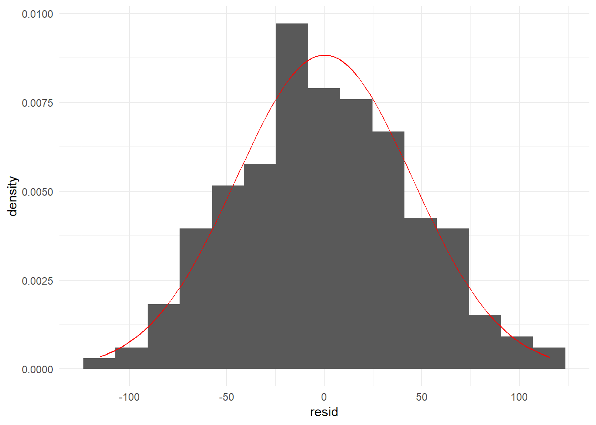
  
The match of residual distribution with the theoretical distribution is not perfect, but overall this model seems to sufficiently satisfy the normality assumption. To give a counter example, we estimate the same model using the outcome variable `returns`, which captures the number of times a participant had (desparately) returned to the homepage.


```r
M_age_rtrn <- 
  stan_glm(returns ~ 1 + age_shft, data = BAB1)
P_age_rtrn <- posterior(M_age_rtrn)
```


```r
T_age_rtrn <- coef(P_age_rtrn)
T_age_rtrn
```


|parameter   |type  |fixef     | center| lower| upper|
|:-----------|:-----|:---------|------:|-----:|-----:|
|Intercept   |fixef |Intercept |  2.563|  1.99| 3.099|
|age_shft    |fixef |age_shft  | -0.004| -0.02| 0.013|
|sigma_resid |disp  |NA        |  1.875|  1.71| 2.073|


```r
C_age_rtrn_disp <- 
  T_age_rtrn %>% 
  filter(type == "disp") %>% 
  select(center) %>% 
  as.numeric()

G_resid_age_rtrn <-
  data_frame(resid = residuals(M_age_rtrn)) %>% 
  ggplot(aes(x = resid)) + 
  geom_histogram(aes(y = ..density..), bins = 10) +
  stat_function(fun = dnorm, 
                args = c(mean = 0, 
                         sd = C_age_rtrn_disp), 
                colour = "red") +
  xlim(-5, 5)
G_resid_age_rtrn
```

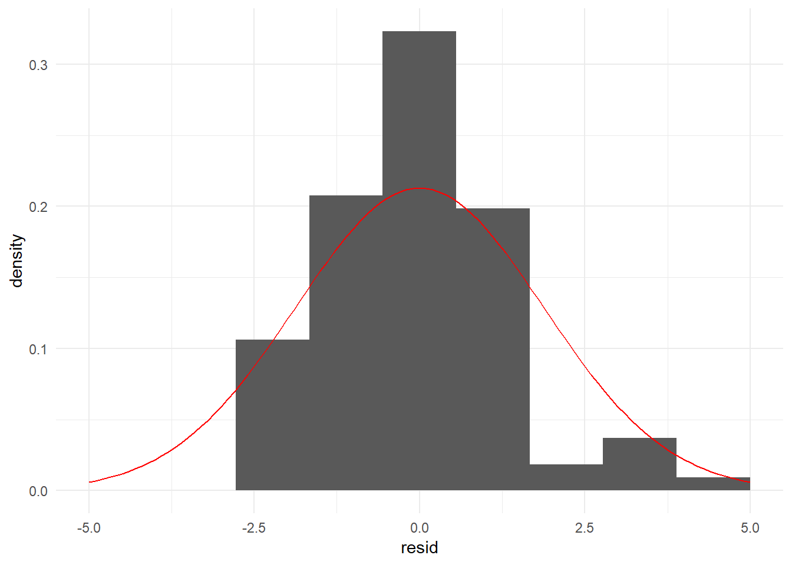


```r
detach(BrowsingAB)
```


The estimation produces the usual coefficients, as well as a standard error. However, the residuals do not even remotely resemble the theoretical curve. While it is unimodal, it appears rather asymmetric, with a steep rise to the left and a long tail to the right. That is a typical outcome when count measures get too close to the left boundary. How about unimodality? We have not discussed any multimodal theoretical distributions in \@ref(distributions), but one has been displayed in \@ref(first_program). In brief, a bimodal residual distribution can arise, when two groups exist in the data, which lay far apart. The following  code illustrates the situation by simulating a simple data set with two groups, that is fed into a GMM.


```r
attach(Chapter_LM)
```


```r
set.seed(42)
D_bimod <- 
  bind_rows(
    data_frame(Group = "A", y = rnorm(50, 4, 1)),
    data_frame(Group = "B", y = rnorm(50, 8, 1))
  )
```


```r
M_bimod <- stan_glm(y ~ 1, data = D_bimod, iter = 200)
```


```r
D_bimod  %>%  
  mutate(resid = residuals(M_1)) %>% 
  ggplot(aes(x = resid)) +
  geom_density()
```


These two deviations from normal distribution have very different causes: asymmetry is caused by scales with boundaries. This is an often arising situation and it is gracefully solved by Generalized Linear Models \@ref(GLM). This is a family of models, where each member covers a certain type of measurement scale. In the above example, Poisson regression, applies, taking care of count measures. Multimodality is caused by heterogeneous groups in the data, like experimental conditions, design or type of user. For a grouping structure to cause distinguished multimodality, differences between groups have to be pronounced in relation to the standard error. It is often the case, that these variables are controlled conditions, such as in an AB test. It is also quite likely that strong grouping structures can be thought of beforehand and be recorded. For example, in usability tests with diverse user samples, it almost comes natural to distinguish between users who have used the design before and those who did not. If the grouping variable is recorded, the solution is group comparison models \@ref(CGM), already introduced.

Visual assessment of symmetry and unimodality is simple and effective in many cases. But, normal distributions are not the only ones to have these properties. At least logistic distributions and t distributions have these, too, with subtle differences in curvature. Normal and t distributions differ in how quickly probability drops in the tails. Normal distributions drop much faster, meaning that extreme events are practically impossible. With t-distributions, extreme values drop in probability, too, but the possibility of catastrophies (or wonders) stays substantial for a long time.

Provided one has a small abundance of data, *quantile-quantile (qq) plots* can be used to evaluate subtle deviations in curvature (and symmetry and unimodality). In qq plots, the observed and theoretical distributions are both flattened and put against each other. This is a powerful and concise method, but it is a bit hard to grasp. The following code illustrates the construction of a qq-plot that compares GMM residuals of a t-distributed measure against the normal distribution. We simulate t-distributed data, run a GMM and extract residuals, as well as the standard error $\sigma_\epsilon$.


```r
set.seed(2)
D_t <- data_frame(y = rt(200, 2))
```


```r
M_t <- stan_glm(y ~1, data = D_t, iter = 200)
```

We obtain the following residual and theoretical distributions. It is approximately symmetric and unimodal, but the curvature seems to be a bit off.


```r
D_t <-   mutate(D_t, resid = residuals(M_t))

C_sigma <- rstanarm::sigma(M_t)

D_t %>%
  ggplot(aes(x = resid)) +
  geom_histogram(aes(y = ..density..)) +
  stat_function(fun = dnorm,
                args = c(mean = 0,
                         sd = C_sigma),
                colour = "red")
```


The next step is where the two curves get flattened. First, we compute a sequence of quantiles with fixed steps, say 1%, 2%, ... 99%%. Finally, theoretical and observed quantiles are fed into a scatterplot.


```r
D_QQ <- data_frame(step = 0:100/100,
           quant_smpl = quantile(D_t$resid, step),
           quant_theo = qnorm(step, 0, C_sigma))

D_QQ %>% 
  ggplot(aes(x = quant_theo, y = quant_smpl)) +
  geom_point() +
  geom_abline(slope = 1, intercept = 0, col = "red")
```


In the ideal case, they match perfectly and the quantiles are on a straight line. Instead, we see a rotated sigmoid shape and this is typical for fat-tailed distributions such as t. The shape is symmetric with turning points at around -4 and 4 on the theoretical scale. In the middle part the relation is almost linear, however, not matching a 1-by-1. The t distribution loses probability mass rather quickly when moving from the center to the turning points. From these points on the theoretical quantiles start to lag behind. The lower and upper 1% sampled quantiles go to much more extreme values, ranging from -10 to almost 20, whereas the Normal distribution  renders such events practically impossible. Generally, a rotated sigmoid shape is typical for fat tailed distributions. The problem of misusing a Normal distribution is that it dramatically underestimates extreme events. Have you ever asked yourself, why in the 1990s, the risk for a nuclear meltdown were estimated to be one in 10.000 years, in face of two such tragic events in the past 40 years? Perhaps, researchers used the Normal distribution for the risk models, under-estimating the risk of extreme events. <!-- #63 -->

The ggplot engine provides an easy to use geometry for qqlots, which lets us further explore deviant patterns. Variables with t distribution take an inverse-sigmoid shape due to their fat tails. 


```r
D_t %>% 
  ggplot(aes(sample = resid)) +
  geom_qq(distribution = qnorm) +
  geom_abline(intercept = 0, slope = 1, col = "red")
```


```r
detach(Chapter_LM)
```


Once mastered, the qq-plot is the swiss knife of Normality check. Next to the subtleties, we can also easily discover deviations from symmetry. This is how the residuals of the returns-to-homepage model look like:


```r
  data_frame(resid = residuals(BrowsingAB$M_age_rtrn)) %>% 
  ggplot(aes(sample = resid)) +
  geom_qq(distribution = qnorm) +
  geom_abline(intercept = 0, slope = 1, col = "red")
```


To the left, extreme values have a lower probability than predicted by the Normal distribution, but the right tail is much fatter, once again. We also see how residuals are clumped, which is characteristic for discrete (as compared to continuous) outcome measures. This is poor behaviour of the model and, generally, when a model is severely mis-specified,  neither predictions nor estimates, nor certainty statements can be fully trusted. A model that frequently fits in case of count numbers is  Poisson regression, which will enter the stage in chapter \@ref(poisson_regression). 


#### Constant variance {#resid_constant_variance}

In \@ref(resid_normality), we assessed one assumption that underlies all linear models, namely Normal distribution of residuals. The second assumption underlying the linear model random (or residual) is that residual variance is constant throughout the whole range. In both classic and modern notation, this stems from the fact that there is just a single $\sigma_\epsilon$ defined. However large $\mu_i$ is, the dispersion of residuals is not supposed to change.

Before we dive into the matter of checking the assumption, let's do a brief reality check using common sense:

1. Consider people's daily commute to work. Suppose you ask a few persons you know: "What is your typical way to work and what is the longest and the shortest duration you remember?". In statistical terms, you are asking for a center estimate and (informal) error dispersion. Is it plausible that a person with typical travel time of 5 minutes experienced the same variation as another person with a typical time of 50 minutes?

1. Consider an experiment to assess a typing training. Is it plausible that the dispersion of typing errors before the training is the same as after the training?

In both cases, we would rather not expect constant variance and it is actually quite difficult to think of a process, where a strong change in average performance is not associated with a change in dispersion. The constant variance assumption, like the normality assumption is a usual suspect when approximating with linear models. We will come back to that down below.

In a similar way, we can ask: can it be taken for granted that residual variance is constant when comparing two or more groups? Would you blindly assume that two rather different designs produce the same amount of spread around the average? It may be so, but one can easily think of reasons, why this might be different. We check the situation in the CGM of the BrowsingAB study. Do both design conditions have the same residual variance? Again, we extract the residuals, add them to the data set and produce a boxplot by Design condition:


```r
attach(BrowsingAB)
```


```r
BAB1 %>% 
  mutate(resid_Design = residuals(M_Design)) %>% 
  ggplot(aes(x = Design, y = resid_Design)) +
  geom_boxplot()
```


Both sets of residuals are reasonably symmetric, but it appears that design B produces more widely spread residuals. Something in the design causes individual performance to vary stronger from the population mean. The cause of this effect will be disclosed in \@ref(differential_design_effects). (In essence, design B is rather efficient to use for younger users, whereas older users seem to have severe issues.)

Visual checks of constant variance for factors is straight forward using common boxplots. For continuous predictors, such as age, requires a more uncommon graphical representation  known as *quantile plots*. These are not the same as qq plots, but luckily are included with ggplot. <!-- #63 -->


```r
BAB1 %>% 
  mutate(resid_age = residuals(M_age)) %>%
  ggplot(aes(x = age, y = resid_age)) +
  geom_point() +
  geom_quantile()
```


The quantile plot uses a smoothing algorithm (probably not unlike LOESS) to picture the trend of quantiles (25%, 50% and 75%). Here, the quantiles run almost horizontal and parallel, which confirms constant variance. Taking this as a starting point, we can evaluate more complex models, too. The MPM on age and design, just requires to create a grouped quantile plot. This looks best using facetting, rather than separating by colour:


```r
BAB1 %>% 
  mutate(resid_mpm_2 = residuals(M_mpm_2)) %>%
  ggplot(aes(x = age_shft, y = resid_mpm_2)) +
  facet_grid(~Design) +
  geom_point() +
  geom_quantile()
```


This looks rather worrying. Especially with Design A, the residuals are not constant, but increase with age. In addition, we observe that residuals are not even centered at zero across the whole range. For design A, the residual distribution moves from positive centered to negative centered, design B vice versa. That also casts doubts on the validity of the LRM on age: these contrariwise trends seem to mix into an unsuspicious even distribution. It seems that a lot more has been going on in this study, than would be captured by any of these models.


```r
detach(BrowsingAB)
```


Another model type we may want to check with quantile plots is the MRM. With two continuous predictors, one might be tempted to think of a 3-dimensional quantile plot, but this is not recommended. Rather, we can use a generalization of quantile plots, where the x-axis is not mapped to the predictor directly, but the predicted values $\mu_i$. We assess the residual variance on the MRM model on the AUP study, where resistance to fall for the active user paradox has been predicted by geekism tendencies (gex) and need-for-cognition (ncs):


```r
attach(AUP)
```


```r
AUP_1 %>% 
  mutate(resid_3 = residuals(M_3),
         mu_3 = predict(M_3)$center) %>%
  ggplot(aes(x = mu_3, y = resid_3)) +
  geom_point() +
  geom_quantile()
```


We observe a clear trend in quantiles, with residual dispersion increasing with predicted values. Generally, plotting residuals against predicted values can be done with any model, irrespectively of the number and types  of predictors. However, interpretation is more limited than when plotting them against predictors directly. In fact, interpretation boils down to the intuition we introduced at the beginning of the section, that larger outcomes typically have larger dispersion. This is almost always a compelling assumption, or even a matter of underlying physics and, once again, a linear model may or may not be a reasonable approximation. Fortunately, when we turn towards \@ref(generalized_linear_models), we will find that these  models provide more reasonable defaults for the relationship between predicted values and dispersion. In contrast, residual variance per predictor allows to discover more surprising  issues, such as interaction effects or heterogeneity in groups.


```r
detach(AUP)
```


<!-- 37

What has happened here is another flavour of the endless-universe paradox. When discussing predictions, we had seen that the linear model is always compromised as it assumes an infinite range of the outcome variable. Often that is of no practical concern, as long as one stays in the safe area with predictions. The problem here arises from the residual distribution extending to infinity in both directions, too. The LR with homepage returns by age estimated number of returns of a 20-year to be `frm_coef(coef(P_age_rtrn), ~fixef == "Intercept")`, with a residual standard error of $`C_age_rtrn_disp`$. As the expected value is positive, there is no linearity paradox and we are perfectly fine.


Analyses of expected values (predictions) are necessary to discover problems with the linearity. Are the predictions we want to make in the safe range? This is essential to know for serious quantification. It is logical, that prediction analysis can only be done after the model has been applied to the data. Residual analysis is another essential part of the modelling process. By analysing residuals, we reflect on whether the Normality assumption is reasonably defensible. For the distribution of count variables may not look Normal at all and impossible predictions can arise when simulating from the model. Keep in mind, that neither the linearity nor the Normality assumption are truly defensible ever, in an endless universe. 

Drawing on expected values, *residual analysis is something you can only do after estimation*. It is usually part of a process called *checking assumptions*, which somehow implies you do it beforehand, which lured many into analyzing the *distribution of the outcome* variable $y_i$ before running the model. This is a false meme, because assumptions are always checked after a certain model has been estimated. In particular, we should check three assumptions on linear models: Normal distribution, independence and homogeneity of variance, which all are codified in the classic residual formula:

$$
\epsilon_i \sim \textrm{Norm}(0, \sigma)
$$


The first assumption of linear models is obvious: the residual distribution must follow a *Normal distribution*. There is an easy and an advanced way to check whether this is true. It is easiest to create a density plot from residuals and compare it to the known properties of a Normal distribution:


```bab1_check_normal
data_frame(resid = residuals(M_age)) %>% 
  ggplot(aes(x = resid)) +
  geom_density()

```

The residual distribution of `M_age` appears perfectly symmetric and has just one peak (unimodality). That is good, although the overall shape more resembles a mole hill rather than a bell curve. While it is easy to discover problems of multimodality or asymmetry in a histogram, a more advanced approach is needed to uncover more subtle deviations. Recall what cumulative density functions (CDF) (\@ref(density-distributions)) do: for any point $x$ it gives the probability to observe a value $y_x$.

The single residual distribution assumption of linear models, as harmless as it may appear, brings forth two claims:  residuals must have the same dispersion everywhere, which is called *homogeneity  of variance* and residuals must have *independence* from any predictors. All residuals are supposed to fall into a horizontal band of even width, like in the figure \@ref(quantile_caterpillar). Note how this figure is created by first simulating data using the approximate coefficients of model `M_age`. The independence of residuals emerges by the absence of any relation with age in the data generating code.


```quantile_caterpillar
set.seed(42)
data_frame(age = runif(200, 20, 70),
           resid = rnorm(200, 0, 46),
           Obs = dplyr::min_rank(age)) %>% 
  ggplot(aes(x = Obs, y = resid)) +
  geom_point() +
  geom_quantile()
  
```


\@ref(BAB1_resid_age_1) reveals some further issues with the models. Note that in the caterpillar plot, the x-axis is labelled with numbers, which is just an identification but has no metric meaning. Not quite! Review the code to see that the observations were not just taken as they came, but re-arranged by age. Also, in \@ref(BAB1_resid_age_1)  a second geometry is visible, showing a so called *quantile plot*.


The residuals follow a flat line (at zero), whereas we see in the graph that the residuals tend towards negative values for older people. The same holds for the dispersion of residuals: there is exactly one $\sigma$ in the equation, hence there should not be any difference in variance between young and old.
Quantile plots resemble the boxplot, in that they approximate the 25%, 50% and 75% quantiles. Two visible trends occur in both models. First, the residuals seem to get more dispersed for higher age. Second, there is a downward trend, with the error for older people tending to be on the negative side. It seems that young and old have different residual distributions, although the classic residual term clearly demands that they come from a single distribution:


-->


### Assessing predictive power {#resid_predictive_power}


```r
attach(BrowsingAB)
```


When residuals are pronounced, predictions are inaccurate, which is undesirable. A model that reduces the residuals, may provide better predictions. In the current case, we may wonder: does the age predictor effectively reduce the residual standard error $\sigma_\epsilon$ as compared to the GMM? We fit the GMM for comparison purposes and compare the standard error. This does not look convincing, as the reduction is marginal.


```r
M_0 <-
  BAB1 %>% 
  stan_glm(ToT ~ 1, data = .)
```


```r
bind_rows(
  posterior(M_0),
  posterior(M_age_cntr)) %>% 
  coef(type = "disp")
```


|model      | center| lower| upper|
|:----------|------:|-----:|-----:|
|M_0        |   46.1|  42.0|  51.2|
|M_age_cntr |   45.2|  41.1|  49.9|

Does the age variable really have that little predictive value? The following graph shows the individual residuals for both models as a column plot. The two caterpillars have about the same overall width and there is no noticable reduction in residual magnitude by adding the age predictor.


```r
T_resid <-
  BAB1 %>% 
  select(Obs, age) %>% 
  mutate(
    M_0 = residuals(M_0),
    M_age = residuals(M_age))

G_resid_age_1 <-
  T_resid %>%
  mutate(Obs_ordered = min_rank(age)) %>% 
  gather(model, error, -Obs, -Obs_ordered, -age) %>%
  ggplot(aes(x = Obs, y = error)) +
  facet_grid(~model) +
  geom_col(position = "dodge") +
  geom_quantile()
G_resid_age_1
```

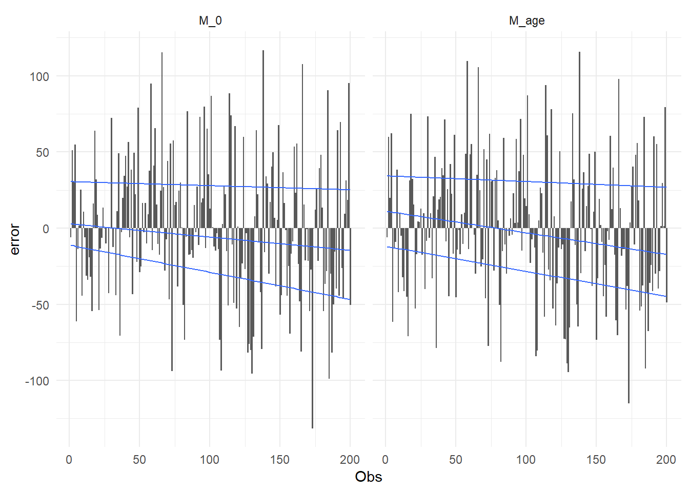

When adding a predictor to a model, the least one would expect is a noticable reduction in error and \@ref(BAB1_resid_age_1) confirms that the age predictor is pretty useless.


```r
detach(BrowsingAB)
```


<!-- ### How to plot MPM? [TBC, move to Interaction effects] -->

<!-- Now that we have seen how we can compare based on one factor, we can extend the CGM to more factors. With linear  models, we can extend the basic CGM to incorporate multiple of such factors. This is called *multifactorial models* (MFM). -->

<!-- Now, we are looking at a slightly more complicated situation, where browsing is predicted by design and education level of participants at the same time. -->

<!-- First, with the *ggplot* system, we plot the new situation. Recall that with *ggplot* you can -->

<!-- 1. map variables in the data set to elemental properties in the plot, such as: x position, y position, colour, shape etc. -->

<!-- 1. select an appropriate geometry that carries such properties, e.g. points, bars, box plots. -->

<!-- ```{r anova_twofact_2, opts.label = "future"} -->
<!-- attach(BrowsingAB) -->

<!-- BAB1 %>% -->
<!--   ggplot(aes(x = Design,  -->
<!--              y = ToT,  -->
<!--              fill = Education)) + -->
<!--   geom_boxplot() -->

<!-- detach(BrowsingAB) -->
<!-- ``` -->

<!-- Now we can do the two-factorial ANOVA in much the same way as before. We only have to add the predictor *Education* to the model formula, then we run the MCMC estimation and get the estimates. -->

<!-- [Interaction plots with groups, -->
<!-- IA plots with standard debs, -->
<!-- mixed IA plots, -->
<!-- using the AMM] -->


### Empirical versus statistical control

Fundamental researchers have a knack for the experimental method. An *experiment*, strictly, is a study where you measure the effects of variables you *manipulate*. Manipulation is, almost literally, that it is *in your hands*, who receives the treatment. The fantastic thing about manipulation is that it allows for *causal conclusions*. A *strictly controlled experiment* is when all influencing variables are either manipulated or kept constant. That is an ideal and would not even be the case if you test the same person over-and-over again (like researchers in psychophysics often do). You never jump into the same river twice.

Sometimes an influencing variable lends itself to be kept constant. For example, in cognitive psychological experiments environment and equipment is usually kept constant. For applied research, keeping things constant comes at a major disadvantage: it limits the possible conclusions drawn from the study. Imagine, you tested a smartphone app with participants, all students, comfortably sitting in a quiet environment. Would you dare to make conclusions on how any users perform in real life situations, say while driving a car? When keeping things constant, *ecological validity* and *generalizability* suffer.

In most applied design studies we need ecological validity and generalizability. If performance differs under certain conditions, you certainly want to know that.
The solution is to *let conditions vary and record them* as variables, as good as possible. For example, if you were to compare two voice-controlled intelligent agent apps, you could manipulate the ambient noise level, if you are in the lab.

In practically all applied studies, variables may exist  which you cannot manipulate. Especially, user traits are impossible to manipulate; If someone has an extrovert character or did a lot of gaming in the past, you cannot change that. Diversity of users is a fact and people come as they are.

Field studies usually aim for high ecological validity. Participants are supposed to use the system in the situations they encounter. If a smartphone app is being used sitting, walking, driving or at a secret place, it is crucial to observe all situations. Consider a car navigation system that is tested in a long, lonely highway situation only. How much would the results tell your for performance in dense city traffic? Design researchers frequently need  results that are highly representative for various users and situations of use.

Fundamental lab researchers are afraid of individual differences, too. The reasons are different, though: all non-manipulated influencing factors add noise to the study, which makes it harder to find the effects of interest. While lab researchers do there best to keep the environment constant, they cannot keep all participant traits constant. Lab researchers have two solutions to the problem: matching and randomized control. 

With *pair matching*, potentially relevant participant traits are recorded upfront; then participants are assigned to conditions such that groups have about the same composition. For example, one makes sure that the age distribution is about the same and both genders are equally represented. When all other influencing variables are constant between groups, the lab researcher can be sure that the effect is unambiguously caused by the manipulation. So they say and routinely record participants age, gender and nationality.

However, there are better alternatives: the best pair  match is the person herself. Experimental studies that expose the same person to several conditions are called *within-subject*. In the special case that all participants encounter all conditions, the variable is *complete within-subject*. [A special  case of within-subject design is *repeated measures*.] In the following chapter, we use mixed-effects models [LMM] to deal with within-subject designs, gracefully.

In design research, pair matching applies for situations where designs are compared. In the simple situation that a design is evaluated against a set standard (e.g. 111 seconds to rent a car), it is more important to do *population matching*. The sample of participants is drawn to be *representative for the target population*. Representativeness comes in two levels: *coverage representation* is reached when all influencing properties have occurred a few times during observation. So, if your target population contains several subgroups, such as age groups, experience or people with different goals, they should all be covered to some extent.
*Proportional representation* means all user and situational properties are covered *and* they have about the same proportion in the sample as in the population.  

You can only match what you can measure and you only measure what you expect. Human behaviour in everyday life is influenced by many factors in complex ways. Although a plethora of personality inventories exists, doing them all prior to the real study is impossible. It would probably not even be effective. Never have I seen a design research study, where even the most established personality tests explain more than a few percent of variation. As another example, take the primacy effect: what you experienced first, has the strongest influence. In real life, impressions are constantly pouring on people and you will never be able to record and match that to a reasonable extent.

When influencing variables cannot be measured for matching or statistical control, the last resort is *randomized control*. This is a misleading term, insofar as what the researcher actually does is to *let go to chance*. Indeed, if the process of drawing participants and assigning them to manipulations is completely left to chance, then *in the long-term*, the sample will be proportional representative and all groups will have the same composition of traits.  *Randomization* works well with larger samples. With small samples, it can still easily happen that one ends up with more or less biased samples or heterogeneous groups. Just by chance, more higher-educated people could have ended up in condition A of BrowsingAB.

Using manipulation, matching or randomization in in-the-wild research may work in some cases. In other cases, it will be ineffective or impractical. The ultimate problem is the attempt to keep things constant.  In applied design research the questions rarely come down to a "Is A better than B?". If there is an age effect, you may certainly want to know it and see how the design effect compares to it.
But, you can only examine what is varied and recorded. The approach of *statistical control* is to record (instead of manipulate) all variables that may influence the results and add them to the statistical model. As we will see now, the linear model puts no limits on the number of predictors. If you believe that user age may play a role for performance, just record it and add it to the model. Statistical control requires at least coverage representation of the sample.

### Exercises

1. Rerun `M_3`, this time using the unstandardized resistance scores. Interpret the intercept.

1. The innovators behind the WWW have a long tradition in figurative use of nautical metaphors, like navigator, cybernaut, ... Do people in a world-wide hypermedia system behave like animals roaming known and lesser known territory? Then we would expect performance to be dependent on abilities for spatial cognition, like the visual-spatial working memory. Another theory could draw on the fact that for most websites, the written word prevails. Would we not expect people with better verbal processing capabilities to excel? Consider a study `MMN` (for Miller's magic number, an iconic term in working memory research) that examines the influence of working memory capacities on people's browsing performance. Two tests for WM capacity were used: the Corsi task for visual-spatial WM capacity and the Ospan task for verbal WM capacity. Then participants were given five different search tasks on five websites. As a measure of efficiency, total time on task and number of clicks were  recorded. As these variables tend to have skewed residual distributions, logarithmic transformation was applied before analysis. *Do LRM on both WM predictors separately, then move on to an MRM*.


## Interaction effects

With the framework of MPM, we can use an arbitrary number of predictors. These can represent properties on different levels, for example, two designs proposals for a website can differ in font size, or participants differ in age. So, with MPM we gain much greater flexibility in handling data from applied design research, which allows us to examine user-design interactions (literally) more closely. 

The catch is that if you would ask an arbitrary design researcher:

> Do you think that all users are equal? Or, could it be that one design is better for some users, but inferior for others?

you would in most cases get the answer:

> Of course users differ in many ways and it is crucial to know your target group.

Some will also refer to the concept of usability by the ISO 9241-11, which contains the famous four words:

> "... for a specified user ..."

The definition explicitly requires you to state for *for whom* you intended to design. It thereby implicitly acknowledges that usability of a design could be very different for another user group. In other words, statements on usability are by the ISO 9241-11 definition *conditional* on the target user group.

In statistical terms, conditional statements have this form:

> the effect of design changes with (some) user properties

In regression models, conditional statements like these are represented by _interaction effects_. Interactions between user properties and designs are the most genuine in design research, and deserve a neologism: *differential design effects (DDM)*<!-- #64-->. They come with some of their siblings. *Saturation* occurs when physical (or other) boundaries are reached and the result is less than the sum. *Amplification*, a rare one, is like compound glue: it will harden only if the two components are present. The final section is a plea for interaction effects in theorizing.


### Users differ: differential design effects {#differential_design_effects}

Do people differ? Yes. If you showed two web designs to a group of stakeholders, asking to choose individually. Is there any chance they would all agree? No. Is the design of universal systems easy? No. The ideal of universal design is to never put a user group at a disadvantage. If it is an ideal, then designs are likely to differ in how much they accomplish it. 

As to age: it is commonly held that older people tend to have lower performance than younger users. A number of factors are called responsible, such as: slower processing speed, lower working memory capacity, lower motor speed and visual problems. Is, perhaps, one of the two designs less of a burden for elderly users? We plot the observed ToT by age, this time forming groups by design. 


```r
attach(BrowsingAB)

G_slope_ia <-
  BAB1 %>%
  ggplot(aes(x = age,
             col = Design,
             y = ToT)) +
  geom_point() +
  geom_smooth(method = "lm", se = F)


G_slope_ia
```

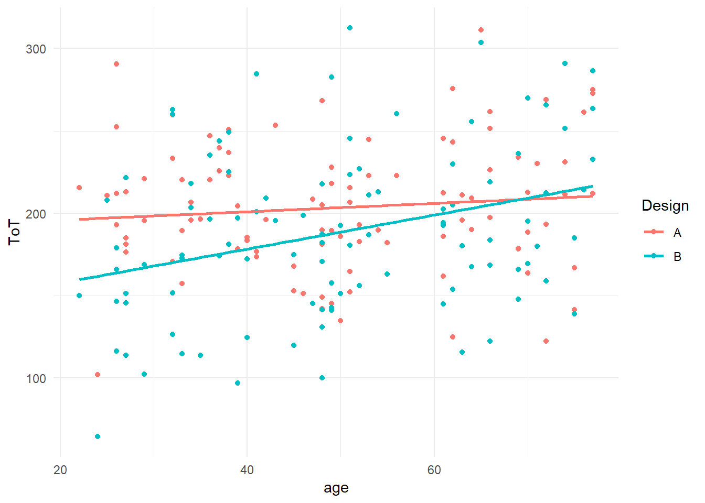


As we have seen, with GLM, it is  possible to investigate the effect of design properties and user properties simultaneously. For example, assume that main difference between design A and B in the web browsing example is that A uses larger letters than B. Would that create the same benefit for everybody? It is not unlikely, that larger letters only matter for users that have issues with farsightedness, which is associated with age. Maybe, there is even an adverse effect for younger users, as larger font size takes up more space on screen and more scrolling is required. 

We recall the MPM in BrowsingAB: `M_mpm_2` showed a moderate relationship between age and ToT. The design effect was disappointing (`M_Design`): a classic statistician may have called it "significant", but one can hardly claim practical relevance. By adding the interaction effect `Design:age_shft` to the model, we will now investigate how the age effect differs by design. We call this a *differential interaction effect*, as one of the involved <!--#65-->


```r
M_ia1 <- 
  BAB1 %>% 
  stan_glm(ToT ~ Design + age_shft + Design:age_shft,
				 data = .)

# T_resid <- mutate(T_resid, M_ia1 = residuals(M_ia1))
```


```r
T_ia1 <-
  bind_rows(
    posterior(M_mpm_2),
    posterior(M_ia1)) %>% 
  fixef()
  

T_ia1
```


|model   |fixef            |  center|   lower|   upper|
|:-------|:----------------|-------:|-------:|-------:|
|M_ia1   |Intercept        | 195.684| 176.708| 214.337|
|M_ia1   |DesignB          | -37.779| -64.695| -12.813|
|M_ia1   |age_shft         |   0.259|  -0.276|   0.798|
|M_ia1   |DesignB:age_shft |   0.770|   0.056|   1.557|
|M_mpm_2 |Intercept        | 184.208| 169.940| 198.789|
|M_mpm_2 |DesignB          | -14.981| -27.804|  -2.140|
|M_mpm_2 |age_shft         |   0.648|   0.254|   1.033|


The intercept still is the performance of an average twenty-year-old using design A. Compared to the MPM, it is less favorable, with $195.68 [176.71, 214.34]_{CI95}$ seconds time-on-task. The effect of design B improved dramatically with the DDM: a twenty-year-old is now $-37.78 [-64.7, -12.81]_{CI95}$ faster with it. Is B the clear winner? It is not,  because A has a much lower age effect. The age parameter does no longer represent both groups, but just reference A, and it is now very small, $0.26 [-0.28, 0.8]_{CI95}$. The final coefficient is *not* the age effect in B, but *the difference* to the reference age effect. With design B, users are getting 1.029 seconds slower per year of life. That is a lot!


If we can do it with continuous predictors, like age, we can do it with factors, too. For example, does the overall improvement from design A to B depend on education level?


```r
BAB1 %>% 
  ggplot(aes(y = ToT, x = Education, color = Design)) +
  geom_boxplot()
```

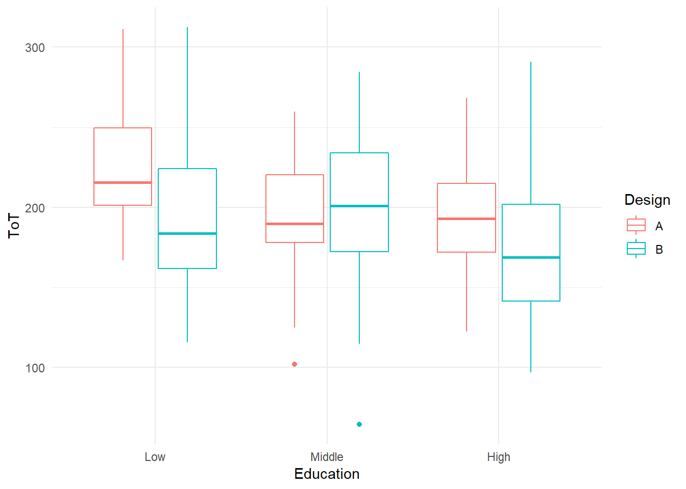


Again, we compare the main-effect model to the one with interaction effects. 


```r
M_mpm_3 <-
  BAB1 %>% 
  stan_glm(ToT ~ Design + Education,
				 data = .)

M_ia2 <- 
  BAB1 %>% 
  stan_glm(ToT ~ Design + Education + Design:Education,
				 data = .)

# T_resid <- mutate(T_resid, M_ia2 = residuals(M_ia2))
```


```r
T_ia2 <-
  bind_rows(
    posterior(M_mpm_3),
    posterior(M_ia2)) %>% 
  fixef() 
  

T_ia2
```


|model   |fixef                   | center|  lower|  upper|
|:-------|:-----------------------|------:|------:|------:|
|M_ia2   |Intercept               | 224.57| 208.53| 239.20|
|M_ia2   |DesignB                 | -26.34| -48.10|  -4.42|
|M_ia2   |EducationMiddle         | -29.51| -51.65|  -7.64|
|M_ia2   |EducationHigh           | -31.49| -51.70| -10.77|
|M_ia2   |DesignB:EducationMiddle |  32.98|   1.61|  64.12|
|M_ia2   |DesignB:EducationHigh   |   4.36| -24.50|  32.74|
|M_mpm_3 |Intercept               | 218.83| 206.34| 231.21|
|M_mpm_3 |DesignB                 | -15.11| -26.84|  -3.27|
|M_mpm_3 |EducationMiddle         | -13.46| -28.80|   2.44|
|M_mpm_3 |EducationHigh           | -29.39| -43.19| -14.46|


The model has factors only, so there is a reference group. The intercepts in both models represent low education encountering design A. The main  effect designB on low-educated  users is present in both models. With the interaction term, design B looks much more favorable, $-26.34 [-48.11, -4.42]_{CI95}$. The effect of middle education has doubled, whereas it remains stable for high education. 

That may appear strange at first, but keep in mind, that by the interaction term, the education main effects are no longer "main": they only refer to group A, now. In the main effects model, the same education effects are assumed for both designs. Here, it is conditional on design, which brings us to the two interaction effects `B:Middle` and `B:High`. These are, once again, differences. The effect of middle education in B is $32.98$more seconds than in A ($-29.51$)<!-- #66 -->. There practically is no net effect of middle education in B. In contrast, the high education interaction effect is small, with practically makes `DesignB` a *main effect: it is the same in both groups*.

Count the number of parameters in both models! We have six with interaction and four without. Six is just the number of groups and, indeed, with interaction effects all group means can vary freely. That is best demonstrated by estimating a variant of the model, where six parameters represent six group means, directly. In other words, it is an AGM, without an intercept and without main effects:


```r
M_ia3 <-
  BAB1 %>% 
  stan_glm(ToT ~ 0 + Design : Education,
				 data = .)
# T_resid <- mutate(T_resid, M_ia2 = residuals(M_ia2))
```


We extract the coefficients and, with a little preparation, we create an *interaction plot*. It shows the same pattern as the exploratory plot, but is fully inferential, with error bars indicate the 95% credibility interval.


```r
P_ia3 <- posterior(M_ia3)
T_ia3 <- fixef(M_ia3)
T_ia3
```


|fixef                   | center| lower| upper|
|:-----------------------|------:|-----:|-----:|
|DesignA:EducationLow    |    224|   208|   240|
|DesignB:EducationLow    |    197|   181|   212|
|DesignA:EducationMiddle |    194|   178|   209|
|DesignB:EducationMiddle |    200|   185|   216|
|DesignA:EducationHigh   |    192|   178|   207|
|DesignB:EducationHigh   |    170|   157|   184|


```r
T_ia3 %>% 
  select(fixef, ToT = center, lower, upper) %>% 
  separate(fixef, c("Design", "Education"), ":") %>% 
  mutate(Design = str_replace(Design, "Design", ""),
         Education = str_replace(Education, "Education", ""),
         Education = forcats::fct_inorder(Education)) %>% 
  ggplot(aes(y = ToT, ymin  = lower, ymax = upper,
             x = Education, 
             color = Design, group = Design)) +
  geom_pointrange(alpha = .5) +
  geom_line()
```

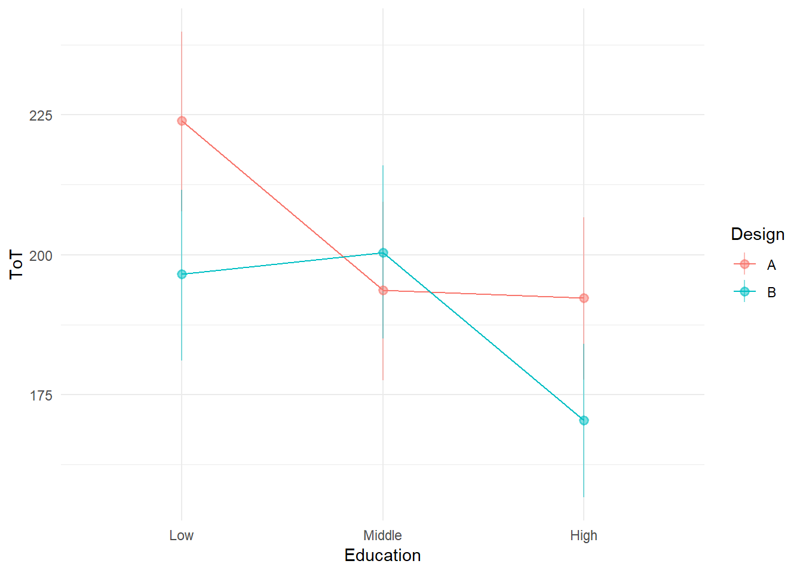
<!-- #67 -->


```r
detach(BrowsingAB)
```


We can distinguish between *saturation effects* and *amplification effects*. <!-- #68 -->


```r
	expand.grid(effect = c("saturation", "amplification"), 
							A = c(0,1),
							B = c(0,1)) %>%
		join(data.frame(effect = c("saturation","amplification"),
										beta_1 = c(.1,.1),
										beta_2 = c(.2,.2),
										beta_3 = c(-0.3, 0.3)))  %>%
		mutate(Outcome = A * beta_1 + B * beta_2 + A * B * beta_3) %>%
		mutate(B = factor(B, labels = c("low", "high")),
					 A = factor(A, labels = c("low", "high"))) %>%
		ggplot(aes(x = A, col = B, y = Outcome)) +
		geom_point(size = 3) +
		geom_smooth(aes(group = B, col= B), method = "lm") +
		facet_grid(.~effect)
```

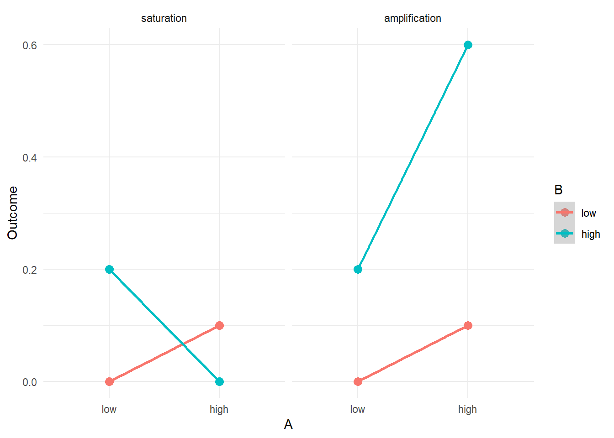

```r
Interactions <- expand.grid(effect = c("saturation", "amplification"), 
						A = seq(0,1, length.out = 11),
						B = seq(0,1, length.out = 11)) %>%
	join(data.frame(effect = c("saturation","amplification"),
									beta_1 = c(.1,.1),
									beta_2 = c(.2,.2),
									beta_3 = c(-0.3, 0.3)))  %>%
	mutate(Outcome = A * beta_1 + B * beta_2 + A * B * beta_3)

library(lattice)
grid.arrange(
	wireframe(Outcome ~ A + B, 
						data = filter(Interactions, effect == "saturation"),
						main = "saturation"),
	wireframe(Outcome ~ A + B, 
						data = filter(Interactions, effect == "amplification"),
						main = "amplification"),
	ncol = 2
)
```


### Hitting the boundaries of saturation

Most statistically trained researchers are aware of some common assumptions of linear regression, such as the normally distributed residuals and variance homogeneity. Less commonly regarded is the assumption of linearity, which arises from the basic regression formula:

$$y_i = \beta_0 + \beta_1 x_{1i} ...$$

The formula basically says, that if we increase $x_1$ (or any other influencing 
variable) by one unit, $y$ will increase by $\beta_1$. It also says that $y$ is composed as a mere sum. In this section, we will discover that these innocent assumptions do not hold.

A major flaw with the linear model is that it presumes the regression line to increase and fall infinitely. However, *in an endless universe everything has boundaries*. The time someone needs to read a text is limited by fundamental cognitive processing speed. We may be able to reduce the inconvenience of deciphering small text, but once an optimum is reached, there is no further improvement. Boundaries of performance measures inevitably lead to non-linear relationships between predictors and outcome. Modern statistics knows several means to deal with non-linearity, some of them are introduced in later chapters of this book ([GLM, NLM]). Still, most researchers use linear models, and it often can be regarded a reasonable approximation, as long as one keeps reasonable distance to the upper and lower boundaries of the outcome. 

Before we turn to a genuine design research case, let me explain saturation effects by an example that I hope is intuitive. It boils down to the question: do two headache pills have twice the effect of one? Consider a pharmaceutical study on the effectiveness of two pain killer pills A and B. It takes place in the aftermath of a great party on a university campus. Random strolling students are asked to participate. First, they rate their experienced headache on a Likert scale ranging from "fresh like the kiss of morning dew" to "dead highway opossum". Participants are randomly assigned to four groups, each group getting a different combination of pills: A-B, A-Placebo, B-Placebo, Placebo-Placebo. After 30 minutes, experienced headache is measured again and the difference between both measures is taken as the outcome measure, headache reduction. We inspect the position of four group means graphically:


```r
attach(Headache)

Pills %>% 
  ggplot(aes(x = PillA, col = PillB, reduction)) +
	geom_boxplot()
```

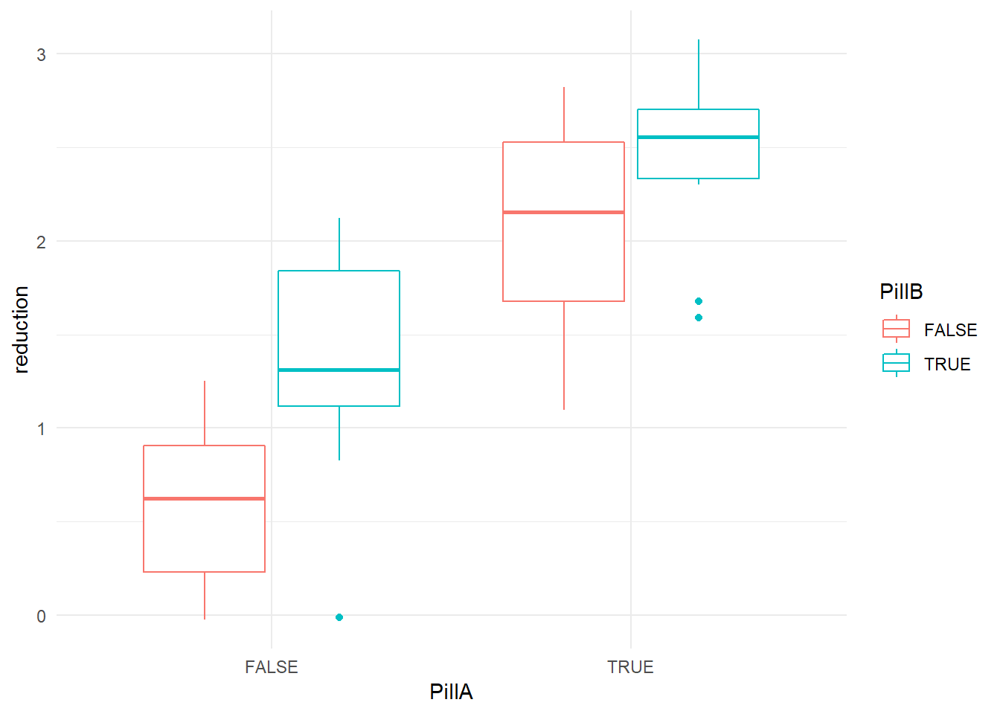


When neither pill is given a slight spontaneous reduction seems to occur, which is the placebo-effect. Both pills alone seem to be effective in their own way, and giving them both has the most beneficial effect. However, it seems that the net effect of B is slightly weaker when administered  together with A. Again, when the effect of one predictor depends on the level of another, the effect is called *conditional*.

Now, we will estimate and compare a set of three models, starting with the standard factorial MPM and proceeding to two models with interaction effects. The third one is actually an AGM with two factors, although it may not seem so at a first glance.


```r
M_1 <- stan_glm(reduction ~ 1 + PillA + PillB, data = Pills)
M_2 <- stan_glm(reduction ~ 1 + PillA + PillB + PillA:PillB, data = Pills)
M_3 <- stan_glm(reduction ~ 0 + PillA:PillB, data = Pills)

P <- bind_rows(
  posterior(M_1),
  posterior(M_2),
  posterior(M_3)
)
```


Imagine, the researcher started with the two-way MGM, estimating the fixed effects PillA and PillB. The result is:


```r
T_fixef_1 <- fixef(M_1)
T_fixef_1
```


|fixef     | center| lower| upper|
|:---------|------:|-----:|-----:|
|Intercept |  0.678| 0.384| 0.975|
|PillATRUE |  1.293| 0.959| 1.626|
|PillBTRUE |  0.576| 0.232| 0.907|


Given these estimates, we conclude that pill A has an almost double reduction of headache compared to B. The intercept indicates that headache diminishes due to the placebo at a rate of $0.68 [0.38, 0.98]_{CI95}$. Setting the placebo-effect aside, what would you predict the effect to be in the group with both pills?


Thinking linearly you probably came up with:

$$1.87$$

Does that make sense? Do the effects of headache pills simply add up like this? Consider a scenario, where five headache pills were compared in the same manner. If we assume linear addition of effects, some participants in the group with all pills could even experience the breathtaking sensation of *negative* headache. Certainly, the effect is not linear. But, is it in the long run? In some Hollywood movies the wounded hero consumes handful of pills before the showdown (With the exception of Leon, the Profi, where it is the scary Gary Oldman consuming some harder stuff). With two pills, how close to the boundaries are we? We can just test that by introducing an *interaction term* to the model: `PillaA:PillB`.


```r
T_fixef_2 <-  fixef(M_2)
T_fixef_2
```


|fixef               | center|  lower| upper|
|:-------------------|------:|------:|-----:|
|Intercept           |  0.592|  0.252| 0.940|
|PillATRUE           |  1.469|  0.976| 1.940|
|PillBTRUE           |  0.746|  0.270| 1.226|
|PillATRUE:PillBTRUE | -0.359| -1.017| 0.315|

We first examine the main effects for both pills. Interestingly, both effects are now considerably stronger than before. Taking either pill alone is more effective than we thought from the multiple CGM. The fourth coefficient (`PillATRUE:PILLBTRUE`) is the interaction term. With the updated model we, again, predict the net headache reduction when both pills are given. This is as simple as summing up all coefficients from intercept to interaction. The result is a combined effect of both main effects *reduced* by   $0.36$. As we would expect, the effectiveness of two pills is not their sum, but less. One can have headache to a certain degree or no headache at all. If it's gone, any more pills have no additional effects. This is called the *saturation effect*: the more is given, the closer it gets to the natural boundaries and the less it adds. Let me emphasize that this is not some strange (and therefore interesting) metabolic interaction between pharmaceuticals. Saturation effects must not be confused with any "real" interaction, that is theoretically interesting. Still, as we have seen, ignoring saturation effects results in severely biased estimates. 

Back to design research! Imagine, you are testing
the influence of font size on reading performance. In your experiment, you found 
that increasing from 8pt to 12pt cuts the required reading time by 10 seconds. 
According to the linear model, you had to expect the reading time to decrease 
by another 10 seconds, when enlarging to 16pt.


```r
detach(Headache)
```


```r
attach(Reading)

D_reading_time <- 
  data_frame(font_size = c(4, 8, 12, 16, 24, 28),
           observed_time = c(NA, 40, 30, NA, NA, NA),
           predicted_time = 60 - font_size/4 * 10) %>% 
  as_tbl_obs()

D_reading_time
```

It should be clear by now, that these expectations have no ground: for normally sighted persons, a font size of 12 is easy enough to decipher and another increase will not have the same effect. Taking this further, one would even arrive at absurdly short or 
impossible negative reading times. At the opposite, a font size of four point may just render unreadable on a computer screen. Instead of a moderate increase by 10 seconds, participants may have to decipher and guess the individual words, which will take much longer.

Researching the effect of font sizes between 8pt and 12pt font size probably keeps the right distance, with approximate linearity within that range. But what happens if you bring a second manipulation into the game with a functionally similar effect? A likely outcome is that the fundamental assumption of *predictors sum up* no longer holds, but *saturation* occurs. 

Let's turn to a fictional, yet realistic problem in design research. Design of systems is a matter of compromises.  A common conflict of interests is between the aesthetic appearance and the ergonomic properties. Consider the  typesetting on web pages. Many commercial websites are equally concerned about the ease of comprehending information as of positive emotional response. From an ergonomic point of view, the typesetting of longer text simply requires you to choose the best screen-readable font, find an optimal font size and maximize contrast. If you were now to suggest typesetting a website in black Arial on white background, you are in for trouble with your graphic designer or, much worse, the manager responsible for corporate impression management. In any case, someone will insist on a fancy serif font (which renders rather poorly on low resolution devices) in an understating blueish-grey tone. For creating a relaxed reading experience, the only option left is to increase the font size. This option is limited by another compromise, though, as too large letters requires excessive scrolling.

The question arises: can one sufficiently compensate lack of contrast by setting the text in the maximum reasonable font size 12pt, as compared to the more typical 10pt? In the fictional study Reading, this is examined in a 2x2 between-subject design:  the same page of text is presented in four versions, with either 10pt or 12pt, and grey versus black font colour. Performance is here measured as time-on-task of reading the full page.


<!--#69-->

```r
D_1
```


```r
D_1 %>% 
  ggplot(aes(col = font_color,
             x = font_size,
             y = ToT)) +
  geom_boxplot()
```

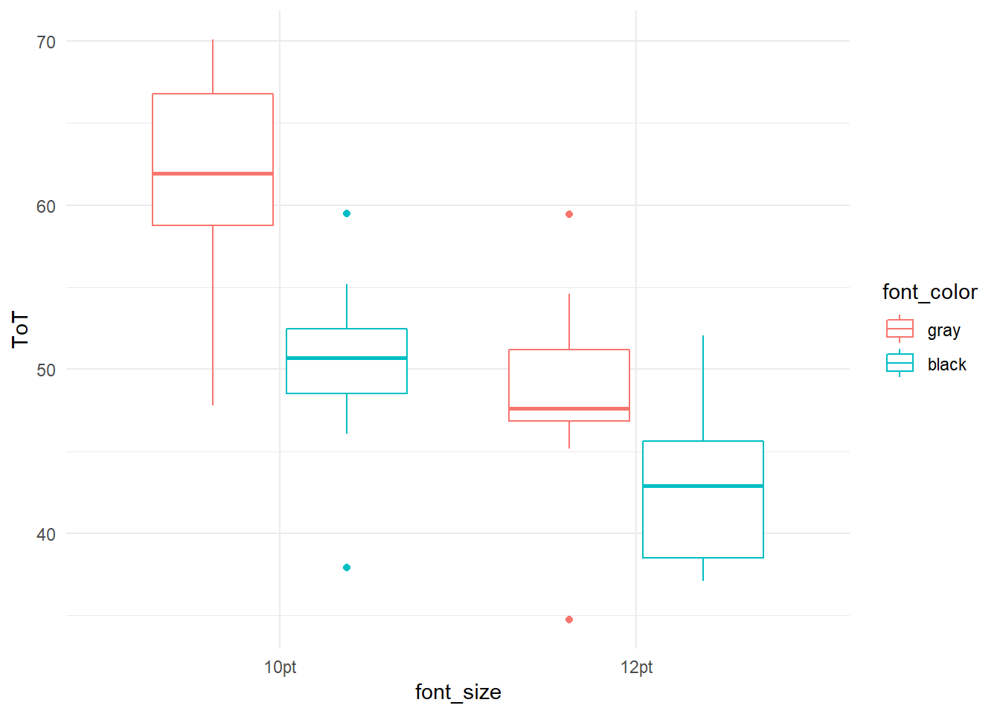

We see immediately, that both design choices have an impact: more contrast, as well as larger letters lead to improved reading performance. But, do they add up? Or do both factors behave like headache pills, where more is more, but less than the sum. Clearly, the 12pt-black group could read fastest on average. Neither with large font, nor with optimal contrast alone has the design reached maximum performance, i.e. saturation. Still, there could be an interaction effect, that gradually reduces the positive effect of large font in a high-contrast design. We run two regression models, one with both main effects and one that adds an interaction term. We extract the coefficients from both models and view them side-by-side:


```r
M_1 <-
  D_1 %>% 
  stan_glm(ToT ~ font_size + font_color,
           data = .)

M_2 <-
  D_1 %>% 
  stan_glm(ToT ~ font_size + font_color + font_size : font_color,
           data = .)
```


```r
T_read_fixef <-
  right_join(select(fixef(M_1), fixef, M_1 = center),
             select(fixef(M_2), fixef, M_2 = center),
             by = "fixef")

T_read_fixef
```


|fixef                         |   M_1|    M_2|
|:-----------------------------|-----:|------:|
|Intercept                     | 59.79|  61.17|
|font_size12pt                 | -9.91| -12.45|
|font_colorblack               | -8.23| -10.78|
|font_size12pt:font_colorblack |    NA|   5.22|


The estimates confirm, that both manipulations have a considerable effect. And, there is an interaction effect as well, correcting the additive effect of font colour and size. The combined effect of high contrast and large font is therefore

$$
\mu_{12pt, black} =
61.172 + -12.45 + 
-10.783 + 5.222 = 
43.161
$$

In this research scenario, that was not strictly the question, as we were primarily interested in comparing the effects of font size and contrast. Also, if we see the credibility interval of the interaction effect it is not highly certain ($5.22 [-2.25, 12.57]_{CI95}$). Still, including the  interaction term is the right choice for two reasons: first, both manipulations influence the same cognitive processing, as they both improve visual clarity, with the effect of better visual letter recognition. From a theoretical perspective, we would thus expect saturation. This is simply the application of prior knowledge and in a perfect world one would  use a prior distribution for the interaction term, creating a more certain estimate. That being said, the data set is synthetic, and the simulation definitely included the interaction effect.  Second, in Table [XY], all other coefficients change considerably with introduction of the interaction effect. Especially the effects of the two manipulations get considerably under-estimated. 

Why are the main effects under-estimated, if the interaction term is not included? The pure main-effects model has three parameters. This allows it to represent the same number of independent group means. Formally, the number of groups in the study is four, however, the three-parameter model assumes that the fourth group (black, 12pt) can sufficiently be specified by the existing three parameters. If saturation occurs, the group of participants in the 12pt group is not homogeneous: in the grey group, they experience a stronger improvement than in the black group. The three parameter model is forced to make the best out of situation and adjusts the net effect of font size to be slightly lower than it actually is. The same occurs for the font colour effect.

Interaction effects are notoriously neglected in research and they are hard to grasp for audience with or without a classic statistics education. It is therefore highly recommended to illustrate interaction effects using interaction plots. 
To begin with, an interaction plot for the 2x2 design contains the four estimated group means. These can be computed from the linear model coefficients, but there is an alternative way: we modify the model such that it represents the four group means, directly. The re-parametrized model has no intercept (if we want the group means directly, we need no reference group), and no main effects. The model contains just the raw interaction effect, which results in an estimation of the four group means:


```r
M_3 <-
  D_1 %>% 
  stan_glm(ToT ~ 0 + font_size : font_color,
           data = .)
```


```r
fixef(M_3)
```


|fixef                         | center| lower| upper|
|:-----------------------------|------:|-----:|-----:|
|font_size10pt:font_colorgray  |   60.9|  56.7|  64.9|
|font_size12pt:font_colorgray  |   48.2|  44.2|  52.2|
|font_size10pt:font_colorblack |   49.8|  45.9|  53.7|
|font_size12pt:font_colorblack |   42.8|  38.8|  46.5|


With some basic data transformation on the coefficient table, we create a data frame that encodes the two factors separately. Note how `separate` is used to split the coefficient names into group identifiers. Using `mutate` and `str_replace`, the group labels are stripped of the factor names. The resulting coefficient table serves as input to ggplot, creating an interaction plot with overlayed credibility intervals, using `geom_errorbar`.


```r
T_2x2_mu <-
  fixef(M_3) %>% 
  separate(fixef, c("font_size", "font_color"), sep = ":") %>% 
  mutate(font_size = str_replace(font_size, "font_size", ""),
         font_color = str_replace(font_color, "font_color", "")) %>% 
  as.data.frame()

G_interaction <-
  T_2x2_mu %>% 
  ggplot(aes(x = font_color, 
             color = font_size, shape = font_size,
             y = center,
             ymin = lower,
             ymax = upper)) +
  geom_point() +
  geom_line(aes(group = font_size)) +
  geom_errorbar(width = .1)

G_interaction
```

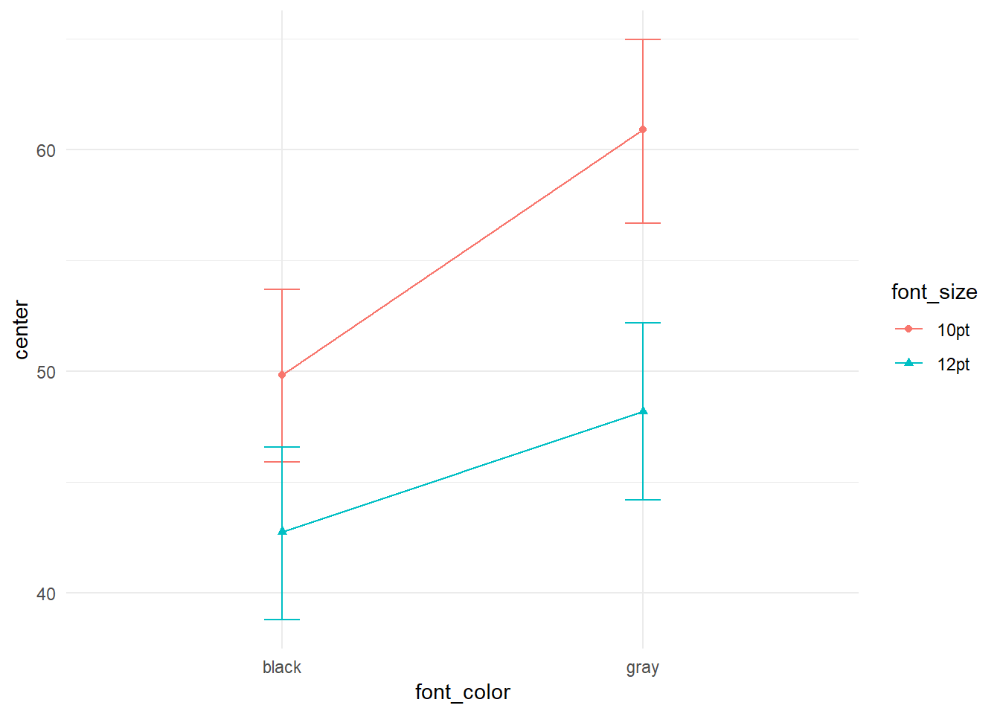

```r
detach(Reading)
```

In Figure XY, we can easily spot the two main effects, and how they go together. The researcher would conclude that with the desired grey font, increasing font size partly compensates for the lack of contrast. At the same time, we see that some saturation occurs, but from a purely ergonomic perspective, large font and high contrast still is the preferred design.

We have seen in the Headache example that interaction effects occur as non-linearity. The more a participant approaches the natural boundary of zero headache, the less benefit is created by additional effort. This we call  *saturation*. Saturation is likely to occur when multiple factors influence the same cognitive or physical system or functioning. In quantitative comparative design studies, we gain a more detailed picture on the co-impact of design interventions and can come to more sophisticated decisions.

In the Reading case, overall utility is a compound of ergonomic quality and aesthetic appeal. It was assumed that a grey-on-white colour scheme is more appealing. The researcher would choose the grey-12pt design: higher contrast would increase ergonomic value, but too much at the expense of appeal. Of course, in a perfect world, one would add emotional appeal as a second measure to the study.

If we don't account for saturation by introducing interaction terms, we are prone to underestimate the net effect of any of these measures and may falsely conclude that a certain measure is ineffective. Consider a large scale study, that assesses the simultaneous impact of many demographic variables on how willing customers are to take certain energy saving actions in their homes. It is very likely that subsets of variables are associated with similar cognitive processes. For example, certain action requires little effort (such as switching off lights in unoccupied rooms), whereas others are time-consuming (drying the laundry outside). At the same time, customers may vary in the overall eagerness (motivation). For high effort actions the impact of motivation level probably makes more of a difference than when effort is low. Not including the interaction effect would result in the false conclusion that suggesting high effort actions is rather ineffective.


### More than the sum: amplification

Saturation effects occur, when multiple impact factors act on the same system and work in the same direction. When reaching the boundaries, the change per unit diminishes. These impact factors can be similar (headache pills) or unsimilar, like font size and contrast. Still, they are to some extent exchangeable. We can compensate lack of contrast with larger font size. 

*Amplification* interaction effects are the opposite: They occur, when two (or more) factors impact different cognitive processes in a processing chain. Conceiving good examples for amplification effects is far more challenging as compared to saturation effects. Probably because saturation is a rather trivial phenomenon, whereas amplification involves some non-trivial orchestration of cognitive or physiological subprocesses. Here, a fictional case on technology acceptance will serve to illustrate amplification effects. Imagine a start-up company that seeks funding for a novel augmented reality game, where groups of gamers compete for territory. For their fund raising endeavor, they need to know their market potential, i.e. which fraction of the population is potentially interested. The entrepreneurs have two hypotheses they want to verify:

1. Only technophile persons will dare to play the game, because it requires some top-notch equipment.

1. The game is strongly cooperative and therefore more attractive for people with a strong social motif.

In their study, they asked a larger set of participants to rate their technophily and sociophily. They were then given a description of the planned game and were asked how much they intended to participate in the game.

While the example primarily serves to introduce amplification effects, it is also an opportunity to get familiar with interaction effects between metric predictors. Although this is not very different to interaction effects on groups, there are a few peculiarities, one being that we cannot straight-forwardly make an exploratory plot. For factors, we have used box plots, but these do not apply for metric variables. In fact, it is very difficult to come up with a good graphical representation. One might think of 3D wire-frame plots, but these transfer poorly to the 2D medium of these pages. Another option is to create a scatter-plot with the predictors on the axes and encode the outcome variable by shades or size of dots <!-- #71 -->. These options may suffice to see any present main effects, but are too coarse to discover subtle non-linearity. The closest we can get to a good illustration is to create groups and continue as usual. Note, that turning metric predictors into factors is just a hack to create exploratory graphs. By no means do I intend to corroborate the use of group-mean models on metric data.


```r
attach(AR_game)
```


```r
D_1 %>% 
  mutate(Sociophile = forcats::fct_rev(ifelse(sociophile > median(sociophile), "high", "low")),
         Technophile = forcats::fct_rev(ifelse(technophile > median(technophile), "high", "low"))) %>%
  ggplot(aes(y = intention, x = Technophile, col = Sociophile)) +
  geom_boxplot() +
  ylim(0, 0.5)
```

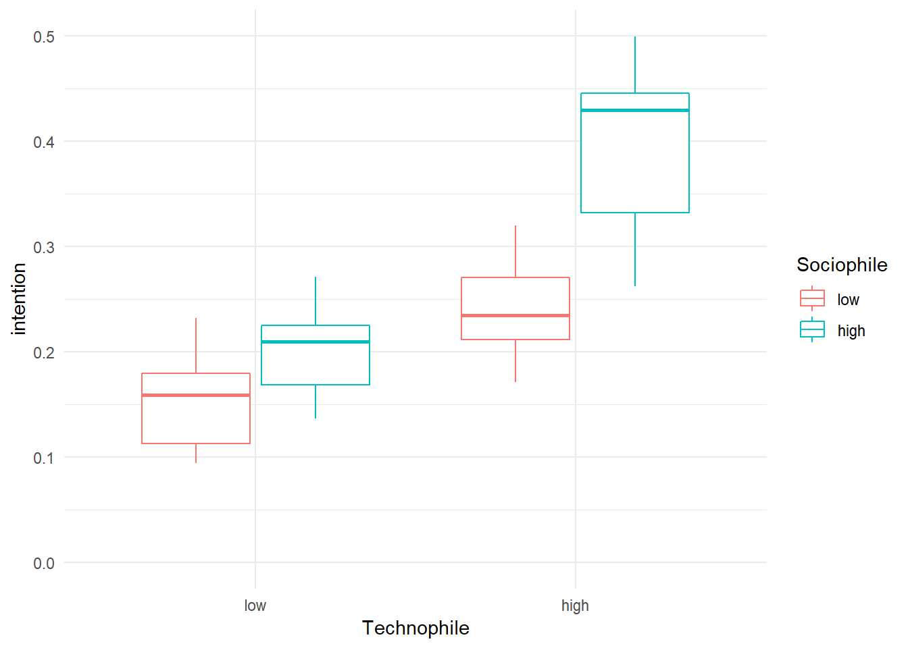

From the boxplot it seems that both predictors have a positive effect on intention to play. However, it remains vague whether there is an interaction effect. In absence of a good visualization, we have to rely fully on the numerical estimates of a linear regression with interaction effect.


```r
M_1 <-
  D_1 %>% 
  stan_glm(intention ~ sociophile * technophile,
           data = .)
```


```r
T_1 <- fixef(M_1)
T_1
```


|fixef                  | center| lower| upper|
|:----------------------|------:|-----:|-----:|
|Intercept              |  0.273| 0.259| 0.288|
|sociophile             |  0.113| 0.075| 0.153|
|technophile            |  0.183| 0.152| 0.212|
|sociophile:technophile |  0.165| 0.082| 0.246|

The regression model confirms that sociophilia and technophilia both have a moderate effect on intention. Both main effects are clearly in the positive range. Yet, when both increase, the intention increases overlinearly. The sociophile-technophile personality is the primary target group.

While plotting the relationship between three metric variables is difficult, there are alternative ways to illustrate the effect. For example, we could ask: how does intention change by .1 unit sociophilia for two imaginary participants with extreme positions on technophilia (e.g., .2 and .8). We could calculate these values arithmetically using the model formula and the center estimates. The better and genuinely Bayesian way of doing it is sampling from the *posterior predictive distribution* (PPD). This distribution is generated during parameter estimation. While the posterior distribution (PD) represents the predictors, the PPD is linked to the outcome variable. More specifically, the PPD is the models best guess of the true value $\mu$, separated from the random component. Once the posterior has been estimated, we can draw from it with any values of interest. As these can be combinations of values that have never been observed, we can truly speak of prediction. Regression engines usually provide easy means to simulate from a PD and generate predictions. In the following example, we simulate some equidistant steps of sociophilia for three participants with technophilia scores from .1 to .9.


```r
D_2 <- 
  mascutils::expand_grid(technophile = seq(.1, .9, by = .1),
                              sociophile = seq(.3, .6, by = .1)) %>% 
  arrange(technophile)

T_1_pred <- 
  post_pred(M_1, newdata = D_2, thin =2) %>%
  predict()

D_2 <- 
  D_2 %>% 
  mutate(intention = T_1_pred$center)

D_2 %>% 
  mutate(technophile = as.factor(technophile)) %>% 
  ggplot(aes(x = sociophile, col = technophile, y = intention)) +
  geom_point() +
  geom_line(aes(group = technophile))
```
<!-- #72 --> 
The effect is not stunning, but visible. The lines diverge, which means they have different slopes. With high technophilia, every (tenth) unit of sociophilia has a stronger effect on intention to play.


```r
detach(AR_game)
```

Amplification effects are like two-component glue. When using only one of the components, you will just get a smear. Putting both togeher gives a strong hold. There also is a parallel in Boolean algebra. Recall, the Boolean OR operator returns `TRUE` when one of the operands is `TRUE`, whereas AND requires both operands to be `TRUE`.


```r
T_bool_interaction <-
data_frame(A = c(F, F, T, T),
           B = c(F, T, F, T)) %>%
  as_data_frame() %>% 
  mutate("A OR B" = A | B) %>% 
  mutate("A AND B" = A & B)
 
kable(T_bool_interaction)
```


A       B       A OR B   A AND B 
------  ------  -------  --------
FALSE   FALSE   FALSE    FALSE   
FALSE   TRUE    TRUE     FALSE   
TRUE    FALSE   TRUE     FALSE   
TRUE    TRUE    TRUE     TRUE    

The Boolean OR is an extreme case of saturation. Once one of the factors is present, the result is "positive" and introducing the other one has absolutely no additional effect.  Another basic Boolean operation is $A AND B$ <!-- #73 -->with quite the opposite effect: any of the two factors only has an effect, if the other is present as well. Clearly, this is a conditional effect. We will rarely encounter non-trivial cases where the results are so crisp as in the Boolean world.


### Theoretically interesting interaction effects [EDIT]

Explaining or predicting complex behaviour with psychological theory is a corner stone of design research. Unfortunately, it is not that easy. While design is definitely multifactorial, with a variety of cognitive processes, individual differences and behavioural strategies, few psychological theories cover more than three associations between external or individual conditions and behaviour. The design researcher is often forced to enter a rather narrow perspective or knit a patchwork model from multiple theories. Such a model can either be loose, making few assumptions on how the impact factors interact which others. A more tightened model frames multiple impact factors into a conditional network, where the impact of one factor can depend on the overall configuration. A classic study will now serve to show how interaction effects and theoretical reasoning go together. 

Vigilance is the ability to remain attentive for rarely occurring events. Think of truck drivers on lonely night rides, where most of the time they spend keeping the truck on a straight 80km/h course. Only every now and then is the driver required to react to an event like braking lights flaring up ahead. Vigilance tasks are among the hardest thing to ask from a human operator. Yet, they are safety relevant in a number of domains. Keeping up vigilance most people perceive as tiring, and vigilance deteriorates with tiredness.

Several studies have shown that reaction time at simple tasks increases when people are tired. The disturbing effect of noise has been documented as well. A study by Corcoran (1961) <!-- #74 --> examined the simultaneous influence of sleep deprivation and noise on a rather simple reaction task. They asked:

>  will the effects of noise summate with those of loss of sleep to induce an even greater performance decrement or will noise subtract from the performance decrement caused by loss of sleep?

The central argument is that sleep deprivation deteriorates the central nervous arousal system. In consequence, sleep deprived persons cannot maintain the necessary level of tension that goes with the task. Noise is a source of irritation and therefore usually reduces performance. At the same time, noise may have an arousing effect, which may compensate for the loss of arousal due to sleep deprivation. To re-iterate on the headache pills analogy, noise could be the antidote for sleepiness.

The sleep case study is a simplified simulation of Corcoran's results. Participants were divided into 2x2 groups (quiet/noisy, rested/deprived) and had to react to five signal lamps in a succession of trials. In the original study, performance measure gaps were counted, which is the number of delayed reactions ($>1500ms$).


```r
attach(Sleep)
```


```r
G_expl <-
  D_1 %>% 
  ggplot(aes(x = Environment,
             color = Sleep,
             y = gaps)) +
  geom_boxplot()
G_expl
```

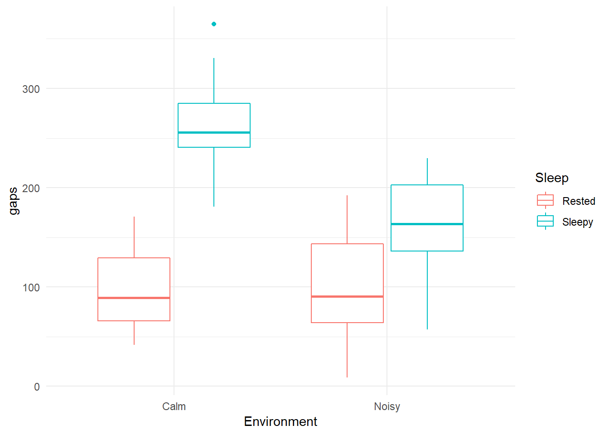

Using a 2x2 model including an interaction effect, we examine the conditional association between noise and sleepiness. The `*` operator in the model formula is an abbreviation for the fully factorial term `Environment + Sleep + Environment:Sleep`<!-- #75 -->.


```r
M_1 <- 
  D_1 %>% 
  stan_glm(gaps ~ Environment * Sleep, data = .)
```


```r
T_fixef <-  fixef(M_1)
T_fixef
```


|fixef                        | center|  lower| upper|
|:----------------------------|------:|------:|-----:|
|Intercept                    |  99.01|   65.1| 132.8|
|EnvironmentNoisy             |  -0.16|  -51.3|  51.3|
|SleepSleepy                  | 160.31|  113.5| 209.5|
|EnvironmentNoisy:SleepSleepy | -98.91| -168.6| -29.6|

Recall, that treatment contrasts were used, where all effects are given relative to the reference group quiet-rested (intercept). The results confirm the deteriorating effect of sleepiness, although its exact impact is blurred by pronounced uncertainty $160.32 [113.49, 209.55]_{CI95}$. Somewhat surprisingly, noise did not affect well-rested persons by much $-0.16 [-51.33, 51.31]_{CI95}$. Note however, that we cannot conclude a null effect, as the credibility limits are wide. Maybe the lack of a clear effect is because steady white noise was used, not a disturbing tumult. The irritating effect of noise may therefore be minimal. As suggested by Corcoran, the effect of sleepiness on performance is partly reduced in a noisy environment $-98.91 [-168.62, -29.62]_{CI95}$. This suggests that the arousal system is involved in the deteriorating effect of sleep deprivation, which has interesting consequences for the design of vigilance tasks in the real world. 

The finding also relates to the well known Yerkes-Dodson law in ergonomic science. The law states that human performance at cognitive tasks is influenced by arousal. The influence is not linear, but better approximated with a curve as shown in Figure XY. Performance is highest at a moderate level of arousal. If we assume that sleepy participants in Corcona's study showed low performance due to under-arousal, the noise perhaps has increased the arousal level, resulting in better performance. If we accept that noise has an arousing effect, the null effect of noise on rested participants stands in opposition to the Yerkes-Dodson law: if rested participants were on an optimal arousal level, additional arousal would usually have a negative effect on performance. There is the slight possibility, that Corcona has hit a sweet spot: if we assume that calm/rested participants were still below an optimal arousal level, noise could have pushed them right to the opposite point. 

Central to the Yerkes-Dodson law is that arousal is a gradually increasing property, but the current experiment only features two levels. A straight line is the only way to unambiguously connect two group means; examining any curved relationships is impossible. We could think of varying noise levels over a wider range for better tracing the non-linear relationship between arousal and performance. The next section introduces polynomial regression for approximating non-linear associations between metric variables.

<!-- #76 -->
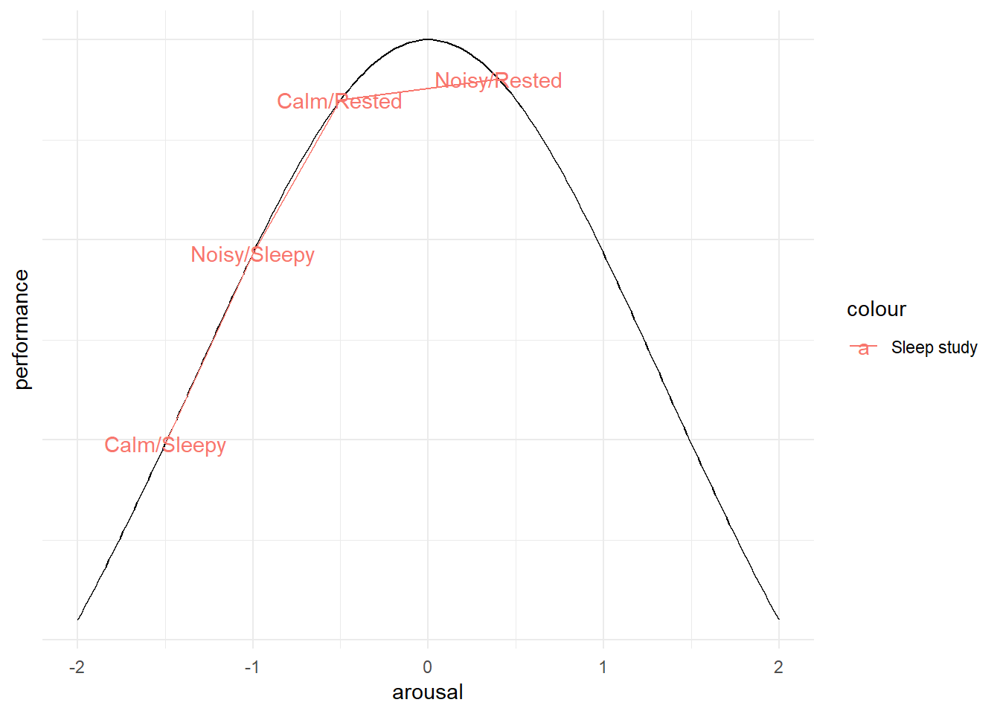


```r
detach(Sleep)
```

### Exercises

1. In the IPump case (data set D_agg), two infusion pumps have been tested against each other (L = legacy, N = novel). Nurses from two professional groups (intensive and general care) completed a sequence of tasks with both devices. In order to account for learning effects, this procedure was repeated in three sessions. Three performance measures were taken: time-on-task, deviations from the optimal path and self-reported workload. Analyze the results using the models that have been introduced so far. Start with basic CGM and LRM, then use these as building blocks for more complex models. At least for the more basic models, always start by an exploratory plot. Then build and run the model. Extract the coefficients table and interpret magnitude and certainty.

1. For the basic models of the previous exercise, extract and plot the residual distribution. Compare the residual distribution by groups.

1. For the more complex models, extract the predicted values and residuals and plot them. Is their an association between the two?


## Doing the rollercoaster: polynomial regression {#polynomial_regression}

Robots build our cars and sometimes drive them. They mow the lawn and may soon also deliver parcels to far-off regions. Prophecy is that robots will also enter social domains, such as accompany children and care for our elderly. One can assume that in social settings emotional acceptance plays a significant role for technology adoption. Next to  our voices, our faces and mimic expressions are the main source of interpersonal messaging. Since the dawn of the very idea of robots, anthropomorphic designs have been dominant. Researchers and designers all around the globe are currently pushing the limits of human-likeness of robots. One could assume that emotional response improves with every small step towards perfection. Unfortunately, this is not the case. [Mori] discovered a bizarre non-linearity in human response: people respond more positive to improvements in human-likeness, but only at the lower end. A feline <!-- #77 --> robot design with recognizable but stylized facial features will always beat a faceless robot with a strong mechanical appeal. For designs on the high end, with a very much but not exactly human-like face, there is a sudden drop in emotional response, which is called the *uncanny valley*.


```r
G_uncanny_illu <-
  data_frame(hl = seq(-1, 1, length.out = 100),
             likeability = -.5 * hl + .6 * hl^3 + .2 * hl^4) %>% 
  mutate(human_likeness = (hl + 1)/2) %>% 
  ggplot(aes(x = human_likeness, y = likeability)) +
  geom_line()

G_uncanny_illu
```

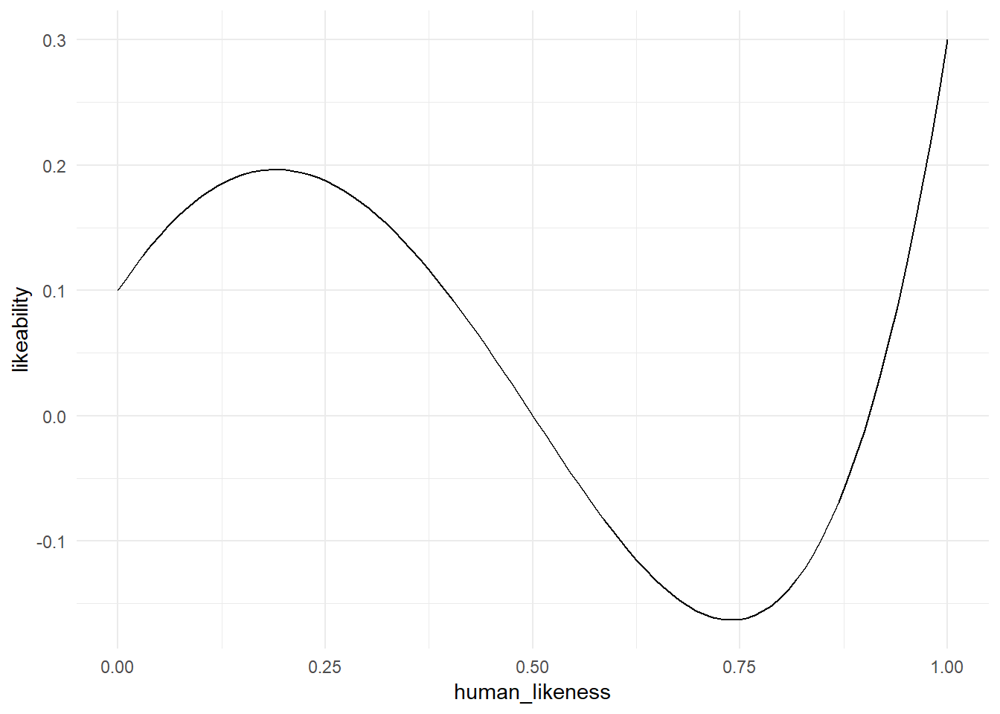


[Mathur et al.] study aimed at rendering the association between human-likeness and liking at full range. They collected 60 pictures of robots and attached a score ranging from mechanical to human appearance. They then let more than 200 participants rate the faces on how much they liked them. Finally, they created an average score of likability per robot picture and examined the association with human likeness using a statistical model. Owing to the curved shape of the uncanny valley, linear regression is not applicable to the problem. Instead, Mathur et al. applied a third degree polynomial term.

A polynomial function of degree $k$ has the form: <!-- #78 -->

$$y_i = \beta_0 x_i^0 + \beta_1 x_i^1 + ... + \beta_{k}  x_i^{k}$$

In fact, you are already familiar with two polynomial models. The zero degree polynomial is the grand mean model. This follows from $x_i^0 = 1$, which makes $\beta_0$ a constant, the intercept. Also, a first degree polynomial is simply the linear model. By adding higher degrees we can introduce more complex curvature to the association.


```r
D_poly <-
  data_frame(x = seq(-2, 3, by = .1),
             degree_0 = 2,
             degree_1 = degree_0 + 3 * x,
             degree_2 = 0.5 * (degree_1 + 2 * x^2),
             degree_3 = 0.5 * (degree_2 + -1 * x^3),
             degree_4 = 0.5 * (degree_3 + 0.2 * x^4)) %>% 
  gather(polynomial, y, degree_0:degree_4) %>% 
  arrange(polynomial, y, x)
D_poly %>% 
  ggplot(aes(x, y)) +
  geom_line() +
  facet_grid(~polynomial)
```

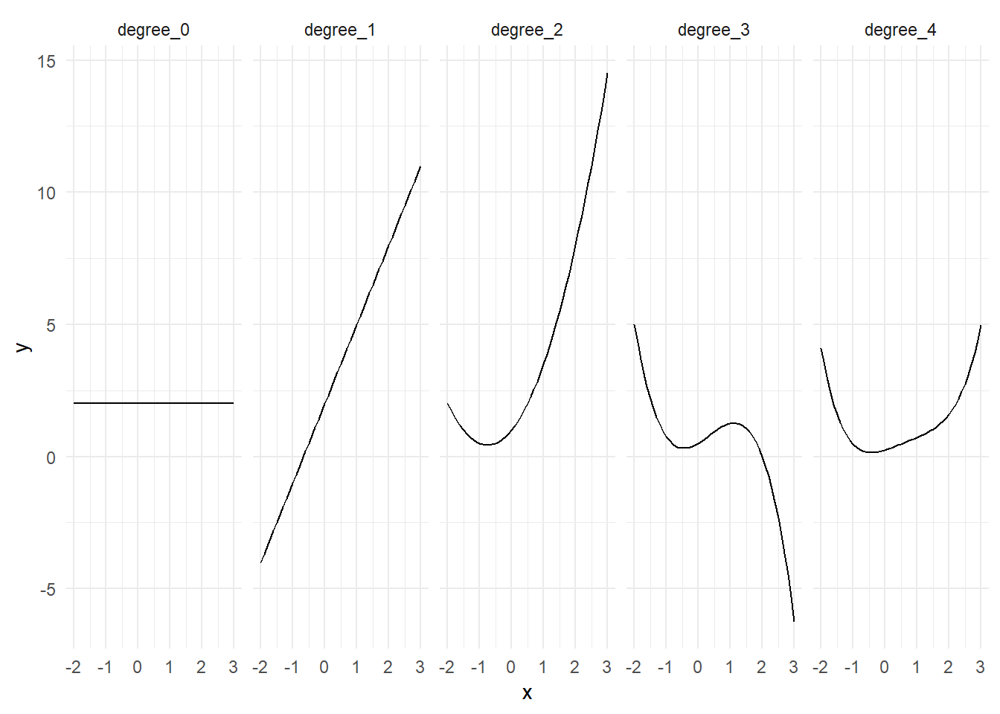


Mathur et al. argue that the Uncanny Valley curve possesses two stationary points, with a slope of zero. One is a local minimum and represents the deepest point in the valley,  the other is a local maximum and marks the shoulder left of the valley. Such a curvature can be approximated with a polynomial of (at least) third degree, which has a constant term $\beta_0$, a linear slope $x\beta_1$, quadratic component $x^2\beta_2$ and a cubic component $x^3\beta_3$.

While R provides high-level methods to deal with polynomial regression, it is instructive to build the regression manually. The first step is to add variables to the data frame, which are the exponentiated predictors ($x_k = x^k$). These variables are then straight-forwardly added to the model term, as if they were independent predictors. For better clarity, we rename the intercept to be $x_0$, before summarizing the fixed effects.


```r
attach(Uncanny)
```


```r
M_poly <-
  UV_1 %>% 
  mutate(huMech_0 = 1,
         huMech_1 = huMech,
         huMech_2 = huMech^2,
         huMech_3 = huMech^3) %>%
  stan_glm(avg_like ~  + huMech_1 + huMech_2 + huMech_3,
           data = ., iter = 400)
  # stan_glm(avg_like ~ poly(huMech, 4),
  #          data = ., iter = 200)

P_poly <- posterior(M_poly)
```


```r
# Uncanny$P_1 %>% 
#   mutate(parameter = str_replace(parameter, "Intercept", "huMech_0"),
#          fixef = str_replace(fixef, "Intercept", "huMech_0"))
```


```r
library(polynom)
```


```r
T_fixef_1 <- fixef(P_poly)
T_fixef_1
```


|fixef     | center|  lower|  upper|
|:---------|------:|------:|------:|
|Intercept | -0.207| -0.337| -0.093|
|huMech_1  | -0.525| -0.763| -0.281|
|huMech_2  |  0.293|  0.060|  0.577|
|huMech_3  |  0.744|  0.368|  1.133|


We can extract the fixef effects table as usual. The four coefficients specify the polynomial to approximate the average likability responses. The polynomial parameters have little explanatory value. Neither of the parameters alone relates to a relevant property of the uncanny valley. One relevant property would be the location of the deepest point of the uncanny valley, its trough. The trough is a local minimum of the curve and we can find this point with polynomial techniques. 

Finding a local minimum is a two step procedure: first, we must find all *stationary points*, which includes local minima and maxima. Then, we determine which of the resulting points is the local minimum. Stationary points occur, where the curve bends from a rising to falling or vice versa. They are distinguishable by having a slope of zero, neither rising nor falling. Stationary points can be identified by the derivative of the third degree polynomial, which is a second degree polynomial:

$$f'(x) = \beta_1 + 2\beta_2x + 3\beta_2x^2$$

The derivative $f'(x)$ of a function $f(x)$ gives the slope of $f(x)$ at any given point $x$. When $f'(x) > 0$, $f(x)$ is rising at $x$, with $f'(x) < 0$ it is falling. Stationary points are precisely those points, where $f'(x) = 0$ and can be found by solving the equation. The derivative of a third degree polynomial is of the second degree, which has a quadratic part. This can produce a parabolic form, which hits point zero twice, once rising and once falling. A rising encounter of point zero indicates that $f(x)$ has a local minimum at $x$, a falling one indicates a local maximum. In consequence, solving $f'(x) = 0$ can result in two solutions, one minimum and one maximum, which need to be distinguished further. 

If the stationary point is a local minimum, as the trough, slope switches from negative to positive; $f'(x)$ crosses $x = 0$ in a rising manner, which is a positive slope of $f'(x)$. Therefore, a stationary point is a local minimum, if $f''(x) > 0$.

Mathur et al. followed these analytic steps to arrive at an estimate for the position of the trough. The following code uses several high-level functions from package `polynom` to estimate the location of the trough, by drawing on the first and second derivative `d[d]poly` 


```r
poly     = polynomial(T_fixef_1$center) # UC function on center
dpoly    = deriv(poly)                  # 1st derivative
ddpoly   = deriv(dpoly)                 # 2nd derivative
stat_pts = solve(dpoly)                 # finding stat points
slopes   = as.function(ddpoly)(stat_pts)# slope at stat points
trough   = stat_pts[slopes > 0]         # selecting the local minimum

cat("The trough is most likely at a huMech score of ", round(trough, 2))
```

```
## The trough is most likely at a huMech score of  0.37
```

While this procedure is instructive, there is an issue: drawing on the center estimates, which is a summary of the PD, we only get a point estimate. Statements on certainty are impossible, as a CI is lacking. Recall the 99 seconds study, where we operated directly on the PD to obtain more specific statements on certainty. Another case for directly operating on the PD samples is to calculate additional statistics. This is possible due to another virtue of the MCMC method.

Every PD sample contains simultaneous draw of the four parameters `huMech_[0:3]`<!-- #79 -->, and therefore fully specifies its own third degree polynomial. A PD for the trough parameter can be obtained by performing the above procedure on every sample separately. For the convenience, the case study Uncanny contains a function `trough(coef)` that includes all the above steps. The following code creates a data frame with one row per MCMC draw and the four huMech variables, the function `trough` acts on this data frame as a matrix of coefficients and returns one trough point per row. We have obtained the PD of the trough.


```r
P_trough <-
  P_poly %>%
  filter(type == "fixef") %>%
  select(chain, iter, fixef, value) %>% 
  spread(fixef, value) %>% 
  select(Intercept, starts_with("huMech")) %>% 
  trough()
```


From the PD, we can derive statements on uncertainty in the usual way: the 95% credibility limits we get by:


```r
quantile(P_trough, c(.025, 0.5, .975), na.rm = T) %>% 
  kable()
```

             x
------  ------
2.5%     0.271
50%      0.367
97.5%    0.479


The 95% CI is a conventional measure of uncertainty and may be more or less irrelevant for the spectator. The most generous account on uncertainty is a density plot on the full posterior. The density function just smooths over the frequency distribution of trough draws, but makes no arbitrary choices on where to cut it. 


```r
grid.arrange(
  UV_1 %>% 
    ggplot(aes(x = huMech, y = avg_like)) +
    geom_point(size = .3) +
    xlim(-1, 1),
  
  data_frame(trough = P_trough) %>% 
    ggplot(aes(x = trough)) +
    geom_density(aes(x = trough)) +
    xlim(-1, 1)
)
```


With reasonable certainty, we can say that the trough is at approximately two-thirds of the huMech score range. <!-- #80 --> The illustration of the uncanny valley as they used to be perpetuated from the original source, place the trough at about four quarters of the scale. We clearly see that this is not the case in Mathur's study. This might be an artifact, for example in that the huMech score is not linearly related to the perception of human-likeness. 


```r
detach(Uncanny)
```


