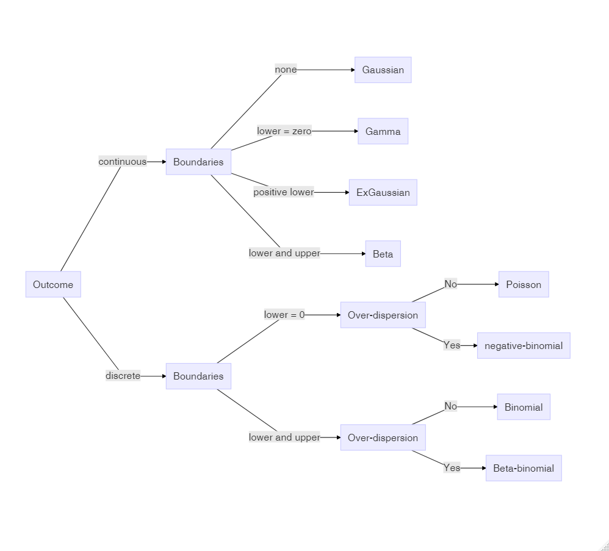
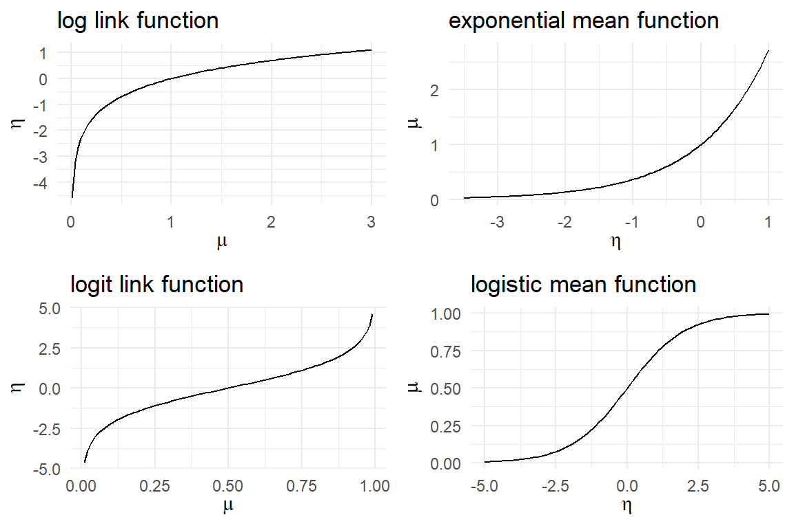
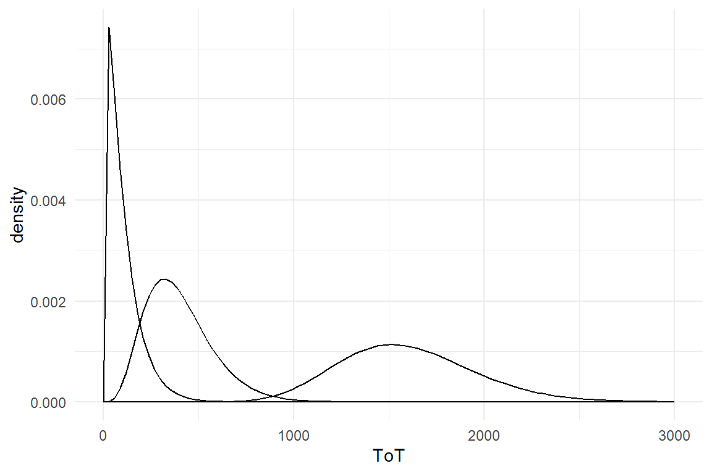
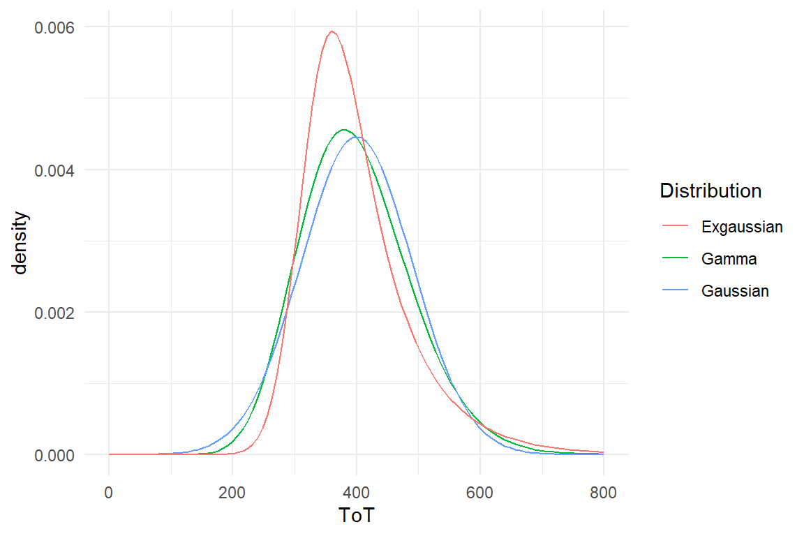

# Generalized Linear Models {#glm}


In the preceding chapters we got acquainted with the linear model as an extremely flexible tool to represent dependencies between predictors and outcome variables. We saw how factors and covariates gracefully work together and how complex research designs can be captured by multiple random effects. It was all about specifying an appropriate (and often sophisticated) right-hand side of the regression formula, the predictor term. Little space has been dedicated to the outcome variables, except that sometimes we used log-transformed outcomes to accomodate the Gaussian error term. That is now going to change, and we will start by examining the assumptions that are associated with the outcome variable.

Have you wondered about why I have been using so many simulated data sets up to this point? The reason for using simulated data is: the linear model, as introduced so far, makes assumptions that are *never* truly met by real data. The simulated data sets so far were meant to demonstrate some features found in real data sets, but generously wiped over some other frequent peculiarities.

Another question is probably lurking in the minds of readers with some classic statistics training:  what has happened to the assumptions of ANOVA and the like, and where are all the neat tests that check for Normality, constant variance and such?  The Gaussian linear model, which we used throughout \@ref(lm) and \@ref(mlm), makes many assumptions, but in my view, the three crucial assumptions are:

1. *Linearity* of the association between predictors and outcome variable. 
2. *Gaussian distribution* of responses 
3. *constant variance* of response distribution 

In the next section we will review these assumptions and lead them ad absurdum. Simply put, in the real world there is no such thing as Gaussian distribution and true linearity. Checking assumptions on a model that you know is inappropriate, seems a futile exercise, unless better alternatives are available, and that is the case: with *Generalized Linear Models* (GLMs) we extend our regression modeling framework once again, this time focussing on the responses and their shape of randomness.

As we will see, GLMs solves some common problems with linearity and gives us more choices on the shape of randomness. To say that once and for all: What GLMs do not do is relax the assumptions of linear models. And because I have met at least one seasoned researcher who divided the world of data into two categories, "parametric data", that meets ANOVA assumptions, and "non-parametric data" that does not, let me get this perfectly straight: *data is neither parametric nor non-parametric*. Instead, data is the result of a process that distributes measures in some form and a good model aligns to this form. Second, a *model is parametric*, when the statistics it produces have a useful interpretations, like the intercept is the group mean of the reference group and the intercept random effect represents the variation between individuals. All models presented in this chapter (and this book) fulfill this requirement and *all are parametric*. There may be just one counter-example, which is polynomial regression \@ref(prm), which we used for its ability to render non-monotonic curves. The polynomial coefficients have no interpretation in terms of the cognitive processes leading to the Uncanny Valley. However, as we have seen in \@ref(test-stat), they can easily be used to derive meaningful parameters, such as teh positions of shoulder and trough. A clear example of a non-parametric method is teh Mann-Withney U-test, which operates on sums of ranks, which typically has no useful interpretation.

The GLM framework rests on two extensions that bring us a huge step closer to our valuable data. The first one is a minor mathematical trick to establish linearity, the *link function*. The second is the expected *shape of randomness*.  After we established the GLM framework \@ref(elements-glm), I will introduce a good dozen  of model classes, that leaves little reason to crudely approximate with  Gaussian distributions, data transformations, or unintelligible non-parametric procedures. There almost always is a clear choice right at the beginning that largely depends on the properties of the response variable, for example:

+ *Poisson LM* is the first choice for outcome variables that are counted (with no upper limit), like number of errors.  
+ *Binomial (aka logistic) LM* covers the case of successful task completion, where counts have an upper boundary. 

These two GLM families have been around for more than half a century. The quest for a good model for reaction time and time-on-task was more difficult, as there does not seem to be a generally accepted default. Luckily, with recent developments in Bayesian regression engines the choice of random distributions has become much broader. For RT and ToT, I will suggest exponentially-modified Gaussian *(ExGauss)* models or, to some extent, *Gamma* models. For  rating scales, where responses fall into a few ordered categories, *ordinal logistic regression* is a generally accepted approach. For (quasi)continuous rating scales will I make a novel suggestion, the *Beta LM*.

Too many choices can be a burden, but as we will see, most of the time the appropriate model family is obvious. For the impatient readers, here is the recipe: Answer the following three questions about the outcome variable. And, to make it even easier, it is always safe to answer Yes to the third question.

1. Is the outcome variable discrete or continuous?
1. What are the lower and upper boundaries of outcome measures?
1. Can we expect over-dispersion?

Then use the graph below to identify the correct distribution family and jump to the respective section.





## Elements of Generalized Linear Models {#elements-glm}

GLM is a *framework for modelling* that produces a *family of models*. Every member of this family uses specific *link functions* to establish linearity and chooses a particular *random distribution*, that has an adequate shape and mean-variance relationship.

Sometimes GLMs are mistaken as a way to relax assumptions of linear models, (or even called non-parametric).  They are definitely not! Every member makes precise assumptions on the level of measurement and the shape of randomness (see Table A)<!-- #108 -->. One can even argue that Poisson, Binomial and exponential regression are stricter than Gaussian, as they use only one parameter, with the consequence of a tight association between variance and mean. A few members of GLM are classic: Poisson, Binomial (aka logistic) and exponential regression have routinely been used before they were united  under the hood of GLM. These and a few others are called *canonical* GLMs, as they possess some convenient mathematical properties, that made efficient estimation possible, back in the days of expensive computer time.

For a first understanding of Generalized Linear Models, you should know that linear models are one family of Generalized Linear Models, which we call a Gaussian linear model. The three crucial assumptions of Gaussian linear models are encoded in the model formula:

$$
\begin{aligned}
\mu_i &=\beta_0+ \beta_1 x_{1i}+ \dots +\beta_k x_{ki}\\ 
y_i &\sim \textrm{Gaus}(\mu_i,\sigma)
\end{aligned}
$$

The first term, we call the likelihood and it represents the systematic quantitative relations we expect to find in the data. When it is a sum of products, like above, we call it linear. *Linearity* is a frequently under-regarded assumption of linear models and it is doomed to fail in \@ref(relinking-linearity). The second term defines the  pattern of randomness and it hosts two further assumptions: *Gaussian distribution*  and *constant error variance* of the random component.

In classic statistics education, the tendency is still to present these assumptions as preconditions for a successful ANOVA or linear regression. The very term *pre*condition suggest, that they need to be checked upfront and the classic statisticians are used to deploy a zoo of null hypothesis tests for this purpose, although it is widely held among statisticians that this practice is illogical. If an assumptions seems to be violated, let's say Normality, researchers then often turn to non-parametric tests. Many also just continue with ANOVA and add some shameful statements to the discussion of results or humbly cite one research paper that claims ANOVAs robustness to violations.

The parameters of a polynomial model usually don't have a direct interpretation. However, we saw that useful parameters, such as the minimum of the curve, can be derived. Therefore, polynomial models can be called *semiparametric*, at least. As an example for a *non-parametric* test, the Mann-Whitney *U* statistic is composed of the number of times observations in group A are larger than in group B. The resulting sum *U* usually bears little relation to any real world process or question. Strictly speaking, the label non-parametric has nothing to do with ANOVA assumptions. It refers to the usefulness of parameters. A research problem, where *U* as the sum of wins has a useful interpretation could be that in some dueling disciplines, such as Fencing, team competitions are constructed by letting every athlete from a team duel every member of the opponent team. We could call the *U*-test parametric, and perhaps, the group means turn out to be meaningless.


### Re-linking linearity {#relinking-linearity}

In the chapter on Linear Models, we encountered several situations where linearity itself was violated:

+ in \@ref(ofm) we used ordered factors to estimate a learning curve
+ in \@ref(saturation), we used conditional effects when two or more interventions improve the same process, e.g. visual recognition of letters
+ and in \@ref(prm) we used polynomials to estimate wildly curved relationships

The case of Polynomial regression is special in two ways: first, the curvature itself is of theoretical interest (e.g. finding the "trough" of the Uncanny Valley efect). Second, a polynomial curve (of second degree or more) is no longer monotonously increasing (or decreasing). In contrast, learning curves and saturation effects have in common that in both situations performance steadily increases when we add more to the predictor side. There is a limit to performance, which is reached asymptotically, but there always is a monotonous trend.


```r
attach(IPump)

D_Novel %>% 
  ggplot(aes(x= session, y = deviations)) +
#  geom_jitter() +
  geom_smooth(se = F)
```


We used an OFM with stairways coding to account for this non-linearity, but that has one disadvantage. From a practical perspective it would interesting to know, how performance improves when practice continues. What would be performance in (hypothetical) sessions 4, 5 and 10. Because the OFM just makes up one estimate for every level, there is no way to get predictions beyond the observed range.

With an LRM, the slope parameter applies to all steps, which gives us the possibility of deriving predictions beyond the observed range. To demonstrate this on the deviations from optimal path, the following code estimates a plain LRM and then injects some new (virtual) data to get predictions beyond the observed range, i.e. extrapolation:


```r
M_LRM_1 <- stan_glm(deviations ~ 1 + session, data = D_Novel)
```


```r
D_new <- 
  tibble(session = as.integer(c(0:9)),
         range = if_else(session < 3, "observed", "extrapolated")) %>% 
  as_tbl_obs()

predict(M_LRM_1, newdata = D_new) %>% 
  left_join(D_new) %>% 
  ggplot(aes(x = session, y = center, ymin = lower, ymax = upper)) +
  geom_ribbon(aes(fill = range), alpha = .2) +
  geom_step() +
  geom_hline(aes(yintercept = 0), color = "red", linetype = 2) +
  scale_x_continuous(breaks = 0:10)
```


```r
detach(IPump)
```


When we use a linear model when there truly is an asymptotic curve, negative values are produced, which are impossible. As the graph shows, this is most pronounced the further we move away from the observed range. But, it also effects the observed levels, as the lower credibility limits are negative, too.

Such a non-linearity happens to all outcome variables that have natural lower or upper boundaries, and that includes all outcome variables in the universe, except its very own spatial extension, perhaps. Speed of light can only be approached asymptotically (if you have some mass to carry around) and even the darkest intergalactic spaces are lit by cosmic background radiation and therefore have a temperature just slightly above absolute zero. It is an unescapable truth, that all our ephemeral measures in design research have boundaries and therefore suffer from wrong predictions:

+ Errors and other countable incidences are bounded at zero
+ Rating scales are bounded at the lower and upper extreme item
+ Task completion has a lower bound of zero and upper bound is the number of tasks.
+ Temporal measures formally have lower bound of zero, but psychologically, the lower bound always is a positive number.


The bare linear term is always inadequate, which is unfortunate, because its strength is the endless versatility in specifying relations between predictor variables and outcome. How can we escape the problem of boundaries, without sacrificing such a useful tool?
Generalized linear models use a simple mathematical trick that keeps linear terms, but confines the fitted responses to the natural boundaries of the measures. In linear models, the linear term $\mu$ is mapped directly to fitted responses: 


$$
\mu_i = \beta_0 + x_1\beta_1
$$ 

In GLMs, a layer is drawn between the fitted response $\mu$ and the linear term, *linear predictor $\theta$*. The *link function* $\phi$ transforms between $\mu$ and $\theta$. In order to transform back to the scale of measurement, the inverse of the link function, the *mean function* is used.

$$
\begin{aligned}
\theta_i &= \beta_0 + x_1 \beta_1\\ 
\mu_i &= \phi( \theta_i)
\end{aligned}
$$

In arithmetics an abundance of functions exists for every possible purpose. However, a link function $\phi$ must fulfill two criteria:

1. mapping from the (linear) range $[-\infty; \infty]$ to the range of the response, e.g. $[0; \infty]$.
1. be monotonically increasing

Intuitively speaking, a monotonically increasing function always preserves the order, such that the following holds for a link function.

$$
\theta_i > \theta_j \rightarrow \phi(\theta_i) > \phi(\theta_j) \rightarrow \mu_i > \mu_j
$$

One reason for monotonicity is that for a link function $\phi$ there must exist the inverse, which is called the mean function ($\phi^{-1}$). For example, $x^2$ is not a proper link function, because its inverse, $\sqrt{x}$ can take *two* values (e.g. $\sqrt{x} = [2, -2]$) and therefore is not a function on the desired range, strictly speaking.

The most typical cases are that there is a lower boundary of zero, or there are two boundaries. An adequate link function for count variables would map the range of natural numbers (only lower bound) to the *linear range* of $\eta$ that is $[-\infty; \infty]$. The *logarithm* is such a function and its inverse is the *exponential* function, which bends the linear range back into the boundary. Other variables, like success rates or rating scales, have lower and upper boundaries. A suitable pair of functions is the *logit* link function and the *logistic* mean function.  


```r
plot_glmfun <- function(f = log,
                        title = "log link function",
                        lower = .01, upper = 3,
                        dir = "link"){
  out <-  
    tibble(x = seq(lower, upper, (upper - lower)/100)) %>% 
    ggplot(aes(x)) +
    stat_function(fun = f) +
    labs(title = title) +
    labs(x = expression(mu), y = expression(eta))
  if(dir == "mean") out <- out + labs(x = expression(eta), 
                                      y = expression(mu))
  out
}

gridExtra::grid.arrange(
  plot_glmfun(),
  plot_glmfun(f = exp, "exponential mean function",  -3.5, 1, dir = "mean"),
  plot_glmfun(f = logit, "logit link function", 0.01, .99),
  plot_glmfun(f = inv_logit, "logistic mean function",  -5, 5, dir = "mean"))
```



Using the link function comes at a cost: the linear coefficients $\beta_i$ is losing its interpretation as increment-per-unit and no longer has a natural interpretation. Later we will see that logarithmic and logit scales gain an intuitive interpretation when parameters are exponentiated, $\textrm{exp}(\beta_i)$ (\@ref(poisson-reg) and \@ref(logistic-reg)

<!--
Who needs a well-defined link between observations and fitted responses? Applied design researchers do when predictions are their business. Reconsider the Sec99 case study, where the population mean of ToT was predicted from a sample. This is a statement on the status quo, and therefore it is not a prediction, in a strict sense. Comparing designs A and B is status quo, too, as both designs do exist. Generally, we  classify all research questions as *status quo* that stay confined in the range of $y_i$. In the IPump study, however, it is compelling to ask: "how will the nurse perform in session 4?". "When will she reach error-free operation?". These are predictive questions, where the question reaches into the unknown and link functions become utterly important.
-->


### Choosing patterns of randomness {#choosing-randomness}

The second term of a linear model, $y_i \sim Norm(\mu_i, \sigma)$ states that the observed values are drawn from Gaussian distributions  (\@ref(gauss-dist)). But Gaussian distributions have the same problem as the linearity assumption: the range is $[-\infty; \infty]$.  in fact, a Gaussian distribution can only be a reasonable approximation when the measures are far off the boundaries of measures and the error is much smaller than the predicted values.

The problem can be demonstrated by simulating observations, using  a Gaussian pattern of randomness, and see how this fails to produce realistic data. Imagine a study comparing a novel and a legacy interface design for medical infusion pumps. The researchers let trained nurses perform a single task on both devices and count the errors. Assuming, the average number of errors per tasks is $\mu_L = 3$ for the legacy device and $\mu_N = 1.2$ for the novel device, with standard deviation of $\sigma = .8$. We can simulate a basic data set as:


```r
N = 80
D_pumps_sim <- 
  tibble(Design = rep(c("L", "N"), N/2),
             mu = if_else(Design == "L", 3, 1.2),
             errors = rnorm(N, mu, sd = 1))
```

We illustrate the data set using histograms:


```r
D_pumps_sim %>% 
  ggplot(aes(x = errors)) +
  facet_grid(~Design) +
  geom_histogram(bins = 20) +
  geom_vline(col = "red", xintercept = 0) +
  coord_flip()
```


We immediatly see, that simulation with Gaussian distributions is rather inappropriate: a substantial number of simulated observations is *negative*, which strictly makes no sense for error counts. The pragmatic and impatient reader may suggest to adjust the standard deviation (or move the averages up) to make negative values less unlikely. That would be a poor solution as Gaussian distributions support the full range of real numbers, no matter how small the variance is (but not zero). There is always a chance of negative simulations, as tiny as it may be. Repeatedly running the simulation until `pumps` contains exclusively positive numbers (and zero), would compromise the idea of random numbers itself. The second reason is that the simulations very purpose was to express and explore expectations from the linear model (CG). We can simply conclude that any model that assumes normally distributed errors must be wrong when the outcome is bounded below or above, which means: always.

Recall how linearity is gradually bent when a magnitude approaches its natural limit. A similar effect occurs for distributions. Distributions that respect a lower or upper limit get squeezed like chewing gum into a corner when approaching the boundaries. Review the sections on Binomial \@ref(binomial-dist) and Poisson distributions \@ref(pois-dist) for illustrations. As a matter of fact, a lot of real data in design research is skewed that way, making  Gaussian distributions a poor fit.

A common misconception is that random distributions approach the Gaussian distribution with larger sample sizes. But, what really happens only, is that  increasing the number of observations renders the true distribution more clearly.

In chapter \@ref(distributions) a number of random distributions were introduced, together with conditions of when they arise. The major criteria were related to properties of the outcome measure: how it is bounded and whether it is discrete (countable) or continuous. 
Generalized Linear Models give the researcher a larger choice for modelling the random component and the following table lists some common candidates.


|boundaries      |discrete |continuous  |
|:---------------|:--------|:-----------|
|unbounded       |NA       |Normal      |
|lower           |Poisson  |Exponential |
|lower and upper |Binomial |Beta        |


That is not to say that these five are the only possible choices. Many dozens of statistical distributions are known and these five are just making the least assumptions on the shape of randomness in their class (mathematicians call this *maximum entropy distributions*). In fact, we will soon discover that real data frequently violates principles of these distributions. For example, count measures in behavioural research typically show a variance that exceeds the mean, which speaks against the Poisson distributions. As we will see in  \@ref(overdispersion), Poisson distribution can still be used in such cases with some additional tweaks borrowed from multi-level modelling (observation-level random effects).

As we will see, response times in design research are particularly misbehaved, as they do not have their lower boundary at zero, but at the lowest human possible time to solve the task. In contrast, most continuous distributions assume that measures near zero are at least possible. In case of response times,  we will take advantage of the fact, that modern Bayesian estimation engines support a larger range of distributions than ever seen before (i.e., in classic statistics). The `stan_glm` regression engine has been designed with downwards compatibility in mind, which is why it includes fewer distributions. Luckily, there is a sibling engine in the package `brms`, which is more progressive and gives many more choices, such as the Exponential-Gaussian distribution.


### Mean-variance relationship {#mean-var-rel}

The third assumption of linear models is rooted in the random component term as well. Recall, that there is just one parameter $\sigma$ for the dispersion of randomness and that any Gaussian distribution's dispersion is exclusively determined by $\sigma$. That is more harmful as it may sound. In most real data, the dispersion of randomness depends on the location, as can be illustrated by the following simulation.

Imagine a survey on commuter behaviour that asks the following questions:

1. How long is the route?
1. How long does it *typically* take?
1. What are the maximum and minimum travel times you remember?

If we simulate such data from a linear model, the relationship between length of route and travel time would look like a evenly wide band, which is due to the constant variance:


```r
N = 100
tibble(Obs = as.factor(1:N),
           km  = runif(N, 2, 40),
           min = rnorm(N, km * 2, 10)) %>% 
  ggplot(aes(x = km, y = min)) +
  geom_point() +
  geom_quantile(quantiles = c(.25, .5, .75))
```


Again, we get some impossible negative data points, but what is also unrealistic is that persons who live right around the corner experience the same range of possible travel times than people who drive dozens of kilometers. Most of the time, we intuit the dispersion of randomness to increase with the magnitude. 


Most other distributions do not have constant variance. For example, a Gamma distribution takes two parameters, shape $\alpha$ and scale $\tau$ and both of them influence mean and variance of the distribution, such that the variance increases by the mean by square:


$$
\begin{aligned}
Y &\sim \textrm{Gamma}(\alpha, \theta)\\ 
E(Y) &= \alpha \theta\\
\textrm{Var}(Y) &= \alpha \theta^2\\
\textrm{Var}(Y) &= E(Y) \theta
\end{aligned}
$$


```r
tibble(Obs = as.factor(1:100),
           km  = runif(100, 2, 40),
           min = rgamma(100, shape = km * .5, scale = 4)) %>% 
  ggplot(aes(x = km, y = min)) +
  geom_point() +
  geom_quantile(quantiles = c(.25, .5, .75))
```


A similar situation arises for count data. When counting user errors, we would expect a larger variance for complex tasks and interfaces, e.g. writing an article in a word processor,  as compared to the rather simple situation like operating a medical infusion pump. For count data, the Poisson distribution is often a starting point and for Poisson distributed variables, mean and variance are both exactly determined by the Poisson rate parameter $\lambda$, and therefore linearly connected.

$$
\begin{aligned}
Y &\sim \textrm{Poisson}(\lambda)\\
\textrm{Var}(Y) &= E(Y) = \lambda
\end{aligned}
$$


```r
tibble(Obs = as.factor(1:100),
           Task  = rep(c("article", "infusion"), 50),
           errors = rpois(100, lambda = if_else(Task == "article", 200, 8))) %>%
  ggplot(aes(x = Task, y = errors)) +
  geom_boxplot() +
  geom_jitter()
```


Not by coincidence, practically all distributions with a lower boundary have variance increase with the mean. Distributions that have two boundaries, like binomial or beta distributions also have a mean-variance relationship, but a different one. For binomially distributed variables, mean and variance are determined as follows:

$$
\begin{aligned}
Y &\sim \textrm{Binom}(p, k)\\
E(Y) &= p k\\
\textrm{Var}(Y) &= p (1-p) k\\
\textrm{Var}(Y) &= E(Y)(1-p)
\end{aligned}
$$

To see this, imagine a study that examines the relationship between user expertise (for the convenience on a scale of zero to one) and success rate on ten tasks. The result is a cigar-like shape. For binomial distributions, variance gets largest, when the chance of success is centered at $p = .5$. This is very similar for other distributions with two boundaries, such as beta and logit-Gaussian distributions.


```r
tibble(expertise  = runif(1000, 0, 1),
           successes = rbinom(1000, 25, expertise)) %>%
  ggplot(aes(x = expertise, y = successes)) +
  geom_point()
```


In conclusion, the Gaussian distribution assumption of constant variance is flawed in two aspects: real distributions are typically asymmetric and have mean and variance linked. Both phenomena are tightly linked to the presence of boundaries. Broadly, the deviation from symmetry gets worse when observations are close to the boundaries (e.g. low error rates), whereas differences in variance is more pronounced when the means are far apart from each other. 

Still, using distributions that are not Gaussian sometimes carries minor complications. Gaussian distributions have the convenient property that the amount of randomness is directly expressed as the parameter $\sigma$. That allowed us to compare the fit of two models A and B by comparing $\sigma_A$ and $\sigma_B$. In random distributions with just one parameter, the variance of randomness is fixed by the location (e.g. Poisson $\lambda$ or Binomial $p$). For distributions with more than one parameter, dispersion of randomness typically is a function of two or more parameters, as can be seen in teh formulas above. For example, Gamma distributions have two parameters, but these do not pull location and dispersion as neatly apart as Gaussian distributions do. Instead, mean and variance depend on both parameters for Gamma distributions.

Using distributions with entanglement of location and dispersion seems to be a step back, but frequently it is necessary to render a realistic association between location of fitted responses and amount of absolute randomness. Most distributions with a lower bound (e.g. Poisson, exponential and Gamma) increase variance with mean, whereas double bounded distributions (beta and binomial) typically have maximum variance when the distribution is centered and symmetric. For the researcher this all means that selecting a distribution class for a Generalized Linear Model, the choice determines the shape of randomness *and* the relation between location and variance.

The following sections are organized by type of typical outcome variable (counts, time intervals and rating scales). Each section (except rating scales) first introduces a one-parametric model (e.g. Poisson). A frequent problem with these models is that the location-variance relation is too strict. When errors are more widely dispersed than is allowed, this is called over-dispersion and one can either use a trick borrowed from multi-level models,  observation-level random effects \@(olre) or select a two-parametric distribution class (e.g., Negative-Binomial).


## Count data {#count-data}

Gaussian distributions assume that the random variable under investigation is continuous. For measures, such as time, it is natural and it can be a reasonable approximation for measures with fine-grained steps, such as average scores of self-report scales with a large number of items. Other frequently used measures are clearly, i.e. naturally, discrete, in particular everything that is counted. Examples are: number of errors, number of succesfully completed tasks or the number of users. Naturally, count measures have a lower bound and frequently this is zero. A distinction has to be made, though, for the upper bound. In some cases, there is no well defined upper bound, or it is very large (e.g. number of users) and Poisson regression applies. In other cases, the upper bound is given by the research design, for example the number of tasks given to a user. When there is an upper bound, Binomial distributions apply, which is called logistic regression.


### Poisson regression {#pois-reg}

If data can be considered successes in a fixed number of trials, logistic regression is the model type of choice. When the outcome variable is of type count, but there is no apparent upper limit, Poisson regression applies.

In brief, Poisson regression has the following attributes:

1. The outcome variable is bounded at zero (and that must be a possible outcome, indeed).
1. The linear predictor is on a logarithmic scale, with the exponential function being the inverse.
1. The random component follows a Poisson distribution.
1. Variance of randomness increases linearly with the mean.

The link function is the logarithm, as it transforms from the non-negative range of numbers to real numbers. For a start, we have a look at a Poisson GMM. Recall the smart smurfer game  from section \@ref(poisson-dist). Imagine that in an advanced level of the game <!-- #99 -->, items are well hidden from the player and therefore extremely difficult to catch. To compensate for the decreased visibility of items, the level carries an abundance them. In fact, the goal of the designers is that visibility and abundance are so carefully balanced that, on average, a player finds three items. We simulate a data set for one player repeating the level 30 times and run our first Poisson model, which is a plain GMM.


```r
set.seed(6)
D_Pois <- 
  tibble(Obs = 1:30,
  items_found = rpois(30, lambda = 3.4))

D_Pois %>% 
  ggplot(aes(x = items_found)) +
  geom_histogram()
```


```r
M_Pois <- 
  stan_glm(items_found ~ 1,
           family = poisson,
           data = D_Pois)
```


<!-- bayr #1 -->


```r
fixef(M_Pois)
```


Table: (\#tab:unnamed-chunk-19)Estimates with 95% credibility limits

|model  |type  |fixef     | center| lower| upper|
|:------|:-----|:---------|------:|-----:|-----:|
|object |fixef |Intercept |   1.31|  1.12|  1.49|

Poisson distributions have only one parameter $\lambda$ (lambda),  has a direct interpretation as it represents the expected mean (and variance) of the distribution. On the contrary, the regression coefficient is on a logarithmic scale to ensure it has no boundaries. To reverse to the scale of measurement, we use the exponential function is the *mean function* \@ref(relinking-linearity):


```r
fixef(M_Pois, mean.func = exp)
```


Table: (\#tab:unnamed-chunk-20)Estimates with 95% credibility limits

|model  |type  |fixef     | center| lower| upper|
|:------|:-----|:---------|------:|-----:|-----:|
|object |fixef |Intercept |   3.72|  3.07|  4.44|

The exponentiated intercept coefficient can be interpreted as the expected number of items found per session. Together with the credibility limits it would allow the conclusion that the items are slightly easier to find than three per session.

Finally, let's take a look of the formalism of the Poisson GMM:

$$
\begin{aligned}
\theta_i &= \beta_0\\
\mu_i &= \exp(\theta_i)\\
y_i &\sim \textrm{Pois}(\mu_i)
\end{aligned}
$$

In linear models, the first equation used to directly relate fitted responses $\mu_i$ to the linear term. As any linear term is allowed to have negative results, this could lead to problems in the last line, because Poisson $\lambda$ is strictly non-negative. *Linear predictor* $\theta_i$ is taking the punches from the linear term and hands it over to the  fitted responses $\mu_i$ via the exponential function. This function takes any number and returns a positive number, and that makes it safe for the last term that defines the pattern of randomness.


#### Speaking multipliers {#speaking-multipliers}

To demonstrate the interpretation of coefficients other than the intercept (or absolute group means), we turn to the more complex case of the infusion pump study. In this study, the deviations from a normative path were counted as a measure for error-proneness. In the following regression analysis, we examine the reduction of deviations by training sessions as well as the differences between the two devices. As we are interested in the improvement from first to second session and second to third, successive difference contrasts apply \@ref(treatment-contrasts).


```r
attach(IPump)
```


```r
M_dev <- 
  stan_glmer(deviations ~ Design + session + session:Design + 
               (1 + Design + session|Part) +
               (1 + Design|Task) +
               (1|Obs), ## observation-level ramdom effect
             family = poisson,
             data = D_pumps) 
```


Note that in order to account for over-dispersion, observation-level random effect (`1|Obs`) has been used, see \@ref(overdispersion). For the current matter, we only need to inspect population-level coefficients:


```r
fixef(M_dev)
```


Table: (\#tab:unnamed-chunk-24)Estimates with 95% credibility limits

|fixef               | center|  lower|  upper|
|:-------------------|------:|------:|------:|
|Intercept           |  0.831|  0.244|  1.406|
|DesignNovel         | -1.555| -2.364| -0.785|
|session             | -0.234| -0.335| -0.133|
|DesignNovel:session | -0.074| -0.243|  0.084|

These coefficients are on a logarithmic scale and cannot be interpreted right away. By using the exponential mean function, we reverse the logarithm and obtain the following table:


```r
fixef(M_dev, mean.func = exp)
```


Table: (\#tab:unnamed-chunk-25)Estimates with 95% credibility limits

|fixef               | center| lower| upper|
|:-------------------|------:|-----:|-----:|
|Intercept           |  2.297| 1.277| 4.081|
|DesignNovel         |  0.211| 0.094| 0.456|
|session             |  0.791| 0.715| 0.876|
|DesignNovel:session |  0.928| 0.784| 1.087|


The intercept now has the interpretation as the number of deviations with the legacy design in the first session. However, all the other coefficients are no longer summative, but *multiplicative*. It would therefore be incorrect to speak of them in terms of differences. 


$$
\begin{aligned}
\mu_i &= \exp(\beta_0 + x_1\beta_1 + x_2\beta_2) \\
&= \exp(\beta_0) \exp(x_1\beta_1) \exp(x_2\beta_2)
\end{aligned}
$$

It has alwyays been more natural to speak of these effects in multiplicative form. If we would say "With the novel interface 1.8 fewer errors are being made", that means nothing. 1.8 fewer than what? Instead, the following statements make perfect sense:

1. In the first session, the novel design  produces 2.297 *times* the deviations than with the legacy design.
1. For the legacy design, every new training session reduces the number of deviations *by factor* 0.791  
1. The reduction rate per training session of the novel design is *92.843% as compared to the legacy design.


```r
detach(IPump)
```

To summarize: reporting coefficients on the linearized scale is usually not an option As we are not used to think in logarithmic terms, any quantitative message would get lost. By applying the mean function, we get back to the original scale. As it turns out, speaking multiplicative is natural and conveys more information. As we will see next, linearized scales can even describe non-linear relationships, such as training progress.


#### Linearizing learning curves {#learning-curves}

The Achilles heel of Gaussian linear models is the linearity assumption. All measures in this universe are finite, which means that all processes eventually hit a boundary. Linearity is an approximation that works well if you stay away from the boundaries. If you can't, saturation effects happen and that means you have to add interaction effects or ordered factors to your model. Recall the IPump case, where we saw a learning curve over three sessions of practice with design Legacy and Novel. Learning curves are non-linear and we had to use an ordered factor model. Learning curves also have a lower boundary, which is often called the asymptote. As we will see now, learning curves can be described by one log-linearized slope coefficient, if the lower boundary is Zero.

The idea of replacing the OFM with a  *linear__ized__ regression model (LzRM)*, is attractive. For one, with such a model we can obtain valid *forecasts* of the learning process. And second, the LzRM is more *parsimonous* \@ref(overfitting). For any sequence length, an LzRM just needs two parameters: intercept and slope, whereas the OFM requires one coefficient per session.

What if I also told you, that exponential functions make pretty good learning curves? (Review the simulation in \@ref(ofm)) Even the idea of a multiplicative effect bears some good intuition for learning processes, for example, if we say that by every session, errors are reduced to, say 80%, compared to the previous. This can be demonstrated by simulation of a learning experiment. This simulation takes a constant step size of $\log(.8) = -0.223$ on the linearized scale, resulting in a reduction of 20% per session.


```r
initial_deviations <- 20
learning_rate <- .8

D_learn <- tibble(session = 0:10,
                  theta = log(initial_deviations) +  session * log(learning_rate),
                  mu = exp(theta),
                  errors = rpois(11, mu))

D_learn %>% 
  ggplot(aes(x =  session, y = errors)) +
  geom_point(aes(col = "simul. responses")) +
  geom_line(aes(y = mu, col = "response scale")) +
  geom_line(aes(y = theta, col = "linearized scale")) +
  ylim(0,20)
```


While the linear predictior scale is a straight line, the response scale clearly is a curve-of-diminishing returns. That opens up the possibility that learning the novel pump design has a constant multiplier (or rate) on the response scale, which would result in a constant difference on the linearized scale. In the following, we estimate two Poisson models, one linearized OFM (OzFM) (with stairway dummies \@ref(ofm)) and one LzRM. Then we will assess the model fit (using fitted responses). If the learning process is linear on the log scale, we can expect to see the following:

1. The two step coefficients of the OzFM become similar (they were wide apart for ToT).
1. The slope effect of the LzRM is the same as the step sizes.
1. Both models fit similar initial performance (intercepts)

We estimate both models as usual, with conditional effects for Design:


```r
attach(IPump)
```


```r
D_agg <- 
  D_agg %>% 
  mutate(Step_1 = as.integer(session >= 1),
         Step_2 = as.integer(session >= 2))

## Ordered  regression model
M_pois_cozfm <- 
  D_agg %>% 
  brm(deviations ~ 0 + Design + Step_1:Design + Step_2:Design, 
      family = "poisson", data = .)

## Linear regression model
M_pois_clzrm <-
  D_agg %>% 
  brm(deviations ~ 0 + Design + session:Design, family = "poisson", data = .)
```

For the question of a constant rate of learning, we compare the one linear coefficient of the regression model with the two steps of teh ordered factor model:


```r
T_fixef <-
  bind_rows(
    posterior(M_pois_cozfm),
    posterior(M_pois_clzrm)
  ) %>% 
  fixef(mean.func = exp) %>% 
  separate(fixef, into = c("Design", "Learning_unit"), sep = ":") %>% 
  mutate(model = if_else(str_detect(model, "lz"), 
                         "Linearized regression", "Ordered factors")) %>%
  filter(!is.na(Learning_unit)) %>% 
  arrange(Design, Learning_unit, model) %>% 
  discard_redundant()

T_fixef
```


|model                 |Design       |Learning_unit | center| lower| upper|
|:---------------------|:------------|:-------------|------:|-----:|-----:|
|Linearized regression |DesignLegacy |session       |  0.773| 0.728| 0.823|
|Ordered factors       |DesignLegacy |Step_1        |  0.730| 0.650| 0.823|
|Ordered factors       |DesignLegacy |Step_2        |  0.830| 0.722| 0.942|
|Linearized regression |DesignNovel  |session       |  0.774| 0.684| 0.876|
|Ordered factors       |DesignNovel  |Step_1        |  0.703| 0.555| 0.890|
|Ordered factors       |DesignNovel  |Step_2        |  0.863| 0.660| 1.126|

```r
T_fixef %>% 
  ggplot(aes(x = Learning_unit, y = center, col = Design, 
             alpha = model, ymin = lower, ymax = upper)) +
  geom_crossbar(position = "dodge", width = .2, fill = "grey") +
  labs(y = "rate of learning") +
  ylim(0, 1.2)
```


Indeed, the coefficients Step_1 and Step_2 appear to be in a similar region for both designs, although learning at step 1 might be a little bit stronger. The OFM puts a huge amount of uncertainty on the coefficients. For Novel there even is quite some possibility that the learning rate falls in the region larger than One, which would mean performance gets worse. This makes little sense. What makes sense is that in both models the learning rate is the same for both designs. This indicates that the linearized regression model can even be reduced further, with just one parameter for learning rate (but with conditional intercepts):


```r
M_pois_lzrm <-
  D_agg %>% 
  brm(deviations ~ 0 + Design + session, family = "poisson", data = .)
```


<!-- ```{r} -->
<!-- T_pred <- -->
<!--   bind_rows( -->
<!--     post_pred(M_pois_ofm), -->
<!--     post_pred(M_pois_clzrm) -->
<!--   ) %>% -->
<!--   predict(scale = "lin_pred") %>% -->
<!--   left_join(D_Novel, by = "Obs") -->


<!-- T_pred %>% -->
<!--   ggplot(aes(x = Session, y = center, ymin = lower, ymax = upper, col = model)) + -->
<!--   geom_point(size = 3) + -->
<!--   geom_errorbar(width = .2, position = "dodge") -->

<!-- + -->
<!--   geom_jitter(data = D_Novel, aes(y = deviations)) -->
<!-- ``` -->


We will return to this case in section \@ref(ic) and show that the unconditional model, with just one learning rate parameter, is the best fit for the data. For now, the bottom line is that variables that a log-linearized model can remove nasty saturation effects and reduce model complexity. In addition, we replaced an ordered factor model with a smooth linear regression model, which has another advantage: The ordered factor model confines us to the number of learning sessions we have observed. From teh OFM, there is no way to predict, how the learning curve would progress with additional sessions.  But, with a linearized regression model, we can produce *forecasts* for future sessions. For this purpose, we inject fabricated data (predictors only) into the model, extract the fitted responses and plot the results:


```r
D_forecast <- 
  expand_grid(session = c(0:10),
              Design = c("Novel", "Legacy"),
              Part = 1:50) %>% 
  as_tbl_obs() %>% 
  mutate(Session = as.factor(session + 1))
  
T_pred <- 
  post_pred(M_pois_lzrm, newdata = D_forecast) %>% 
  left_join(D_forecast, by = "Obs") %>% 
  group_by(Design, Session) %>% 
  summarize(mean_deviations = mean(value))

T_pred %>% 
  mutate(linetype = if_else(as.numeric(Session) <= 3, "retrospective", "forecast")) %>% 
  ggplot(aes(x = Session, col = Design, y = mean_deviations)) +
  geom_line(aes(group = Design)) +
  geom_point(aes(y = deviations), data = D_pumps)
```


```r
detach(IPump)
```

Normally, fitted responses are just retrospective. Here, we extrapolate the learning curve by fake data and obtain real *forecasts*. We can make more interesting comparison of the two devices. For example, notice that initial performance with Novel is around five deviations. With Legacy this level is reached only in the seventh session. We can say that the Novel design is always seven sessions of training ahead of Legacy.

The conclusion is that log-linearized scales can reduce or even entirely remove saturation effects, such that we can go with a simpler models, that are easier to explain and potentially more useful. Potentially, because we can not generally construct parametric learning curves with log-linear models. The crucial property here is that the lower bound is Zero. Some measures have a positive lower bound, which is constant and known, and can be translated to a lower bound of Zero. For example, path length, the minimum number of steps to find something on the internet is One, Path length can just shifted by One, e.g. `mutate(addional_steps = steps + 1)` to create a lower bound of Zero. This is different for Time-on-Task, which always has a strictly positive lower bound, which we don't know and which probably varies between individuals. Learning curves that approach strictly positive asymptotes have the following mathematical form:


```r
# devtools::install_github("schmettow/asymptote")
asymptote::ARY
```

```
## perf ~ ampl * exp(-rate * trial) + asym
## <environment: namespace:asymptote>
```

The offset to Zero is in the summand `asym`, and because it is a summand this term cannot be linearized in a straight-forward manner. For general learning curves a truly non-linear model is required, not just a linearized. This can be constructed with the Brm engine, but I considered this to be beyond the scope of this book.

<!-- $$y_i = \phi\exp(\rho + x) + \omega$$ -->

<!-- where $\omega$ is the positive asymptote -->

<!-- ```{r} -->
<!-- # devtools::install_github("schmettow/asymptote") -->
<!-- asymptote::ARY -->
<!-- ``` -->


<!-- count errors, deviations or additional steps are great measures for experiments on learning. By model comparison against an OFM you first must assess whether the learning rate is approximately constant. If it is, then a log-linearized model renders a valid learning curve and can be used to predict future performance. When two designs are learned new, as in the IPump case, the difference can be interpreted as saved amount of training. Another interesting application would be how much training is needed for a novel design to actually beat a default design that users are highly trained with. -->


<!-- An interesting application arises, when a novel design is learned and compared against a default device, that users are highly trained with. A naive A/B study would come to te conclusion that teh default design is much better. With learning curves,  would An interesting application of learning curves is to find out  -->

<!-- #### Monotony and quantiles -->

<!-- The  transformation of coefficients to the original scale has been applied to the point and range estimates as produced by the `fixef` command, that is *after* summarizing the posterior distribution. One may wonder if this is valid.  Would we get the same estimates when applying the mean function to all draws of the MCMC chain and then summarize? The general answer is that applying the mean function after summarizing is allowed if the summary function is invariant under the exponential function. <!-- 101 -> -->

<!-- For all GLM, the link and mean functions are monotonically increasing, with the consequence that the order of observations is preserved. Formally, for any two MCMC iterations $i$ and  $j$ for a parameter $\beta_i$: -->

<!-- $$ -->
<!-- \beta_{1i} < \beta_{1j} \rightarrow \exp(\beta_{1i}) < \exp(\beta_{1j}) -->
<!-- $$ -->

<!-- Recall that throughout this book, center and interval estimates have been obtained by simple quantiles, marking the points where 2.5%, 50% and 97.5% of all iterations are smaller. Order does not change with monotonous transformations, if 2.5% (50%, 97.5%) of draws are smaller on the linear scale, they will still be after applying the mean function. Quantiles are not affected by monotonous transformation and transformation after summary is therefore valid. Some researchers prefer the mode of the posterior to represent its center location. The mode is the point of highest density and does not rely on ranks, it is therefore even invariant under all transformations that preserve identity. -->

<!-- This is different for higher order methods for obtaining point and interval estimates. Most notably the mean and the highest posterior density intervals are not invariant to mean functions. When using those, the mean function must be applied before summarizing the posterior, which is inconvenient and inconsistent. -->


<!-- #### Zero inflation -->

<!-- #### ZAP ME -->

<!-- Imagine a study that examines the frequency of visits to the social media website Fakebook <-- 102 ->. While other researchers already set out to find predictive factors, like extrovert personality and the like, we are here interested in the frequency of daily use.   -->

<!-- ```{r opts.label = "invisible"} -->
<!-- attach(Chapter_GLM) -->
<!-- ``` -->


<!-- ```{r sim_ZI, ops.label = "rtut"} -->
<!-- sim_zi <- function( -->
<!--   beta_0  = 2.5, -->
<!--   N_Part  = 120, -->
<!--   p_zero  = .2, # proportion of non-users -->
<!--   sd_Part = 0.8, # individual differences (lp scale) -->
<!--   seed    = 23 # parameters passed on to simulate_1 -->
<!-- ){ -->
<!--   set.seed(seed) -->
<!--   tibble(Part = 1:N_Part, -->
<!--              theta = rnorm(N_Part, beta_0, sd_Part), -->
<!--              mu = exp(theta), -->
<!--              is_user = rbinom(N_Part, 1, 1 - p_zero),  -->
<!--              visits = 0 + is_user *rpois(N_Part, mu)) -->
<!-- } -->

<!-- D_zi <- sim_zi() -->
<!-- D_zi %>%  -->
<!--   ggplot(aes(x = visits)) + -->
<!--   geom_histogram() -->

<!-- ``` -->


<!-- ```{r fit_ZI, opts.label = "future"} -->
<!-- M_zi <- -->
<!--   D_zi %>% brm(visits ~ 1 + (1|Part) , family = zero_inflated_poisson, data = .) -->
<!-- M_zi -->
<!-- sync_CE(Chapter_GLM, M_zi) -->
<!-- ``` -->

<!-- ```{r opts.label = "invisible"} -->
<!-- detach(Chapter_GLM) -->
<!-- sync_CE(Chapter_GLM, sim_zi, D_zi) -->
<!-- ``` -->


### Logistic (aka Binomial) regression {#logistic-reg}

In the last section, we have seen how Poisson regression applies, when outcome variables are count numbers. More strictly, Poisson regression applies to count data, when there is no upper limit to counts (or if this limit is extremely large, as in the Smart Smurfer example). When the outcome variable is counts, but an upper limit exists and is known, *logistic regression* is an appropriate model. Such a situation often arises, when the counts are successes in a fixed number  of trials. More brief, logistic regression has the following properties:

1. The outcome variable has a zero lower bound and a fixed upper bound, e.g. number of trials $k$.
1. The linear predictors are on a *logit scale* also called *log-odds*, which is reversed by a *logistic function*. 
1. The random component follows a *binomial distribution*.
1. Due to the former, the variance of randomness is largest at $\mu = 0.5$ or $\eta = 1$ and declines towards both boundaries, taking a characteristic cigar shape.

Logistic regression applies for discrete outcomes, just like Poisson regression. The difference is that logistic regression has a finite number of possible outcomes, which is teh number of trials plus one. In the following section, I will first introduce logistic regression for when there is only one trial per observation, with two possible outcomes. That is called a *dichotomous outcomes*. This has some interesting applications for outcomes that are not exactly  quantitative, like any other outcome variable covered in this book. Namely, we can apply logistic regression to variables that denote two classes. In the subsequent section, we will look at logistic regression for when there is more than one trial. The most difficult part of logistic regression is to report the estimated coefficients in an intelligible manner, which will be covered in the final section.


#### Dichotomous outcomes {#dich-outcomes}


The most simple form of successes-in-trials measure is when there is only one trial. This is called a *dichtotomous* variable, and that is very common:

+ a user is successful at a task, or fails
+ a visitor returns to a website or does not
+ a usability problem is discovered or remains unseen
+ a driver brakes just in time or crashes
+ a customer recommends a product to a friend or does not
+ a user starts searching on a website by keyword or by traversing links

Often, dichotomous outcome variables have a quantitative notion in the  sense of more or less desireable.. When the outcome casts a positive light on the design, by convention it is coded as 1, otherwise 0. But, the dichotomy can also be two equal alternatives, such as whether a user starts a web inquiry by keyword search or by following a link. Let's take this as an example. Research on search strategies of web users revealed that they are quite ecclectic regarding their method to find a piece of information. In particular, most people use keyword search and link navigation at occasion. Web users are also known to be impatient companions, who build a first judgment very quickly and swiftly turn to a competitor's site, when the first impression leaves something to be desired. Therefore, it can be valuable to know what method the majority of users prefer, initially.

For this purpose, we can classify users by what method they start with when given a search task during a usability study. As there exist only two options, keyword search or following links, we can capture the outcome in a dichotomous response variable. Below is the simulation of a small data set, where 40% of users initially prefer keyword search:


<!-- extremely impatient companions. They scan a page for visual features, rather than reading [REF: high school students information mall]. Visitors of websites build their first judgement in a time as short as 17ms [REF: Tuch presentation time]. For e-commerce that is a highly important fact to know about their customers and nowadays practically all commercial websites shine with a pleasing visual appearance. But, how would one measure the gratitude of a visitor who actually used the website and may have something to tell beyond visual appeal? -->

<!-- Let us consider an example: early research on foraging strategies of web users revealed that they are extremely impatient companions. They scan a page for visual features, rather than reading [REF: high school students information mall]. Visitors of websites build their first judgement in a time as short as 17ms [REF: Tuch presentation time]. For e-commerce that is a highly important fact to know about their customers and nowadays practically all commercial websites shine with a pleasing visual appearance. But, how would one measure the gratitude of a visitor who actually used the website and may have something to tell beyond visual appeal? -->

<!-- A simple measure for gratitude simply is when a visitor returns to buy more. This is usually a highly available measure, too, as any skilled web administrators can distill such data from the server logfiles with little effort.  -->

<!-- First, all unique visitors are extracted and if the same visitor returns within a given period of time, this is coded as a success (one) or otherwise failure (zero). We simulate such a data set:  -->


```r
set.seed(42)
D_web <- tibble(visitor = as.factor(1:100),
                init_keyword = rbinom(100, 1, .4))

D_web %>% sample_n(6) %>% kable()
```


|visitor | init_keyword|
|:-------|------------:|
|82      |            0|
|24      |            1|
|18      |            0|
|69      |            1|
|55      |            0|
|40      |            1|

```r
D_web %>% 
  ggplot(aes(x = init_keyword)) +
  geom_bar()
```


For estimating the proportion of the two classes of users, we run a logistic regression grand mean model and inspect the coefficient table. Note that logistic regression is not called after its shape of randomness and we have to pass the *binomial family* to the regression engine.


```r
M_web <- D_web %>% stan_glm(init_keyword ~ 1, data = .,
                            family = binomial)
```


```r
clu(M_web)
```


Table: (\#tab:unnamed-chunk-41)Estimates with 95% credibility limits

|parameter |type  |fixef     | center|  lower| upper|
|:---------|:-----|:---------|------:|------:|-----:|
|Intercept |fixef |Intercept | -0.167| -0.582| 0.255|

Clearly, the Intercept parameter is not a proportion, as that forbids  negative values. Like with Poisson regression, the coefficient is on a linearized scale. As proportions are in a range from zero to one, a particular link function is sits between the measures and the linear term, stretching the bounded into an unbounded range. For logistic regression, the *logit* functions maps the fitted responses $\mu_i \in [0;1]$ onto the *linear predictor* scale $\eta_i \in [-\infty; \infty]$.

$$
\eta_i = \textrm{logit}(\mu_i) = \log \frac{\mu_i} {1-\mu_i}
$$

Note that the fraction $\frac{\mu_i} {1-\mu_i}$ is the proportion of keyword search divided by the proportion of following links and is called an *odds*. The logit function is therefore often called *log-odds*. In section \@ref(talking-odds), we will see how we can report logistic regression results as odds. In the case here, we can directly report the results as proportions, which requires to apply the *mean function*, which is  the inverse of the logit, also known as the *logistic function*: 

$$
\mu_i = \textrm{logit}^{-1}(\eta_i) = \frac{\exp \eta_1} {\exp \eta_i + 1}
$$


<!-- \@ref(logit_logist) shows link and mean functions side-by-side. -->

<!-- ```{r logit_logist} -->
<!-- grid.arrange( -->
<!--   ggplot(data.frame(mu=c(0, 1)), aes(x = mu)) +  -->
<!--     stat_function(fun = mascutils::logit) + -->
<!--     xlab(expression(mu)) + ylab(expression(eta)) + -->
<!--     ggtitle("logit link function"), -->
<!--   ggplot(data.frame(eta=c(-5, 5)), aes(x = eta)) +  -->
<!--     stat_function(fun = mascutils::inv_logit) +  -->
<!--     xlab(expression(mu)) + ylab(expression(eta)) + -->
<!--     ggtitle("logistic mean function"), -->
<!--   nrow = 1) -->
<!-- ``` -->

In  GMM, $\eta_i = \beta_0$ and we can directly obtain the estimated proportion by applying the logistic function to the Intercept. The `clu` command lets you pass on a mean function. However, this logistic mean function is only useful for GMM and other absolute group means models, as we will see in \@ref(talking-odds).


```r
posterior(M_web) %>% clu(mean.func = inv_logit)
```


Table: (\#tab:unnamed-chunk-42)Estimates with 95% credibility limits

|model |parameter |type  |fixef     | center| lower| upper|
|:-----|:---------|:-----|:---------|------:|-----:|-----:|
|M_web |Intercept |fixef |Intercept |  0.458| 0.359| 0.563|

From the GMM we retrieve one estimate that reflects the proportion to start by keyword search. As a side note, proportions could also be called probabilities, like "with 40% probability a user starts by keyword search." However, I urge anyone to avoid speaking of logistic regression coefficients as probabilities. While mathematically this is correct, for the audience it can easily cause confusion with certainty or, beware of this, the p-value.


The apt reader may have noticed that the returners data set has been simulated with an exact return rate of 40%. Despite the sample size of 100, the center estimate seems rather off and hampered by considerable uncertainty. In computer science jargon, every dichotomous observation accounts to a *bit*, which  is the smallest amount of information ever possible. Because the information of a single dichotomous observation is so sparse, large samples are important when dealing with dichtomous outcomes. Large samples can mean testing many users, or giving every user more than one trial.


#### Successes in a number of trials {#successes-trials}

If we repeatedly observe a dichotomous response, we can summarize the results as *successes-in trials*, like:


```r
responses <- c(0, 1, 1, 1, 0, 1)
cat(sum(responses), "successes in", length(responses), "trials")
```

```
## 4 successes in 6 trials
```

Imagine  we had conducted an extended version of the previous experiment, where users get set of ten tasks and we observe their initial behaviour every time they open a new website. As such tasks sometimes take very long, it may also happen that a participant cannot finish all ten tasks within time. That means, we potentially have a different number of attempts per participant, which we simulate as:


```r
set.seed(42)
D_web_ex <- 
  tibble(
    Session = 1:100,
    trials = round(runif(100, 7, 10), 0),
    init_keyword = rbinom(100, trials, .4),
    init_link = trials - init_keyword) %>% 
  mascutils::as_tbl_obs()

D_web_ex
```


<!-- Recall the fictional jump-and-run game  *smart smurfer* in \@ref(poisson_dist): the goal of the game is that players collect items and for the user experience it is crucial that this is neither too difficult nor too easy. Imagine, that for adjusting the difficulty level, the developers conduct a quick evaluation study, where they place a number of items (trials) in the game and the success rate of a single player is observed in a series of 15 game sessions. We simulate such a data set: -->


<!-- Per session the player has a number of opportunities for collecting an item, which makes it a repeated measures situation. One might expect that we need to include random effects into the model. Later we will see that this is necessary when the sessions were observed on a sample of players with different abilities. However, as long as one can reasonably assume the chance of catching an item to be constant across all sessions, plain logistic regression can deal with *successes in multiple trials*.  -->


In order to estimate a model with more than one trial per observation, we have to specify how many trials there were. That is not done directly, but via the number of "failures", in this case this is the number of trials where a link was followed. The response side of the model formula takes this in as an array with two columns, which is generally constructed as `cbind(successes, failures)`. We estimate a GMM:


```r
M_web_ex <- stan_glm(cbind(init_keyword, init_link) ~ 1,# <--
                   family = binomial,
                   data = D_web_ex)
```


```r
fixef(M_web_ex, mean.func = inv_logit)
```


Table: (\#tab:unnamed-chunk-46)Estimates with 95% credibility limits

|model  |type  |fixef     | center| lower| upper|
|:------|:-----|:---------|------:|-----:|-----:|
|object |fixef |Intercept |  0.406| 0.374| 0.442|


With repeated trials the estimate for tzhe proportion of initial keyword search gets much closer to real value and credibility intervals tighten up, too. By using teh inverse logit, we can readily report the results as proportions. But, make no mistake, when predictors come into play and additional coefficients are being estimated, reporting proportions does no longer work. Instead, we have to learn to speak in odds.


#### Talking odds {#talking-odds}

When presenting results of a statistical analysis, the linear predictor is likely to cause trouble, at least when the audience is interested in real quantities. Coefficients on a  logit-linearized scale have only very general intuition: 

+ zero marks a 50% chance
+ positive values increase the chance, negative decrease
+ bigger effects have larger absolute values

That is sufficient for purely ranking predictors by relative impact (if on a comparable scale of measurement), or plain hypothesis testing, but it does not connect well with quantities a decision maker is concerned with. Let's see this at the example of the infusion pump study:

1. What is the expected frequency of failure on first use?
1. The novel design reduces failures, but is it sufficient?
1. Is frequency of failures sufficiently reduced after two training sessions?


In the comparison of two medical infusion pumps (\@ref(slope_RE)) 25 nurses completed a set of eight tasks repeatedly over three sessions. In \@ref(slope_RE) a multi-level model was estimated on the workload outcome. It is tempting to apply the same structural model to success in task completion, using binomial random patterns and logit links. 

    completion ~ Design*Session + (Design*Session|Part) + (Design*Session|Task)

Such a model is practically impossible to estimate, because dichtomous variables are so scarce in information. Two populations encounter each other in the model: participants and tasks, with 6 observations per combination (6 bit). We should not expect to get reasonably certain estimates on that level and, in fact, the chains will not even mix well. The situation is a little better on the population level: every one of the six coefficients is estimated on 400 bit of raw information. We compromise here by estimating the full model on population level and do only intercept random effects to account for gross differences between participants and tasks.


```r
attach(IPump)
```


```r
M_cmpl <-   
  D_pumps %>%  
  stan_glmer(completion ~ Design * Session + 
               (1|Part) + (1|Task),
             family = binomial,
             data = .)
```


```r
fixef(M_cmpl)
```


Table: (\#tab:unnamed-chunk-52)Estimates with 95% credibility limits

|fixef                  | center|  lower| upper|
|:----------------------|------:|------:|-----:|
|Intercept              |  1.317|  0.131| 2.522|
|DesignNovel            |  0.403|  0.080| 0.719|
|Session2-1             |  0.692|  0.138| 1.237|
|Session3-2             | -0.079| -0.635| 0.457|
|DesignNovel:Session2-1 | -0.301| -1.093| 0.494|
|DesignNovel:Session3-2 |  0.286| -0.546| 1.079|

The result is one absoulte group mean, the Intercept, and five effects, which are mean differences on the logit-linearized scale $\eta_i$. This is a boundless scale, where we can freely sum over effects to obtain group means. If we want to report group means, we can use the invers elogit function to obtain proportions, but for that we have to *first do the linear combination followed by the transformation*, for example:


+ the completion rate in the first legacy session is 0.789
+ in novel/session 1: `logist(Intercept + DesignNovel)` = 0.848
+ in novel/session 2: `logist(Intercept + DesignNovel + Session2-1 + DesignNovel:Session2-1)` = 0.892
+ in legacy/session 3: `logist(Intercept + DesignNovel + Session2-1)` = 0.873


Above we have used the mean logistic mean function to elevate the absolute group means  to proportions. This is an intuitive scale, but unfortunately, the mean function does not apply to individual effects. It is for example, *incorrect* to apply it like: "the novel pumps proportion of failures in the first session increases by `logist(DesignNovel)` = 0.6".

Now, it comes into play that the logit is a compound function, the logarithm of an odds. The inner part of the function, the *odds*, are the chance of success divided by the chance of failure. Especially in the anglo-american culture, odds are a rather common way to express ones chances in a game, say:

+ odds are 1 against 1 that the coin flip produces Head. If you place 1 on Head, I put 1 on tail.
+ odds are 1 against 12 that Santa wins the dog race. If you place 1 on Santa, I place 12 against.

If the coefficients are log-odds, than we can extract the odds by the inverse of the logarithm, the exponential function, like in the following call of `fixef`:


```r
fixef(M_cmpl, mean.func = exp)
```


Table: (\#tab:unnamed-chunk-54)Estimates with 95% credibility limits

|fixef                  | center| lower| upper|
|:----------------------|------:|-----:|-----:|
|Intercept              |  3.733| 1.140| 12.45|
|DesignNovel            |  1.497| 1.083|  2.05|
|Session2-1             |  1.999| 1.148|  3.44|
|Session3-2             |  0.924| 0.530|  1.58|
|DesignNovel:Session2-1 |  0.740| 0.335|  1.64|
|DesignNovel:Session3-2 |  1.331| 0.579|  2.94|


But is it legitimate to apply the transformation on individual coefficients in order to speak of changes of odds? The following arithmetic law tells that what is a sum on the log-odds scale, is multiplication on the scale of odds:

$$
\exp(x + y) = \exp(x)\exp(y)
$$

Consequently, we may speak of changes of odds using *multiplicative language*: 

* If you place 100 on failure in the next task with the legacy design in session 1, I place 373.303 on success. 
* The odds of success with the novel design increase by *factor* 1.497. Now, I would place $373.303 \times 1.497$ = 558.835 on success.
* On success with the novel design in session 2, I would place $373.303 \times 1.497 \times 1.999 \times 0.74$ = 826.809 on success.

Once, we have transformed the coefficients to the odds scale, we can read coefficients as multipliers and speak of them in hard currency.


```r
detach(IPump)
```

To summarize: Logistic regression applies when the basic observations falls into two classes. For any research design involving such outcomes, repetition is highly recommended, and outcomes can be summarized into successes-in-trials. Reporting coefficients on the logit scale is only useful when nobody is interested in intelligible effects sizes. How to report the results depends on the research question. If one is interested in proportions per group, the inverse logit applies to the absolute group meeans and this can be easily understood. If one wants to talk about effects or differences, such as the amount of improvement with a novel design, only the logarithm of log-odds is inversed, and effects are reported as odds. Depending on teh audience, this may be more or less intuitive, but it can always be embedded in a wager for illustration.

While logistic regression is not easy to master it has important areas of application, as well as interesting extensions. 

+ In epidemiologic research, logistic regression is the undispensible tool for several central  outcomes, such as hospitalization, mortality, infection and recovery.
+ In psychometrics, the famous Rasch model applies for measuring a persons ability by teh number of correct answers in a test. A Rasch model is just a cross-classified multilevel logistic regression \@ref(designometrix).
+ If the outcome is a classification with more than two classes, *multi-nomial regression* is an extension of logistic regression.
+ In section \@ref(ofm), we will encounter *ordinal logistic regression*, which applies for classifications with an order, such as responses on Likert scales.

One frequent problem when using logistic regression on successes-in-trials outcomes is that the assumption of a Binomial shape of randomness is violated by *over-dispersion*. Like Poisson distributions, Binomial distributions have a variance tightly linked to the mean, but frequently there is more variance than allowed, for example when tasks or test items vary in difficulty. In the following section two solutions to the problem are introduces: *beta-binomial regression* and *observation-level random effects*.


<!--What is reported here, are the coefficients on the *linear predictor scale*, with the *logit* as link function. 
-->


<!-- \@ref(gross_task_completion) is chilling. Successful completion is the exception rather than the rule. Besides that, there is little difference between designs and sessions. For the mere sake of illustration we run a first logistic regression:


The Design factor is centered at zero and is highly uncertain. There simply is no clear conclusion possible. However, if Binomial distribution is underlying the logistic regression, should we not expect probability of success? Clearly that is not the case, as the lower credibility limits are negative. 


<!-- here: Infusion pump -->

<!-- For the two logistic GMMs, it seems one can short-circuit $\eta$ and state $\mu = \textrm{logist}(\eta)$ right away. This is not so, but a mere consequence of them only being the intercept $\mu = \beta_0$. It is also legitimate for absolute group mean models (AGMs), but not for any other coefficients with contrast settings. In order to find a specific predicted value, the mean function is applied to the linear combination of coefficients. For example, the 

However, in the final example of logistic regression we will see an alternative way to speak of logistic coefficients, *odds*, which allows transformation of individual coefficients.


<!--What is reported here, are the coefficients on the *linear predictor scale*, with the *logit* as link function. The logit is also called *log odds*: $\textrm{logit}(x) = \log(p(1-p))$. The inner part of the function, the *odds* are the chance of success divided by the chance of failure. That is a rather common way to express ones chances in a bet, say: "odds are 1 against 12 that Santa wins the dog race". If you place 1 on Santa, I place 12 against.

If the coefficients are log odds, than we can convert them to odds by the inverse of the logarithm, the exponential function, like in the following call of `fixef`:


If you place 1000 on the next sequence with the legacy design being successful (which is the reference group), I place 103 against. What would be the odds of a successful sequence with the novel design? There are two ways to calculate. The first way is to do the respective linear combination on the linear predictor estimates, and than apply the exponential transformation:

$$\textrm(Odds(success|Novel)) = \exp(\beta_{0} + \beta_1) =
\exp(0) = 
1$$

The second way makes use of the following arithmetic law:

$$\exp(x + y) = \exp(x)\exp(y)$$

Once, we have transformed the linear predictor coefficients to the odds scale, we receive the combination of odds by multiplication:

$$\textrm(Odds(success|Novel)) = \exp(\beta_{0})\exp(\beta_1)) =
1$$
-->


<!--
Now we simulate a data set with the same research design, but the outcome variable is successes in ten tasks. For instance, the designs are three websites and participants are given ten information retrieval tasks.

Because the research design is the same, we can keep the two object data frames. The only issue is that $\beta$ and $\theta$ are on the scale of the linear predictor $\eta$, which is linked to fitted responses $\mu$ by the *logit link function*:

$$\eta = \log(\mu/(1-\mu))$$ 

fitted responses $\mu$ are computed from $\eta$ through the so-called *mean function*, which is the inverse of the logit, the *logistic tranformation*:

$$\mu = \exp(\eta)/{1 + \exp(eta)}$$ 

Note that values of \mu from the Gaussian data set above, are in the range of 300 - 350, which would result in chances of success of virtually 100%. To get more realistic values, we first divide $\eta$ by 100. 


from the experiment on Visual EDA:

Logistic regression coefficients are on a logit scale. For the interpretation, we want to back-transform to the original scale, which is: probability of the assumption to be rejected. In order to make statements on the probability scale, we backtransform using the inverse function of the logit, the logistic function:
mu_x = exp(eta_x)/(1 + exp(eta_x))
eta in the above formula is called the "linear predictor". The linear predictor is the value you get when you do operations on the coefficients. The most simple application is computing the overall probability for a rejection. This is represented by the Intercept parameter. In the table below, this parameter accounts to practically zero, on the logit scale. Back-transforming to the probability scale gives exactly a chance of 50%:
exp(0)/(1 + exp(0)) = 1/2
 So, an intercept of zero always means that chances are equal, which is the same as saying: the coefficient does not add any information. The same is true for parameters: the closer a coefficient is to zero, the less does it influence the prediction of rejection. Like with general linear models, parameters close to zero have "no effect" and can even be removed to simplify a model (we do not do that here).
Note, that the intercept in our model represents the situation that skew is 0 and N = 0. A more useful baseline rate for rejection rate would be at skew = 0 and the smallest sample size N = 10.
We can compute any prediction we want by combining the parameters with the predictors. But, the other coefficients in the model represent differences, not absolute values. Therefore, when predicting a certain event, let's say rejection at a skew = 0 and N = 50, we first have to compute the linear predictor eta, then transform to get predicted value mu. 
eta = 0.042 + Skew * 0 + Sampel size * 10
mu = logist(eta)
To give another example, the chance of rejection at skew = .5 and N = 50 is computed as:
eta = 0.042 + Skew * 0.5 + Sampel size * 50
mu = logist(eta)
Watch out! It is a severe mistake to transform coefficients individually, then do the linear combination.
eta = logist(Skew * 0.5) + logist(Sampel size * 50)
In any case, it is much preferred to report the estimates on the probability scale, as this is right-away interpretable. Credibility limits can be reported on the linear predictor scale. 

Group effects indicate how homogeneous the overall pattern (Table 1) is on individual units in the data set. Relevant units here are the participant and stimuli. For exanple, the relatively large coefficient skew means that people differ a lot in how much their response is influenced by skew (which is desireable): The strong effect on stimuli means that (after taking skew and N into account) stimuli differ a lot in which response they provoke. It sounds a bit paradox, but that means that stimuli differ systematically: there exist properties other then skew and N, that trigger a response.

-->


### Modelling overdispersion {#overdispersion}


<!-- With count data, we usually expect the variance of randomness to be tied to the location (or magnitude). The Poisson distribution  is very strict in the sense that the variance equals the mean.  -->

Poisson and binomial distributions are one-parameter distributions. As there is only one parameter, it is impossible to choose location and dispersion independently. In effect, both properties are tightly entangled. For Poisson distributions they are even the same.

$$
\begin{aligned}
Y &\sim \textrm{Poisson} (\lambda) \\
\textrm {Var}(Y) &= \textrm {Mean}(Y) = \lambda
\end{aligned}
$$

For binomial variables, mean and variance both depend on probability $p$ and are entangled in cigar shaped form, as the dispersion shrinks when approaching either two boundaries. Binomial variance is also affected by the number of trials $k$, but that hardly matters as the value of $k$ is usually not up for estimation, but known a prior.

$$ 
\begin{aligned}
Y &\sim \textrm{p, k} (\lambda) \\
\textrm {Mean}(Y) &= kp \\
\textrm {Var}(Y) &= kp(1 - p) 
\\&= \textrm {Mean}(Y) (1-p)\\
\end{aligned}
$$


In real count data, we often see similar relationship between variance and mean, except that  variance is inflated by some additional positive factor, which is called *overdispersion*. Poisson or Binomial distribution cannot render inflated data, and using them on over-dispersed data is a serious mistake. Fortunately, there exist two solutions to the problem, which I will introduce in the following three sections. In the first two sections, we will *replace the one-parameter distribution with a two-parameter distribution*, where the second parameter represents the factor of variance inflation. The second method is to use *observation-level ramdom effects*, which draws from the multi-level modelling toolbox.


Let me give you an example to illustrate the two methods. It is common saying that some people attract mosquito bites more than others. But is that really true? A simple lab experiment would do to test the "Sweet Blood" theory. A sample of participants are exposed to a pack of mosiquitos under carefully controlled conditions (time of day, environmental condition, hungriness of mosquitos). We don't know the mechanisms that makes the blood sweeter, and hence cannot measure it. In the simulation below, it is just assumed that there is a such a property, but in a real study we would not know. Know imagine a study, where mosquito bites have been counted on 200 boy scouts after an expedition.

The following simulation function works by using a two-parameter distribution. Negative-binomial distributions are discrete distributions with a lower bound of zero, just like Poisson distributions. They also have the same location parameter $\mu$, but a new parameter `size`, which re-scales the scale of measurement. When the scale of measurement is down-scaled, the distribution becomes relatively wider. When size approaches infinity, we are left with a plain Poisson variance. The following data simulation samples Sweet-blood data from a negative-binomial distribution with a size of 6. 


```r
set.seed(42)
N = 200
avg_sweet <- 6
size = 3

Sweet_blood_nbin <- tibble(Method = "NegBinomial",
                           bites = rnbinom(n = N, 
                                           mu = avg_sweet, 
                                           size = size))

Sweet_blood_nbin %>% 
  summarize(mean(bites), var(bites))
```


| mean(bites)| var(bites)|
|-----------:|----------:|
|        5.83|       16.7|

The next simulation first creates an observation-level indicator for blood sweetness, which in real data would not be known to the researcher; it is therefore a *latent variable*. Sweetness is sampled from a Gaussian distribution, that means we can get negative and positive values. Then Poisson random numbers are generated, but `lambda` is not a fixed value. Instead, every observation is sampled with a different value for sweetness. The exponentiation is simply to transform the Gaussian variable to the non-negative range of `lambda`. Taking the logarithm of the Gaussian `mu` puts the resulting distribution at approximately(!) the desired location of average sweetness.


```r
set.seed(42)
N = 200
avg_sweet <- 6
size = 4


Sweet_blood_olre <-
  tibble(Method = "OLRE",
         sweetness = rnorm(N, mean = log(6), sd = .5),
         bites = rpois(N, lambda = exp(sweetness)))

Sweet_blood_olre %>% 
  summarize(mean(bites), var(bites))
```


| mean(bites)| var(bites)|
|-----------:|----------:|
|        6.56|       16.5|


```r
bind_rows(Sweet_blood_nbin,
          Sweet_blood_olre) %>% 
  ggplot(aes(x = bites)) + 
  geom_histogram() +
  facet_grid(Method~1)
```


The two methods for dealing with over-dispersion reverses either method of simulation.  Either we choose a more flexible distribution, or we estimate the residuals on the linearized scale. The first method can be recommended, because it is leaner. Only one parameter is added, whereas OLRE results in one linearized residual for every observation. The advantage of OLRE is more of a conceptual kind. Not only is it appealing for researchers who are familiar with multi-level models, it also reverbs with the well-known concept of Gaussian residuals and lets us compare (linearized) residual variance to (linearized) random effects variances.


<!-- Overdispersion practically always happens in studies involving objects with complex dynamics, such as the human mind. Two solutions exist for overdispersed count data: we can either switch to a two-parameter response distribution, that gives variance more flexibility (see table below). -->

<!-- <!-- 46 make work with LaTeX --> -->

<!-- ```{r echo = F} -->
<!-- readxl::read_excel("Illustrations/GLM_distributions.xlsx", sheet = "plugin") -->
<!-- ``` -->

<!-- The alternative is to introduce an observation-level random effect, which is just like the Gaussian distributed variable Sweetness in the simulation above. -->

<!-- #### HERE -->

#### Negative-binomial regression for overdispersed counts {#negbin-reg}

When Poisson regression is used for overdispersed  count data, the model will produce reliable center estimates, but the credibility limits will be too narrow. The model suggests better certainty than there is.  To explain that in simple terms: The model "sees" the location of a measure, which makes it seek  errors in a region with precisely that variance. There will be many measures outside the likely region, but the model will hold on tight, regard these  as (gradual) outliers and give them less weight. A solution to the problem is using a response distribution with *two parameters*. A second parameter usually gives variance of the distribution more flexibility, although only Gaussian models can set it loose, entirely. For the Poisson case (i.e. counts without an upper limit) *negative binomial distributions* do the job, for binomial distributions the beta-binomial applies. Both distributions are so-called *mixture distributions*. In mixture distributions, the parameter of the "outer" distribution is not constant, but allowed to vary by a distribution itself. Under this perspective, negative binomial distribution is equivalent to a Poisson distribution, if we let parameter $\lambda$ follow a gamma distribution, like this:


```r
rnegbinom <- function(n, mu, size){
  shape <- size
  scale <- mu/size
  lambdas <- rgamma(n, shape = shape, scale = scale)
  rpois(n, lambda = lambdas)
}

rnegbinom(1000, mu = 3, size = 2) %>%  qplot(bins = 20)
```


The figure below shows a negative binomial distribution and Poisson distribution with the same mean. The additional parameter size reduces the scale and makes the distribution wider.


```r
tibble(x = 0:15,
           nbinom = dnbinom(x, mu = 3, size = 2),
           poisson  = dpois(x, lambda = 3)) %>% 
  gather(distribution, prob, -x) %>% 
  ggplot(aes(x = x, y = prob)) +
  facet_grid(distribution ~ .) +
  geom_col(position = "dodge")
```


In \@ref(learning-curves) we have seen how log-linearization can accomodate learning curves, using a Poisson model. It is very likely that this data is over-dispersed and that the Poisson model was not correct. To demonstrate overdispersion, we estimate the unconditional learning curve model  one more time, with a negative-binomial pattern of randomness:


```r
attach(IPump)
```


```r
M_negbin_lzrm <- 
  D_agg %>% 
  brm(deviations ~ 0 + Design + session, family = "negbinomial", data = .)
```


```r
bind_rows(
  posterior(M_pois_lzrm),
  posterior(M_negbin_lzrm)) %>%   
  filter(type == "fixef") %>% 
  clu() %>% 
  ggplot(aes(x = fixef, y = center, ymin = lower, ymax = upper, col = model)) +
  geom_crossbar(position = "dodge")
```


We observe that the center estimates are precisely the same. But, credibility limits are much wider with an underlying negative-binomial distribution. In the CLU table we also see that the neg-binomial model got another parameter `phi`, which is another name for the size parameter, controlling over-dispersion relative to a Poisson distribution as:

$$
\textrm{Variance} := \mu + \mu^2/\phi
$$

Due to the reciprocal term, the *smaller* $\phi$ gets, the *more* overdispersion had to be accounted for. From this formula alone it may seem that neg-binomial distributions could also account for under-dispersion, when we allow negative values. But, in most implementations $\phi$ must be non-negative. That is rarely a problem, as under-dispersion only occurs under very rare circumstances. Over-dispersion in count variables in contrast, is very common, if not ubiquitous. Negative-binomial regression solves the problem with just one additional parameter, which typically need not be interpreted.  Reporting on coefficients uses the same principle as in plain Poisson regression: inversion by exponentiation  and speaking *multiplicative*.


```r
detach(IPump)
```


<!-- ```{r} -->

<!-- L_ovdsp_1 <- waic(M_ovdsp_1) -->

<!-- W_ovdsp_3 <- waic(M_ovdsp_2) -->


<!-- ``` -->


#### Beta-binomial regression for successes in trials {#betabin-reg}

Beta-binomial regression follows a similar pattern as neg-binomial. A two parameter distribution allows to scale up the variance relative to a binomial model \@ref(logistic-reg). A beta-binomial distribution is created by replacing binomial parameter $p$ by a $beta distribution$, with parameters $a$ and $b$:


```r
rbetabinom <- function(n, size, a, b) rbinom(n, size, rbeta(n, a, b))
rbetabinom(1000, 10, 1, 2) %>% qplot()
```


<!-- Predictions and interpretation of coefficients of negative-binomial and beta-binomial models are just as with their counterparts, using the same link functions. There is just a tiny difference: a single parameter has been added to the model, which modifies the dispersion. In a standard analysis these parameters have very little meaning, even less than the standard error in a Gaussian model. No misunderstanding: these parameters are *not* the constant standard deviation of residuals. They act as scalers for the "natural" dispersion at any point. -->

The Brms regression engine currently only implements the negative binomial, but not the beta-binomial family. That is a good opportunity to applaud the author of the Brms package for his ingenious architecture, which  allows custom families to be defined by the user. The only requirement is that the distribution type is implemented in Stan [@Carpenter2017], which is the underlying general-purpose engine behind Brms. The following code is taken directly from the Brms documentation and adds beta-binomial distribution to the available shapes of randomness. 


```r
# define a custom beta-binomial family
beta_binomial2 <- custom_family(
  "beta_binomial2", dpars = c("mu", "phi"),
  links = c("logit", "log"), lb = c(NA, 0),
  type = "int", vars = "trials[n]"
)

# define custom stan functions
bb_stan_funs <- "
  real beta_binomial2_lpmf(int y, real mu, real phi, int N) {
    return beta_binomial_lpmf(y | N, mu * phi, (1 - mu) * phi);
  }
  int beta_binomial2_rng(real mu, real phi, int N) {
    return beta_binomial_rng(N, mu * phi, (1 - mu) * phi);
  }
"
```

*Note* that Beta-binomial distribution are usually parametrized with two shape paramneter $a$ and $b$, which have a rather convoluted relationship with mean and variance. For a GLM a parametrization is required that has a mean parameter (for $\mu_i$). Note, how the author of this code created a `beta_binomial2` distribution family, which takes $\mu$ and a scale parameter $\phi$.

Defining the two function is sufficient to estimate beta-binomial models with Brms. In the following I simulate two outcomes from nine trials, `y` is sampled from a beta-binomial distribution, whereas `ybin` is from a Binomial distribution. Both have the same mean of $.1$ (10% correct). Subsequently, a beta-binomial and a binomial grand mean models are estimated.


```r
set.seed(42)
D_betabin <- tibble(y = VGAM::rbetabinom(1000, 9, prob = .1, rho = .3),
                    n = 9) %>% 
  as_tbl_obs()

M_betabin <- 
  D_betabin %>% 
  brm(y | trials(n) ~ 1, family = beta_binomial2, 
      stan_funs = bb_stan_funs, data = .)

M_bin <- brm(y |trials(n) ~ 1, family = "binomial", data = D_betabin)
```

The following CLU table collects the estimates from both models, the true beta-binomial and the binomial, which does not account for over-dispersion in the data.


```r
bind_rows(
  posterior(M_bin),
  posterior(M_betabin)) %>% 
  clu(mean.func = inv_logit)
```


Table: (\#tab:unnamed-chunk-74)Estimates with 95% credibility limits

|model     |parameter   |type  |fixef     | center| lower| upper|
|:---------|:-----------|:-----|:---------|------:|-----:|-----:|
|M_betabin |b_Intercept |fixef |Intercept |  0.104| 0.093| 0.116|
|M_betabin |phi         |shape |NA        |  0.927| 0.893| 0.955|
|M_bin     |b_Intercept |fixef |Intercept |  0.103| 0.097| 0.110|

When comparing the two intercept estimates, we notice that the center estimate is not affected by over-dispersion. But, just like with Poisson models, the binomial model is too optimistic about the level of certainty.

We have seen To summarize: one-parameter distributions usually cannot be used to model count data due to extra variance. One solution to the problem is to switch to a family with a second parameter. These exist for the most common situations. When we turn to modelling durations, we will use the Gamma family to extend the Exponential distribution \@ref(exp-gam-reg). Gamma distributions have another   problem: while extra variance can be accounted by a scale parameter, we will see that another property of distribution families can be to rigid, the skew. The solution will be to switch to a three-parameter distribution family to gain more flexibility.

Another technique to model over-dispersion does not require to find (or define) a two-parametric distribution. Instead, *observation-level random effects* borrow concepts from multi-level modelling and allow to keep the one-parameter distributions.


#### Using observation-level random effects {#olre}

As we have seen in chapter  \@ref(mlm), random effects are often interpreted towards variance in a population, with a Gaussian distribution. On several occasions were multi-level models used to separate sources of variance, such as between teams and participants in CUE8.  *Observation-level random effect* (OLRE) use the same approach by just calling the set of observation a *a population*.

Using random effects with GLMs is straight-forward, because random effects (or their dummy variable representation, to be precise), are part of the linear term, and undergo the log or logit linearization just like any population-level effect in the model. 

<!-- Recall how we regard variation between members of a population as normally distributed deviations from the population mean, by the example of a Poisson grand mean model with a participant-level ($p$) random effect: -->

<!-- $$ -->
<!-- \theta_{pi} = \beta_0 + x_p\beta_{0p} \\ -->
<!-- \mu_{pi} = \exp(\theta_{pi})\\ -->
<!-- \beta_{0p} \sim N(\mu_{p}, \sigma_p)\\ -->
<!-- y_{p} \sim \textrm{Pois}(\mu_{ij}) -->
<!-- $$ -->

<!-- The OLRE is normally distributed but does not cause any bounded range, as it is added on the level of the linear predictor before applying the exponential transformation. Observation-level random effects are completely analogous, except that every observation becomes its own group, in a Poisson grand mean model with added variation: -->

<!-- $$ -->
<!-- \theta_{i} = \beta_0 + \beta_{i} \\ -->
<!-- \mu_i = \exp(\theta_i)\\ -->
<!-- y_{ij} \sim \textrm{Pois}(\mu_{ij}) -->
<!-- $$ -->

<!-- See, how $\beta_i$ is a unique deviation per observation $i$, and how a variance parameter $\sigma$ appears in an otherwise purely Poisson model. Observation-level random effects are on the linear predictor level, and therefore additive. Compare this to the negative binomial distribution where variance is scaled up, which is multiplication. We find a resemblance with how sums on the linear predictor become multiplications on the fitted responses scale. -->


For demonstration of the concept, we simulate from an overdispersed Poisson grand mean model with participant-level variation and observation-level variation. 


```r
sim_ovdsp <- function(
  beta_0 = 2,   # mu = 8
  sd_Obs = .3, 
  sd_Part   = .5,
  N_Part = 30,
  N_Rep  = 20, 
  N_Obs =  N_Part * N_Rep,
  seed = 1){
  set.seed(seed)
  Part <- tibble(Part = 1:N_Part,
                     beta_0p = rnorm(N_Part, 0, sd_Part)) ## participant-level RE
  D <- tibble(Obs  = 1:N_Obs,
                    Part = rep(1:N_Part, N_Rep),
                    beta_0i = rnorm(N_Obs, 0, sd_Obs),   ## observeration-level RE
                    beta_0 = beta_0) %>%
    left_join(Part) %>% 
    mutate(theta_i = beta_0 + beta_0p + beta_0i,
           mu_i    = exp(theta_i),               ## inverse link function
           y_i     = rpois(N_Obs, mu_i))
  D %>% as_tbl_obs()
}

D_ovdsp <- sim_ovdsp()

D_ovdsp %>%
  ggplot(aes(x = y_i)) +
  geom_histogram(bins = 15)
```


The above code is instructive to how OLREs work:

1. A participant-level random effect is created as `beta_0p`. This random effect can be recovered, because we have repeated measures. This variation  will not contaminate  Poisson variance.
2. An observation-level random effect is created in much the same way. 
3. Both random effects are on the linearized scale. The linear predictor  `theta_i` is just the sum of random effects (and Intercept). It could take negative values, but ...
4. ... applying the inverse link function (`exp(theta_i)`) ensures that all responses are positive.

The extra variation comes from two sources: participant-level, with repeated measures and observation-level, without repeated measures. When random effects were introduced in the previous chapter, I said that estimating random effects requires repeated measures. For Gaussian models, that is true (and probably also for other two-parametric families). In contrast, one-parameter distributions precisely specify their variance at any point of location and therefore the OLREs can be recovered. The following model contains an participant-level random effects and an OLRE:


```r
M_ovdsp <- 
  D_ovdsp %>% 
  stan_glmer(y_i ~ 1 + (1|Part) + (1|Obs), data = .,
             family = poisson)
```


```r
grpef(M_ovdsp)
```


Table: (\#tab:unnamed-chunk-80)Estimates with 95% credibility limits

|re_factor | center| lower| upper|
|:---------|------:|-----:|-----:|
|Obs       |  0.330| 0.289| 0.373|
|Part      |  0.503| 0.387| 0.683|

Let's first take a look at the two random effect standard errors above. It seems that we got a fair recovery on the center estimates (for standard deviation). For OLRE certainty is also good, even better than for the participant-level, which is simply due to the fact that there are more levels. Random effect variation is accurately recovered from the simulated data, but can we also recover the full vector of factor levels? The following plot shows that In the following I am extracting observation-level random effects and plot them against the simulated (linearized) coefficients:


```r
OLRE <- 
  posterior(M_ovdsp) %>% 
  filter(type == "ranef", re_factor == "Obs") %>% 
  clu()

D_ovdsp %>% 
  bind_cols(OLRE) %>% 
  ggplot(aes(x = beta_0i, y = center)) +
  geom_point() +
  geom_smooth(method = "lm", se = F)
```


This shows, that even the observation-level deviations can be recovered quite well. For every single observation, the model can determine  how much it has been pushed by unrecorded sources of variation. These OLRE levels can be seen as generalized residuals, or *linearized residuals*. 

Linearized residuals can be used for different purposes, such as outlier detection or to  compare sources of variation. Frequently, I reminded the reader to interpret parameters quantitatively by translating their magnitude to statements of practical relevance. For random effects variance this is not always straight forward, especially when we are on a linearized scale. One way is to make comparative statements on the sources of variance, like "the variance due to individual differences exceeds the measurement error". OLREs are on the same scale as all other random effects in the model, which makes it a suitable reference source of variation.

<!-- A non-default comparison of sources of variance is the one of Dennis Egan, that people cause more variance than designs do. With <!-- #111 GLMMs, the marriage of LMM and GLM this claim is testable. -->

<!-- Up to this point, this would only make sense for Gaussian models, as only those have this parameter. And only with Gaussian models does it make sense to talk about residuals in the sense of `y_i = \mu_i + \epsilon_i`. Residuals are summands on the response scale, whereas Poisson models are multiplicative on the response scale. OLREs operate  -->


<!-- From LMM we borrow a surprisingly simple and general solution, observation-level random effects. So, most of the time we will not need one of those twisted two parameter random distributions to account for overdispersion. With OLRE models we get an estimate that is very similar to *residuals*, which has proven very useful in model criticism. -->


```
## [1] "sim_ovdsp" "D_ovdsp"
```


## Duration measures {#duration-measures}


Time is a highly accessible measure, as clocks are all around us: on your wrist, in transport stations, in your computers and a very big (and accurate) one is hosted at the Physikalisch-Technischen Bundesanstalt in Braunschweig (Physical-technological federal institute in Braunschweig, Germany). Duration measures often carry useful information; especially, *Reaction time (RT)* measures are prime in experimental cognitive studies and have revealed fascinating phenomena of the human mind, such as the Stroop effect, memory priming, motor learning and the structure of attention. In design research,  reaction times are also frequently used in experiments, but more common is *time-on-task (ToT)* as a measure of task efficiency. Formally, both outcome types measure a period of time. I am deliberately making a distinction between the two, because the data generating process of reacting to a simple task (like naming a color) may be different  to a complex task, like fidning information on a website.

Temporal variables are practically continuous (as long as one measures with sufficient precision), but always have lower bounds. First, I will introduce two classic types of models that use exponentially or Gamma distributed error terms. Both distribution families assume a lower bound at zero, which is problematic, as we will see. Modern Bayesian estimation engines offer an increasing variety of more exotic response distributions. Among those  are Exgaussian response distributions, which works well when the lower bound is positive.


### Exponential and Gamma regression {#exp-gam-reg}

Exponential distributions arise from basic random processes under some very idealized conditions. First, the lower boundary must be zero and second, the rate at which events happen is assumed to be constant rate, just like Poisson distributions assumes a constant $\lambda$. 

<!-- This leads to the property called *being memoryless*, which can be mind-boggling as . In many situations we have the intuition that the longer we wait, the shorter our expected remaining time-to-wait. Examples of such memoryful processes are plenty, such as: -->

<!-- + the longer a little girl waits, the closer is her birthday -->
<!-- + the longer you wait in a queue, the more likely you'll be called in, soon. -->
<!-- + earthquakes are essentially relaxations in the earth crust. Once it happened, it is less likely to reoccur in near future. -->


Reconsider the subway smurfer example \@ref(distributions), where players collect items in a jump and run game. We have already seen how collection counts can be modelled using Poisson or binomial regression. Another way to look at it is the time between two events of item collection. 
For demonstration only, we assume such idealized conditions in the subway smurfer example and generate a data set. Exponential distributions are determined by one parameter, the *rate* parameter $\lambda$, which is strictly positive. The mean of an exponential distribution is the reciprocal $1/\lambda$ and the variance is $\textrm{Var} = 1/\lambda^2$. Like with Poisson regression, variance is strictly tied to the mean.


```r
set.seed(20)
D_exp <- 
  tibble(Obs = 1:100,
  time = rexp(100, rate = 1/3))

D_exp %>% 
  ggplot(aes(x = time)) +
  geom_histogram(bins = 10)
```


```r
mean(D_exp$time)
```

```
## [1] 3.29
```

```r
var(D_exp$time)
```

```
## [1] 12.4
```

As the `stan_glm` engine does not support exponential response distributions, we use `brm`, instead, and recover the parameter.


```r
M_exp <- brm(time ~ 1, 
             family = "exponential", 
             data = D_exp)
```


```r
fixef(M_exp, mean.func = exp)
```


Table: (\#tab:unnamed-chunk-86)Estimates with 95% credibility limits

|type  |fixef     | center| lower| upper|
|:-----|:---------|------:|-----:|-----:|
|fixef |Intercept |    3.3|  2.73|  3.99|


Exponential disribution are rarely used in practice for two shortcomings: first, the strict mean-variance relation makes it prone to over-dispersion. This can be resolved by using observation-level random effects \@ref(olre) or using Gamma distributions, which  accounts for extra variance by a second parameter. The second problem is the lower boundary of Zero, which will be resolved by using  Exgaussian error distributions, instead. 

Exponential regression has a single parameter and therefore has the same problem as seen with Poisson and binomial regression before. Only if all events have the same rate to occur, will an exponential distribution arise, which means for behavioural research: never. A general solution to the problem is introducing an observation-level random effect \@ref(olre). Here we will tackle the problem by using continuous, zero-bounded distributions with two parameters, the Gamma family of distributions. While the two parameters rate and shape do not directly translate into location and dispersion as with Gaussian, it provides the extra degree of freedom to set them almost independently. The only limitation is that variance rises with the mean, but as we have argued in \@ref(mean-var-rel), this is rather a desired feature than a problem. In the following, we simulate Gamma distributed observations. 


```r
set.seed(20)
D_gam <- 
  tibble(Obs = 1:100,
  time = rgamma(100, rate = 1/3, shape = 2))

D_gam %>% 
  ggplot(aes(x = time)) +
  geom_histogram(bins = 10)
```


```r
mean(D_gam$time)
```

```
## [1] 7.61
```

In comparison to the exponential distribution above, a significant difference is that the mode of the gamma distribution (its peak) is not fixed at zero, but can move along the x-axis. That makes it appear a much more realistic choice for temporal data in behavioural research. We estimate a simple gamma GMM on the simulated data. For historical reasons, `brm` uses the inverse link function ($\theta = 1/\mu$) for Gamma regression per default, but that does not actually serve the purpose of link functions to stretch $\mu$ into the range of real numbers. Instead, we explicitly demand a log link, which makes this a multiplicative model.


```r
M_gam <- brm(time ~ 1, 
             family = Gamma(link = log), 
             data = D_gam)

M_gam
```


```r
fixef(M_gam, mean.func = exp)
```


Table: (\#tab:unnamed-chunk-90)Estimates with 95% credibility limits

|type  |fixef     | center| lower| upper|
|:-----|:---------|------:|-----:|-----:|
|fixef |Intercept |   7.61|  6.72|  8.74|


Both, Exponential and Gamma distributions support the range of real numbers including zero. The weak point of both models is that they have zero as their natural starting point.  As we will see in the following section, this assumption is usually violated with RT and ToT data. So, what are they good for, after all? These two models are routinely used for the *time intervals (TI)* between events that are triggered independently. In nuclear physics the individual triggers are atoms, each one *deciding on their own* when to decay. If you measure the interval between two decays the time interval is exponentially distributed. (And if you count the neutrons per time interval, the result is a Poisson distribution). 

Analog situations can be found in service design and logistics. Take the exanmple of for customer support systems. Customers are like atoms in that their decision to file a request is usually independent from each other. Just by chance it can truly happen that two customers call the service center practically the same moment, so that the lower bound of Zero can actually be reached by some observations. Overwhelmed hotline queues do not make people happy, if they have technical problems. When planning a support system, the risk of angry customers  has to be weighed against the costs of over-staffing. A good design would hit a certain sweet spot and in the ideal case there would be a predictive model of inflow rate of customers.


### ExGaussian regression {#exgauss-reg}

The problem with RT and ToT data is that Zero is not a possible outcome, as any task uses up a minimum time to complete. For example, the table below shows the minimum ToT for finding the academic calendar on ten university websites (case Egan). This varies a lot between designs, but is never even close to zero. The last column puts the minimum observed ToT in relation to the observed range. On two of the websites, the offset was even larger than the obvserved range itself, hence the problem of positive lower boundaries is real in user studies.


```r
attach(Egan)
```


```r
D_egan %>% 
  filter(success,
         Task == "academic calendar") %>% 
  group_by(Task, Design) %>% 
  summarize(min_time = min(ToT),
            range = max(ToT) - min_time,
            min_time/range) %>% 
  kable()
```


|Task              |Design                | min_time| range| min_time/range|
|:-----------------|:---------------------|--------:|-----:|--------------:|
|academic calendar |VU Brussel            |       21|   130|          0.162|
|academic calendar |KU Leuven             |       52|    40|          1.300|
|academic calendar |UGent                 |        8|    70|          0.114|
|academic calendar |University of Antwerp |        3|     7|          0.429|
|academic calendar |UHasselt              |       21|    48|          0.438|
|academic calendar |Leiden University     |      130|   181|          0.718|
|academic calendar |VU Amsterdam          |      207|   188|          1.101|
|academic calendar |RUG                   |      119|   132|          0.902|
|academic calendar |University Tilburg    |       24|    39|          0.615|


```r
detach(Egan)
```


On the first glance, that does not seem to pose a major problem for Gamma distributions, as the left tail vanishes the more a Gamma distribution is shifted to the right, the impossible regions get smaller. However, Gamma distributions inevitably become more symmetric at larger values. A Gamma distribution far to the right has almost equally long tails and we may eventually use a Gaussian distribution, instead. As there is no separate parameter controlling the skewness of the curve it may happen that the random component captures the amount of variance, but overdoes the left tail, which introduces a bias on the coefficients. The following graphic illustrates the mean-variance-skew relationship on three Gamma distributions that move from left to right (`M`), keeping the variance constant (`V`):


```r
M = c(100,200, 400)
V = 8000

## gamma
rate = M/V
shape = rate^2 * V

ggplot(data.frame(x = c(0, 3000)), aes(x = x)) +
  stat_function(fun = dgamma, 
                args = list(rate = rate[1], shape = shape[1])) +
  stat_function(fun = dgamma, 
                args = list(rate = rate[1], shape = shape[2])) +
  stat_function(fun = dgamma, 
                args = list(rate = rate[1], shape = shape[3])) +
  labs(x = "ToT", y = "density")
```



We have seen so far, that distributions with one parameter (Poisson, binomial, exponential) have a fixed relationship between location and dispersion. In order to vary location and dispersion independently, a second parameter is needed (neg-binomial, beta-binomial, Gamma, Gaussian). Only three-parameter distributions can do the trick of setting skewness separately. So called *exponentially modified Gaussian* (Exgaussian) distributions are convolutions of a Gaussian distribution and exponential distribution and have three parameters, $\mu$, $\sigma$ and rate $\beta$. Very roughly, the Gaussian component controls location and dispersion whereas the exponential part adjusts the skew.  When $\beta$ is large in comparison to $\mu$, the distribution is more left skewed. With this additional degree of freedom we can simulate (and estimate) distributions that are far to the right, have strong dispersion *and* strong skewness. The following plot repeats the right-furthest Gamma distribution from above and adds a Gaussian and Exgaussian distributions with all three having the exact same mean and variance.


```r
M = 400
V = 8000

## Exgaussian
mu = M
beta = 80
sigma = sqrt(V - beta^2)

## Gamma
rate = M/V
shape = rate^2 * V

ggplot(data.frame(x = c(0, 800)), aes(x = x)) +
  stat_function(fun = dgamma, 
                args = list(rate = rate, shape = shape), 
                mapping = aes(colour = "Gamma")) +
  stat_function(fun = dnorm, 
                args = list(mean = M, sd = sqrt(V)), 
                mapping = aes(colour = "Gaussian")) +
  stat_function(fun = brms::dexgaussian, 
                args = list(mu = M, 
                            sigma = sigma,
                            beta = beta), 
                mapping = aes(colour = "Exgaussian")) +
  labs(colour="Distribution", x = "ToT", y = "density")
```



The Gamma distribution in this example starts approaching a the perfect bell curve of the Gaussian distribution. In contrast, the exgaussian distribution takes a steep left climb followed by a long right tail, which is caused by its pronounced exponential component. We do the usual exercise to simulate a grand mean model and recover the parameters with the help of the `brm` engine:


```r
attach(Chapter_GLM)
```


```r
D_exg <- tibble(Y = rexgaussian(100, mu = 100, sigma = 20, beta = 30))
qplot(D_exg$Y)
```


```r
M_exg <- brm(Y ~ 1,
             family = exgaussian,
             data = D_exg)
```


```r
fixef(M_exg)
```


Table: (\#tab:unnamed-chunk-102)Estimates with 95% credibility limits

|type  |fixef     | center| lower| upper|
|:-----|:---------|------:|-----:|-----:|
|fixef |Intercept |   99.4|  92.9|   107|


```r
detach(Chapter_GLM)
```

Noteworthy, for Exgaussian models the brm engine uses the identity link function by default. While this is rather convenient for interpretation, it could theoretically lead to impossible predictions. As we will see later, the exgaussian is not immune, but *robust to impossible predictions* because of its tiny left tail. Any linear impact factor, like an experimental treatment can push it 150 ms to the left with insignificant risk of impossible predictions.

All GLM family members introduced so far are established, have been presented in many textbooks and are routinely used in research of all kinds.  The Exgaussian is a newcomer. It does not come with a solid background in physical systems and may very well be considered just a hack. The following two sections  examine Exgaussian models more closely and sets them in competition against Gamma and Gaussian error terms. We will be using primarily graphical methods here, but will come back these cases in chapter \@ref(choose-dist) with a more formal approach. 


<!-- In chapter \@ref(crossover) we have tested Egan's assumption that user differences produce more variation in performance than designs do. In order to "normalize" the ToT outcome, log transformation was applied. Using an exgaussian regression as part of the GLM framework, we are now set to do without this humble trick. -->


#### Reaction times {#rt}

In experimental studies, the *inertia of the nervous system* sets a limit larger than zero for reaction times. This is partly due to to some hard electrochemical and biomechanical limits of the peripheral systems. (Octopuses have decentralized nervous system for a reason!) Nerve cells and muscle fibers are slow working horses. The same goes for our minds. Reportedly, they are blazingly fast at complex tasks, such as recognizing colors and written words. Still, there always is a minimum time necessary to collect an idea from the memories and activate the surrounding nodes. Therefore, experimental reaction times have a positive minimum and it is not much of a stretch to imagine that this is a sharp limit.

In the Hugme case, we tried to pin down the hypothetical Geek personality. We used Need-for-cognition as a predictor for reaction times from  the semantic Stroop task. Like in the original Participants must name the color of words, but these are non-color words from two categories (geek/non-geek). These words are  preceded by Geek/non-geek pictures. The theory goes that a real geek, when seeing an open computer case followed by "root" will briefly reminisce and be distracted from the primary task. It did not work this way at all and we only saw a few miniscule effects. That is good news for the analysis here. The only effect was that Geek primes caused a minimal delay. Because there are no other  effects, we can use a rather simple multi-level CGM to compare how Gaussian, Gamma  and Exgaussian fit reaction times. Let's take a first look some parts of the data:


```r
attach(Hugme)
```

Most of the participant-level frequency distributions of RT have a clear cut-off at around .25 seconds. The steepness of the left climb varies between participants, but some at least are rather sharp, with a right tail that is leveling off slowly. When compared to the illustrations above, it seems that an Exgaussian model could accomodate this data well.


```r
D_hugme %>%
  group_by(Part) %>% 
  filter(Part <= 10) %>%
  ggplot(aes(x = RT, color = PrimeGeek)) +
  facet_wrap(~Part, nrow = 2) + 
  geom_density(adjust = 2) +
  xlim(0, 1.5)
```


Even the efect of geek primes is barely visible, but we clearly observe a left skew in most of the participants. In the following, we run three CGM models with Exgaussian, Gamma or Gaussian response distributions. For the subsequent analysis, multi-model posterior distributions and posterior predictive distributions  are extracted and merged into one multi-model posterior object `P_1`.


```r
memory.limit(16000)

F_1 <- formula(RT ~ 1 + PrimeGeek + (1 + PrimeGeek|Part))

M_1_gau <- D_hugme %>% 
  brm(F_1,
      family = gaussian,
      data = .)

M_1_gam <- D_hugme %>% 
  brm(F_1,
      family = Gamma(link = identity),
      data = .)

M_1_exg <- D_hugme %>% 
  brm(F_1,
      family = exgaussian,
      data = .)

P_1 <- bind_rows( 
  posterior(M_1_gau),
  posterior(M_1_gam),
  posterior(M_1_exg)
)

T_1_predict <- 
  bind_rows( 
    post_pred(M_1_gau, thin = 5),
    post_pred(M_1_gam, thin = 5),
    post_pred(M_1_exg, thin = 5)
  ) %>% 
  predict()
```


*Note* that the predictive posterior distributions runs over thousands of observation, which creates very large objects in your computer's RAM. To prevent running into a memory limit, we crank up the memory limit (`memory.limit`) and thin out the number of posterior predictive samples by factor 5.

The below plot shows the population-level effects for the three models. The center estimates are very close, which means that neither of the models has a significant bias. However, the Exgaussian model produces much tighter credibility intervals. We have seen such an effect before, when on over-dispersed data, a Poisson model produced tighter intervals than the Negbinomial model.  Here it is the other way round: the model with more parameters  produces better levels of certainty.


```r
fixef(P_1) %>% 
  ggplot(aes(y = center, ymin = lower, ymax = upper, 
             x = fixef, 
             color = model)) +  
  facet_wrap(~fixef, scales = "free") +
  geom_crossbar(width = .2, position = "dodge")
```


<!-- The following residual plot give us a hint why this might be so: Apparently, the Exgaussian model takes a much steeper left climb, whereas  -->

If the Exgaussian model has a better fit, we should primarily see that in how the residuals are shaped. The Exgaussian distribution has one more degree of freedom, which can be used to set an arbitrary skew. The following reveals that the extra flexibility of the Exgaussian has been employed. Both, Gaussian and Gamma are almost symmetric, whereas the Exgausian takes a steeper left climb. The three distributions have almost the same right tail, but the left tail of the Exgaussian is smaller and the extra probability mass has moved to the center.


```r
D_hugme <- D_hugme %>% 
  left_join(T_1_predict) %>% 
  mutate(resid = RT - center)

D_hugme %>% 
  ggplot(aes(x = resid, color = model)) +
  facet_wrap(~PrimeGeek) + 
  geom_density() +
  labs()
```


We can carefully conclude that the Exgaussian may be very useful for analyzing pychological experiments as it seems to better accomodate reaction times. Given the novelty of Exgaussian models, it is recommended that researchers carry out a careful multi-model analysis. In \@ref(choose-dist) we will come back to this case with  a more formal approach and confirm that from the three response distributions, the Exgaussian has the best predictive accuracy.


```r
detach(Hugme)
```


#### Time-on-task {#tot}


Experimental psychologists call the Stroop task a complex one. But, essentially it is a decision between three options and minimal processing time is rather short. Compared  to tasks in usability studies, such as finding information on websites or renting cars online, this is almost nothing. Also, the complex dynamics of the task are rather different. For example, a single user error at the begin of a task sequence can have dramatic consequences, such as getting lost on a website. While ToT data also has a strictly positive lower boundary (the fastest way of achieving the goal), it often has a much wider spread and more pronounced than in RT data. In the following we will repeat the informal model comparison from the last section for ToT data.

We compare the three patterns of randomness on the CUE8 data set, which contains ToT measures on five tasks on a car rental website. In this study 14 professional teams took part with two conditions: remote and moderated sessions. As data from the remote condition is contaminated with cheaters, we only use the moderated sessions. In order to compare the impact of the chosen distribution on the coefficient estimates, we include the factor Task as a fixed effect (with treatment contrasts), despite this not being the most meaningful.


```r
attach(CUE8)
```


```r
D_cue8_mod <- D_cue8 %>% 
  filter(Condition == "moderated", !is.na(ToT)) %>% 
  as_tbl_obs()
```


```r
F_4 <- formula(ToT ~ 1 + Task + (1|Part))

M_4_gau <- D_cue8_mod %>% 
  brm(F_4,
      family = gaussian(link = log),
      data = ., iter = 2000)

M_4_exg <- D_cue8_mod %>% 
  brm(F_4,
      family = exgaussian(link = log),
      data = ., iter = 2000)

M_4_gam <- D_cue8_mod %>% 
  brm(F_4,
      family = Gamma(link = log),
      data = ., iter = 2000)

P_4 <- bind_rows( 
  posterior(M_4_gau),
  posterior(M_4_gam) %>% mutate(value = if_else(value %in% c("fixef", "ranef"), exp(value), value)),
  posterior(M_4_exg)
)


T_4_predict <- bind_rows( 
  post_pred(M_4_gau, thin = 5),
  post_pred(M_4_gam, thin = 5),
  post_pred(M_4_exg, thin = 5)) %>% 
  predict()
```

*Note* that the Gamma model caused trouble when estimated with an identity link. For this reason, all three models were estimated on a log-linearized scale. This makes the back-transformed coefficients multiplicative, which actually makes more sense, as we have seen in \@ref(speaking-multipliers). 


```r
fixef(P_4, mean.func = exp) %>% 
  ggplot(aes(y = center, ymin = lower, ymax = upper, 
             x = " ", 
             color = model)) +  
  facet_wrap(~fixef, scales = "free", nrow = 1) +
  geom_crossbar(width = .2, position = "dodge")
```


In the pr4evious section, we have seen, that the three models agreed on the center estimates. For the ToT data here, three models produce rather different coefficients. It seems that the models disgree on all but the Intercept. 

Inspecting the residual distributions yields a similar patter, once again: there is visible left skew, and the Exgaussian model has the sharpest left rise. 

```r
left_join(T_4_predict, D_cue8_mod, by = "Obs") %>% 
  mutate(resid = ToT - center) %>% 
  ggplot(aes(x = resid, color = model)) +
  facet_wrap(~Task, nrow = 1) + 
  geom_density(adjust = 2)
```


```r
detach(CUE8)
```


In general, it seems that Exgaussian models for RT and ToT accomodates left skewness better and produces estimates that are more conservative and certain at the same time. But, These are just informal comparisons. In chapter \@ref(wwm), we will apply formal criteria for selecting between distributions. As will turn out, Gamma distribution is the preferred distribution for ToT in CUE8.

<!-- Could it be true, that Gaussian and Gamma models overestimate group mean differences for left skewed RT and ToT responses? We examine this possibility by simulating a well-known experiment using an exgaussian distribution. -->

<!-- #### MAKE Stroop -->

<!-- ```{r} -->
<!-- sim_Stroop <- function(beta_0 = 500, # congruent -->
<!--                        beta_1 = 50,  # neutral -->
<!--                        beta_2 = 120, # incongr -->
<!--                        sigma = 20,   -->
<!--                        beta = 70, -->
<!--                        N = 400,      # obs per condition -->
<!--                        seed = 42){ -->
<!--   set.seed(seed) -->
<!--   tibble(Condition = rep(c("con", "neu", "inc"), N), -->
<!--              mu = beta_0 + beta_1 * (Condition == "neu") + beta_2 * (Condition == "inc"), -->
<!--              RT = rexgaussian(N * 3, mu, sigma, beta)) %>%  -->
<!--     as_tbl_obs() -->
<!--   } -->

<!-- D_stroop <- sim_Stroop() -->

<!-- D_stroop %>%  -->
<!--   group_by(Condition) %>%  -->
<!--   summarize(mean(RT)) %>%  -->
<!--   kable() -->

<!-- D_stroop %>%  -->
<!--   ggplot(aes(x = RT, col = Condition)) + -->
<!--   geom_density() -->

<!-- ``` -->

<!-- In the same way as above, we recover the effects by three models that have the same likelihood, but differ in their response distribution. -->

<!-- ```{r opts.label = "mcmc"} -->
<!-- F_stroop <- formula(RT ~ Condition) -->

<!-- M_stroop_gau <- D_stroop %>%  -->
<!--   brm(F_stroop, -->
<!--       family = gaussian, -->
<!--       data = .) -->

<!-- M_stroop_exg <- D_stroop %>%  -->
<!--   brm(F_stroop, -->
<!--       family = exgaussian, -->
<!--       data = .) -->

<!-- M_stroop_gam <- D_stroop %>%  -->
<!--   brm(F_stroop, -->
<!--       family = Gamma(link = identity), -->
<!--       data = .) -->

<!-- P <- bind_rows(  -->
<!--   posterior(M_stroop_gau), -->
<!--   posterior(M_stroop_gam), -->
<!--   posterior(M_stroop_exg) -->
<!-- ) -->


<!-- T_stroop_predict <- bind_rows(  -->
<!--   post_pred(M_stroop_gau, thin = 4), -->
<!--   post_pred(M_stroop_gam, thin = 4), -->
<!--   post_pred(M_stroop_exg, thin = 4) -->
<!-- ) %>%  -->
<!--   predict() -->


<!-- ``` -->

<!-- ```{r opts.label = "mcsync"} -->
<!-- sync_CE(Chapter_GLM, M_stroop_gau, M_stroop_gam, M_stroop_exg, P_stroop, T_stroop_predict, D_stroop) -->
<!-- ``` -->


<!-- ```{r} -->
<!-- fixef(P_stroop) %>%  -->
<!--   ggplot(aes(y = fixef, x = center, xmin = lower, xmax = upper, color = model)) + -->
<!--   facet_wrap(~fixef, ncol = 1, scales = "free") + -->
<!--   geom_point(size = 2) + -->
<!--   geom_errorbarh() -->
<!-- ``` -->

<!-- What is confirmed by the simulation is that the exgaussian model, when it is the true one, produces more certain estimates.  -->

<!-- ```{r} -->
<!-- D_stroop  %>%    -->
<!--   left_join(T_stroop_predict) %>%  -->
<!--   mutate(resid = RT - center) %>%  -->
<!--   ggplot(aes(x = resid, color = model)) + -->
<!--   facet_wrap(~Condition) + -->
<!--   geom_density(adjust = 2) + -->
<!--   xlim(-200, 350) -->
<!-- ``` -->

<!-- Different to what has been observed above, the shapes of the residual distributions do not differ much, except for a shift to the right. What could be accountable for that is that the simulation only contained three homogenous groups, rather than the many groups in the previous multi-level data sets (random factors). It remains to be clarified what precisely the biases and drags are caused by, ill-specified response distribution for RT or ToT in complex research designs. Despite these question marks, it has been confirmed that the superior certainty of estimates is not just an artifact of the exgaussian model, but is real and likely to make quantitative inference from RT and ToT data more efficient. -->

One last issue remains to get clarified: using the identity link for Exgaussian models is very convenient and is probably much safer as compared to Gaussian models with their longer left tails. Still, impossible predictions can arise. But, how much of a risk is there? We check this on the posterior predictive distributions of both studies, CUE8 and Hugme. The following table shows the proportion of observations, that get a negative 2.5% credibility limit assigned.


```r
bind_rows(Hugme$T_1_predict, CUE8$T_4_predict) %>%
  group_by(model) %>% 
  summarize(mean(lower < 0)) %>% 
  kable()
```


|model   | mean(lower < 0)|
|:-------|---------------:|
|M_1_exg |           0.000|
|M_1_gam |           0.000|
|M_1_gau |           0.000|
|M_4_exg |           0.015|
|M_4_gam |           0.000|
|M_4_gau |           0.733|


For our RT data, impossible predictions is not a big issue with any of the models, as all 2.5% quantiles are positive. That is different for ToT: while the gamma model is inherently immune to negative predictions, the exgaussian model produced a few impossible lower 2.5% limits (around 3%). The Gaussian model is extremely off: more than 70% of all predictions have impossible lower 2.5% limits.

In the scientific literature, the coverage on what random pattern to use for RT and ToT data is meager at this moment. Probably, that is due to the lack of user-friendly engines supporting the more exotic GLM family members, gamma or exgaussian regression. The brms engine covers a much broader set of distributions than any other implementation before and researchers have the choice. This chapter attempted to provide theoretical arguments as well as empirical indications that the exgaussian regression can be a better choice than Gaussian and gamma. First of all, it accomodates the strong left skew of RT and ToT much better than the gamma, which takes a too symmetric form when far from the left boundary. Second, it is reasonably robust to impossible predictions, even when using the convenient identity link function. Third, and that is almost too good to be true, it massively improves certainty in predictors. It seems that Exgaussian models are more efficient for carving out delicate effects in experimental studies.

However, as the discussion has not even fully started, to declare it settled would be premature. In contrast, the aim of this section was to illustrate a semi-formal approach that reseachers can follow to choose among the candidate models for their specific RT and ToT data. Data from other RT paradigms might take different shapes. For example, when measuring RT by events in EEG signals (rather than actual key presses), motor time plays a much smaller role, pushing RTs closer to the left boundary. Then, the exgaussian model might produce higher rates of impossible predictions and the gamma model could sufficiently accomodate the left skewness. Note that even using a log link on the exgaussian model can produce  visits to the negative range. When both accomodate the left skew equally well, the gamma model is to be preferred as it never produces impossible predictions and is more parsimomous.

<!-- That being said, the brms engine offers even more opportunities. First, it supports two more distributions with an offset component: the shifted log-normal and the Wiener distribution. Interestingly, the latter grounds on one of the few formally specified cognitive process models, the diffusion model for simple choice tasks. All four parameters of the Wiener distribution are directly linked to individual elements of the cognitive process. This  brings us to another  extension of Brms, which I will briefly cover in the last section of this chapter. *Distributional models* put linearized predictor terms not just on the distribution mean, but also on other parameters on . The vast majority of statistical analysis capitalizes on the location parameters. We ask whether an increase in a continuous predictor causes an increase in the outcome or if one group has a higher average than the other.  -->

<!-- Only in the analysis of random effects have we drawn conclusions from dispersion parameters, such as to test Egans claim. In design research, the variance in performance is a crucial issue. To give another example: reportedly, several areas of cognitive functioning deteriorate with age, on average, but variance typically increases. It was the very idea of Dennis Egan that designs should not just improve performance on average, but also keep variance at a minimum. Hence, linking variance to predictors, such as design and age, can be a fruitful endeavour under the paradigm of robust designs. For RT the beforementioned Wiener distribution matches RTs in simple choice tasks and every parameter corresponds with an element in the so called  diffusion model. In design research, such ideas are almost unexplored. Perhaps, one day a researcher finds that the gaussian and the exponential component are influenced by different design features. -->


<!-- ### Literature -->


<!--The theoretical thoughts at the beginning of the chapter spoke of two components of tasks that have different properties: the motor part is slow, but higly predictable, whereas the cognitive part is very fast, but performance varies a lot. Possibly, motor time could be mapped to the gaussian component and the cognitive time be assigned to the exponential component. In a distributional model, all parameters of the distribution can get their own set of predictors. For example, in a Stroop experiment, the exgaussian $\beta$ could  be linked to the experimental conditions, whereas $\mu$ gets a random effect to accomodate individual differences in motor speed.--> 


<!--
#### Dealing with upper boundaries

As we have seen, the exgaussian linear model gracefully deals with lower boundaries larger than zero. However, so far it maintains the assumption that there is no upper boundary for durations. This assumption is uncritical when the empirical setup gives all participants enough headroom to finish their tasks. When most durations are rather short, fractions of a second to just a few minutes, one does not mind waiting for a few that take longer. However, in user research tasks are often rather complex and purportedly routine tasks, like renting a car online can be surprisingly long-running. In order to reduce the risk of user frustration, user studies are often imposing a limit for task completion, say five minutes, and give participants the freedom to give up whenever they want. As a consequence, there will be a number of *censorded* observations. These cannot be taken at face value, such as "user $i$ took five minutes  to complete task $j$", but as a minimum for an otherwise unknown duration: "it would have taken user $i$ *at least* five minutes to complete the task".

Had the researchers in the CUE8 study limited the time per task to ten minutes, the distribution would take the following shape:
-->


<!--
For tasks 1 and 4, the smooth running right tail of the distribution is replaced by a sudden peak. So, how to deal with such observations? A brute-force approach would be to regard them as outliers and completely remove them from the data. However, that would induce a serious bias as those observations are real and they are even the most crucial to pin-point problems in the design. In consequence, one would get a highly optimistic estimate for ToT. The optimistic bias would be reduced, but not removed, if one would take the censored observations at face value. In addition to the location bias, all dispersion estimates (residuals, random effects variance) will be underestimated, too.

The `brm` engine allows to specify censored #114 --> <!--observations by another formula extension, *additional response information*. For censoring, a Boolean indicator variable needs to be added to the data frame  (`cens`, see above) and the formula specified as follows: 

-->


<!--
We compare the results of the (artificially) censored data with the original. At least for this data set, I had to seriously crank up the number of iterations to obtain adequatly effective samples.-->


<!--
In the above example, we have used a generic censoring rule for all observations, but in fact, all individual observations may have their own limit, which is very convenient as in user studies participants typically have the freedom to give up at any time they want and you never know in advance when that is. Furthermore, the censoring function can also deal with lower bound censoring and even interval censoring, but it is difficult to come up with convincing examples from design research.

When observations are censored, the regression engine interpolates the missing parts from the random distribution. Review the comparison of residuals from the previous section. It is the real observations on the long right tail, that drag the notoriously symmetric Gaussian distribution into some skewness. If the far right observations were not available due to censoring, a Gaussian model would snap back to a more symmetric form. Therefore, when data is censored an adequate distributional choice is more important than ever.

-->


<!-- ### Exercises: -->

<!-- 1. Review the literature on reaction times. What is the shortest time length you can find? <!-- #113 ->  -->

<!-- 1. The user can only do things one after the other and therefore, RT and ToT will never come close to zero. Conceive examples of independently triggered events that *happen* to users and effect user satisfaction.  -->


## Rating scales {#rating-scales}


In classic design research of the last millenium, die-hard Human Factors researchers have mainly been asking objectively sounding questions, like:

+ Can a user achieve accurate results with the system?
+ Can they do so in less time?
+ Is the number of errors reasonably confined?

For professional, and especially critical, systems, these are highly valid questions, indeed. The purpose of a medical infusion pump is to improve the health status of a patient by accurately and reliably delivering medication into the bloodstream and the extent to which this can be measured dircetly. 

However, starting with the 1990s, wave after wave of novel electronic entertainment systems and digital gadgets rolled over the comsumer mass market. The purpose of a video recorder or a smartphone is to deliver joy ... and to be sold in large batches. The sole purpose  of a commercial website is to sell and nothing else. With the new millenium, design researchers began to recognize what consumer psychologists had discovered two decades earlier: users are not rational decision makers in a utilitarian sense. When people decide to adopt (or buy) a new system, this is only partly driven by their expectation of productivity. These additional expectations are commonly called *hedonistic values* and cover a broad class of human needs, such as:

+ positive emotions
+ expression of self
+ social connectedness
+ aesthetic perception
+ personal growth

Whether or not these concepts are well-defined from a psychological point-of-view is beyond the scope of this book. What matters is that these concepts are so elusive that the most sincere researchers have not yet found objective criteria to measure them. Instead, almost everyone resorts to use of *self-report rating scales*, like this one:

How beautiful do you perceive the user interface to be?

unattractive 1 -- 2 -- 3 -- 4 -- 5 a piece of art

If you use a 5 point rating scale like this one to measure perceived beauty, participants have to convert their gut feeling into a number, which involves the following three processes somewhere in their minds:

1. anchoring
1. introspection
1. binning

By *anchoring* participants establish an idea of how ugly or beautiful something has be to get an extreme rating of 1 or 5. These imaginary endpoints define the *absolute range* of the rating scale. The researcher might early on give explicit or implicit cues to let the participant guess the range the researcher has in mind. If an experiment is overtly about web design, then probably "very ugly" means the least attractive commercial website the participant can think of. However, participants old enough to remember web design in its infancy (say the early attempts of disney.com), may end up with a lower anchor than today's kids. If too few cues are given upfront, participants will probably adjust their anchors to the stimuli they see throughout the experiment. Probably, it will make a difference for what 1 or 5 mean, when the  set of stimuli contain just websites, or websites  *and* impressionist paintings *and* screenshots from 1980 splatter <!-- #105 --> movies.

By *introspection* participants intuitively assess the intensity of their *real feelings* as compared to the anchors. Reportedly, feelings are influenced by:

1. visual simplicity
1. prototypicality
1. second exposure
1. Gestalt principles
1. fluency of processing
1. attribute substitution heuristics
1. color aesthetics
1. fashion
1. previous stimuli
1. current mood
1. a person's history
1. and cultural background <!-- #104 -->
    
By *binning* the participant mentally divides the absolute range into five categories that are either fuzzy or defined by stereotypes, like "It must look at least as elegant as a certain other website to get a 4." 

As the outcome of anchoring, introspection and binning are not under the control of the researcher, the response patterns can vary between participants. Let's consider a few possible  patterns of participants (and their dramatic stories):

1. A is undecisive and stays in the center region
1. B has a crush on the experimenter and responds slightly more positive
1. C politely avoids the negative extremes
1. D is a human rights activist and habitually treats the seven bins equally. 
1. E is annoyed by the experiment (rightly so) and falls into a dichotomous  response pattern: 1 or 5
1. F is a surrealist and has a completely unique way to "look at things".


Many unkowns are in the game. Only one special case we can alleviate with the multilevel modelling tools in our hands. Anchoring can (but not necessarily does) result in a constant *shift* between participants. Compare participants A and B: A collects almost all stimuli in categories 2, 3 and 4, whereas B uses 3, 4 and 5.  This is not much else than a participant-level intercept random effect. Unfortunately, the situation can be more difficult than that. When participants differ in how extreme they set their endpoints, like  C and D, than their responses will differ in variance. The maximum variance, however, will be found in participant E. 

To speak of a real case: In the IPump study, a single-item rating scale was used to measure mental workload. The results suggest that all participants used the lower range of the scale, but differed vastly in where they set their upper point. Figure XY orders participants by the maximum value they used. This is obviously related to variance, but seemingly not so much with location. It does not suffice to use a response distribution with mean-variance relationship, as we used to. All these issues make rating scales peculiar and we should not pretend they have the same neat arithmetic properties as objective measures. 


```r
attach(IPump)

D_pumps %>% 
  group_by(Part) %>% 
  summarize(min = min(workload),
            max = max(workload),
            median = median(workload)) %>%
  mutate(Part_ord = rank(max, ties.method = "first")) %>% 
  ggplot(aes(x = Part_ord, ymax = max, ymin = min, y = median)) +
  geom_errorbar() +
  geom_point(size = 3)
```


```r
detach(IPump)
```

Setting the idiosyncratic rating scale responses aside, how does a common rating scale appear in our framework of link functions and patterns of randomness? Rating scales are bounded on two sides and we already know what that means: a suitable model for rating scales will likely contain a logit link function and a distribution of randomness that is bounded on two sides.

A real problem with rating scales is that they often are discrete. Most scales force participants to give their answer as a choice between five or seven ordered levels. When the response variable has just a few levels, *ordinal regression* is a good choice. Ordinal regression itself is a generalization of logistic regression. 

However, with most properly designed self-report instruments, a scale comprises several items, because only that can sufficiently reduce measurement error and allow for in-depth psychometric assessments. Take the well-known Cronbach $\alpha$, which assesses reliability of a scale by correlating every items score with the sum score. Obviously, that only makes sense when there are multiple items. 
While from a psychometric perspective, single-item scales are susceptible, there can be situations where a researcher may use a validated single item scale for pragmatic reasons. Especially, when measures happen in situ, such as during a usability test or even a real operation, being brief and unobtrusive might be more important than good quality of measures.

<!-- 40 write a separate subsection on multilevel models with multi-item scales -->

With multi-item rating scales, one also has the possibility to build a psychometric multi-level model, where items are considered a sample of a population of possible items. That is actually a very good idea, as the item-level random effects control for differences in item location. For example, the following item is likely to produce generally lower beauty ratings than the one shown earlier, because the anchors have been moved downwards:

How beautiful do you perceive the user interface?

like a screenshot from a splatter <!-- #105 -->movie 1 -- 2 -- 3 -- 4 -- 5 quite attractive

Unless one builds such a psychometric multi-level model, ordinal regression is not very suitable for multi-item scales and here is why: The sum (or mean) score is still binned, but more finely grained. A sum score over three seven-binned items already has 21 bins, which would result in an inflation of number of parameters in ordinal regression. 

As a rescue, one might well regard a measure with 21 bins  as continuous <!-- #115 -->. Furthermore, there actually is no strong reason to use binned rating scales at all. So called *visual analog scales* let participants make continuous choices by either drawing a cross on a line or move a slider control. For sum scores and visual analogue scales, the problem of choice reduces to a logit link function (they still have two boundaries) and a continuous distribution bounded on both sides. That is precisely what is behind *beta regression* and, as we shall see, this distribution is flexible enough to smooth over several of the rating scale pathologies that were just discussed.


<!--Moreover, they are not directly linked 
to the purpose. When testing a novel design of a commercial website against the current version
-->


### Ordered logistic regression {#ord-logist-reg}


When the ordinal response has a low number of response categories  (between 4 and 7), ordinal regression applies. Recall logistic regression: the response falls into one of two categories, which are coded as 0 and 1. Although not in a strict sense, the two categories can often be thought of as in an order: success is better than failure, presence more than absence and a return better than staying away. Instead of two categories, we can also conceive the situation as a *threshold* between the categories, that needs force to jump over it. Any positive impact factor $x_i$ can then be thought of as such a force that pushes a response probability to the higher category, by the amount $\beta_i$ (on logit scale). At the same time, the intercept $\beta_0$ represents the basic log-odds of falling into category 1 in a default state, that is $x_i = 0$.

In ordinal regression, this idea extends to cases with more than two ordered response categories. The only arising complication is that with two categories, we have one *threshold* to overcome, whereas with three categories there are two thresholds and generally, with $c$ categories, there are $c - 1$ thresholds. Ordinal regression deals with the problem by estimating  $c - 1$  intercept estimates $\beta_{0[k]}$. Each threshold intercept $\beta_{0[k]}$ represents the probability (on logit scale) that the response falls into category $k$ *or lower*, or formally: 

$$
\text{logit}(P(y_i \leq k)) = \beta_{0[k]}
$$

Let's see this at the example of the BrowsingAB case, first. User ratings have been simulated with seven levels:


```r
attach(BrowsingAB)
```


```r
BAB1 %>% 
  ggplot(aes(x = rating)) +
  facet_grid(Design~.) +
  geom_histogram() +
  xlim(1,7)
```


The brms regression engine implements ordinal regression by the family `cratio` (cumulative odds ratio <!-- #116 -->) with a default logit link function.


```r
M_ord_1 <- 
  BAB1 %>% 
  brm(rating ~ Design, 
      family = "cratio", 
      data = .) 
```


<!--We have to keep in mind, though, that the constant shift of thresholds is an assumption [EXPLAIN ASSUMPTION FIRST EXPLICITLY], which may fail. For example, when participants choose different anchor points for their judgements, such as in the IPump study, this is no longer the case. [WHY NOT?] -->


```r
fixef(M_ord_1)
```


Table: (\#tab:unnamed-chunk-133)Estimates with 95% credibility limits

|fixef   | center|  lower|  upper|
|:-------|------:|------:|------:|
|NA      | -2.072| -2.557| -1.607|
|NA      | -0.276| -0.633|  0.075|
|NA      |  0.646|  0.168|  1.162|
|NA      |  1.205|  0.320|  2.274|
|DesignB | -0.543| -0.955| -0.122|


The six intercepts correspond with the thresholds between the seven levels. It is no coincidence that the intercept estimates increase by order, as they are cumulative (the "c" in cratio). The first intercept estimate represents (the logit of) the proportion of responses $y_i \leq 1$, the second $y_i \leq 2$ etc.
The Design effect has the usual interpretation as compared to logistic regression, an increase in logit. The only difference is that it refers to all six reference points. The expected proportion of responses equal to or smaller than 2 for design A is:

$$
\begin{aligned}
\pi(y_i \leq 2|A) &= 
\text{logit}^{-1}(\beta_{0[2]}) \\ 
&=\text{logit}^{-1}(-0.3) = 
0.426
\end{aligned}
$$

The expected proportion of responses equal to or smaller than 2 for design B  we get by the usual linear combination:

$$
\begin{aligned}
\pi(y_i \leq 2|B) &= \text{logit}^{-1}(\beta_{0[2]} + \beta_1) \\
&= 
\text{logit}^{-1}(NA) = 
NA
\end{aligned}
$$


All coefficients are shifting all thresholds by the same amount (on the linear predictor scale). You can picture this as a single puppetier controlling multiple puppets by just one stick, making them dance synchronously. As long as the ordinal scale has only a low number of bins, that keeps the number of parameters at a reasonable level. Just imagine, you were estimating an ordinal multilevel model and all participant-level effects were five or seven-folded, too. However, the equidistancy of effects on bin thresholds is an assumption by itself, and in the presence of response styles on rating scales, it cannot be taken for granted <!-- #117 -->.

Besides that, the ordinal model appears very snug to the structure of the data. It does not wipe over the fact that the response is discrete and the thresholds represent the order. Conveniently, effects are represented by a single estimate, which one can use to communicate direction and certainty of effects. On the downside, communicating absolute performance (that is, including the intercept) is more complicated. When presenting predictions from an ordinal model one actually has to present all thresholds, rather than a single mean. In practice that probably is less relevant than one might think at first, because predictions on self-report scales is less useful than metric performance data. Ordinal data also does not lend itself so much to further calculations. For example, you can use ToT measures on infusion pumps in calculating the required staffing of an intensive care unit, because seconds are metric and can be summed and divided. In contrast, it does not make sense to calculate the cognitive workload of a team of nurses by summing their self-report scores.  The only possibility is to compare the strengths of predictors, but that does not require predictions. 


```r
detach(BrowsingAB)
```

### Beta regression {#beta-reg}

One of the most futile discussions in methodology research to my mind is whether one should use a four, five or seven binned Likert scale. From a pure measurement point of view, more bins give better resolution, the ultimate consequence being not to bin at all, that is using continuous rating scales. At the same time, many rating responses come from multiple item scales, which multiplies the number of bins. Speaking of ordinal regression, it seems reasonable to have seven intercepts for a single item scale, but who would want 14 or 21 for a two or three-item scale? And most scales have more items than that, which is good from a psychometric perspective. 

In fact, psychometric research in the process of developing rating scales routinely uses a method called *confirmatory factor analysis*, which derives from the Gaussian linear model and inherits its assumptions. Not surprisingly, most research applying the very same instruments also use plain linear models. It seems fair enough to take a multi-item scale as a continuous measure, but given the framework of GLM, it is unnecessary (to put it mildly) to go along with the assumptions of Normality and linearity. While the link function for a double bounded response variable is simply the logit, the only missing ingredient is a double bounded error distribution. Enter beta distribution!

We demonstrate beta regression on rating scales at the example of the CUE8 study. This study aimed at assessing whether remote usability testing arrives at the same ToT measures as in moderated sessions. As we have seen in \@ref(nested-re), the difference is marginal. But, rating scales are susceptible for all kinds of cognitive and social biases. For that reason, a golden rule for user test moderators is to constantly remind participants to not blame themselves for errors. Reportedly, test moderators also do help participants (after counting to 10) in order to minimize frustration (and maximize information flow). What could the presence or absence of a moderator do to satisfaction ratings? Perhaps, remote participants feel the lack of assurance and support as higher levels of frustration. Furthermore, it is not unlikely that satisfaction ratings are sensitive to idiosyncratics in the process and setting of the user test, such that we could even expect differences between teams.


<!--


MOVE TO MODEL SELECTION


-->

Before we build the model, there are two issues to regard: First, the boundaries are 0 and 1, which requires a rescaling of responses into this interval. The SUS <!-- #119 -->scores are on a scale from 0 to 100 and a divisor of 100 would produce the desired interval. Second, the responses must actually lie *strictly between 0 and 1*, excluding the boundaries. On (quasi)continuous scales, it seems not very likely to have 0 or 1 as response, but it can happen. Indeed, participants in the CUE8 study have responded with a satisfaction rating of 100 quite often.


A practical solution is to scale the responses in such a way as to avoid the two boundaries, which is what the following hack does.

1. add a tiny value to all responses
1. create a divisor by adding twice that value to the maximum value the responses can take
1. divide all responses by that divisor

You may find it inappropriate to mangle a response variable in such an arbitrary way. However, keep in mind that the levels of ordinal responses are highly arbitrary. In terms of measurement theory, all transformations that maintain the order are permitted for ordinal scales. For the following analysis, the data set was further reduced by averaging the scores across tasks and excluding probable cheaters with a ToT < 30s.


```r
attach(CUE8)

D_cue8_SUS <-
  D_cue8 %>% 
  filter(!is.na(SUS)) %>% 
  group_by(Part, Team, Condition) %>% 
  dplyr::summarize(ToT = sum(ToT),
            SUS = mean(SUS)) %>% 
  ungroup() %>%
  filter(ToT > 30) %>% 
  mutate(SUS = (SUS + 1)/(100 + 2)) %>% ## rescaling to ]0;1[
  as_tbl_obs()

D_cue8_SUS %>% 
  ggplot(aes(x = Team, y = SUS, fill = Condition)) +
  geom_violin() +
  geom_jitter()
```


```r
M_5_bet <-
  D_cue8_SUS %>% 
  brm(SUS ~ Condition + (1 | Team),
      family = Beta(link = "logit"), iter = 0, chains = 1,
      data = .)

M_5_bet <-
  D_cue8_SUS %>% 
  brm(fit = M_5_bet, data = .)

sync_CE(M_5_bet, Env = CUE8)
```


```r
M_5_bet
```

```
##  Family: beta 
##   Links: mu = logit; phi = identity 
## Formula: SUS ~ Condition + (1 | Team) 
##    Data: . (Number of observations: 363) 
## Samples: 4 chains, each with iter = 2000; warmup = 1000; thin = 1;
##          total post-warmup samples = 4000
## 
## Group-Level Effects: 
## ~Team (Number of levels: 7) 
##               Estimate Est.Error l-95% CI
## sd(Intercept)     0.75      0.32     0.34
##               u-95% CI Rhat Bulk_ESS
## sd(Intercept)     1.60 1.01      977
##               Tail_ESS
## sd(Intercept)     1496
## 
## Population-Level Effects: 
##                    Estimate Est.Error
## Intercept              0.76      0.45
## Conditionmoderated    -0.28      0.63
##                    l-95% CI u-95% CI Rhat
## Intercept             -0.22     1.68 1.00
## Conditionmoderated    -1.49     1.01 1.00
##                    Bulk_ESS Tail_ESS
## Intercept              1148     1278
## Conditionmoderated     1185     1233
## 
## Family Specific Parameters: 
##     Estimate Est.Error l-95% CI u-95% CI
## phi     4.13      0.29     3.58     4.73
##     Rhat Bulk_ESS Tail_ESS
## phi 1.00     2774     2098
## 
## Samples were drawn using sampling(NUTS). For each parameter, Bulk_ESS
## and Tail_ESS are effective sample size measures, and Rhat is the potential
## scale reduction factor on split chains (at convergence, Rhat = 1).
```

```r
fixef(M_5_bet)
```


Table: (\#tab:unnamed-chunk-145)Estimates with 95% credibility limits

|fixef              | center|  lower| upper|
|:------------------|------:|------:|-----:|
|Intercept          |  0.784| -0.223|  1.68|
|Conditionmoderated | -0.301| -1.489|  1.01|

```r
grpef(M_5_bet)
```


Table: (\#tab:unnamed-chunk-145)Estimates with 95% credibility limits

|type  |fixef     |re_factor | center| lower| upper|
|:-----|:---------|:---------|------:|-----:|-----:|
|grpef |Intercept |Team      |  0.677|  0.34|   1.6|


Do participants in remote sessions feel less satisfied? There seems to be a  slight disadvantage, but we cannot confirm this with sufficient certainty. In contrast, the variation between teams is substantial, which indicates that SUS ratings are not independent of the particular setting. That is rather concerning for a widely used and allegedly validated rating scale. 

<!-- Is that a realistic model for the SUS responses? Another glance at the violin plot suggests another pathology: the teams seem to differ in variation. In the closing section I will briefly demonstrate how to deal with differences in variance (rather than mean) by a *distributional model*. -->


## Beyond mean: distributional models {#distributional-models}

The framework of GLM, as flexible as it has proven to be up to this point, has one major limitation: it renders the relationship between predictors and the location of the response. We only think in terms of impact factors that improve (or damage) average response times, error rates, satisfaction ratings etc. As we have seen multiple times in chapter \@ref(mlm), variance matters, too. With multi-level models we can estimate variance within a sample and even compare variance across samples, like in the CUE8 case, where more variance is due to teams rather than due to participants. What cannot be done with plain multi-level models is estimate effects on variance, like: "Do teams in CUE8 differ in the variation of responses?". That brings me to the final feature of modern regression modelling in the scope of this book. With *distributional models*, we can put predictors on any distribution parameter that we want, not just location $\mu$.

<!-- That brings me to the final feature of modern regression modelling in the scope of this book. GLMs greatly enhanced the scope of modelling by giving us the choice of response distributions and linearizing functions. Still, all models introduced so far establish an association between predictors and location ($\mu$), only.  -->

All but the one-parameter distributions come with additional parameters that allow to accomodate the dispersion of the error distribution, or even its skew in the case of Exgaussian models. In teh following I will present two application scenarios for distributional models. We start with  a designometric problem when using bi-polar rating scales (see \@ref(rating-scales).) In the next section I will illustrate the problem on simulated data from two items with different anchoring. Subsequently, we will see on a real data set, that participants differ in how they exploit the range of a rating scale. by a simple simulation will show what effect item anchoring can have and how a distributional model can deal with such a situation. 


### Item-level anchoring in rating scales {#item-anchoring}


As a first illustration, imagine two versions of a continuous rating scale for visual beauty that differ in how their extreme levels are labelled:

1. like the ugliest website I have ever seen: 0 -------- 1 like the most beautiful website
1. distgusting as a screenshot from a splatter movie: 0 -------- 1 like the most beautiful sunset

<!-- The second scale has the lower and upper anchors moved to more extremes and two questions arise: -->

<!-- 1. Is the overall location of the scale untouched, that is, have both anchors been moved by the same distance outwards? -->
<!-- 1. What range do websites cover as compared to all thinkable visual impressions? -->

For the sake of simplicity (not for a strong research design), let us assume that one participant has rated a sample of 400 websites in two conditions: narrow anchoring and wide anchoring. The following simulates data such that both anchorings have the same location (`mu`), but the narrow anchoring condition produces a much more exploitation of the range. Note that parameter `phi` does not increase variance, but just the opposite: the range of the scale is expanded, which lets the variance shrink. It is comparable to the number of trials in a binomial process. The more trials there are, the relatively tighter the distribution becomes. 


```r
set.seed(42)

N = 400

Conditions <-
  tribble(~Anchoring, ~mu, ~phi,
             "wide", .3, 18,
             "narrow", .3, 6) %>% 
  mutate(a = mu * phi,
         b = phi - mu * phi)

D_Anchor <- 
  tibble(Obs = 1:N,
             Anchoring = rep(c("wide", "narrow"), N/2)) %>% 
  left_join(Conditions) %>% 
  mutate(rating = rbeta(N, a, b))

D_Anchor %>% 
  ggplot(aes(x = Anchoring, y = rating)) +
  geom_violin() +
  ylim(0,1)
```


*Note* that the `rbeta` command uses a different parametrization of beta distribution, with parameters `a` and `b`, which have are linked to the distribution mean and variance in rather convoluted ways.

The two response distributions have the same location, but the more narrow anchoring produces a wider dispersion of responses. How would we confirm this statistically? The Brms engine can link predictors to *any* other parameter of the response distribution, which teh author of the package  calls *distributional models*. They have an immense potential as they relax another assumption of GLM, namely that all variance parameters must strictly follow the mean-variance relationship demanded by a distribution family. As we have seen, one can easily create a case where this assumption is violated. 

<!-- ```{r} -->


<!-- plot_rbinom <- function(N, size, p) { -->
<!--   tibble(succ = rbinom(N, size, p)) %>%  -->
<!--   ggplot(aes(x = succ)) + -->
<!--   geom_histogram(bins = size + 1) + -->
<!--   xlim(0, size)   -->
<!-- } -->

<!-- plot_rbinom(1000, 10, .5) -->
<!-- plot_rbinom(1000, 50, .5) -->

<!-- ``` -->

For Beta distributions, a large $\phi$ results in reduced dispersion and vive versa. Accordingly, when used in a distributional model, a positive effect decreases variance.

When estimating dispersion or scale parameters, we have to regard that these are positive, strictly. The Brms engine simply extends the principle of link functions to parameters other than the $\mu$ and sets a default log link for $\phi$. In order to estimate the changes in $\mu$ and $\phi$ simultaneously, the brms engine receives two regression formulas. Having multiple formulas for a regresson model is a notable extension of the R model specification language, which is why Brms brings its own command `bf()` to collect these. We run a distributional Beta regression on the simulated rating scale responses:


```r
M_beta <- brm(bf(rating ~ 0 + Anchoring,
                 phi ~ 0 + Anchoring),
              family = Beta(),
              data = D_Anchor)
```


The parameter table below contains the two regular coefficients on location and, as expected, there is little  difference in location. The intercept on scale parameter $\phi$ is the scale in the narrow condition (with wider variance). The treatment effect on $\phi$ is positive on the log scale, which means it is deflates variance, just as expected.


```r
posterior(M_beta) %>% 
  select(parameter, value) %>% 
  mutate(value = if_else(str_detect(parameter, "phi"), 
                         exp(value), 
                         inv_logit(value))) %>% 
  group_by(parameter) %>% 
  summarize(center = median(value),
            lower = quantile(value, .025),
            upper = quantile(value, .975))
```


|parameter             | center|  lower|  upper|
|:---------------------|------:|------:|------:|
|b_Anchoringnarrow     |  0.301|  0.278|  0.326|
|b_Anchoringwide       |  0.294|  0.281|  0.308|
|b_phi_Anchoringnarrow |  5.687|  4.711|  6.851|
|b_phi_Anchoringwide   | 20.828| 17.164| 25.000|

*Note* that as of writing this, the Bayr package has not yet evolved to handle distributional models. One issue is that the two parameters are on different scales ()


With such a distributional model we can discover differences in anchoring. And, even better, we can account for it. It intuitively makes sense to mix items with extreme and modest anchoring. By merging a distributional model with a designometric multi-level model \@ref(designometrix), we can evaluate and use such heteogeneous scales. The general concept is shown in the next section, where we account for participant-level employment of scale.


### Participant-level employment of scale {#part-employment}

In the previous section, we have seen how to discover differences in anchoring of items. What is seen frequently in designometric studies is different response patterns in participants, in particular how much they tend to use the extremes. We can account for that by letting the variance parameter vary across participants. The last model in this chapter is putting it all together:

1. a structural part for the mean with a fixed-effects polynomial term and a participant-level random effect for the response curve.
2. a structural part for scale parameter  `rho` with a participant-level random effect on the scale parameter `rho`
3. a Beta shape of randomness


```r
attach(Uncanny)
```


```r
RK_1 <-
  RK_1 %>% 
  mutate(response_unit = mascutils::rescale_centered(response, scale = .99) + 1)

M_poly_3_beta  <-
  brm(formula = response_unit ~ 1 + huMech1 + huMech2 + huMech3 + 
        (1 + huMech1 + huMech2 + huMech3 | Part),
      family = Beta(),
      data = RK_1,
      inits = 0)

M_poly_3_beta_dist  <-
  brm(formula = bf(response_unit ~ 1 + huMech1 + huMech2 + huMech3 + 
        (1 + huMech1 + huMech2 + huMech3 | Part),
                   phi ~ 1 + (1|Part)),
      family = Beta(),
      data = RK_1,
      inits = 0)
```


*Note* that on such more exotic and complex models, Brm sometimes has difficulties in finding valid good starting values for the MCMC walk. Like here, it often helps to fix all starting values to Zero.


If participants show different employment of scale, we should see that on the participant-level standard deviation of `rho`. 

<!-- We return to this case with a formal and a theoretical conclusion in \@ref(choos_resp). -->


```r
bind_rows(
  posterior(M_poly_3_beta),
  posterior(M_poly_3_beta_dist)
) %>% 
  filter(type %in% c("grpef", "fixef")) %>% 
  group_by(model, parameter) %>% 
  summarize(center = median(value),
            lower = quantile(value, .025),
            upper = quantile(value, .975)) %>% 
  ungroup()
```


|model              |parameter              |  center|   lower|   upper|
|:------------------|:----------------------|-------:|-------:|-------:|
|M_poly_3_beta      |b_huMech1              |   4.958|   3.479|   6.397|
|M_poly_3_beta      |b_huMech2              | -14.607| -17.687| -11.537|
|M_poly_3_beta      |b_huMech3              |  10.231|   8.246|  12.210|
|M_poly_3_beta      |b_Intercept            |  -0.210|  -0.499|   0.066|
|M_poly_3_beta      |sd_Part__huMech1       |   2.909|   1.258|   4.145|
|M_poly_3_beta      |sd_Part__huMech2       |   6.185|   1.979|   8.865|
|M_poly_3_beta      |sd_Part__huMech3       |   4.118|   1.960|   5.869|
|M_poly_3_beta      |sd_Part__Intercept     |   0.647|   0.472|   0.885|
|M_poly_3_beta_dist |b_huMech1              |   4.458|   3.039|   5.915|
|M_poly_3_beta_dist |b_huMech2              | -13.615| -16.783| -10.575|
|M_poly_3_beta_dist |b_huMech3              |   9.654|   7.641|  11.742|
|M_poly_3_beta_dist |b_Intercept            |  -0.161|  -0.422|   0.104|
|M_poly_3_beta_dist |b_phi_Intercept        |   1.366|   1.063|   1.670|
|M_poly_3_beta_dist |sd_Part__huMech1       |   2.960|   2.056|   4.080|
|M_poly_3_beta_dist |sd_Part__huMech2       |   6.418|   4.476|   8.878|
|M_poly_3_beta_dist |sd_Part__huMech3       |   4.353|   3.133|   5.977|
|M_poly_3_beta_dist |sd_Part__Intercept     |   0.629|   0.473|   0.853|
|M_poly_3_beta_dist |sd_Part__phi_Intercept |   0.748|   0.573|   1.023|

*Note* that the Bayr package does not fully support distributional models, yet, and we have to make without some of the high-level commands, such as grpef.

The standard deviation of `rho` is positive and even half of the population average. While a regular Beta model adjusts the variance according to the usual mean-variance relationship, the distributional model also accounts for overall broader and narrower distributions. We would probably see some subtle adjustments in predictive plots, but this model is also very complex, as every participant get their own `rho`. Therefore, we defer a deeper inspection to the end of the next chapter, where we demonstrate the superiority of the distributional model using information criteria.


<!-- , for example on mental *workload*. Imagine you are evaluating a simulator-based driver training, designed with the  idea that movement tasks are better learned if you begin fast, not accurate. This training uses *speed episodes*, where the trainee is asked to do 20% faster, at the expense of accuracy. In such an experiment, *workload* can play a moderating factor, because if you work very hard, you can be fast and accurate at the same time. In such a case, we can  -->


```r
detach(Uncanny)
```


### Participant-level skew in reaction times {#part-skew}

In \@ref(exgauss-reg), the Exgaussian model seemed to sit well with reaction times, accomodating their left skew better than Gaussian or Gamma distributions. But if we review the participant-level plots carefully, we see that the shape of randomness differ between participants. There is visible differences in variance, as well as in skew.    

The following distributional model estimates the same location effects (PrimeGeek), but grant all participants their own variance and skew. Two distributional parameters, $\sigma$ for variance and $\beta$ for skew are added to the multi-line formula interface. The maximum distributional model  would estimate fully separate distributions per every participant and condition. But, since the two response distributions (Geek/nogeek) appear similar in the plots, a reduced predictor term is used, assuming that variance and shape are not affected by the experimental condition, but only the person doing the task. That is further justified by the fact, that the effect of priming categories were meager, at best.


```r
attach(Hugme)
```


```r
M_1_exg_dist  <-
  brm(formula = bf(RT    ~ 1 + PrimeGeek + (1 + PrimeGeek|Part),
                   sigma ~ 1 + (1|Part),
                   beta  ~ 1 + (1|Part)),
      family = exgaussian(),
      data = D_hugme,
      inits = 0)
```


Next, we extract the fixed efefcts, as well as the group-level standard deviation from the posterior. If participants show different patterns of randomness, we should see that in participant-level  variation of $\sigma$ and $\beta$. 


```r
P_1_exg_dist <- posterior(M_1_exg_dist)

P_1_exg_dist %>% 
  filter(type %in% c("fixef","grpef")) %>% 
  group_by(parameter) %>% 
  summarize(center = median(value),
            lower = quantile(value, .025),
            upper = quantile(value, .975)) %>% 
  ungroup()
```


|parameter                | center|  lower|  upper|
|:------------------------|------:|------:|------:|
|b_beta_Intercept         | -2.008| -2.132| -1.891|
|b_Intercept              |  0.618|  0.590|  0.646|
|b_PrimeGeekTRUE          |  0.011|  0.003|  0.019|
|b_sigma_Intercept        | -2.909| -3.035| -2.787|
|sd_Part__beta_Intercept  |  0.473|  0.392|  0.582|
|sd_Part__Intercept       |  0.113|  0.093|  0.139|
|sd_Part__PrimeGeekTRUE   |  0.026|  0.020|  0.034|
|sd_Part__sigma_Intercept |  0.443|  0.356|  0.559|


The estimates confirm, that participants vary significantly in how there RTs are dispersed, as well as how skewed they are. Finally, we can also examine whether there are any associations between location, variance and skew. Recall that parameter `beta` gives the model the flexibility to add extra skew for when the location is far from the left boundary. If that were the case, we would see a correlation between participant-level random effects betwen location and skew. The following extracts the participant-level random effects for `beta`, `mu` and `sigma`:


```r
P_1_exg_dist %>% 
  filter(type == "ranef" & fixef == "Intercept") %>%
  mutate(dist_par = str_match(parameter, "beta|sigma"),
         dist_par = if_else(is.na(dist_par), "mu", dist_par)) %>% 
  group_by(dist_par, re_entity) %>% 
  summarize(center = median(value)) %>% 
  ungroup() %>% 
  spread(key = dist_par, value = center) %>% 
  select(-re_entity) %>% 
  corrr::correlate()
```


|rowname |  beta|    mu| sigma|
|:-------|-----:|-----:|-----:|
|beta    |    NA| 0.770| 0.044|
|mu      | 0.770|    NA| 0.357|
|sigma   | 0.044| 0.357|    NA|


```r
D_hugme %>% 
  filter(60 < as.numeric(Part) & as.numeric(Part) < 90) %>% 
  ggplot(aes(x = RT)) +
  geom_density() +
  facet_wrap(~Part)
```


One could get excited about the strong correlation between `mu` and `beta`, but recall that the amount of skew introduced by `beta` is proportional to the location. At the same time we see a mild correlation between `mu` and `sigma`, which is just the usual mean-variance relationship, which other distributions have factored in. So, from a theoretical point of view, there is not much to gain. 

That does not mean the distributional model is a fruitless endeavour. In the following chapter, we will learn how to compare models by predictive accuracy. As it will turn out in \@ref(choose-dist), the distributional Beta model in the Hugme case has a better predictive accuracy than the location-only model. The same is true for the Exgaussian distributional model and left to the reader as an exercise.

Distributional models also can do more than just better accomodate data. Applied researchers and experimentalists traditionally embrace on-average effects, but have been mostly blind to effects on variance. In safety relevant systems, strong variance can be a real problem, because this implies  that extremely poor performance is becoming more likely, increasing the risk of hazard. For such systems, variance is a crucial parameter and the dispersion effects of design changes should be tracked, carefully. For the readers interested in exercising this technique, several data sets from this book are candidates for such an analysis: 

+ CUE8:  Do teams differ in the variance of ToT variance?
+ Egan:  What is the most robust web design (the one that reduces variance)?
+ IPump: Does training (or the Novel design) reduce variance?

Experimentalists should scratch their heads, too, and take a fresh look at their theories. Systematic variation in variance canm give further clues about what is going on in the minds of their participants. For example, it has been suggested that the Uncanny Valley effect is due to category confusion, which suggests that the longest RTs are to be found in the trough, which [%M&R] have shown to be the case. In [%Keeris], we have fleshed out this theory a little more, basically saying that at every trial the confusion only occurs if the mind picks up enough detail to reject the initial category (Human Face). So, if we reduce the presentation time, we would see more responses where the initial category is kept and the emotional response is positive, rather than extrenmely negative. This hypothesis implies that variance should be largest in the range of the valley, and that with shorter presentation times variance goes up, as responses are a mix of category confusion and category retainers. If we go even shorter, retaining the category will become prominent and variance decreases again.


<!-- Strong variance can be a real problem, because this implies  that extremely poor performance is possible, increasing the risk of hazards. In hazardous environments, variance  is a crucial parameter should be track carefully. Especially,  a design improvement *on average* is not necessarily accompanied by less variance (other than the mean-variance relationship prescribed by the error distribution). -->


<!-- Generalized Linear Models gave us control over the average shape of randomness, average variance and average skew. When we use these models, we gain control over the data generating process on an individual level. Distributional models have enormous potential for research and applications. *Rating scales* are vulnerable to different response patterns when the anchoring is ambivalent. But that is not the only possible response pattern. For example, in our own studies on the Uncanny Valley effect, we used analog rating scales and found some participants to reduce the task to a binary answer (left or right end). A Beta distribution can handle such a pattern well, but only if it is consistent. -->

<!--  Another example is mental *workload*. Imagine you are evaluating a simulator-based driver training, designed with the  idea that movement tasks are better learned if you begin fast, not accurate. This training uses *speed episodes*, where the trainee is asked to do 20% faster, at the expense of accuracy. In such an experiment, *workload* can play a moderating factor, because if you work very hard, you can be fast and accurate at the same time. And a few things you only learn, when you try really hard. Try you must!
-->


```r
detach(Hugme)
```

---

In the last three chapters we have met the family of models called *Generalized Multi-level Linear Models* (GMLM). Linear linear models mainly rests on the linear term, or I would rather say: the linear term is the power of linear models. The predictor side of the formula can combine multiple linear terms, at the same time, qualitative data, as captured by factor variables, can be added, too. These simple mechanism unfold into a combinatoric expansion of possibilities.

Technically, multi-level models don't expand the linear term. From a utilitarian perspective, random effects are just useful, because fixef-effects factors do not really shine when factors have an abundance of levels, like participants in an experimental study. But, multi-level models also bring a new perspective, which is painfully missing in many design studies. When we start thinking about users as a population, a population with a good deal of diversity, this makes us think about individuals, too.

Multi-level models also redeem variance as a first-class citizen among model parameters, and we are getting used to think of distributions. Generalized Linear Models expand on that perspective and deal exclusively with what happens on the response side of a model and we learned that  for practically all standard measures a Gaussian model is wrong and an (almost) right distribution can just be picked from a whole zoo, using just a few rules. To me, the framework of Generalized Linear Models feel like the sudden relief from pain, when you untie a pair of bad fitting shoes after a full day hike. And sometimes even literally, some real pain, like ordered factors for a learning curve, just goes away.

In the recent past have seen many researchers beginning to see the beauty of the New Statistics approach. Suddenly, people start thinking of models, rather than arcane procedures, and start tinkering. Then their favorite regression engine gets a new feature, say distributional models, and that could be worth a try, could it not?

This book could stop right here, where I leave my readers with an ethusiastic speech, hoping that everybody has reached this page and that some people will read on and write more about interesting models in design research. But, the abundance of possible models leaves the question of when to stop. How do we decide whether introducing, say distributional random effects, really improves the model?  As we will see in the final chapter, there are two opposite forces at work, model complexity, which is to be avoided, and model fit. Let's tie our shoes to get the best grip!


## Further readings

1. In [@Burkner2019] more variations of ordinal models are demonstrated using the Brms regression engine
1. The extended formula interface of package Brms is explained in [@Buerkner2018], including distributional and even non-linear models.
1. The Rasch model is famous in psychometrics. It can be estimated as a logistic regression model with crossed random effects for persons and items [@Doran2007].


<!-- Both random effects variance parameters are certaintly positive  -->

<!-- The IPump case we compared two infusion pump interfaces in three sessions and also collected measures on workload, using a self-report ratings. The results suggest that participants responded with quite different ranges. The following Beta regression  -->

<!-- ```{r} -->
<!-- detach(IPump) -->
<!-- ``` -->


<!-- ```{r} -->
<!-- D_pumps %>%  -->
<!--   group_by(Part) %>%  -->
<!--   mutate(Part_mean = mean(workload, na.rm = T)) %>%  -->
<!--   ungroup() %>%  -->
<!--   mutate(Part_ordered = rank(Part_mean)) %>%  -->
<!--   ggplot(aes(x = as.factor(Part_ordered), y = workload)) + -->
<!--   geom_point() -->
<!-- ``` -->

<!-- ```{r} -->
<!-- M_distr <-  -->
<!--   brms(workload ~ ) -->
<!-- ``` -->


<!-- The following distributional Beta regression  -->

<!-- Back to the CUE8 study. Do teams differ in how much variance arises, as the violin plot suggests? Before we test this by a distributional model, recall once again the principle of the mean-variance relation. Beta distributions have variance tied to the mean in much the same way as binomial distributions. When moving along the range between 0 and 1, variance is largest in the center and decreases towards the boundaries. That does not seem to be the case in CUE8. Compare the distributions of Teams B and K to H and L. They all are close to the upper boundary, but show inflated variance. It could be the case, that somehow some teams trigger more extreme responses, inflating variance. The following model tests the effect of testing condition and teams on the location and dispersion of responses simultaneously. -->


<!-- ```{r opts.label = "mcmc"} -->
<!-- F_unequal_var <- bf(SUS ~ 1 + Condition + (1 | Team), -->
<!--                     phi ~ 1 + Condition + (1 | Team)) -->

<!-- M_6_bet <- -->
<!--   D_cue8_mod %>%  -->
<!--   brm(F_unequal_var, -->
<!--       family = Beta(), iter = 1, chains = 1, -->
<!--       data = .) -->

<!-- M_6_bet <- -->
<!--   D_cue8_SUS %>%  -->
<!--   brm(fit = M_6_bet, data = ., -->
<!--       chains = 6, -->
<!--       iter = 4000, -->
<!--       warmup = 2000) -->

<!-- sync_CE(M_6_bet, Env = CUE8) -->
<!-- ``` -->


<!-- ```{r} -->
<!-- T_fixef <-  -->
<!--   brms::fixef(M_6_bet)[,c(1,3,4)] %>%  -->
<!--   as_tibble(rownames = "fixef") %>%  -->
<!--   dplyr::rename(center = Estimate) -->
<!-- T_fixef -->
<!-- ``` -->


<!-- The default behaviour of brm is that the scale parameter $\phi$ is on a log scale. As usual, lifting it to original scale by exponantiation makes it a multiplier. By $\exp(0.774) = 2.167$, we see that there is just a small difference between the two conditions. But, are there other differences between teams? The following table shows the scale multipliers for individual teams. All multipliers are closely arranged around 1, which means there is little differences. The SUS scale can safely be adminstsred in remote and moderated usability testing. -->

<!-- ```{r} -->
<!-- T_ranef <- -->
<!--   ranef(M_6_bet) %>% -->
<!--   filter(nonlin == "phi") %>%  -->
<!--   mutate_if(is.numeric, exp) %>%  -->
<!--   discard_redundant() -->
<!-- T_ranef -->
<!-- ``` -->


<!-- ```{r} -->
<!-- detach(CUE8) -->
<!-- ``` -->


<!-- ### Exercises -->

<!-- 1. The IPump study took repeated measure of workload on a one-item quasi-continuous rating scale. Examine the effect of training and Design on workload. Then take a closer look at how participants used the scale. Build a distributional model. -->


<!-- ```{r opts.label = "future"} -->
<!-- attach(IPump) -->

<!-- max(IPump$D_pumps$workload) -->

<!-- D_pumps <- -->
<!--   D_pumps %>%  -->
<!--   mutate(workload = (workload + 1)/(150 + 2)) %>%  -->
<!--   group_by(Part) %>%  -->
<!--   mutate(mean_workload = mean(workload)) %>%  -->
<!--   ungroup() %>%  -->
<!--   mutate(Part_ord = as.factor(dense_rank(mean_workload))) -->

<!-- D_pumps %>%  -->
<!--   ggplot(aes(x = Part_ord, y = workload)) + -->
<!--   geom_boxplot() + -->
<!--   geom_point() -->

<!-- ``` -->

<!-- ```{r opts.label = "future"} -->
<!-- M_bet <- -->
<!--   D_pumps %>%  -->
<!--   brm(bf(workload ~ 1 + session * Design + (session * Design|Part_ord), -->
<!--          phi ~ 1|Part), -->
<!--       family = Beta(), -->
<!--       data = ., iter = 0, chains = 0) -->

<!-- M_bet <- -->
<!--   D_pumps %>%  -->
<!--   brm(fit = M_bet, -->
<!--       data = ., iter = 3000, chains = 6, warmup = 2000) -->

<!-- T_ranef <- -->
<!--   ranef(M_bet) %>%  -->
<!--   filter(nonlin == "phi") -->
<!-- T_ranef -->
<!-- ``` -->


<!-- ## Gaussian regression revisited

The classic linear model has mercilessly been debunked at the beginning of the chapter. Time and count measures are truly not Gaussian distributed. In \@ref(), the Gaussian situation was illustrated as a bunch of SMURFS that bump into each other.

However, , is a member of the GLM framework, with some rather unusual properties. It assumes normally distributed randomness, which implies a constant variance. In contrast to all other members so far, there is no relation between mean and variance of randomness. The link function simply is *identity* and is consequential for the two problems of Gaussian regression: linearity and bounded ranges. The general take is that, whenever there is a theoretically justified and reasonably pragmatic choice, one better leaves the Gaussian alone. Here it makes its re-entrance for a type of outcome measures that are so problematic that a pragmatic choice is indicated.

### Outlier removal

Outliers are observations that were hit by one strong force, that is of no further interest. Outliers can be upper or lower. One often sees the advice to remove outliers that exceed x times the standard deviation of the outcome variable. That is clearly mistaken as we have pointed out in \@ref(residual_analysis). Outliers must be identified by their residuals, first of all. Another problem arises because the removal intervals are symmetric. Boxplots pull up the Tukey fence at $1.35 \sigma_\epsilon$ beyond or above the first and third interquartile range. No matter, whether you can easily imagine that rule, it assumes symmetry. A boxplot of the two conditions X and Y in the CUE8 study looks like this:
-->


<!--
Boxplots routinely fail at non-symmetric pattens of randomness. Violin plots render a more accurate shape of the residual distribution. The distribution in the moderated condition almost resemble a ginko leaf, full of grace and substantial all the way up. The remote condition looks like a moth that fell prey to a spider (or an obese sword-billed hummingbird). The upper part is long but of thin substance. Seeing the condition on its own, one would perhaps pull up the outlier fence at 800 seconds. However, the tail of the moderated condition is substantial and there is no firm cue there being outliers at all. Since both conditions used comparable instructions and equal tasks, the maximum value of the moderated condition is a conservative upper fence.
-->


<!--

Again, the moderated condition is smooth as a leaf. There is no reason to believe that even the shortest observation is an outlier  at all and we pull this fence up in the remote condition. Here we observe a characteristic pattern, the lower socket of the distribution supported by a clear disruption in the cloud. One possible story for this irregularity is that some remote-testing teams have not checked on task completion and the data set contains observations of cheaters (only if they were payed). Cheating is something that is untypical for the real use of the car rental website. When people enter such a site, they usually want to rent a car. Cheaters in remote studies tell us nothing about performance of real users. They are interuptive, but irrelevant. 

Now, consider the famous *Stroop task*: participants are shown a word that is written to the screen in one of three ink colours (red, blue, green). They are asked to name the ink color as quickly as possible, usually by pressing one of four assigned keys (e.g., Y = red, X = blue, N = green). The task has a twist: the presented words are themselves colour words. It can happen that the word "RED" appears in red ink, which we call the *congruent condition*, but it can also happen that the word "BLUE" appears in red letters, which is *incongruent*. Hundreds of experiments have shown, that in the incongruent condition people respond noticably slower. This observation is called the *Stroop effect* and dozens of theories have spawned from this observation. Discussing them is beyond the scope, but to not let you completely dissatisfied: people seem to always read the words, although they were not asked to do so and we can conclude:

1. Reading is overlearned. It is easier to catch a thrown stone than to resist a word.
1. When people do not follow instructions, this is often a sign of *bottom-up processing*.

What strong forces of no interest can disturb a trial in the Stroop task? Here are some examples:

1. a door could slam
2. participants motivation dropped
3. participants got really exhausted
4. participants went into a zen state of mind, absorbed in deep self observation

What about a possible number 5 on the list: some participant saw the word "gun" in red and the following association raced through their minds:

gun -> huntsman -> man who shot the wolf in little red riding hood


What would be a legitimate way to catch outliers? The Stroop task has been replicated dozens and dozens of times. For rough approximation, one takes a sample of ten papers reporting on variants of the Stroop task and derives a broadly typical range from it. As a rule of thumb, for an upper threshold adding 3 standard deviations to the highest 
, say, between 500ms and 1500ms. 


-->


<!-- ## Robust Models -->

<!-- ```{r} -->
<!-- attach(Egan) -->

<!-- M_1 -->

<!-- insight::find_formula(M_1) -->

<!-- M_1_t <-  -->
<!--   D_egan %>%  -->
<!--   mutate(logToT = log(ToT)) %>%  -->
<!--   brm(formula(M_1), family = "student", data = .) -->


<!-- ls(Egan) -->

<!-- ``` -->


