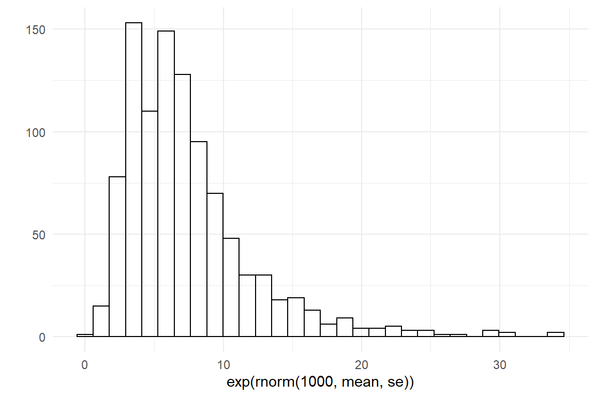
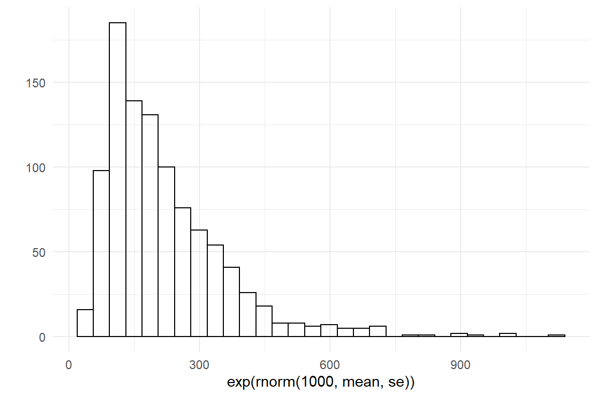
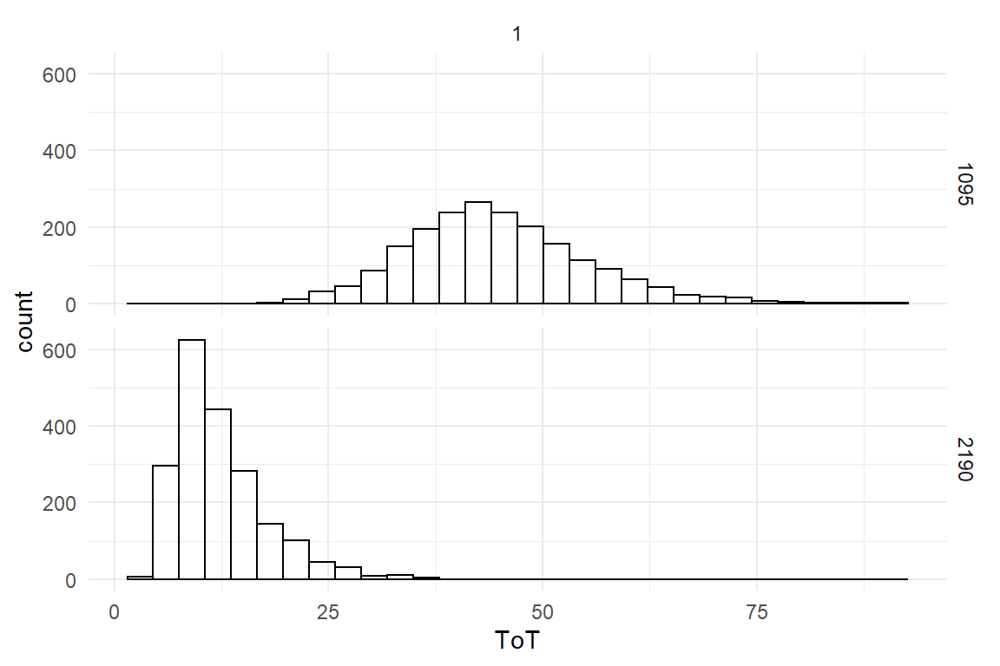

# (PART) Preview Chapters {.unnumbered}


# Learning curve models {#LCM}


As learning we describe the psychological process of improving performance by means of training. This can be many things, such as learning a language, learning to multiply large numbers or learning to lace your shoes. Broadly, two types of learning can be distinguished, that often appear in that order: For lacing her shoes, a little girl first has to learn *how* this is done, for example by the following instructions:

1.  make a tie
2.  make a lace on the left
3.  make a lace on the right
4.  make a tie with the laces


## The tweak-finder model of building skills

The first phase of learning happens when the child is able to translate the spoken words into an *action plan*. We may call this *task knowledge*. Task knowledge has more or less a discrete learning function, which jumps from 0 to 1 at the exact moment the instructions are understood. Once there is comprehension, it won't go away.

The second phase of learning is building *building skills*. The initial action plan is mostly just a generic recipe. In consequence, initial successes usually don't shine with elegance, when we learn to walk, tie our shoes or throw a Three-Sixty. Building skills is a long running, continuous process of refining the action plan. These refinements are *tweaks* like short-cuts, parallel execution out-of-loop execution etc.

Building skill can be ascribed as the process of *finding the possible tweaks*. This does not go on forever, because there can be only so many possible tweaks. If we further assume that finding a tweak irreversible, the set of possible tweaks must diminish over time. This makes it harder to find them and the net amount of learning per exercise diminishes.

When all tweaks are found and applied, the learning organism has reached its level of *maximum performance*. Maximum performance usually is a person-specific parameter that is always finite and never zero, because some parts of the organism cannot be tweaked, such as the travel time in nerve cells and the inertia of limbs.

To summarize the process of building skills has two significant properties:

1.  There is a point of maximum performance, which is reached asymptotically, but never crossed.
2.  The process is non-linear, such that the net effect diminishes over time.


### The Exponential law of finding tweaks

Imagine at age of three a certain little girl understood how to lace her shoes in the morning. Let's further assume the following:

1.  $N_0 = 1000$ possible tweaks exist before the first attempt
2.  With every trial $t$, the little girl finds the remaining tweaks at a rate of $.002$, which means the *rate of survival* is $\textrm{Surv} = .998$

Let's put this in a row and see what happens up to the third attempt:

$$
\begin{aligned}
N_0 &= 1000\\
N_1 &= N_0 \times .998\\
N_2 &= N_1 \times .998\\
&= N_0 \times .998 \times .998\\
N_3 &= N_2 \times .998\\
&= N_0 \times .998 \times .998 \times .998
\end{aligned}
$$

By this series, we see that we can predict the remaining number of tweaks at any point in time as an exponential function running over trials $t$.

$$
N_t = N_0 \times \textrm{Surv}^t
$$

Since Surv is a proportion, this term has the property to get smaller to asymptotically (not eventually) reach zero. As this formula is only counting hypothetical tweaks, it runs against zero. However, ToT and many other measures cannot run against zero, because performance also contains a non-tweakable part, a positive constant. Let's assume that by the girls anatomy, the non-tweakable part of the execution is 2 seconds, then her *maximum performance* $\textrm{Asym} = 2$ is reached when all tweaks are found.

Maximum performance enters the formula as positive constant. If we further assume that every tweak has a net effect of $\beta = .005$ seconds, we can predict the little girl's performance over a series of 400 mornings (Figure \@ref(fig:little-girl-1)).

$$
P_t = \textrm{Asym} + \beta N_0^t
$$


```r
attach(Chapter_LCM)
```


```r
sim_Lacing <- 
  function(N_Obs = 3000, 
           N_0 = 1000, 
           beta = .36, 
           ampl = N_0 * beta, 
           surv = .998, 
           asym = 2,
           seed = 42){  
    set.seed(seed)
    tibble(trial = 1:N_Obs,
           N_tweaks = N_0 * surv^trial,
           ToT_pred = asym + N_tweaks * beta,
           ToT = rgamma(N_Obs, 
                        shape = ToT_pred/8, 
                        rate = 1/8)) %>% 
      as_tbl_obs()
  }

Lacing_1 <- sim_Lacing()

sync_CE(sim_Lacing, Lacing_1, Env = Chapter_LCM)
```

```
## [1] "sim_Lacing" "Lacing_1"
```


```r
Lacing_1 %>%
  ggplot(aes(x = trial)) +
  geom_point(aes(y = ToT, 
                 color = "simulated"), 
             size = .05, alpha =.5) +
  geom_line(aes(y = ToT_pred, 
                color = "predicted")) +
  geom_hline(aes(yintercept = 2, 
                 color = "maximum performance")) +
  labs(col = "Performance")
```

<div class="figure">

<p class="caption">(\#fig:little-girl-1)Simulating a learning process as finding of possible tweaks</p>
</div>


For the practical purpose of estimating learning curves, the formula above has a problem. In reality we do not know the initial number of tweaks $N_0$, neither do we know the performance increment per tweak $\beta$. We only see the decline in ToT, and that's also what we are mostly interested in. If we pull the two together as one factor, usually called the *amplitude*, $\textrm{Ampl} = \beta N_0$. It so represents the total performance improvement from the first encounter to, well, infinite amount of training.

$$
P_t = \textrm{Asym} + \textrm{Ampl}\times \textrm{Surv}^t
$$


```r
F_asy <- formula(ToT ~ asym + ampl * surv^trial)
F_lasy <- formula(ToT ~ exp(asym) + exp(ampl) * inv_logit(surv)^trial)
```

The first step is to consider the allowed range for the three parameters. For positive measures, such as ToT or errors, asymptote and amplitude must be non-negative. Gamma distributions come to mind. The survival rate is a proportion, ranging between zero and one, which makes Beta distributions seem a good candidate.

However, the Stan engine uses a highly advanced MCMC algorithm, Hamiltonian MC sampling, which requires all parameters to run without boundaries. You can define boundaries and you can use distributions with boundaries, but they will be internally converted to an unbound parameter. Can you guess how they do the conversion? \@ref(relinking-linearity).

In the case of ASY parameters, we have two types of conversion:

-   Ampl and Asym need conversion from non-negative to unbound

-   Surv needs double-bound to unbound conversion.

This are the exact same transformations as in the linearization of linear coefficients (\@ref(relinking-linearity)) and we can use the usual pair of transformations: log/exp and logit/inv_logit

Learning curve models tend to be nasty. One trick I have learned to make the estimation more quick and stable is to transform all non-linear parameters to an unbound space, right away. Let's get started with Asym, which we need to be non-negative. The result of the exponential function is always positive, which we can assure by rewriting the ASY model as

$$
P_t = \exp\textrm{Asym} + \textrm{Ampl} \times\textrm{Surv}^t
$$

When estimating, Asym is not the same parameter as before. It now runs on a the unbound log scale. Following the same logic for Ampl and using the inverse logit for Surv, we can create the following re-parametrization of the ASY formula:

$$
P_t = \exp\textrm{Asym} + \exp\textrm{Ampl} \times\textrm{logit}^{-1} \textrm{Surv}^t
$$


```r
F_lasy <- formula(ToT ~ exp(asym) + exp(ampl) * inv_logit(surv)^trial)
```

### Priors

The models presented in the second part of the book all came with a great convenience. Formally, all Bayesian models require the specification of *priors (*\@ref(priors)). Even if a researcher has very little prior knowledge, a prior has to be given and that requires a deeper understanding of statistical distributions. The developers of Rstanarm and Brms managed to automatize the choice of *weak priors* for a wide range of models. But for non-linear models, like learning curves, the user has to specify some of the priors.

The first consideration in analysis of priors is the boundaries of parameters, as these confine the prior. ASY parameters have either one or two boundaries, so using Gamma and Beta distributions to represent our belief is a possibility. However, these two distributions are particularly user-unfriendly, because they don't have separate parameters for location and dispersion. And, most importantly, if we estimate an unbound LASY model, we can conveniently use a boundless distribution, like the Gaussian distribution, ot $t$ distribution.

To start with the priors for Asym, we have to figure out what *maximum* speeds are possible in lacing your shoes. Here, I am going with the rough estimate that most adults, with years of practice, can lace their shoe within 2 and 20 seconds.

A quick and crude way to create a weak Gaussian prior on an unbound parameter is to take your best guess for lower and upper values and use the logarithm to create upper and lower bounds on the log scale. Then use the center as the Normal mean and a quarter of the range as the standard error.


```r
lower = log(2)
upper = log(20)
mean = (lower + upper)/2
se = (upper - lower)/4

qplot(rnorm(1000, mean, se))
```


```r
qplot(exp(rnorm(1000, mean, se)))
```


Then, we lift the values to the scale of measures (`exp`) and cvheck if this distribution represents what we know. In this  case I am quite satisfied with my *weakly informative prior*.

In the same manner, we can produce a distribution for the amplitude. Here, my common sense is that the first time it can take easily take between 60 and 600 seconds longer compared to maximum performance at a much later age.


```r
lower = log(60)
upper = log(600)
mean = (lower + upper)/2
se = (upper - lower)/4

qplot(rnorm(1000, mean, se))
```




```r
qplot(exp(rnorm(1000, mean, se)))
```


Finally, the same procedure is used on the survival rate, with a logit transformation. I have seen learning curves on several motor tasks that drop very fast, with a survival of as low as 20%. At the lower end I can think of situations with an incredibly high survival, like 99.9%.


```r
lower = logit(.2)
upper = logit(.999)
mean = (lower + upper)/2
se = (upper - lower)/4

qplot(rnorm(1000, mean, se))
```



```r
qplot(inv_logit(rnorm(1000, mean, se)))
```


Note that the trick here is to approximate a Normal distribution on the linearized scale, such that it matches the prior you have on  your mind, which usually is in on the original scale. So you will have to make some adjustments. The visual check after transformation is crucial, because exponentials and inverse logits are sensitive. Exponentials tend to blow up, so you may end up with unreasonably wide priors, when you choose the wrong base. Inverse logits are even worse, because if you make the Normal prior too wide, you can easily produce split-mind priors, like the following:


```r
lower = logit(.2)
upper = logit(.999)
mean  = (lower + upper)/2
se    = upper - lower

qplot(rnorm(1000, mean, se))
```


```r
qplot(inv_logit(rnorm(1000, mean, se)))
```


The following code puts these priors into Brms formulas:


```r
F_asy_prior <- c(set_prior("normal(300, 200)", nlpar = "ampl", lb = 0),
                 set_prior("beta(2, 4)", nlpar = "surv", lb = .0001, ub = .9999),
                 set_prior("normal(6, 5)", nlpar = "asym", lb = 0))

F_lasy_prior <- c(set_prior("normal(5.25, 0.576)", nlpar = "ampl"),
                 set_prior("normal(2.76, 2.07)", nlpar = "surv"),
                 set_prior("normal(1.84, 0.576)", nlpar = "asym"))
```


### Building the model

If we compare the non-linear term formula to the linear models formulas, there is one notable difference. With linear models, all coefficient names are composed of the names of measured variables. That is because they are all linear coefficients. Here, new names are introduced and the formula is not just a combination of linear terms. The second set of formulas specifies the linear association of non-linear parameters and coefficients. We will explore that later, because here there really is just a single little girl and we specify a plain intercept-only model.


```r
F_asy_ef_1 <- list(formula(ampl ~ 1),
                 formula(surv ~ 1),
                 formula(asym ~ 1))
```

The model is build by collecting the non-linear formula, the effects formula and the priors specifications. Note that `nl = T` switches the non-linear mode of on. This is crucial, because otherwise the engine assumes all variable names to be from the data set. 

Finally, we are dealing with duration measures, which requires a random component that is bounded below and has a suitable mean-variance relationship. As the measures are getting rather close to zero, a gamma distribution is a reasonable approximation.

For our first model, we only look at the data of the first two years of training.


```r
Lacing_2 <- 
  Lacing_1 %>% 
  filter(trial <= 730)
```


```r
M_1 <- 
  Lacing_2 %>% 
  brm(bf(F_lasy,
         flist = F_asy_ef_1,
         nl = T), 
      prior = F_lasy_prior,
      family = Gamma(link = identity),
      data = .,
      chains = 2)

sync_CE(Lacing_2, M_1, Env = Chapter_LCM)
```


The fixef command extracts the parameter estimate. Since this is an intercept-only model, exponentiation yields the original scale for Ampl and Asym, whereas Surv is expressed as odds. 


```r
fixef(M_1, mean.func = exp)
```


Table: (\#tab:unnamed-chunk-15)Coefficient estimates with 95% credibility limits

|nonlin | center|  lower| upper|
|:------|------:|------:|-----:|
|ampl   | 350.24| 336.74| 362.5|
|surv   | 483.92| 437.98| 511.2|
|asym   |   7.68|   2.36|  22.3|

If Surv is 500, that means the odds are 500 against 1 in favor of tweak survival. This can be transformed back and from proportions as follows:


```r
odd <- function(prop) prop/(1-prop) 
unodd <- function(odd) odd/(1+odd)

my_odd <- 500
my_odd
```

```
## [1] 500
```

```r
unodd(my_odd)
```

```
## [1] 0.998
```

```r
odd(unodd(my_odd))
```

```
## [1] 500
```

### Analyzing the results

After being trained with data, the learning curve model turns into a forecasting engine. But, first we will see that all parameters have a useful interpretation.


#### Parameter interpretation

The way the ASY model is derived, the *Asym* parameter represents performance once all possible tweaks have been found. In other words, it contains all processes that are not improving by training (at least not this one) and therefore defines the *maximum performance* for this girl, under this training. If the value is 8, this will be the value the girl will work towards her whole life time, under this model.

Recall how we derived *Ampl* from the tweak-finding model as the number of possible tweaks times the average gain. In other words the amplitude parameter represents the amount of *potential for improvement*, before the first trial. Or rather, what has been marked as the first trial. Sometimes, the first trial in such an experiment may not be the first attempt. Imagine, the little girl had done ten earlier attempts without her dad noticing.


```r
Lacing_2 %>% 
  filter(trial <= 300) %>% 
  mutate(ToT_shifted = dplyr::lag(ToT_pred, n = 10)) %>% 
  ggplot(aes(x = trial)) +
  geom_line(aes(y = ToT_pred, col = "full recording")) +
  geom_line(aes(y = ToT_shifted, col = "first 10 trials missed"))
```


Amplitude and asymptote are predictions that will never happen. The real fun begins when we use parameter *Surv* to predict events that are actually going to happen. Surv represents the survival of tweaks, that means the *smaller* Surv is, the *faster* the little girl learns.  

How long does it take to reach a certain level? On which day will the girl have found half of the tweaks, and when will her skills reach 99%? For a start we can create a simple projection:


```r
prop_surv <- .998

tibble(years = 1:7,
       trial = years * 365,
       level = 1 - prop_surv^trial) %>% 
  ggplot(aes(x = years, y = level)) +
  geom_line()
```


It is predicted that 50% performance already is reached within one year. For reaching 99%, the girl has to practice between 6 and 7 years. A more precise statement can be derived easily. We want to know how often Surv needs to be multiplied to reach a desired level, which means we can use the logarithm. Note how the base of the logarithm is specified. When we use the `exp()` function for scale transformations, the base does not matter as long as it is the same. When the base argument is omitted, the default base is Euler's number $e$. Also note that R is one of the few languages knowing infinity as a value.


```r
prop_surv <- .998

tibble(level =  c(0, 1, 5, 10, 50, 95, 99, 100)/100,
       trials = log(1 - level, base = prop_surv),
       years = trials/365)
```


| level|  trials| years|
|-----:|-------:|-----:|
|  0.00|    0.00| 0.000|
|  0.01|    5.02| 0.014|
|  0.05|   25.62| 0.070|
|  0.10|   52.63| 0.144|
|  0.50|  346.23| 0.949|
|  0.95| 1496.37| 4.100|
|  0.99| 2300.28| 6.302|
|  1.00|     Inf|   Inf|


#### Posterior predictions

Parameter interpretation and projection are useful for eye-balling the model results, but they lack one important ingredient: information on certainty. Posterior predictions contain certainty information and are the ultimate method to make predictions from learning curves.

We start by extracting the posterior predictions and plot them over the observed range:


```r
PP_1 <- post_pred(M_1)
sync_CE(PP_1, Env = Chapter_LCM)
```


```r
predict(PP_1)  %>% 
  left_join(Lacing_1) %>% 
  ggplot(aes(x = trial)) +
  geom_point(aes(y = ToT, color = "data")) +
  geom_line(aes(y = center, color = "predicted"))
```


In order to reach beyond the observed range, we extract posterior predictions based on fabricated data. This fabricated data contains only the model predictors (`trial`). The trained model is used as a simulator for the outcome.


```r
D_fore <- 
  tibble(trial = c(3*365, 6*365)) %>% 
  as_tbl_obs()

PP_fore <- post_pred(M_1, newdata = D_fore)

 
left_join(D_fore, predict(PP_fore))
```


Table: (\#tab:unnamed-chunk-22)Data set with 6 variables, showing 2 of 2 observations.

| Obs| trial|model | center| lower| upper|
|---:|-----:|:-----|------:|-----:|-----:|
|   1|  1095|M_1   |   44.3| 27.50|  67.1|
|   2|  2190|M_1   |   11.4|  5.64|  25.7|


Now, we can add certainty statements, as usual. Or, to be most precise, display the posterior predictive distribution:


```r
PP_fore %>% 
  left_join(D_fore) %>% 
  ggplot(aes(x = value)) +
  geom_histogram() +
  facet_grid(Obs~1) +
  labs(x = "ToT")
```


Using the full distributions, we can derive further statements around uncertainty, for example: what is the probability that the girl will lace her shoe in less than 30 seconds:


```r
PP_fore %>% 
  group_by(Obs) %>% 
  summarize(prob_LT30 = mean(value < 30))
```


| Obs| prob_LT30|
|---:|---------:|
|   1|     0.060|
|   2|     0.991|
According to these results, the chance of lacing faster than 30 seconds is very small after three years of training, but it is almost certain after six years.

For its three parameters *A*mplitude, *S*urvival and As*y*mptode, we abbreviate this model as ASY. We have discussed the interpretation of the learning parameters and we have seen two ways for making forecasts using a trained learning curve model.


### A bunch of girls and their Lacies

As we have seen, ASY parameters can be used to make a forecast for a single learner.  As we will see now, we can also compare learners. Also, we will make a slight modification and introduce the ACY model. Imagine the following three little girls and their shoe lacing performance over one year of practice:


```r
set.seed(42)
Years = 1
N_trials = Years * 365
N_Girls = 3
N_Obs = N_trials * N_Girls


Girls <- 
  tribble(~Girl, ~ampl, ~surv, ~asym,
          "Eli",   300,   .996,     10,
          "Lia",   200,   .997,     20,
          "Ina",   100,   .998,     30) %>% 
  mutate(surv_odd = odd(surv))

Lacing_3 <- 
  expand_grid(trial = 1:N_trials,
              Girl = Girls$Girl) %>% 
  left_join(Girls, by = "Girl") %>% 
  mutate(ToT_pred = asym + ampl * surv^trial,
         ToT = rgamma(N_Obs, shape = ToT_pred/2, 1/2)) %>% 
  as_tbl_obs()

Lacing_3
```


Table: (\#tab:unnamed-chunk-25)Data set with 9 variables, showing 8 of 1095 observations.

| Obs| trial|Girl | ampl|  surv| asym| surv_odd| ToT_pred|   ToT|
|---:|-----:|:----|----:|-----:|----:|--------:|--------:|-----:|
|  34|    34|Eli  |  300| 0.996|   10|      249|    271.8| 262.4|
| 167|   167|Eli  |  300| 0.996|   10|      249|    163.6| 173.4|
| 316|   316|Eli  |  300| 0.996|   10|      249|     94.5|  79.4|
| 355|   355|Eli  |  300| 0.996|   10|      249|     82.3|  54.9|
| 448|    83|Lia  |  200| 0.997|   20|      332|    175.9| 184.9|
| 671|   306|Lia  |  200| 0.997|   20|      332|     99.8| 110.9|
| 803|    73|Ina  |  100| 0.998|   30|      499|    116.4| 138.3|
| 837|   107|Ina  |  100| 0.998|   30|      499|    110.7| 102.3|

```r
sync_CE(Lacing_3, Env = Chapter_LCM)
```

```
## [1] "Lacing_3"
```


```r
Lacing_3 %>% 
  ggplot(aes(x = trial, color = Girl)) +
  geom_line(aes(y = ToT_pred)) +
  geom_point(aes(y= ToT), size = .1) +
  ylim(0,400)
```


Note how tiny differences in Surv seem to make a huge difference for speed of learning. Within one year, Eli catches up to Ina, although she has three times the amplitude. This becomes clear, when we replace rate of survival with *rate of catching tweaks*:


```r
Girls %>% 
  mutate(ctch = 1 - surv)
```


|Girl | ampl|  surv| asym| surv_odd|  ctch|
|:----|----:|-----:|----:|--------:|-----:|
|Eli  |  300| 0.996|   10|      249| 0.004|
|Lia  |  200| 0.997|   20|      332| 0.003|
|Ina  |  100| 0.998|   30|      499| 0.002|
Now, it becomes clear that Eli catches up with Ina, because she has double the chance to catch a tweak. Eli started out with a larger set of undiscovered tweaks, but she catches more of them per trial. For the purpose of comparing learners, the catch rate is more intuitive and we can easily derive the ACY (amplitude, catch rate, asymptote) model. 

$$
\textrm{Perf}_t = \textrm{Asym} + \textrm{Ampl}\times(1 - \textrm{Ctch})^t
$$
Just like Surv, Ctch is a proportion and the LACY formula of the unbound model is derived much the same way:

$$
P_t = \exp\textrm{Asym} + \exp\textrm{Ampl} \times \textrm{logit}^{-1} (1-\textrm{Ctch})^t
$$


```r
F_lacy <- formula(ToT ~ exp(asym) + exp(ampl) * inv_logit((1-ctch))^trial) 
```

The priors need only one simple adjustment for the switch from Surv to Ctch. The Ctch prior is a mirrored version of the Surv prior, with a mirror axis at 50%, which is an odd of 1 and on a logit scale zero becames the mirror axis. The LACY prior for catch rate is just the negative.


```r
F_lacy_prior <- c(set_prior("normal(5.25, 0.576)", nlpar = "ampl"),
                  set_prior("normal(-2.76, 2.07)", nlpar = "ctch"),
                  set_prior("normal(1.84, 0.576)", nlpar = "asym"))
```

Since we want to estimate three learning curves, we have to adjust the effects formula. The following factorial effects formula suppresses the Intercept and results absolute learning parameters, conditional on Girl.
Note that with larger learner samples, a multi-level model is more approriate. We will come to that in the next section.


```r
F_acy_ef_1 <- list(formula(ampl ~ 0 + Girl),
                 formula(ctch ~ 0 + Girl),
                 formula(asym ~ 0 + Girl))
M_2 <- 
  Lacing_3 %>% 
  brm(bf(F_lacy,
         flist = F_acy_ef_1,
         nl = T), 
      prior = F_lacy_prior,
      family = Gamma(link = identity),
      data = .)

sync_CE(M_2, Env = Chapter_LCM)
```


```r
fixef(M_2, mean.func = exp)
```


Table: (\#tab:unnamed-chunk-31)Coefficient estimates with 95% credibility limits

|nonlin |fixef   |  center|   lower|   upper|
|:------|:-------|-------:|-------:|-------:|
|ampl   |GirlEli | 305.450| 295.218| 314.759|
|ampl   |GirlIna | 124.886| 112.026| 130.943|
|ampl   |GirlLia | 210.727| 198.709| 218.599|
|ctch   |GirlEli |   0.011|   0.010|   0.012|
|ctch   |GirlIna |   0.004|   0.004|   0.005|
|ctch   |GirlLia |   0.007|   0.007|   0.008|
|asym   |GirlEli |   5.865|   2.036|  15.100|
|asym   |GirlIna |   6.619|   2.154|  19.806|
|asym   |GirlLia |   6.673|   2.217|  20.110|


```r

```


## Conditional Learning Curve Models


```r
attach(LapTrain)
```


```r
F_lacy <- formula(ToT ~ exp(asym) + exp(ampl) * inv_logit((1-ctch))^trial) 
```


```r
F_lacy_prior <- c(set_prior("normal(5.25, 0.576)", nlpar = "ampl"),
                  set_prior("normal(-2.76, 2.07)", nlpar = "ctch"),
                  set_prior("normal(1.84, 0.576)", nlpar = "asym"))
```


Let's try LACY on a real data set:


```r
D_LT <- 
  D_laptrain %>% 
  mutate(ToT = Duration,
         gaming = as.numeric(Gaming)) %>% 
  select(Obs, Part, gaming, SM, VSA, trial, ToT)
```

The following linear effects specifications create an intercept-only multi-level model:


```r
F_acy_ef_3 <- list(formula(ampl ~ 1|Part),
                   formula(ctch ~ 1|Part),
                   formula(asym ~ 1|Part))
```


```r
M_3 <- 
  D_LT %>% 
  brm(bf(F_lacy,
         flist = F_acy_ef_3,
         nl = T), 
      prior = F_lacy_prior,
      family = Gamma(link = identity),
      data = .)

sync_CE(M_3, Env = LapTrain)
```


#### Do gamers have previous experience?

Gamers have previous experience with processing a 2D image of a 3D environment. As this is part of the task, gamers can be expected to have lower amplitudes. As gaming experience varies within the population, but not on participant level, the predictor enters the model as a continuous linear predictor. 


```r
F_acy_ef_4 <- list(formula(ampl ~ 1 + gaming + (1|Part)),
                   formula(ctch ~ 1 + (1|Part)),
                   formula(asym ~ 1 + (1|Part)))
```


```r
M_4 <- 
  D_LT %>% 
  brm(bf(F_lacy,
         flist = F_acy_ef_4,
         nl = T), 
      prior = F_lacy_prior,
      family = Gamma(link = identity),
      data = .)

sync_CE(M_4, Env = LapTrain)
```

```r
fixef(M_4)
```


Table: (\#tab:unnamed-chunk-41)Coefficient estimates with 95% credibility limits

|nonlin |fixef     | center|  lower| upper|
|:------|:---------|------:|------:|-----:|
|ampl   |Intercept |  2.771|  2.537| 3.071|
|ampl   |gaming    | -0.021| -0.066| 0.025|
|ctch   |Intercept |  0.750|  0.451| 1.080|
|asym   |Intercept |  0.986|  0.879| 1.108|


#### Is spatial memory capacity associated with faster learning?


```r
F_acy_ef_5 <- list(formula(ampl ~ 1 + (1|Part)),
                   formula(ctch ~ 1 + SM + (1|Part)),
                   formula(asym ~ 1 + (1|Part)))
```


```r
M_5 <- 
  D_LT %>% 
  brm(bf(F_lacy,
         flist = F_acy_ef_5,
         nl = T), 
      prior = F_lacy_prior,
      family = Gamma(link = identity),
      data = .)

sync_CE(M_5, Env = LapTrain)
```


```r
fixef(M_5, mean.func = exp)
```


Table: (\#tab:unnamed-chunk-44)Coefficient estimates with 95% credibility limits

|nonlin |fixef     | center|  lower| upper|
|:------|:---------|------:|------:|-----:|
|ampl   |Intercept | 15.207| 12.479| 19.23|
|ctch   |Intercept |  0.111|  0.007|  1.65|
|ctch   |SM        |  1.468|  1.037|  2.11|
|asym   |Intercept |  2.687|  2.409|  3.02|


```r
Loo_3 <- loo(M_3)
Loo_5 <- loo(M_5)

sync_CE(Loo_3, Loo_5, Env = LapTrain)
```


```r
list(Loo_3, Loo_5) %>% 
       bayr::compare_IC()
```


Table: (\#tab:unnamed-chunk-46)Model ranking by predictive accuracy

|Model |IC    | Estimate|   SE| diff_IC|
|:-----|:-----|--------:|----:|-------:|
|M_3   |looic |      554| 43.5|    0.00|
|M_5   |looic |      557| 43.7|    2.41|


#### High VSA is associated with a lower asymptote


```r
F_acy_ef_6 <- list(formula(ampl ~ 1 + (1|Part)),
                   formula(ctch ~ 1 + (1|Part)),
                   formula(asym ~ 1 + VSA + (1|Part)))
```


```r
M_6 <- 
  D_LT %>% 
  brm(bf(F_lacy,
         flist = F_acy_ef_6,
         nl = T), 
      prior = F_lacy_prior,
      family = Gamma(link = identity),
      data = .)

sync_CE(M_6, Env = LapTrain)
```


```r
fixef(M_6, mean.func = exp)
```


Table: (\#tab:unnamed-chunk-49)Coefficient estimates with 95% credibility limits

|nonlin |fixef     | center|  lower| upper|
|:------|:---------|------:|------:|-----:|
|ampl   |Intercept | 15.233| 12.247| 19.54|
|ctch   |Intercept |  2.130|  1.528|  2.96|
|asym   |Intercept |  3.739|  1.833|  8.41|
|asym   |VSA       |  0.994|  0.978|  1.01|


## Compound learning curves (EXPERIMENTAL)

How likely is it that all tweaks have the same probability of discovery (Ctch) or total effect (Ampl). 


### Adjusting for fatigue and finding a separation

What you often see in learning curves that were taken on the same day is that performance starts declining caused by fatigue. Sometimes, an otherwise  proper learning curve warps up. This is not covered by the standard LACY model and can throw off the MCMC sampling.

You can think of fatigue in two ways, depending on where it appears, in the tweakable or un-tweakable part. Fatigue of learning would result in a reduction of Ctch, whereas performance fatigue can be modelled as an asymptote that increases with every new trial:


```r
F_acy_ef_7 <- list(formula(ampl ~ 1 + (1|Part)),
                   formula(ctch ~ 1 + (1|Part)),
                   formula(asym ~ 1 + trial + (1|Part)))
```

As you can see, I have to tune the Stan engine quite a bit to get a properly converging model. 


```r
M_7 <- 
  D_LT %>% 
  brm(bf(F_lacy,
         flist = F_acy_ef_7,
         nl = T), 
      prior = F_lacy_prior,
      family = Gamma(link = identity),
      iter = 4000, warmup = 2000,
      chains = 6,
      control=list(adapt_delta=0.999),
      data = .)

sync_CE(M_7, Env = LapTrain)
```


```r
bind_rows(posterior(M_3),
          posterior(M_7)) %>% 
  fixef(mean.func = exp)
```


Table: (\#tab:unnamed-chunk-52)Coefficient estimates with 95% credibility limits

|model |nonlin |fixef     | center|  lower|  upper|
|:-----|:------|:---------|------:|------:|------:|
|M_3   |ampl   |Intercept | 15.158| 12.164| 19.684|
|M_3   |ctch   |Intercept |  2.121|  1.532|  2.944|
|M_3   |asym   |Intercept |  2.678|  2.399|  3.006|
|M_7   |ampl   |Intercept | 30.250| 18.642| 64.359|
|M_7   |ctch   |Intercept |  7.367|  3.681| 23.025|
|M_7   |asym   |Intercept |  4.871|  4.066|  5.977|
|M_7   |asym   |trial     |  0.944|  0.927|  0.958|

The results indicate a different picture: 

+ Asym is not rising, but falling at a rate of .94
+ the amplitude and asymptote have both doubled.
+ the catch odds are more than tripled
+ the initial asymptote is almost doubled


```r
PP_cmpnd <- 
  bind_rows(post_pred(M_3, thin = 8),
            post_pred(M_7, thin = 24))

sync_CE(PP_cmpnd, Env = LapTrain)
```


```r
PP_cmpnd %>% 
  predict() %>% 
  left_join(D_LT, by = "Obs") %>% 
  ggplot(aes(x = trial, 
             y = center,
             color = model)) +
  geom_smooth(se = F) +
  facet_wrap(~Part)
```


```r
Loo_7 <- loo(M_7)

list(Loo_3, Loo_7) %>% 
  compare_IC()
```


Table: (\#tab:unnamed-chunk-55)Model ranking by predictive accuracy

|Model |IC    | Estimate|   SE| diff_IC|
|:-----|:-----|--------:|----:|-------:|
|M_7   |looic |      526| 45.3|     0.0|
|M_3   |looic |      554| 43.5|    28.7|

```r
sync_CE(Loo_7, Env = LapTrain)
```

```
## [1] "Loo_7"
```

This model suggests that the data is better explained by adding a second much slower decay process with a survival rate of 94%. Enter Lace Acy!


### Lace ACY!


```r
F_lacacy <- ToT ~ exp(asym) + exp(ampl1) * inv_logit((1 - ctch1))^trial  + exp(ampl2) * inv_logit((1 - ctch2))^trial
```


```r
F_lacacy_prior<- c(set_prior("normal(2.25, 0.576)", nlpar = "ampl1"),
                  set_prior("normal(-2.76, 2.07)", nlpar = "ctch1"),
                  set_prior("normal(5.25, 0.576)", nlpar = "ampl2"),
                  set_prior("normal(2.76, 2.07)", nlpar = "ctch2"),
                  set_prior("normal(1.84, 2)", nlpar = "asym"))
```


```r
F_acy_ef_8 <- list(formula(ampl1 ~ 1 + (1|Part)),
                   formula(ctch1 ~ 1 + (1|Part)),
                   formula(asym ~ 1 + (1|Part)),
                   formula(ampl2 ~ 1),
                   formula(ctch2 ~ 1))
```


```r
M_8 <- 
  D_LT %>% 
  brm(bf(F_lacacy,
         flist = F_acy_ef_8,
         nl = T), 
      prior = F_lacacy_prior,
      family = Gamma(link = identity),
      iter = 6000, warmup = 4000,
      chains = 6,
      control=list(adapt_delta=0.999),
      data = .)

sync_CE(M_8, Env = LapTrain)
```

```r
P_cmpnd <- bind_rows(posterior(M_3),
                     posterior(M_7),
                     posterior(M_8))

P_cmpnd %>% fixef(mean.func = exp)
```


Table: (\#tab:unnamed-chunk-60)Coefficient estimates with 95% credibility limits

|model |nonlin |fixef     |  center|   lower|    upper|
|:-----|:------|:---------|-------:|-------:|--------:|
|M_3   |ampl   |Intercept |  15.158|  12.164|   19.684|
|M_3   |ctch   |Intercept |   2.121|   1.532|    2.944|
|M_3   |asym   |Intercept |   2.678|   2.399|    3.006|
|M_7   |ampl   |Intercept |  30.250|  18.642|   64.359|
|M_7   |ctch   |Intercept |   7.367|   3.681|   23.025|
|M_7   |asym   |Intercept |   4.871|   4.066|    5.977|
|M_7   |asym   |trial     |   0.944|   0.927|    0.958|
|M_8   |ampl1  |Intercept | 844.564| 201.583| 1215.560|
|M_8   |ctch1  |Intercept |   3.750|   0.614|    6.693|
|M_8   |asym   |Intercept |  21.480|   2.062|  138.113|
|M_8   |ampl2  |Intercept | 224.229| 177.049|  926.792|
|M_8   |ctch2  |Intercept |   0.158|   0.092|    4.914|

```r
grpef(M_8, mean.func = exp)
```


Table: (\#tab:unnamed-chunk-60)Coefficient estimates with 95% credibility limits

|nonlin | center| lower| upper|
|:------|------:|-----:|-----:|
|ampl1  |  0.585| 0.235|  1.47|
|ctch1  |  0.723| 0.358|  1.42|
|asym   |  1.113| 0.110|  3.31|


```r
PP_cmpnd
```


Table: (\#tab:unnamed-chunk-61)posterior predictions: 500 samples in 1 chains on 226 observations. (five shown below)

|model | Obs| iter| value|Part |  SM|  VSA| gaming| trial| ToT| Damage| MotionEfficiency|
|:-----|---:|----:|-----:|:----|---:|----:|------:|-----:|---:|------:|----------------:|
|M_3   |  14|  362|  7.21|02   | 8.5| 54.5|    0.0|     2| 452|  43.82|             7.73|
|M_3   |  46|  207|  2.89|04   | 7.0| 48.8|    0.0|    10| 155|   6.66|             3.43|
|M_3   | 190|  466|  2.57|16   | 8.0| 54.5|    0.0|    12| 173|   8.92|             2.47|
|M_7   |  19|  128|  4.46|02   | 8.5| 54.5|    0.0|     7| 224|   7.65|             3.66|
|M_7   | 100|  146|  3.29|09   | 7.0| 36.5|    0.5|     6| 160|   8.78|             3.59|


```r
Loo_8 <- loo(M_8)
sync_CE(Loo_8, Env = LapTrain)
```


```r
list(Loo_3, Loo_8, Loo_7) %>% 
  compare_IC()
```


Table: (\#tab:unnamed-chunk-63)Model ranking by predictive accuracy

|Model |IC    | Estimate|   SE| diff_IC|
|:-----|:-----|--------:|----:|-------:|
|M_7   |looic |      526| 45.3|     0.0|
|M_3   |looic |      554| 43.5|    28.7|
|M_8   |looic |     2380| 46.8|  1854.3|


```r
F_acy_ef_9 <- list(formula(ampl1 ~ 1 + (1|Part)),
                   formula(ctch1 ~ 1 + (1|Part)),
                   formula(ampl2 ~ 1 + (1|Part)),
                   formula(ctch2 ~ 1 + (1|Part)),
                   formula(asym ~ 1 + (1|Part)))
```


```r
M_9 <- 
  D_LT %>% 
  brm(bf(F_lacacy,
         flist = F_acy_ef_9,
         nl = T), 
      prior = F_lacacy_prior,
      family = Gamma(link = identity),
      iter = 8000, warmup = 6000,
      chains = 6,
      control=list(adapt_delta=0.9999),
      data = .)

Loo_9 <- loo(M_9)

sync_CE(M_9, Loo_9, Env = LapTrain)

M_9
```


```r
fixef(M_9, mean.func = exp)
```


Table: (\#tab:unnamed-chunk-66)Coefficient estimates with 95% credibility limits

|nonlin |  center|   lower|  upper|
|:------|-------:|-------:|------:|
|ampl1  | 238.651|  59.604| 1000.3|
|ctch1  |   0.158|   0.063|   17.6|
|ampl2  | 899.298| 202.552| 1455.6|
|ctch2  |   3.877|   0.116|   15.9|
|asym   |   8.489|   0.128|  153.2|


```r
grpef(M_9, mean.func = exp)
```


Table: (\#tab:unnamed-chunk-67)Coefficient estimates with 95% credibility limits

|nonlin | center| lower| upper|
|:------|------:|-----:|-----:|
|ampl1  |  0.154| 0.013|  4.00|
|ctch1  |  0.238| 0.016| 30.67|
|ampl2  |  0.515| 0.057|  1.99|
|ctch2  |  0.631| 0.058|  2.00|
|asym   |  1.360| 0.029|  5.60|


```r
list(Loo_3, Loo_7, Loo_8, Loo_9) %>% 
  compare_IC()
```


Table: (\#tab:unnamed-chunk-68)Model ranking by predictive accuracy

|Model |IC    | Estimate|   SE| diff_IC|
|:-----|:-----|--------:|----:|-------:|
|M_7   |looic |      526| 45.3|     0.0|
|M_3   |looic |      554| 43.5|    28.7|
|M_8   |looic |     2380| 46.8|  1854.3|
|M_9   |looic |     2380| 47.3|  1854.6|


```r

```


<!-- ### Comparison with LARY -->

<!-- ```{r opts.label = "mcmc"} -->
<!-- F_ary <- formula(ToT ~ ampl*exp(-rate * trial) + asym) -->
<!-- F_lary <- formula(ToT ~ exp(ampl)*exp(-exp(rate) * trial) + exp(asym)) -->

<!-- F_lary_prior <- c(set_prior("normal(5.25, 0.576)", nlpar = "ampl"), -->
<!--                   set_prior("normal(0, 10)", nlpar = "rate"), -->
<!--                   set_prior("normal(1.84, 0.576)", nlpar = "asym")) -->

<!-- F_ary_ef_2 <- list(formula(ampl ~ 1|Part), -->
<!--                    formula(rate ~ 1|Part), -->
<!--                    formula(asym ~ 1|Part)) -->

<!-- M_4 <-  -->
<!--   D_laptrain %>%  -->
<!--   brm(bf(F_lary, -->
<!--          flist = F_ary_ef_2, -->
<!--          nl = T),  -->
<!--       prior = F_lary_prior, -->
<!--       family = Gamma(link = identity), -->
<!--       data = .) -->

<!-- P_LapTrain <-  -->
<!--   bind_rows(posterior(M_3), -->
<!--             posterior(M_4))  -->

<!-- PP_LapTrain <- bind_rows(post_pred(M_3), -->
<!--                          post_pred(M_4)) -->

<!-- sync_CE(M_3, M_4, P_LapTrain, PP_LapTrain, Env = LapTrain) -->
<!-- ``` -->

<!-- Do we get similar Asym and Ampl estimates? -->

<!-- ```{r} -->
<!-- P_LapTrain %>%  -->
<!--   fixef(mean.func = exp) -->
<!-- ``` -->


<!-- Do we get the same random effects? -->

<!-- ```{r} -->
<!-- P_LapTrain %>%  -->
<!--   ranef() %>%  -->
<!--   pivot_wider(id_cols = c("re_entity","nonlin"),  -->
<!--               names_from = model,  -->
<!--               values_from = center) -->
<!-- ``` -->


<!-- ```{r fig.height = 12} -->

<!-- sync_CE(PP_LapTrain, Env = LapTrain) -->

<!-- PP_LapTrain %>%  -->
<!--   predict() %>%  -->
<!--   left_join(D_laptrain, by = "Obs") %>%  -->
<!--   ggplot(aes(x = trial)) + -->
<!--   # geom_point(aes(y = ToT), size = .1) + -->
<!--   geom_smooth(aes(y = center, color = model, ), se = F) + -->
<!--   facet_wrap(~Part) -->
<!-- ``` -->

<!-- ```{r} -->
<!-- Loo_3 <- loo(M_3, moment_match = T) -->
<!-- Loo_4 <- loo(M_4, moment_match = T) -->

<!-- list(,  -->
<!--      loo(M_4, moment_match = T)) %>%  -->
<!--   compare_IC() -->
<!-- ``` -->

<!-- ##### [HERE] -->

<!-- 1.  In contrast to linear coefficients, ARY parameters must all be positive (including zero). At the same time, the prior distributions need to be specified as their cannot be reasonable defaults for a such a wide class of models. The pragmatic choice is the positive part of a Normal distribution. Amplitude and asymptote are on the scale of minutes. Typically, trained persons do such a simulator task in the range of a few minutes, but the amplitude can be much larger. A rather pronounced variance makes the prior weakly informative. For rate parameters the scale is a little different. Typical values are in the range between zero and 1, whereas With values larger than 3 the curve practically drops to the asymptote in one step. Note that with `brm` it is required to explicitly state the parameter boundaries (`lb`) if they exist. In addition, the non-linear likelihood function already takes care of the lower boundary of performance, such that we do not need a logarithmic link function. -->

<!-- ```{r} -->
<!-- grid.arrange( -->
<!--   data_frame(x = seq(0,50), -->
<!--              density = dnorm(x, 25, 100)) %>% -->
<!--     ggplot(aes(x = x, y = density)) + -->
<!--     geom_line() + -->
<!--     expand_limits(y=0) + -->
<!--     labs(title = "amplitude prior"), -->

<!--   data_frame(x = seq(0,5,.1), -->
<!--              density = dnorm(x, 0.5, 5)) %>% -->
<!--     ggplot(aes(x = x, y = density)) + -->
<!--     geom_line() + -->
<!--     expand_limits(y=0) + -->
<!--     labs(title = "rate prior"), -->
<!--   data_frame(x = seq(0,10, .1), -->
<!--              density = dnorm(x, 3, 15)) %>% -->
<!--     ggplot(aes(x = x, y = density)) + -->
<!--     geom_line() + -->
<!--     expand_limits(y=0) + -->
<!--     labs(title = "asymptote prior"), -->
<!--   nrow = 1 -->
<!-- ) -->
<!-- ``` -->

<!-- ```{r} -->


<!-- ``` -->

<!-- This basic model only estimates a single learning curve, hence we have to pick one individual from the LapTrain data set. In addition, the above learning curve equation requires the trials to start counting at zero, as there has not happened any learning before the first trial. -->

<!-- ```{r} -->
<!-- D_1 <- D_laptrain %>%  -->
<!--   filter(Part == "03") %>%  -->
<!--   mutate(Obs = row_number()) %>%  -->
<!--   select(Obs, trial, Duration) -->

<!-- D_1 %>%  -->
<!--   ggplot(aes(x = trial, y = Duration)) + -->
<!--   geom_point() + -->
<!--   geom_smooth(se = F) + -->
<!--   expand_limits(y = 0, x = 0) -->
<!-- ``` -->

<!-- The model is build as follows. Note that `nl = T` switches the non-linear mode of `brm` on. Finally, we are dealing with a temporal variable, which requires a random component that is bounded below and has a suitable mean-variance relationship. As the measures are getting rather close to zero, a gamma distribution is a reasonable approximation. -->

<!-- ```{r opts.label = "mcmc"} -->
<!-- M_1 <- D_1 %>%  -->
<!--   brm(bf(F_ary, -->
<!--          flist = F_ary_ef_1, -->
<!--          nl = T),  -->
<!--       prior = F_ary_prior, -->
<!--       family = Gamma(link = identity), -->
<!--       data = .) -->

<!-- M_1 <- brm(fit = M_1, data = D_1) -->
<!-- ``` -->

<!-- ```{r} -->

<!-- ``` -->

<!-- When training a skill, performance gets better over time, but sooner or later starts leaning towards an asymptote. We will now develop the *exponential law of training* in a step-by-step manner from the well-known exponential function. -->

<!-- $$f(t) = \exp t$$ -->

<!-- ```{r} -->
<!-- tibble(amount = 0:10, -->
<!--        performance = exp(amount)) %>%  -->
<!--   ggplot(aes(x = amount, y = performance)) + -->
<!--   geom_line() -->
<!-- ``` -->

<!-- The first we notice is that the function increases, rather than decreases and therefore reaches the asymptote to the left. This can easily be fixed by reversing amounts $t$: -->

<!-- $$f(t) = \exp -t$$ -->

<!-- ```{r} -->
<!-- tibble(amount = 0:10, -->
<!--        performance = exp(-amount)) %>%  -->
<!--   ggplot(aes(x = amount, y = performance)) + -->
<!--   geom_line() -->
<!-- ``` -->

<!-- Next, the exponential function asymptotically reaches zero, but most real performance measures are strictly positive and the little girl will reach $5s$ at best. The *maximum performance* parameter $omega$ (omega) is just an additive constant to the learning process, shifting the whole curve upwards. -->

<!-- $$f(t) = \textrm{Asym} + \exp -t$$ -->

<!-- ```{r} -->
<!-- asym = 5 -->

<!-- tibble(amount = 0:10, -->
<!--        performance = exp(-amount) + asym) %>%  -->
<!--   ggplot(aes(x = amount, y = performance)) + -->
<!--   geom_line() + -->
<!--   geom_hline(yintercept = asym, color = "blue") + -->
<!--   geom_hline(yintercept = 0, color = "blue", linetype = 2) + -->
<!--   geom_segment(x = 0, y = -.1, xend = 0, yend = 5, arrow = arrow(), col = "red") + -->
<!--   expand_limits(y = 0) -->
<!-- ``` -->

<!-- The range of performance is squeezed between initial performance (6) and the asymptote. By scaling up the exponential part of the formula by a constant $\textrm{Ampl}$, we adjust the scale of performance to the real measures. This parameter $\textrm{Ampl}$ directly represents the total amount of learning and is therefore called the *amplitude*. -->

<!-- ```{r} -->
<!-- ampl = 115 -->
<!-- asym = 5 -->


<!-- tibble(amount = 0:10, -->
<!--        ToT = asym + ampl * exp(-amount)) %>%  -->
<!--   ggplot(aes(x = amount, y = ToT)) + -->
<!--   geom_line() + -->
<!--   geom_hline(yintercept = asym) + -->
<!--   geom_segment(x = 0, y = asym, xend = 0, yend = asym + ampl, arrow = arrow(ends = "both"), col = "red") + -->
<!--   expand_limits(y = 0) -->
<!-- ``` -->

<!-- $$f(t) = \textrm{Asym} + \textrm{Ampl}\exp -t$$ -->

<!-- Next we adjust the amount-of-training scale. The constructed learning curve approaches the asmptote much too fast for the shoe lacing example. One unit of training exert to much effect. The *learning rate* parameter $\rho$ adjusts the strength of effect as a multiplier for trials $t$: -->

<!-- $$f(t) = \textrm{Asym} + \textrm{Ampl}\exp -t \rho$$ -->

<!-- ```{r} -->
<!-- ampl = 115 -->
<!-- rate = 1/100 -->
<!-- asym = 5 -->


<!-- tibble(day = 0:1000, -->
<!--        ToT = asym + ampl * exp(-day * rate)) %>%  -->
<!--   ggplot(aes(x = day, y = ToT)) + -->
<!--   geom_smooth() + -->
<!--   geom_segment(x = 0, y = 0, xend = 1000, yend = 0, arrow = arrow(ends = "both"), col = "red") + -->
<!--   expand_limits(y = 0) -->
<!-- ``` -->


<!-- ### The problem with end-point analysis -->

<!-- ### The problem with averaging learning curves -->

<!-- Task knowledge\* is learned by Understanding these instructions is a first step -->

<!-- The principle of many design domains is to adapt the system or process to the user as much as possible. A modern car is a good example of that. Human drivers are terrible. They have no clue of physics, poor reaction times and are easily distracted or annoyed. This is why modern cars are  stuffed with assistant systems that augment the limited processing capabilities of the human driver. And nobody doubts that the advent of the automatic car will drastically improve overall road safety. Eventually, we will no longer need a driving licenses to ride a car. -->

<!-- In the domain of aircraft transport the situation is oddly different. The first aircraft piloting assistance systems appeared a century ago. Still, while there is little trouble in becoming a cab or bus driver, most people won't pass the tight personnel selection for professional pilots. Only the fittest are admitted and what follows is a tough traning and strict certification rules. -->

<!-- The situation is again different in minimally invasive surgery. Modern surgical techniques, such as laparascopy, have great benefits for patients in terms of reduced risk and convenience. At the same time, laparascopy is an extremely hard job for the surgeon. Imagine you ride a bike through dense traffic, but can only view your surrounding through a tiny mirror and you arms reach the handelbar crosswise. This is how it must feel to be a laparascopist. For us mortals it would be comforting to know that a job so hard on the limits of human capabilities would have a similarly strict selection process as we find in other high-risk domains (other than private transport).  -->

<!-- Any selection process is basically an attempt to predict future performance. Reaction time tests in pilot personnel selection aim at predicting the timeliness. Many studies in laparascopy research have attempted to predict laparascopy performance by means of standardized tests. For example, the Corsi block tapping task is often used to assess a persons visual-spatial working memory capacity. As laparascopy involves spatial cognitive operations, this seems logical. However, most studies seem to miss an important point: the cognitive predictors are being used on average performance in a number of trials, whereas it is common sense that performance changes systematically with practice. Psychologists describe this association with *learning curves*. Several mathematical models have been suggested for learning curves. Here we are introducing the *exponential law of practice*.  -->

<!-- The mathematical function has the following form: -->

<!-- $$ -->
<!-- y = \textrm{Asym} + \textrm{Ampl} e^{-\rho t} -->
<!-- $$ -->

<!-- where the parameters have the following interpretation: -->

<!-- -   amplitude $\textrm{Ampl}$ is the total amount of performance improvement a person would ideally achieve, i.e. with infinite practice. -->
<!-- -   rate $\rho$ is the speed of learning -->
<!-- -   asymptote $\textrm{Asym}$ is the maximum level of performance, i.e. under infinite practice. -->
<!-- -   $t$ is the number of practice trials -->

<!-- Other parametrizations exist for this model, where the parameters have a different meaning. These will be introduced below, but for now, we refer to this parametrization as *ARY* (Amplitude, Rate, asYmptote). The following graphs show a selection of forms learning curves can take. -->

<!-- ```{r} -->
<!-- ## move to asymptote library -->

<!-- sim_ARY <- function(){ -->
<!--   Part <- data_frame(Part = 1:8) %>%  -->
<!--     bind_cols( -->
<!--       expand_grid(ampl = c(2, 4), -->
<!--                   rate = c(.3, .5), -->
<!--                   asym = c(1, 2)) -->
<!--     ) -->
<!--   Obs <- expand_grid( -->
<!--     Part = Part$Part, -->
<!--     trial = 0:20) %>%  -->
<!--     left_join(Part) %>%  -->
<!--     mutate(performance = ary(ampl, rate, asym, trial)) -->
<!--   Obs %>% as_tbl_obs() -->
<!-- } -->


<!-- ``` -->

<!-- As you can see, these learning curves are declining, as for many performance measures lower values mean better performance, think of time on task, reaction times or number of errors. The central part in the formula is the exponential term $e^{\rho t}$. The rate parameter $\rho$ has to be a positive number. When $\rho$ is zero, the term becomes $e^0 = 1$, which basically means that performance is a flat line without progress. Recall the arithmetic law of $e^{-x} = \frac{1}{e^x}$. When $\rho$ grows larger, the exponential term gets smaller, i.e. the learning curve approaches the asymptote at a slower rate. Note that there is nothing special about the natural base $e$, one could equally well use 2, 10 or 42 as a base. -->

<!-- ```{r} -->
<!-- attach(LapTrain) -->
<!-- ``` -->

<!-- ```{r} -->
<!-- sim_ARY() %>%  -->
<!--   ggplot(aes(x = trial, y = performance, col = as.factor(rate))) + -->
<!--   facet_grid(as.factor(ampl) ~ as.factor(asym)) + -->
<!--   geom_line() -->
<!-- ``` -->

<!-- Learning curves are obviously not linear and estimation is not supported by the `rstanarm` regression engines and most others. Currently, only, the `brm` regression engine provides powerful means to estimate regression models with non-linear relationships between predictors and outcome. The most basic case is when performance of a single subject depends simply on the number of trials. In order to allow for non-linear models, the formula interface of `brm` has been extended and can take more than one formula to specify different aspacts of the model. We build the required formulas one-by-one: -->

<!-- 1.  First, the non-linear relationship is specified in a separate formula. Whereas in the linear model formula interface only the predictors are specified and the coefficients are implicit, here the parameters `ampl`, `rate` and `asym` must be spelled out. -->

<!-- ```{r} -->
<!-- F_ary <- formula(Duration ~ asym + ampl * exp(-rate * trial)) -->
<!-- ``` -->

<!-- 1.  The second set of formulas specifies additional fixed and random effects. Later in this chapter, we will attach predictors to some of the learning parameters, but here we specify a plain intercept-only model. -->

<!-- ```{r} -->
<!-- F_ary_ef_1 <- list(formula(ampl ~ 1), -->
<!--                  formula(rate ~ 1), -->
<!--                  formula(asym ~ 1)) -->
<!-- ``` -->

<!-- 1.  In contrast to linear coefficients, ARY parameters must all be positive (including zero). At the same time, the prior distributions need to be specified as their cannot be reasonable defaults for a such a wide class of models. The pragmatic choice is the positive part of a Normal distribution. Amplitude and asymptote are on the scale of minutes. Typically, trained persons do such a simulator task in the range of a few minutes, but the amplitude can be much larger. A rather pronounced variance makes the prior weakly informative. For rate parameters the scale is a little different. Typical values are in the range between zero and 1, whereas With values larger than 3 the curve practically drops to the asymptote in one step. Note that with `brm` it is required to explicitly state the parameter boundaries (`lb`) if they exist. In addition, the non-linear likelihood function already takes care of the lower boundary of performance, such that we do not need a logarithmic link function. -->

<!-- ```{r} -->
<!-- grid.arrange( -->
<!--   data_frame(x = seq(0,50), -->
<!--              density = dnorm(x, 25, 100)) %>%  -->
<!--     ggplot(aes(x = x, y = density)) + -->
<!--     geom_line() + -->
<!--     expand_limits(y=0) + -->
<!--     labs(title = "amplitude prior"), -->

<!--   data_frame(x = seq(0,5,.1), -->
<!--              density = dnorm(x, 0.5, 5)) %>%  -->
<!--     ggplot(aes(x = x, y = density)) + -->
<!--     geom_line() + -->
<!--     expand_limits(y=0) + -->
<!--     labs(title = "rate prior"), -->
<!--   data_frame(x = seq(0,10, .1), -->
<!--              density = dnorm(x, 3, 15)) %>%  -->
<!--     ggplot(aes(x = x, y = density)) + -->
<!--     geom_line() + -->
<!--     expand_limits(y=0) + -->
<!--     labs(title = "asymptote prior"), -->
<!--   nrow = 1 -->
<!-- ) -->
<!-- ``` -->

<!-- ```{r} -->
<!-- F_ary_prior <- c(set_prior("normal(25, 100)", nlpar = "ampl", lb = 0), -->
<!--                  set_prior("normal(.5, 3)", nlpar = "rate", lb = 0), -->
<!--                  set_prior("normal(3, 15)", nlpar = "asym", lb = 0)) -->

<!-- ``` -->

<!-- This basic model only estimates a single learning curve, hence we have to pick one individual from the LapTrain data set. In addition, the above learning curve equation requires the trials to start counting at zero, as there has not happened any learning before the first trial. -->

<!-- ```{r} -->
<!-- D_1 <- D_laptrain %>%  -->
<!--   filter(Part == "03") %>%  -->
<!--   mutate(Obs = row_number()) %>%  -->
<!--   select(Obs, trial, Duration) -->

<!-- D_1 %>%  -->
<!--   ggplot(aes(x = trial, y = Duration)) + -->
<!--   geom_point() + -->
<!--   geom_smooth(se = F) + -->
<!--   expand_limits(y = 0, x = 0) -->
<!-- ``` -->

<!-- The model is build as follows. Note that `nl = T` switches the non-linear mode of `brm` on. Finally, we are dealing with a temporal variable, which requires a random component that is bounded below and has a suitable mean-variance relationship. As the measures are getting rather close to zero, a gamma distribution is a reasonable approximation. -->

<!-- ```{r opts.label = "mcmc"} -->
<!-- M_1 <- D_1 %>%  -->
<!--   brm(bf(F_ary, -->
<!--          flist = F_ary_ef_1, -->
<!--          nl = T),  -->
<!--       prior = F_ary_prior, -->
<!--       family = Gamma(link = identity), -->
<!--       data = .) -->

<!-- M_1 <- brm(fit = M_1, data = D_1) -->
<!-- ``` -->

<!-- ```{r opts.label = "mcsync"} -->
<!-- sync_CE(LapTrain, M_1, D_1) -->
<!-- ``` -->

<!-- ```{r} -->
<!-- fixef(M_1) -->
<!-- ``` -->

<!-- In comparison to the exploratory plot above, the asymptote parameter seems to make sense, whereas the amplitude appears to be strikingly off. The reason is that amplitude does *not* represent the difference between the first trial and teh asymptote, but teh difference between performance *before* the first trial and maximum performance. -->

<!-- To see whether the model fitted a proper learning curve, we extract the posterior predictions and plot them against the original observations. The following posterior prediction plot contains three layers with different data sources: first, all MCMC draws are plotted, which represents the distribution of certainty (`PP_1`), the posterior predictive median serves as a center estimate (`T_1`), whereas the third layer contains the original data points (`D_1`). We observe that the center estimates are neatly aligned with the original data. A very typical phenomenon with learning curves is that uncertainty is very pronounced in the first few trials, but the situation improves dramatically when performance approaches the asymptote. As much as this is logical, it also means that the first trials have very little to say about the potential of the person under assessment. -->

<!-- ```{r} -->
<!-- PP_1 <-  -->
<!--   post_pred(M_1) %>%  -->
<!--   left_join(D_1, by = "Obs") -->

<!-- T_1 <- PP_1 %>%  -->
<!--   group_by(Obs, trial) %>%  -->
<!--   mutate(center = median(value)) -->


<!-- PP_1 %>%  -->
<!--   ggplot(aes(x = trial, y = value)) + -->
<!--   geom_jitter(size = .05, alpha = .02) + -->
<!--   geom_line(aes(y = center), data = T_1, linestyle = 2) + -->
<!--   geom_point(aes(y = Duration), size = 2, data = D_1) -->


<!-- ``` -->

<!-- Now that the basic model seems to produce proper predictions, we can move on to estimate learning curves for the complete sample. This follows similar principles as in multilevel modelling. In particular, when dealing with non-linear functions, estimating individual curves is a must as the arithmetic average (per trial across persons) is not properly defined for exponential functions. -->

<!-- In order to build a *bunch of learning curves (BLCM) model*, first, the random effects are specified in the effects formula, such that contains the participant factor. The typical random effects syntax is used: -->

<!-- ```{r} -->
<!-- F_ary_ef_2 <- list(formula(ampl ~ (1|Part)), -->
<!--                  formula(rate ~ (1|Part)), -->
<!--                  formula(asym ~ (1|Part))) -->
<!-- ``` -->

<!-- As always, random effects imply that the coefficients are on a linear scale, as otherwise, the factor-level normal distribution could hit the boundaries. Therefore, a link function is necessary. Quite conveniently, the three parameters all have a lower boundary at zero, such that a logarithmic link function applies and we can just add this via the `family = Gamma(link = log)` argument. As a consequence, the priors must support the whole range. -->

<!-- ```{=html} -->
<!-- <!-- -->
<!-- The normally distributed priors below are tight only seemingly. In fact, they are only weakly informative, as the logarithmic link  function compresses the scale of the coefficients. If a participant has an amplitude of 15, on the log scale this is just 2.708.--> -->
<!-- ``` -->
<!-- ```{r opts.label = "future"} -->
<!-- F_ary_prior_2 <- c(set_prior("normal(3, 5)", nlpar = "ampl", lb = 0), -->
<!--                  set_prior("normal(-1, 2)", nlpar = "rate", lb = 0), -->
<!--                  set_prior("normal(1, 3)", nlpar = "asym", lb = 0)) -->

<!-- ``` -->

<!-- ```{r} -->
<!-- M_2 <-   brm(bf(F_ary, -->
<!--                 flist = F_ary_ef_2, -->
<!--                 nl = T),  -->
<!--              prior = F_ary_prior, -->
<!--              family = Gamma(link = log), -->
<!--              data = LapTrain$D) -->

<!-- ``` -->

<!-- ```{r opts.label = "mcsync"} -->
<!-- sync_CE(LapTrain, M_2) -->
<!-- ``` -->

<!-- The population level averages are given in the following table. -->

<!-- ```{r} -->
<!-- fixef(M_2) -->
<!-- ``` -->

<!-- However, a more interesting issue is in how much participants differ in learning performance, i.e. rate and asymptote. The next table shows the factor-level variance. On the linear predictor scale, this is how much individuals vary in the population. Setting the high level of uncertainty aside for a moment, there appears to be some variation, at least. -->

<!-- ```{r} -->
<!-- grpef(M_2) -->
<!-- ``` -->

<!-- If this laparascopy task were used in an assessment, then what would also need a rule that decides on admission or rejection of a candidate. Such a rule could be: the candidate has a 80% chance of eventually completing the procedure within 80 seconds. The following code extracts the *absolute* individual asymptotes from the posterior distribution and selects participants 07 and 19 for rejection. -->

<!-- ```{r} -->
<!-- P_2_fixef <-  -->
<!--   posterior(M_2, type = "fixef") %>%  -->
<!--   filter(nonlin == "asym") %>%  -->
<!--   posterior() -->

<!-- P_2_ranef <-  -->
<!--   posterior(M_2, type = "ranef") %>%  -->
<!--   filter(nonlin == "asym") %>%  -->
<!--   posterior() -->

<!-- P_2_scores <-  -->
<!--   left_join(P_2_ranef, P_2_fixef,  -->
<!--             by = "iter", suffix = c("", "_fixef")) %>%  -->
<!--   mutate(asym = value + value_fixef) %>%  -->
<!--   posterior() -->

<!-- P_2_scores %>%  -->
<!--   group_by(re_entity) %>%  -->
<!--   mutate(value = exp(value) * 60) %>%         ## <- mean function, seconds -->
<!--   summarize(lb80 = quantile(value, .9)) %>%  -->
<!--   filter(lb80 > 80) -->
<!-- ``` -->

<!-- The random effects learning curve estimates a bunch of learning curves. The asymptote parameter predicts future (or maximum) performance and applies for psychometric purposes. In the same manner other rules can be constructed, for example, one may prefer fast learners for the training program. In theory, one could also design an adaptive training, where a learning curve is continually updated and the candidate continues the training until an acceptable level of performance is reached. However, that vwoudl probably require a much faster implementation of the model. -->

<!-- Beyond that, the learning curve model can also be extended by predictors for testing certain hypotheses. In research on laparascopy training an abundance of studies attempted to predict performance by means of so-called innate ability tests. For example, the fulcrum effect, i.e. crosswise handling of the instruments, complicates matters a lot. One may theorize that dealing with the fulcrum effect requires a good deal of mental rotation operations. An experimental task that measures the processing speed in mental rotation is easy to construct: in several trials, two figures are shown next to each other, where the right one is rotated by a certain degree. When we ask the participants to decide whether the figures are the same or not, reaction time represents the mental rotation processing speed. In the LapTrain study, such a measure has been collected. -->

<!-- #### [HERE] -->

<!-- ### Testing SCOR -->

<!-- ```{r} -->

<!-- ``` -->

<!-- ### Exercises -->

<!-- 1.  Pick one of the models in chapter \@ref(LM) and build it with `brm` as if it were non-linear -->
