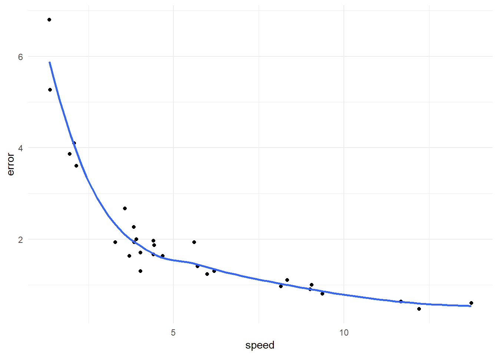
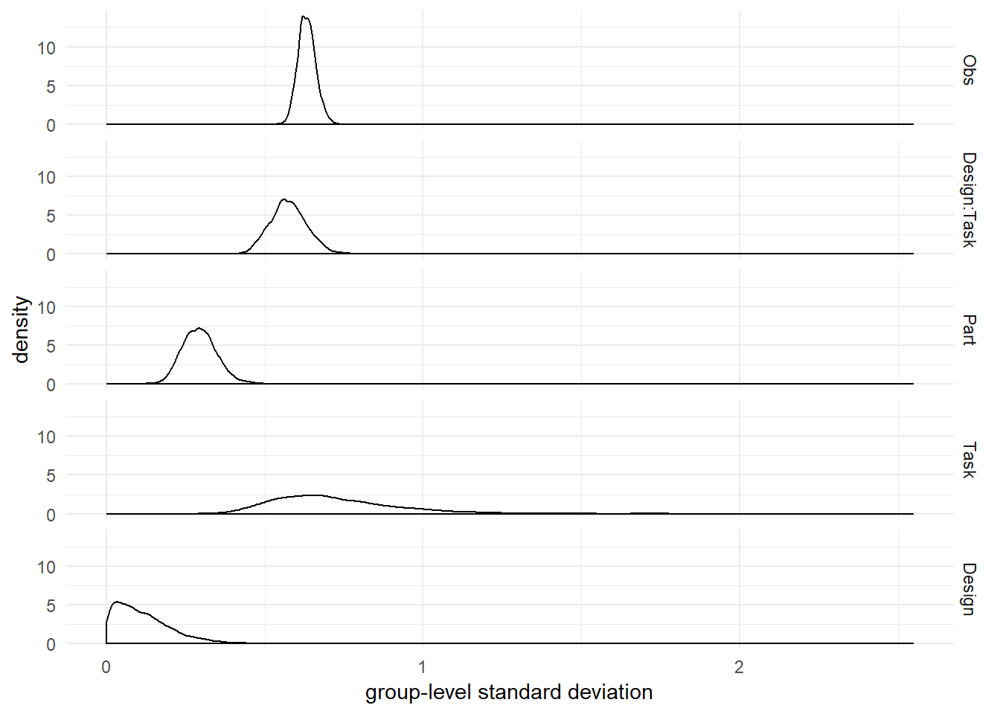
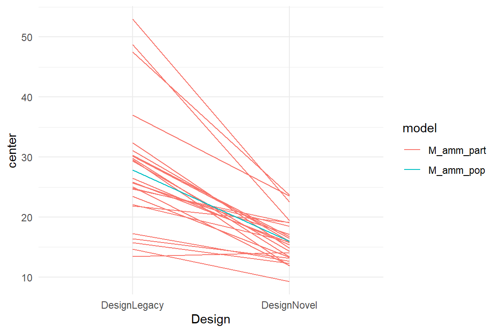

# Multilevel models {#multilevel-models}


In the previous chapters we have seen several examples of differential design effects: groups of users responding differently to design conditions, such as font size, noise and emerging technology. Dealing with differential design effects seems straight forward: identify the relevant property, record it and add an interaction effect to the model. Identifying the relevant property is, in fact, a catch-22: how would you know what is relevant before you have conducted the research,  actually. Researchers routinely record basic demographic properties such as age and gender, but these frequently show little effects, or the effects are obvious, i.e. not interesting. In addition, such predictors are rarely more than approximations of the properties that make the difference, really. Older people have weaker vision *by tendency*, but the individual differences in any age group are immense. Boys tend to be more technophile, but there exist some real geek girls, too.

Identifying properties that matter upfront requires careful review of past research or deep theorizing, and even then it remains guesswork. Presumably, hundreds of studies attempted to explain differences in usage patterns or performance by all sorts of psychological predictors, with often limited results. That is a big problem in design research, as variation in performance can be huge and good predictors are urgently needed. Identifying the mental origins of being fast versus slow, or motivated versus bored, is extremely useful to improve the design of systems to be more inclusive or engaging.

As we will see in this chapter, individual differences can be accounted for and measured accurately without any theoretically derived predictors. For researchers trained in experimental social sciences it may require a bit of Zen to let go of theory-driven reasoning, as it is always tempting to ask for the *why*. But in applied evaluation  studies, what we often really need to know is by *how much* users vary. The key to measuring variation in a population is to create models that operate on the level of participants, in addition to the population level, for example

+ on population level, users prefer design B over A on average ($\beta_1 = 20$)
+ on the participant-level, participant $i$ preferred B over A ($\beta_{1i} = 20$), $j$ preferred A over B ($\beta_{1j} = -5$), ...

See how on the participant level, everyone gets their own estimate for preference ($\beta_{1\cdot}$). The key to estimating individual parameters is simply to regard participant (`Part`) a grouping variable on its own, and introduce it as a factor to the linear model. As we will see, it is *almost* that easy. The additional idea is that the levels of the factor, hence the individuals, are part of a *population*. While researchers in fundamental social sciences typically ignore individual variation, there is an independent  branch in Psychology called *psychometrics* that deals with precisely that: constructing tests to measuring the individual. Think of IQ tests, which are constructed to have an average of 100, with 67% humans falling in the range 85 - 115. More extreme values become increasingly infrequent. From this perspective, it becomes clear what a population is: a set of entities that do vary but clump around a typical value. These two simple ideas, participants are factors, too, and are part of a population, form what is commonly called *random factors*: a factor where levels are drawn from an overarching distribution, usually the Gaussian. This distribution is estimated simultaneously to the individual parameters ($\beta_{1\cdot}$), which has some interesting consequences, as we will see when discussing shrinkage.

Typically, fixed and random effects appear together in a linear mixed-effects model. As we will see, it depends on the research question whether the researcher capitalizes on the participant-level effects, the average outcome or the variation in the population. As we will also see, the idea of random effects transfers with grace to *non-human populations*, such as designs or questionnaire items. But, first, let me give you an illustration, why caring for individual differences is not just an added value, that you may take or leave, but a necessary perspective to avoid severely wrong conclusions.


## Average? Neverage!

Many studies in design research pretend that all users are alike. This borrowed from experimental social science research. Seminal studies in cognitive psychology and social psychology claim mental structures or processes that hold for all humans. That is the very paradigm of fundamental psychology and many researchers ground their theorizing and experimentation on it. And indeed, several properties of human information processing have been replicated under such diverse conditions that one can assume that they are general. For example, the Stroop observation has been observed a hundred times in various population subgroups [REF], situations [REF] and variations.

The treatments in such experiments can be simplistic to an extreme. Often, participants are asked to respond to colored geometric shapes that light up on a black background by simple key presses. This is called *reductionism* and it has lead to at least some insights how the human mind works. As much as  design researchers should draw upon psychological theory, as little useful the reductionist paradigm is, as designs must work in real world situations, often in many different ones, and highly controlled lab experiments just bear to little resemblance to the real world. In particular, by no means can we expect all usersalike to one or more designs. Their minds are complex, too, obscure and unpredictable besides.

> Our minds are not run as top - down dictatorships; they are rambunctious parliaments, populated by squabbling factions and caucuses, with much more going on beneath the surface than our conscious awareness ever accesses.
(Carroll, Sean. The Big Picture (Kindle Locations 5029-5031). Oneworld Publications. Kindle Edition.)


Let me get it straight: People differ! If you plan to move from design A to B, or any other design choice, its is a good idea to also regard how much people vary. If your research question refers to any mental process or its change, the only solid way is to observe how one-and-the-same individuals behave on all conditions. That means within-subject designs should be the rule, not the exception. In contrast, doing a between-subject design is a potential mistake and requires good justification. The following case illustrates how terribly things can go wrong, when within-subject processes are examined in a between-subject manner:

Imagine you set out to determine the association between typing speed and errors. It is common sense that quality decreases with speed, so a positive correlation is expected. During the epxeriment, participants get a number of texts to type. With the first trial they are instructed to type at a relaxed speed. With every further trial they were asked to type slightly faster than at the trial before. The expectation is that

> The faster a person types, the more errors occur

In terms of statistical skills, the researcher is familiar with linear models, and is aware of the fact, that these may not be applied for repeated measures. Therefore our researcher first averages the scores across participants and receives a data set with a neat 30 data points, one per trial. A first exploratory plot reveals a bizarre relation: it seems that the faster participants type, the less error they make. That is completely against expectations, as there almost always is a trade-off between speed and accuracy.


```r
attach(Typing)

Type_1_avg %>% 
  ggplot(aes(x = speed,
             y = error)) +
  geom_point() +
  geom_smooth(se = F)
```



Could it be true that the faster a person types, the less errors happen? Of course not. The problem is how precisely we ask the question. When averaging over persons, we actually answer a different question, which is on a *population-level*: Do persons who can type faster make fewer errors? This question sees every person as one data point with two performance measures, speed and errors, both representing the ability to type. Now, the above results make more sense: people, who are trained in typing are at the same time fast and more accurate. But, what the experiment was out for is the trade-off between speed and accuracy *within a person*. The experiment provokes this trade-off by asking the same person to accelerate in typing. And, when we visualize the results on an individual level, the speed-accuracy trade-off becomes immediately visible:


```r
Type_1 %>% 
  ggplot(aes(x = speed,
             y = error,
             group = Part)) +
  geom_point() +
  geom_smooth(se = F, method = "lm", aes(col = "within participant")) +
  geom_smooth(data = Type_1_avg, 
              aes(col = "between participant", x = speed, y = error, group = NA), 
              se = F, method = "lm")
```


```r
detach(Typing)
```


The example here is constructed to be extreme: the population-level effect has the opposite direction of individual level effects. However, the situation is fully plausible and points us to an important principle: Whenever a research question capitalizes on a change in mental state or behaviour, the only solid way  to research is a within-subject design. Therefore again: treating averaged data as if it represents within-persons changes is a severe mistake. In the A/B case, for example, one must always be clear about the level. Is it true that 

+ on average, users prefer B over A?
+ or all users individually prefer B over A?

The bizzare situation with the Typing study will have to wait, because we will need all elements of multilevel modelling to resolve it. However, the figure above features the core elements of mutlilevel models:

+ persons have different levels for errors at relaxed typing (varying intercepts)
+ persons differ in how much the error frequency goes up with speed (varying slopes)
+ the better a person performs at relaxed typing, the stronger the number of errors goes up when the person types faster (correlated ramdom effects)


## The Human Factor: Intercept random effects

Design science fundamentally deals with interaction between  systems and humans. Every measure we take in a design study is an encounter of an individual with a system. As people differ in almost every aspect, it is likely that people differ in how they use a system. In the previous chapter we have already dealt with differences between users: in the BrowsingAB case, we compared two designs in how inclusive they are with respect to elderly users. The data set included further variables, education and gender, that may help to predict performance.

Imagine, you had gathered no predictors at all and observed massive amount of variation in performance. It is reasonable to assume that much of this variation stems from individual differences. That, in turn would mean that a fraction of users perform extremely well, whereas many users fail miserably.  If that were true,  you would give the advice to invest into redesign that is more inclusive, ironing out the differences, would you not? To make your point, you had to prove that individual differences are the main source of variation. 

At first, one might think that the grand mean model would do, take $\beta_0$ as the population mean and $\sigma$ as a measure for individual variation. Unfortunately, it is not valid to take the residual variance as variance between individuals, the reason being that random variation captured by $\sigma$ is composed of multiple sources, in particular:

+ inter-individual variation
+ intra-individual variation, e.g. by different levels of energy over the day
+ variations in situations, e.g. responsiveness of website
+ inaccuracy of measures

What is needed, is a way to separate the variation of participants from the rest. Reconsider the principles of model formulations: the likelihood captures what is repeatable, what does not repeat goes to the random term. For the problem of identifying individual differences, we simply apply this principle: to pull out a factor from the random term, repetition is needed. For estimating users' individual performance level, all that is needed is repeated measures.

Imagine, a pre-study to BrowsingAB was done on the existing design A. Data was gathered in live operation of the website. Real users were tracked on eight tasks. While it was possible to identify the task a user was on and identity of users could be tracked, too. However, as a consequence of privacy protection not a single demographic variable could be gathered. With the simulation function of the BrowsingAB case environment we generate a new data set `SOV` (sources of variance), reduce it to design A and remove all predictors.


```r
attach(BrowsingAB)
```

```r
n_Part = 25
n_Task = 8
n_Obs = n_Part * n_Task


SOV <-
simulate(n_Part, n_Task) %>% 
filter(Design == "A") %>% 
select(Obs, Part, Task, ToT) %>% 
  as_tbl_obs()
```

We start with some data exploration. The first question we can ask is:

> What is the average ToT in the population?


```r
SOV %>% 
summarize(mean_Pop = mean(ToT)) %>% 
  kable()
```


| mean_Pop|
|--------:|
|      146|

This question is rather global and does not refer to any individuals in the population. The following question does:

> What is the average ToT of individual participants?


```r
SOV %>% 
group_by(Part) %>% 
summarize(mean_Part = mean(ToT)) %>% 
  sample_n(5) %>% 
  kable()
```


Part    mean_Part
-----  ----------
7             145
14            101
6             128
22            127
12            148

This question differs in that it is *grouped* by participant. Now, that we have the individual means, we can plot the variation in task performance. For comparison, the overall variation is added to the plot. It is apparent that individual differences make only part of the overall variance.


```r
G_sources_variation <-
  SOV %>% 
  group_by(Part) %>% 
  summarize(mean_Part = mean(ToT)) %>% 
  ungroup() %>% 
  ggplot(aes(x = mean_Part)) +
  geom_density(data = SOV, aes(x = ToT, y=..scaled.., 
                               fill = "total"),alpha = 1/2) +
  geom_density(aes(fill = "user", y=..scaled..),alpha = 1/2) +
  labs(fill = "Variation")
G_sources_variation
```


```r
detach(BrowsingAB)
```


Above, we have claimed that our data set is bare of predictors. Is it? The variable `Part` groups observations by participant identity and therefore is a plain factor. If we can compute user means like above, what keeps us from adding a factor, like:

`SOV ~ 1 + Part`

While formally, a participant is just a group of observations, there is one apparent, one practical and one subtle difference compared to factors as we know them so far. The apparent difference is that before we had just very few levels and many observations. With participants we had to estimate dozens or hundreds of coefficients with just very few observations per level. In consequence, the posterior distribution will become spread out like butter on a toast and certainty will be abysmal. The practical difference is that, while we are interested in the overall variation, the ability of individual users is rather uninteresting. We actually have no use for dozens of user ability scores. The subtle difference is that users form a population. That sounds rather obviuous than subtle, but is key for the solution once we understand what being *member of a population* means, statistically. I will give a brief account here and return to the topic in a later section.

Imagine the following situation: you are seated in a university bistro and you get the task to guess the intelligence quotient of every person entering the bistro. After every trial you are disclosed  the real IQ of the person. You know that the average IQ is 100 and you give a bonus of 5 owing to the fact it is at a university. The first five persons have the IQs:


```r
IQ <- c(106, 108, 103, 115, 110)
```

It seems the bonus of five is an understatement and the average is closer to 110. You adjust your best guess accordingly. That sounds trivial, but for the specification of a regression model it is not. The crucial point is that any guess $k$ depends on the information you received on trials $1...(k-1)$. Review the model formulation for comparison of means models. There is nothing in the linear term  that transfers information between levels of factors. The group means are estimated in complete independence.  

The key is is that participants are *members of a population*. In a reasonably large population, extremes such as an IQ of 160 will eventually happen, but they are very unlikely. by far most people, roughly two thirds, are clumped together in the range 85 to 115. Imagine you are travelling to an African country you have never heard of before. Africa  has the richest gene pool of all and ethnicies differ a lot in tallness and skin tone. Once you have left the plane and saw a few people, you get an impression of how tall and dark people are in this place. The same principle holds for human attributes or capabilities in design research. Having seen a bunch of participants completing a task between two and five minutes gives a best guess for the next particiant. It is not excluded that this person will need 25 minutes or 20 seconds  for the task, but it is less likely.

Factors where the individual levels vary, but are more or less clumped around a population mean are best modelled as *random factors* and the individual levels are called *random effects*. Random effects enter the likelihood of the linear model specification in a similar additive way as fixed effects. The difference is that the levels are assumed to stem from a normal distribution, which represents the clumping. The mean of this distribution is zero, similar to the distribution of residuals, but the standard deviation of this distribution, representing the amount of variation in the population, is *estimated alongside* the individual levels. 

For the pre-study we have simulated above we can formulate a GM model with participant-level random effect $\beta_{p0}$ as follows:

$$
\mu_i = \beta_0 + x_p\beta_{p0}\\
\beta_{p0} \sim N(0, \sigma_{p0})\\
y_i \sim N(\mu_i, \sigma_\epsilon)
$$

There will be as many parameters $\beta_{p0}$, as there were users in the sample, and they have all become part of the likelihood. The second term describes the distribution of the levels. And finally, there is the usual random term. Before we examine further features of the model, let's run it. In the package `rstanarm`, the command `stan_glmer()` is dedicated to estimate mixed-effects models with the extended formula syntax. 


```r
attach(BrowsingAB)
```


```r
M_1_SOV <- stan_glmer(ToT ~ 1 + (1|Part), data = SOV)
P_1_SOV <- posterior(M_1_SOV)
```


The posterior of the mixed-effects  model contains four types of variables: 

1. the *fixed effect* captures the population average (Intercept)
1. *random effects* capture how individual participants deviate from the population mean
1. *random factor variation* (or group effects) captures the overall variation in the population.
1. the residual standard deviation captures the amount of noise


With the `bayr` package these parameters can be extracted using the respective commands:


```r
fixef(P_1_SOV)
```


Table: (\#tab:unnamed-chunk-5)Estimates with 95% credibility limits

```r
# ranef(P_1_SOV) # a long list
grpef(P_1_SOV)
```


Table: (\#tab:unnamed-chunk-5)Estimates with 95% credibility limits


Random effects are factors and enter the model formula just as linear terms. What sets them apart, is that they are estimated together with the overarching Gaussian distribution. To indicate that to the regression engine, a dedicated syntax is used in the model formula (recall that `1` represents the intercept parameter):

`(1|Part)`

In probability  theory expressions, such as famous Bayes theorem, the `|` symbol means that something to the left is conditional on something to the right. Random effects can easily be conceived  as such conditional effects. Left of the `|` is the fixed effects that is conditional on (i.e. varies by) the factor to the right. In the simplest form the varying effect is the intercept and in the case here could be spoken of as:

> ToT depends on the participant you are looking at

Speaking of factors: so far, we have used *treatment contrasts* most of the time, which represent the difference towards a reference level. Analogue to a factor model, we could estimate the first participants performance level and make it the reference group, intercept $\beta_0$. All other average scores, we would express as differences to the reference participant. This seems odd and, indeed, has two disadvantages: first, whom are we to select as the reference participant? The choice would be arbitrary, unless we wanted to compare brain sizes against the gray matter of Albert Einstein, perhaps. Second, most of the time the researcher is after the factor variation rather than differences between any two individuals, which is inconvenient to compute from treatment contrasts. 

The solution is to use a different contrast coding for random factors: *deviation contrasts* represent the individual effects as *difference ($\delta$) towards the population mean*. As the  population mean is represented by the respective fixed effect, we can compute the absolute individual predictions by adding the fixef effect to the random effect:


```r
data_frame(mu_i = ranef(P_1_SOV)$center + 
             fixef(P_1_SOV)$center) %>% 
  ggplot(aes(x = mu_i)) +
  geom_histogram()
```


Finally, we can assess the initial question: is individual differences a significant component of all variation in the experiment? Assessing the impact of variation is not as straight-forward as with fixed effects. One heuristic is to compare it against the residual variance, which is:


```r
T_sov_vc <- coef(P_1_SOV, type = c("grpef", "disp"))
T_sov_vc
```


Table: (\#tab:unnamed-chunk-7)Estimates with 95% credibility limits

parameter                           type    fixef       re_factor    center   lower   upper
----------------------------------  ------  ----------  ----------  -------  ------  ------
sigma_resid                         disp    NA          NA             54.5    49.3    60.9
Sigma[Part:Intercept,(Intercept)]   grpef   Intercept   Part           26.1    15.5    40.4

```r
detach(BrowsingAB)
```

The variation due to individual differences is half of the noise, which is considerable. It seems in order to further investigate of why and how users vary in performance, as this is the key to improving the design for all users.

__Exercises__:


## Designs and other non-human populations

With the introduction of random effects design researchers can make more precise statements about how a design affects the population of users. The population-level average effect gets amended by a measure of variation. Only when this variation is small can one conclude that the effect is homogenous for the whole population. In the  BrowsingAB case, this gives valuable information on how well this particular design serves the population of users and whether one should be satisfied with it or not. This is a typical research question in applied design research where one seeks to choose one from a small set of designs. Generally, A/B studies seek to answer the question: *is one design better for the user population?*. This question has two entities: the user and the design. However, it is not symmetric, as users are provided as a sample from which one wishes to generalize, whereas the two designs are exhaustive. There is the choice between the two and they are both present.

But, that is not all there is in design research. Many studies in, what one could call *fundamental design research* seek to uncover general laws of design that may guide future system development. Fundamental design research is not concerned with choosing between individual designs, whether they are good enough or not, but with seperating the population of possible designs into good ones and the bad. A/B studies, as we know them, are not adequate to answer such questions, simply because there is no reasonable way to generalize from a sample of two to all possible designs. This would only be possible under one strict constraint: the design property in question, let's say font size, must be the only property where A and B differ. Under this constraint,  the population of designs is exactly all designs that are constant except for font size. It is left to the reader to contemplate why that is of little value.

If the research question is fundamental, aiming at general conclusions on design, it is almost inevitable to test it on a larger sample of designs. Once we start speaking about samples of designs, there must be a *population of designs*, too. The term population suggests a larger set of entities, and in fact many application domains have an abundance of existing designs and a universe of possible designs. Just to name a few: there exist dozens of note taking apps for mobile devices and hundreds of [...]. Several classes of websites count thousands of members, such as webshops and municipal websites. 

Even in highly standardized domains such as automotive cockpits the differences between generations, manufacturers and models are noticable to be called individuals from a population. That is precisely the idea of a random effect: entities vary around a clump of commonalities. In consequence, when testing a fundamental design rule, like *large fonts are better to read*, the proposed research strategy is to sample from the population of websites, classify sample members by font size, and test every design with a sample of users. Given our definition of random effects it is easy to see that the regression model will contain two random effects (at least), one across users, the other across websites. More on that later.

It does not stop here. While design research is clearly about the user-design encounter, other research entities exist that we could call a population. The most routinely used *non-human populations* in design research, besides *designs*, are *tasks*, *situations* and *questionnaire items*. We briefly characterize  the latter three and proceed to a case study that employs three population at once.

*Tasks:* Modern informational websites contain thousands of information pieces and finding every one of those can be considered a task. At the same time, it is impossible to cover them all in one study, such that sampling a few is inevitable.  We will never be able to tell the performance of every task, but using random effects, it is possible to estimate the variance of tasks. Is that valuable information? Probably it is in many cases, as we would not easily accept a design that prioritizes on a few items at the expense of many others, which are extremely hard to find.

*Situations:* With the emerge of the web, practically everyone started using computers to find any  information. With the more recent break through in mobile computing, everyone is doing everything using a computer in almost every situation. People chat, listen to music and play games during meals, classes and while watching television. They let themselves being lulled into sleep, which is tracked and interrupted by smart alarms. Smartphones are being used on trains, while driving cars and bikes, however dangerous that might be, and not even the most private situations are spared. Does the usability of messaging, navigation and e-commerce apps generalize across situations? Again, a study to examine performance across situations would best sample from a population of situations.

*Questionnaire items:* Most design researchers cannot refrain from using questionnaires to evaluate certain aspects of their designs. I do not refrain from being very critical about that, however: a well constructed scale (which unfortunately is rather rule than exception in design research) consists of a set of items that trigger similar responses. At the same time, it is desireable that items are unsimilar to a degree, as that establishes good discrimination across a wide range. In ability tests, for example to assess people's intelligence or math skills, test items are constructed to vary in difficulty. The more ability a person has, the more likely will a very difficult item be solved correctly. In design research, rating scales cover concepts such as perceived mental workload, perceived usability, beauty or trustworthiness. Items of such scales differ in how extreme the proposition is, like the following three items that could belong to a scale for aesthetic perception:

1. The design is not particularly ugly.
2. The design is pretty.
3. The design is a piece of art.

For any design it is rather difficult to get a positive response on item 3, whereas item 1 is little of a hurdle. So, if one thinks of all possible propositions about beauty, any scale is composed of a sample from the population of beauty propositions.


If we look beyond design research, an abundance of non-human populations can be found in other research disciplines, such as:

* phonemes in psycholinguistics
* test items in a psychometrics
* pictures of faces in face recognition research
* products in consumer research
* patches of land in agricultural studies
* flowers in biology

However, most of the time these one or two of these populations are involved at once, whereas in design research the encounter of three is rather typical, and not even the limit, as we will see in the following case study


## Crossover: Testing Egans assumption {#crossover}

In design research, the encounter of users and designs is almost inevitable. All sampling schemes with an encounter of otherwise independent populations produce so called *cross-classified random effects* (CRE). Random effects, that is the individual entities in the sample, are usually of lesser interest, but the group-level variation is a natural measure of diversity in the sample. When performance is diverse, we gain little faith that the situation serves all users well. 

But, is variance in performance due to diversity of users, necessarily? At least this is what Dennis Egan claimed almost three decades ago:

> ‘differences among people usually account for much more variability in performance than differences in system designs’ [^1]

[^1]: Egan, D. Individual differences in human-computer
interaction. In M. Helander, ed., Handbook of Human Computer interaction. Elsevier Science Publishers, Amsterdam, The Netherlands, 1988, 543–568.

This claim has been cited in many papers that regarded individual differences. We were wondering how it would turn out in the third millenium, with the probably most abundant of all application domains: informational websites. For the convenience, we chose the very accessible user population of student users. The design population consisted of ten unversity websites, and ten representative tasks on those were selected. During the experiment, every one of 41 participants completed 10 information search items, being of the folling form:

> On website [utwente.nl] find the program schedule [Biology].

As this is a real study, there is some inconvenience ahead. Most synthetic case studies so far have outcome measures that are too good to be true. Recall that the distribution of residuals is assumed to be Gaussian in linear regression models. Unfortunately, that is not how the noise of time-on-task measures and other "temporal" variables is shaped, frequently. The cheap trick of *log transformation* often serves the purpose when not much is at stake. A more disciplined approach to work with time variables is given in [GLM - Time variables].


```r
attach(Egan)
```


```r
D_egan <- D_egan %>% mutate(logToT = log(ToT))
D_egan %>% as_tbl_obs()
```


Table: (\#tab:unnamed-chunk-11)Data set: showing 8 of 410 observations

 Obs   Part  Gender    age   trial  Design               Task                              success    ToT   clicks   returns_hp   return_links   workload   logToT
----  -----  -------  ----  ------  -------------------  --------------------------------  --------  ----  -------  -----------  -------------  ---------  -------
 391      6  woman      23       5  Erasmus University   student psychologist              TRUE        61        4            0              0       3.50     4.11
  82      8  man        22       6  VU Brussel           schedules                         TRUE        89        7            1              0       3.00     4.49
 392     12  man        24       4  Erasmus University   student psychologist              TRUE        74        3            0              0       3.50     4.30
  11     17  woman      21      10  UGent                number of libraries               TRUE        16        2            0              0       2.50     2.77
 266     28  woman      20       4  UHasselt             ombudsperson or complaints desk   FALSE       70        2            0              0       2.50     4.25
  64     30  man        22       6  Erasmus University   number of faculties               TRUE         6        1            0              0       3.25     1.79
 172     32  man        23      10  KU Leuven            opening hours library             TRUE        61        4            0              0       4.00     4.11
 250     39  woman      21       4  VU Brussel           ombudsperson or complaints desk   TRUE        99        6            2              0       3.25     4.59


The study originally gathered demographic data and even design features, but for the question of which population varies the most, they are of no further interest. The basic factors in the study were exclusively from human and non-human populations. The latter consisted of designs and tasks in the first place. However, a fourth non-human population has been added: after all, participants get items, which are pairs of tasks and websites. Only seemingly redundant, items will enter the model as a separate random effect. Similar to interaction effects, it may not hold that a task has the same difficulty on every website, and a particular website may present one task in an accessible way, but hide another. The following grid of histogram shows a graphical approximation of the  distribution of human and non-human populations. The individual plots were created using the following code:


```r
  D_egan %>% 
    group_by(Part) %>%
    summarize(avg_logToT = mean(logToT)) %>% 
    ggplot(aes(x = avg_logToT)) +
    geom_histogram() +
    labs(title = "distribution of participant average log-times") +
    xlim(1.5,6.5)
```


There seems to be substantial variation between participants, tasks and items, but very little variation in designs. We build a GMM for the encounter of the four populations.

$$
\mu_i = \beta_0 + x_{Pi}\beta_{P} + x_{Di}\beta_{D} + x_{Ti}\beta_{T} + x_{D:Ti}\beta_{D:T}\\
\beta_{P} \sim N(0, \sigma_{P}) \\
\beta_{D} \sim N(0, \sigma_{D}) \\
\beta_{T} \sim N(0, \sigma_{T}) \\
\beta_{DxT} \sim N(0, \sigma_{DxT})\\
y_i \sim N(\mu, \sigma_\epsilon)$$


```r
M_1 <- D_egan %>% 
  stan_glmer(logToT ~ 1 + (1|Part) + (1|Design) + (1|Task) + (1|Design:Task),data = .)

P_1 <-  posterior(M_1)
```


The group-level variations are recorded as standard deviations and in Bayesian estimation framework, such variance parameters have their posterior distributions like any other. While the `grpef` command would conveniently extract a summary of the posteriors, here we choose to get in full contact with the posteriors. In contrast to the linear coefficients, variance parameters are bounded at zero. For this reason, it usually makes little sense to ask whether there is possibly zero variance in a random effect. But, to answer our question, we should rather compare the posterior distributions of all $\sigma_.$, including the error term (Obs).


```r
P_1 %>% 
  filter(type == "grpef"  | type == "disp") %>% 
  mutate(re_factor = if_else(type == "disp", "Obs", re_factor)) %>% 
  arrange(order) %>% 
  mutate(re_factor = forcats::fct_inorder(re_factor)) %>% 
  ggplot(aes(x = value)) +
  geom_density() +
  labs(x = "group-level standard deviation") +
  facet_grid(re_factor~.)
```



Before we formally evaluate Egan's claim, there are a few noteworthy remarks on how to read the posteriors, when the parameter is a group-level standard deviation. First, standard deviation is on the same scale as the measured variable. Usually, this makes standard deviations  rather intuitive to interpret. This is, *unless* you have obscured your variable by log transformation, which is the major disadvantage of this procedure. Second, the posterior graph is too easily misinterpreted by confusing the posterior distribution for the group-level distribution. Instead, the amount of variation in a random factor is reflected by the location on the x-axis, while the spread is uncertainty. The population of designs seems to have the lowest variation of all, with users being close second. The observation-level variation (Obs) is nothing but the standard error, $\sigma_\epsilon$. The observation-level variation sometimes serves well as a reference point to make quantitative statements on variation. For example, there is little confirmation for an overwhelming "users differ!" in this particular study, as there is much more variation from one situation to the other than between participants. A third observation on the posterior plot is that some posteriors are rather certain, e.g. Obs, whereas others are extremely uncertain, especially task-level variation. There is a pattern to explain this: uncertainty of group-level variation estimates heavily depends on sample size from the respective population. Design and Task have a meager $N = 10$, which is why there is so much uncertainty. At the other extreme, every single one of the 410 observations contributes to estimation of $\sigma_\textrm{Obs}$, resulting in a rather certain estimate.

All interaction effects are potential assaults on generalizability and so are items (`Design:Task`). Without this interaction effect, the model would assume that all ten tasks had the same relative difficulty regardless of the website. And the same goes for website. Given the countless possibilities to structure information on a website, this is a bold assumption. It were as if all ten information architects had previously agreed on how well to support any of the tasks. And, as the results show, there is substantial conditional variation, information architects do not fully agree. Regarding the interpretation, the question is: are we willing to add the *conditional* design effects under what Egan called "designs", or can only complete websites be called designs, with everything underneath being singular forces that amplify of erase each other? This depends on whether you are an optimist or realist designer. The realist thinks that design is a wicked problem science, where a good design a bunch of reasonable compromises, but is never maximum. You may use large fonts to improve reading speed, but that comes at more scrolling time. You may choose to place an awesome video presentation of your university on its homepage, but you are using costly real estate you could use for other frequently used information. In such a view, a design is a set of carefully calibrated trade-offs and must therefore be taken as a whole. 

We proceed with a formal check of Egans claim. It can be stated as: is the random effect variation of users larger than variation of designs, $\sigma_ \textrm{Part} > \sigma_ \textrm{Design}$. One might be tempted to somehow refer to the figure above and evaluate how much the two posterior distributions overlap. It is much easier than that. Recall, that the joint posterior distribution covers all parameters simultaneously at every MCMC draw. Usually, we evaluate the marginal posterior of one parameter at a time for inference. But, it is equally valid to derive further quantities at every MCMC draw and make inference. In the present case, this quantity is a variable with two states: either Egan's claim holds, or it does not. The marginal posterior of such a logical variable is of type Bernoulli, capturing the proportion of MCMC draws, where $\sigma_ \textrm{Part} > \sigma_ \textrm{Design}$ holds.


```r
C_Egan_is_right <-
  P_1 %>% 
  filter(type == "grpef", re_factor %in% c("Part", "Design")) %>% 
  select(chain, iter, re_factor, value) %>% 
  spread(re_factor, value) %>% 
  summarize(Prop_Egan_is_right = mean(Part > Design)) %>%
  c()

C_Egan_is_right
```

```
## $Prop_Egan_is_right
## [1] 0.944
```
A chance of $0.944$ can count as good evidence in favor of Egan's claim, although it is outshined by other factors, as we have discussed above. 

In this case study we have illustrated a number of useful concepts in design research:

1. Design research deals with samples of several human and non-human populations at once. Cross-classified random effects models capture these structures.
1. Group-level standard deviations are captured by the posterior in much the same manner as linear coefficients. The only difference being that they are bounded to zero, which makes null hypothesis useless and can lead to strongly skewed marginal posteriors. 
1. When testing Egan's claim, we saw how an exotic hypothesis can easily be answered through deriving further quantities from the joint posterior. The same technique we have previously employed to find the troughs in te uncanny valley polynomials.


```r
detach(Egan)
```

## Measuring entities: psychometric applications [TBC]

Traditionally, psychometrics deals with the valid and reliable measurement of person characteristics, such as individual levels of performance, motivation, socio-cognitive attitude and the like. Advanced statistical models have been devised, such as confirmatory factor analysis or item response models. Formally, these applications establish an order among population entities, from low to high. The least one is aiming for is that for any pair of entities $A$ and $B$, we can tell which entity has the more pronounced property. This is called an *ordering structure*. Few applications even go beyond mere ranking and establish metric interpretations. For example, in an *interval-scaled* test, the researcher may compare differences between participants.

A psychometric test usually contains several items. For example, a test to measure a child's arithmetic skills would contain a set of arithmetic problems and a simple test score would be the number of correctly answered items. In design research, self-report questionnaires are routinely used for one of two purposes: first, research questions sometimes involve traits or abilities of users. For example, one could ask how a persons visual-spatial abilities are related to navigation performance, be it in a complex hypertext environment, body cavities during surgical procedures or the scattered displays in air traffic control centers. The researcher would then administer two tests: an innate ability test, such as a mental rotation task and a performance test on, let's say, the surgical procedure. This is just twice the standard psychometric procedure. Second, in design research one frequently assesses properties of a design by using standardized questionnaires. One example would be the comparison of user experience among a set of e-commerce homepages using scales such as the AttrakDiff (the hedonic dimension). Another example would be to map the uncanny valley effect by letting participants judge a set of artificial faces with a scale to measure eeriness.

We begin with the first case, standard psychometrics to assess user characteristics. A well designed test always employs a set of items. The primary reason for multiple items is a familiar one. In classical test theory, the observed test score $y_i$ for participant $i$ is assumed to be composed of the the true score $\mu_i$ and the measurment error  $\epsilon_i$ as:

$$y_i = \mu_i + \epsilon_i$$
The same principle holds as for linear models: the researchers aim is to separate $\mu_i$ from $\epsilon_i$ and that is only possible if there is repeated measures.

In our terminology, psychometric models are the encounter of persons and test items. With only two populations involved, the standard psychometric model is a crossover of person and item random affects, a simplification of the quadrupel crossover encountered in the Egan study. What sets psychometric models apart is how random effects are being used. While in the Egan study inference was based on the population-level distribution, i.e. $\sigma_\cdot$, in psychometrics applications one is interested in the individual scores. If we wanted to compare two individuals, e.g. which of the two is more likely to become the better surgeon based on some ability test,  we need individual scores and that is precisely what random effects are on their lowest level. 

[semantic Stroop]


Measuring participant performance is a useful application in some design research fields, such as human performance in  critical systems, e.g. identify persons with the best talent for being an airspace controller. However, in design research, it is frequently designs that are to be compared. For example, in the Egan case, one might be interested to select the best of the ten website designs, in order to use it as a blueprint. Such a research question is no longer psychometric, literally, but formally the only difference is that participants can be considered test items, rather than test objects. At least, when using ramdom effects for psychometric purposes, there is nothing special about the participant random effects compared to design random effects. Let's pretend we had conducted the stufy in order to identify a good template for university websites. The following code extracts design random effects posteriors, summarizes them in the usual way and plots.


```r
attach(Egan)

ranef(P_1) %>% 
  filter(re_factor == "Design") %>%
  rename(Design = re_entity) %>% 
  ggplot(aes(x = Design, y = center, ymax = upper, ymin = lower)) +
  geom_point(size = 1) +
  geom_crossbar() +
  ylab("log ToT") +
  theme(axis.text.x = element_text(angle = 45))
```


The most simple form is the Rasch model in IRT, where participants respond to a set of items and the response is either correct or wrong. The outcome variable response is usually coded as 0 = wrong and 1 = correct. Apparently, such a variable does nowhere near satisfy the assumption of linear models. It turns out that the Rasch model can be interpreted as a cross-classified random effects in a *logistic regression* \@ref(logistic_regression). Logistic regression is a member of the General*ized* Linear family of models, which will be introduced in the next chapter.

As innocent as the Egan study seems, there is some psychometrics involved.  First, cognitive workload was measured using the NASA TLX questionnaire which has four items. With four items, we would hardly want to speak of a population. The trick is to view the four items as instantiations from all a virtual set of possible questions (on that matter). A typical question in psychometric research is that of *item consistency*, which for a small set of items can be measured by the correlation between items. Inter-item correlations indicate that a scale is reliable, which basically means it predicts well. Item correlations are mainly used during scale development, as a criterion to sort out renegade items, those that do not move in accordance with the others.


```r
detach(Egan)
```

## Nested random effects

*Nested random effects* (NRE) represent nested sampling schemes. A classic example from school research is: a sample of schools is drawn and inside every school a sample of students is selected. Like cross-classified models, nested models consist of multiple levels. The difference is that if one knows the lowest (or: a lower) level of an observation, the next higher level is unambiguous, like:

+ every student is in exactly one class
+ every participant is from exactly one professional group

As we have seen above, cross-classified models play a primary role in design research, due to the user/task/design encounter. NRE are more common in research disciplines where organisation structures or geography plays a role, such as education science (think of the international school comparison studies PISA and TIMMS), organisational psychology or political science.

One case of a nested sampling structures are some of the Comparative Usability Evaluation (CUE) studies, pioneered by Rolf Molich [CUE8]. Different to what the name might suggest, not designs are under investigation in CUE, but usability professionals. The over-arching question in the CUE series is the performance and reliability of usability professionals. Earlier studies sometimes came to devastating results regarding consistency across professional groups when it comes to identifying and reporting usability problems. We always knew, qualitative analysis is much harder to do in an objective way, didn't we? The CUE8 study lowered the bar, by asking whether several professional groups are able to arrive at consistent measures for time-on-task.

The CUE8 study measured time-on-task in usability tests, which had been conducted by 14 different teams. The original research question was: how reliable are time-on-task measures across teams? All teams were responsible for recruiting their own sample of participants. The nested sampling scheme is therefore: every participant is assigned to exactly one team. The original analysis [CUE8] focussed on the consistency across teams. Using hierarchical random effects, we can extend the analysis. Conjsider the research question: strong systematic variation between teams is considered a sign of low reliability in the field. But, how strong is strong? It is difficult to come up with an absolute standard for inter-team reliability. Again, we can resort to a relative standard: how does the variation between teams compare to variation between individual participants?

Under this perspective, we examine the data. This time, we have real time-on-task data and as so often, it is highly skewed. Again, we use a cheap trick of logarithmic transformation to obtain more symmetric distribution of residuals. The downside is that the outcome variable may not be zero. For time-on-task data this is not an issue. In fact, the original CUE8 data set contains several observations with unrealistically low times. Before proceeding to the model, exploring the original variable `ToT` on the two levels is in order. The mean ToT is computed for the two random effect levels, participants and teams and plotted in that order.


```r
attach(CUE8)

D_cue8
```


Table: (\#tab:CUE8_eda)Data set: showing 8 of 2620 observations

  Obs  Team   Part   Condition      SUS  Task    ToT   logToT
-----  -----  -----  ----------  ------  -----  ----  -------
  140  B3     28     moderated     87.5  5       120     4.79
  303  D3     61     remote          NA  3        80     4.38
  377  E3     76     moderated       NA  2        91     4.51
  440  F3     88     remote          NA  5       280     5.63
  956  K3     192    moderated     97.5  1       611     6.42
 1511  L3     303    remote        80.0  1       111     4.71
 1897  L3     380    remote       100.0  2        79     4.37
 2416  M3     484    remote        55.0  1       289     5.67

```r
D_part_mean <-
  D_cue8 %>% 
  group_by(Part, Condition) %>% 
  summarize(mean_ToT = mean(ToT), na.rm = T,
            n_Obs = n()) %>%   
  ungroup() %>% 
  rename(Unit = Part) %>% 
  mutate(percentile = percent_rank(mean_ToT),
         Level = "Part")

D_team_mean <-
  D_cue8 %>% 
  group_by(Team, Condition) %>% 
  summarize(mean_ToT = mean(ToT, na.rm = T),
            n_Obs = n()) %>%
  ungroup() %>% 
  rename(Unit = Team) %>% 
  mutate(percentile = percent_rank(mean_ToT),
         Level = "Team")

D_task_mean <-
  D_cue8 %>% 
  group_by(Task, Condition) %>% 
  summarize(mean_ToT = mean(ToT, na.rm = T),
            n_Obs = n()) %>%
  ungroup() %>% 
  rename(Unit = Task) %>% 
  mutate(percentile = percent_rank(mean_ToT),
         Level = "Task")


bind_rows(D_team_mean,
          D_part_mean) %>%
  ggplot(aes(x = percentile, 
             y = mean_ToT,
             col = Level,
             shape = Level,
             size = Level)) + 
  geom_point()
```


```r
detach(CUE8)
```

It seems there is ample variation in ToT for participants, with mean ToT ranging from below 100 to almost 500 seconds. There is variation in team-wise ToT, too, although less pronounced. This observation is congruent with the *law of small numbers*, which will be discussed in the following section.

The model is easily specified with the familiar syntax. In fact, it is not even necessary to specify that participants are nested within teams. The only requirement is that participant identifiers are unique across the whole study (not just within a team unit). The model below contains another feature of ths CUE8 study. Participants were tested in one of two conditions: moderated and remote testing sessions. Mixing fixed and random effects, we examine all influences simultaneously.

Note that this treatment is between-subject for participants. There is also just one team that did both conditions. For specifying hierarchical random effects we can use the same syntax as before, *if* all participants have a unique identifier. If the participant identifier is only unique within a team, it is either to be recoded, e.g. `mutate(Part = str_c(Team, Part))`, or one uses the nesting operator `Part/Team`.


```r
attach(CUE8)

M_1 <- 
  D_cue8 %>% 
  stan_lmer(logToT ~ Condition + (1|Part) + (1|Team),
       data = .)

P_1 <- posterior(M_1)

detach(CUE8)
```


After running the model, we compare the sources of variation. Recall, that LMM assume that the ramdom effects are drawn from a normal distribution and the amount of systematic variation is represented by $\sigma$. As this is precisely the way, normal distributed errors are represented, we can actually distinguish three levels of variation: participants, team and observations (residuals). The table below tells that the strongest variation is still on observation-level. Almost the same amount of variation is due to teams. And, surprisingly, the variation due to teams is considerably smaller than participant-level variation.


```r
attach(CUE8)
T_sov <- coef(P_1, type = c("grpef", "disp"))
T_sov
```


Table: (\#tab:tab:CUE8_sov)Estimates with 95% credibility limits

parameter                           type    fixef       re_factor    center   lower   upper
----------------------------------  ------  ----------  ----------  -------  ------  ------
sigma_resid                         disp    NA          NA            0.611   0.592   0.632
Sigma[Part:Intercept,(Intercept)]   grpef   Intercept   Part          0.427   0.388   0.468
Sigma[Team:Intercept,(Intercept)]   grpef   Intercept   Team          0.589   0.405   0.940

 It is hard to deny that, at least for consumer systems, people vary greatly in performance. That is the whole point about universal design. The discordance, between professional teams is concerning. And that arises after controlling for an experimental factor, remote or moderated. By the way, the difference between moderated and remote testing is $0.33 [-0.31, 1.05]_{CI95}$. The fixed effect is rather weak and highly uncertain.


```r
T_fixef <- fixef(P_1)
T_fixef
```


Table: (\#tab:tab:CUE8_fixef)Estimates with 95% credibility limits

fixef                 center    lower   upper
-------------------  -------  -------  ------
Intercept              4.614    4.093    5.10
Conditionmoderated     0.331   -0.311    1.05

```r
detach(CUE8)
```


## What are random effects? On pooling and shrinkage

At least half a dozen of defintions exist for the term random effect. This is so confusing that some authors refrain to use the term altogether. Here the definition is conceptually based on the idea of a population. Technically, it is compatible with the implementation found in `rstanarm` and other engines. Unfortunately, the very terms *random effect* and *random factor* are highly misleading, as there is nothing more or less random in a random factors as compared to fixed factors. The opposite is the case: as we have seen above, a random effects pulls a variance component from the random term and explains it by assigning coefficients to entities (teams or users). The best advice is  to not contemplate over what makes a factor random. It is just a name and because random factors are so amazingly useful, they should be called fonzy factors, instead.

When a data set contains a factor that we may wish to add to the model, the question is: fixed effect or random effect? Above, I have introduced the heuristic of populations. If one can conceive tasks, designs, or whatever set of items, as a population, there is clumping to some degree, but also  variation. The more clumping there is, observing some members gives a more or less good guess for unobserved members. In such a case, the predictor is introduced as a fonzy factor. Now, it is in order, to more formally conceive when a set of things is a population.

Obviously, we would never speak of a population, when the objects of interest are from different classes. Entities gathering on super market parking lots, persons, cars, baskets and and dropped brochures, we would never see as a population. People, we would generally see as a population, as long as what we want to observe is somewhat homogenous. When the question is, how fast persons can do a 2000 meter run at the olympic games, we would certainly want one population per discipline (swimming, running, etc). Why is that so? It is because we expect members of a population to have some similarity, in other words: if you have observed how some members of the population behave, you get an idea about the unobserved.

Reconsider the Bayesian principle of prior knowledge by an experiment of thought: Consider, a UX expert with experience in e-commerce is asked to estimate how long it takes users to do the checkout, *without being shown the system*. The expert will probably hesitate briefly, and then come up with an estimate of, let's say, 45 seconds. Without any data, the expert made some reasonable assumptions, e.g. that a  disciplined design process has been followed, and then relies on experience. The experts personal experience has formed prior to the study by observing many other cases. Now, we confront the expert with an even more bizzare situation: guess the time-on-task for an unknown task with an unseen system of unknown type! The expert will probably refuse to given an answer, arguing that some systems have tasks in the millisecond range (e.g. starting a stopwatch), whereas other processes easily run for hours or days (e.g. doing data exploration). This is agreeable, and we provide the expert with average ToT of four other tasks within the same system:

$ToT_{1-4} = {23, 45, 66, 54}$

Now, the expert is confident that ToT be around 50 seconds and that is probably a good guess. What has happened is that prior belief about the unkown task parameter has been formed not externally, but *by data* as it arrived. The likely value of one unit has been learned from the other units and this appears pretty reasonable. The same principle applies when removing outliers. When staring at a boxplot or scatterplot the mind of the observer forms a gestalt that covers the salient features of data, for example: almost all points are located in the range 100 - 500. Once this pattern has formed, deviant points stand out.

However, the salience of the gestalt may vary. Consider a situation where ToT has been measured by the same procedure, but using five different stop watches. Stop watches are so incredibly accurate that if you know one measure, you basically know them all. What many researcher do with repeated measures data is average over the repetitions. This is the one extreme called *total pooling*.  In the stopwatch case the average across the five measures would be so highly representative, that total pooling is a reasonable thing to do.

In other cases, the levels of a factor are more or less independent, for example tasks in a complex system, where procedure duration ranges from seconds to hours. Guessing the duration of one task from a set of others is highly susceptible and the average duration across tasks is not representative at all. The best choice then is to see tasks as  factor levels, that are independent. This extreme of *no pooling* is exactly represented by fixed effects factors as they have been introduced in \@ref(linear_models).

Random effects sit right between these two extremes of no and partial pooling and implement *partial pooling*: the more the group mean is representative for the units of the group, the more it is taken into account. The best thing about partial pooling is that, unlike real priors, there is not even the need to determine the amount of pooling in advance. The variation of entities has been observed. The stronger the enities vary, the less can be learned from the group level. The variation is precisely the group-level standard deviation of the random effect. So, we can think of random factors as factors where there is a certain amount of cross-talk between levels. The random effect estimate then draws on two sources of evidence: all data from the over-arching population and data that belongs just to this one entity. As that is the case, the exploratory analysis of individual performance in SOV does not resemble a true random effect, as group means were calculated independently. 

How are random effects implemented to draw on both sources? Obviously, the procedure must be more refined than just putting dummy variables in a likelihood formula. In the Bayesian framework, a remarkably simple trick suffices, and it is a familiar one. By the concept of prior distributions, we already know a way to restrict the range of an effect, based on prior knowledge. For example, intelligence test results have the prior distribution $IQ ~ N(100, 15)$, just because they have been empirically calibrated this way. In most other cases, we do have rough ideas about the expected magnitude and range in the population, say: healthy human adults will finish a 2000m run in the range of 5-12 minutes. 

As prior knowledge is external to the data, it often lacks systematic evidence, with the exception of a meta analysis. This is why we tend to use weakly informative priors. Like priors, random effects take into account knowledge external to the entity under question. But, they draw this knowledge from the data, which is more convincing, after all. The basic trick to establish the cross-talk between random factor levels, is to *simultaneously estimate factor levels and random factor variation*. This has several consequences:

All random effects get a more or less subtle trend towards the population mean. As a side effect, the random factor variance usually is a smaller than variance between fixed factors, or naive group means. This effect is called *shrinkage*. When the random factor variation is small, extreme factor levels are pulled stronger towards the population mean, resulting in stronger shrinkage. Or vice versa: When random variation is large, the factor levels stand more on their own.

The random factor variation is an estimate and as such is certain only to a degree. As we have seen in \@ref(crossover), the more levels a random factor comprises, the more precise is the estimate of random factor variation. The strongest shrinkage occurs with few observations per factor levels and highly certain random factor variation.

Previously, I have stressed how important repeated measures design is, and the number of observations per entity plays a role, too. The more observations there are, the less is the group mean over-ruled by the population mean. Less shrinkage occurs. This is why mixed-effects models gracefully deal with imbalanced designs. Groups with more observations are just gradually more self-determined. Taking this to the opposite extreme: when a factor level contains no data at all, it will just be replaced by the population mean. This principle offers a very elegant solution to the problem of missing data. If you know nothing about a person, the best guess is the population mean.

Under the perspective of populations as a more or less similar set of entities, these principles seem to make sense. Within this framework, we can even define what fixed effects are:

> a fixed effect is a factor where levels are regarded so unsimilar, that the factor-level distribution can be practically considered infinite.

We routinely approximate such a situation when using non-informative prior distributions, like $\beta_0 ~ N(0, 10000)$. In the extreme case, a uniform distribution with an infinite upper boundary truly has an infinite variance: $\beta_0 ~ U(0, \infty)$. A finite population mean doesn't even exist with such a distribution.

So, when a design researcher has observed that with design A, ToT is approximately distributed as $ToT_A ~ N(120, 40)$, is it a realistic to assume that design B has ToT in the range of several hours? Would a cognitive psychologist see it equally likely that the difference in reaction time on two primitive tasks is 200ms or 2h. Probably not. Still, using fixed effects for factors with very few levels is a justifyable approximation. First of all, at any time can priors be used to factor in reasonable assumptions about the range. Second, with very few estimates, the random factor variation cannot be estimated with any useful certainty. Very small shrinkage would occur and the results would practically not differ.

The CUE8 study makes a case for seeing shrinkage in action: Teams of researchers were asked to conduct a performance evaluation on a website. Tasks and website were the same, but the teams followed their own routines. Some teams tested a few handful of participants, whereas others tested dozens remotely. Teams, as another non-human population (sic!) differ vastly in the number of observations they collected. We can expect differences in shrinkage. To see the effect, we compare the team-level group means as fixed factor versus random factor. All teams have enough participants tested to estimate their mean with some certainty. At the same time, the group sizes varies so dramatically that we should see clear differences in tendency towards the mean.

We estimate two models, a random effects model and a fixed effects model. For the RE model, the absolute group means are calculated on the posterior. Figure XY shows the comparison of FE and RE estimates. 


```r
attach(CUE8)
```


```r
M_2 <- 
  D_cue8 %>% 
  stan_glm(logToT ~ Team - 1, data = .)

M_3 <- 
  D_cue8 %>% 
  stan_glmer(logToT ~ 1 + (1|Team), data = .)
```


```r
P_2 <- posterior(M_2, type = "fixef")
P_3_fixef <-  posterior(M_3, type = "fixef")
P_3_ranef <-  posterior(M_3, type = "ranef")

## Creating a derived posterior with absolute team-level random effects
P_3_abs <-
  left_join(P_3_ranef, P_3_fixef,
    by = c("chain", "iter", "fixef"),
    suffix = c("","_fixef"))

P_3_abs$value <-  P_3_abs$value + P_3_abs$value_fixef


T_shrinkage <- 
  D_cue8 %>% 
  group_by(Team) %>% 
  summarize(N = n()) %>% 
  mutate(fixef = fixef(P_2)$center,
         ranef = ranef(P_3_abs)$center,
         diff = fixef - ranef) 


sd_fixef <- sd(T_shrinkage$fixef)
sd_ranef <- sd(T_shrinkage$ranef)


T_shrinkage %>% 
  ggplot(aes(x = Team, y = fixef, size = N, col = "fixef")) +
  geom_point() +
  geom_point(aes(y = ranef, col = "ranef"), alpha = .5)
```


```r
detach(CUE8)
```


Team H is far off the population average, but almost no shrinkage occurs due to the large number of observations. Again, no shrinkage occurs for Team L, as it is close to the population mean, and has more than enough data to speak for itself. Team B with the fewest observation (a genereous $N = 45$, still), gets noticable  shrinkage, although it is quite close to the population mean. Overall, the pattern resembles the above properties of random effects: groups that are far off the population mean and have comparably small sample size get a shrinkage correction. In the case of CUE8, these correction are overall negligible, which is due to the fact that all teams gathered ample data. Recall the SOV simulation above, where the set of tasks every user did was beyond control of the researcher. In situations with quite heterogeneous amount of missing data per participant, shrinkage is more pronounced and more information is drawn from the population mean.

At the same time, shrinkage adjusts the estimates for variation, with $sd_{RE} = 0.583 < sd_{FE} = 0.588$. The random effects estimate is an unbiased estimate for the population variance, whereas fixed effects variation would be  overestimating. [REF]

Now that random effects have been de-mystified as effects with partial pooling, where the amount of pooling is a consequence of observed data, we can move on to applications. The variance in the population is an indicator for heterogeneity of participants (or any non-human population) and random effects variation is an accurate estimator  for that. For designers, it is vital to understand how varied performance with a system is. Furthermore, as we will see in the next section, with slope random effects we can even estimate the variation of how users respond to different design conditions. When comparing two designs A and B, that enables the researcher to assess in how much a desig is uniformly better, a desireable property of universal designs. There also are a useful applications for the random effects, i.e., the individual levels. In some applications the crucial issue is to get good estimates of individual performance, which falls into the domain of psychometrics.


## Variance in variation: slope random effects [TBC] {#slope_RE}

So far, we have dealt with random effects that capture the gross differences of entities: individuals differ in how quick they work, task differ in length and test items in difficulty. We introduced these random effects as conditional effects like: "the intercept depends on what person you are looking at". Whereas in the beginning of the chapter I emphasized the necessity to examine within-person processes in within-subject designs, we never went beyond conditional statements regarding the intercept effect. In contrast consider the A/B testing case. Being more efficient with design B compared to A is the primary question and that we can straight-forwardly put into a conditional statement: "by how much B is more efficient than A depends on the person".

Let's first exlore graphically what this means. Assume that we had tested only five participants with one task each. The CGM model with participant-level random effect takes the following form:

$$
\mu_i = \beta_0 + \beta_{0p} + x_1\beta_1\\
\beta_{0p} \sim N(0,\sigma_{0p})
$$
The figure below illustrates the model on a sample of five participants. As the effect is the same, we see five parallel lines. While the height where a line starts differs between users, the all benefit to the precisely same amount from design B.  Is that realistic? If we expect that differential design effects exist, it is not. There can be plenty of reasons why two users differ in how much the benefit from a certain design. For example, the BrowsingAB case features a strong interaction effect on age. When thinking of random effects, it helps to imagine the situation´where an influencing factor exists, but was not recorded. The inter-individual variance will remain, and the participant identifier is the only predictor at hand.


```r
sim <- function(n_Part = 5,
                beta_0P = rnorm(n_Part,0, sigma_0P),
                sigma_0P = 20,
                beta_1P = rnorm(n_Part,0, sigma_1P),
                sigma_1P = 0,
                sigma_eps = 0) {
  Part = data_frame(Part = 1:n_Part, 
                     beta_0P = beta_0P, 
                     beta_1P = beta_1P)
  Design = data_frame(Design = c("A", "B"),
                       beta_0 = 120,
                       beta_1 = -30)
  mascutils::expand_grid(Part = Part$Part, Design = Design$Design) %>% 
    left_join(Part) %>% 
    left_join(Design) %>% 
    mutate(mu = beta_0 + beta_0P + (beta_1 + beta_1P) * (Design == "B"),
           ToT = rnorm(nrow(.), mu, 0)) %>% 
    as_tbl_obs()
}

sim() %>% 
  ggplot(aes(x = Design, 
             y = ToT,
             group = Part)) +
  geom_line()
```


A more realistic figure of the effects is the spaghetti plot below. All participants improve with design B, but to rather different degrees. The lines have different starting points, and they differ in slopes. This is called a *slope random effect*. Similar to intercept random effects, slope random effects are factors that represent individual deviations from the population-level effect. 


```r
sim(sigma_1P = 15) %>% 
  ggplot(aes(x = Design, 
             y = ToT,
             group = Part)) +
  geom_line()
```



For the design effect in BrowsingAB, a model with intercept and slope random effects is formally specified as:

$$
\mu_i = \beta_0 + \beta_{0p} + x_1\beta_1 + x_{1}\beta_{1p}\\
\beta_{0p} \sim N(0,\sigma_{0p})\\
\beta_{1p} \sim N(0,\sigma_{1P})
$$

Previously, we have seen that repeated measures are the key to pull a random effect out of the residual term. The same holds for slope random effects. For estimating individual slopes, the same participant (or any non-human entity) must encounter multiple conditions. For demonstration of slope random effects, we examine another instantiation of the BrowsingAB data set `BAB5`, which differs from `BAB1` in two aspects: all participants encounter both designs (within-entity design) and ToT was measured on five given tasks (repeated measures). We use the simulation function as provided by the BrowsingAB case environment. As always, we start with some exploratory analysis. 


```r
attach(BrowsingAB)
```


The spaghetti plot (the pasta is dry, not cooked) is excellent for visualizing participant-level effects. For the BAB5 data set the following figure shows the individual design effects. While on average design B is favored, there is a wild bunch of slopes. That should not surprise us, as in the previous chapter we discovered a strong interaction effect by age. Here we ignore this predictor (or pretending not to have recorded it) and exclusively work with the participant factor.


```r
G_slope_RE_1 <-
  BAB5 %>% 
  group_by(Part, Design) %>% 
  summarize(ToT = mean(ToT)) %>% 
  ggplot(aes(x = Design, 
              y = ToT)) +
  geom_line(aes(color = "participant effects", group = Part), alpha = .7) +
  geom_line(data = group_by(BAB5, Design) %>% summarize(ToT = mean(ToT)), 
            aes(X = Design, y = ToT, group = 1, color = "population effect"), size = 1) +
  labs(color = NULL)

G_slope_RE_1
```


The R formula for slope random effects follows the same principles as before. For the present case it reads as "the intercept and design effect are *conditional* on participants": `(1 + Design|Part)`. We estimate the model using the rstanarm engine and use the usual commands to extract population-level estimates and random effect variation. 


```r
M_Des_ME <- stan_glmer(ToT ~ 1 + Design + (1 + Design|Part),
                       data = BAB5)
```


```r
P_Des_ME <- posterior(M_Des_ME)
```


```r
detach(BrowsingAB)
```

Mind to always put complex random effects into brackets, as the `+` operator binds very strongly.


```r
attach(BrowsingAB)

M_slope_1 <-
  stan_glmer(ToT ~ 1 + Design + (1 + Design|Part),
             data = BAB5)

P_slope_1 <- posterior(M_slope_1)

detach(BrowsingAB)
```


The random factor variation is extracted from the posterior distribution using the `grpef` command. The coefficients are standard deviations of the two random factors INtercept and DesignB. The results confirm the earlier fixed effects analysis on the data set: users experience very different advantages of Design B. The variation of the difference is almost as pronounced as the variation on Design A (Intercept), alone. The standard deviation has the same magnitude as the group level effect, hence some users are likely to experience a disadvantage, even. That matches the earlier results, where design B caused problems for elderly users. In fact, we can phrase the slope random effect in much the same way as interaction effect `age:Design` in \@ref(differential_design_effects), namely as a conditional statement of the form:

> the effect of Design depends on the participant. 


```r
attach(BrowsingAB)

P_slope_1 %>% 
  filter(fixef %in% c("Intercept", "DesignB"),
         type %in% c("grpef", "fixef")) %>% 
  group_by(re_factor, fixef) %>% 
  summarize(center = median(value, na.rm = T),
            lower = quantile(value, .05, na.rm = T),
            upper = quantile(value, .95, na.rm = T)) %>% 
  kable()
```


re_factor   fixef        center    lower    upper
----------  ----------  -------  -------  -------
Part        DesignB        18.9     9.63    33.86
Part        Intercept      17.6    10.48    26.45
NA          DesignB       -20.6   -32.36    -8.93
NA          Intercept      99.5    91.27   108.17

```r
detach(BrowsingAB)
```


Intercept random effects capture gross variations between users. Independent of designs, tasks or situation, some users are assumed to always be faster, more accurate or pleased. That is certainly better than sticking with the image of the average user, but it remains static. With slope random effects can we render *individual differences in the process*. How differently do individual users react when proceeding from design A to B? That is a completely different question than the average difference between designs. Review the spaghetti plot \@ref(fig:BAB_RE_age) once again. Adding a slope random effect to the model really means that the effect is estimated as many times as there are participants in the sample (run `ranef(M_slope_1)` to see it). And these coefficients tell a story about *generalizeability*. The more the random effects are dispersed, the less typical is the average (the fixed effect). When you are doing a user study for an e-commerce company, it may be sufficient to just tell the average figure (and maybe even a good idea as to not overwhelm the mind of your manager). However, when doing design experiments for the purpose of finding more generally applicable rules for good design, generalizeability matters. In fact, with a CGM that compares to independent groups, you cannot prove that the hypothesized process (e.g., larger fonts are better to read) holds for everyone.

Proving that an effect is practically universal across participants is possible with slope random effects, but requires rendering individual trajectories. That is only possible, if the study assesses the conditions in question for every participant. This is called a within-subject design. Anyone who as trustingly made generalizing conclusions on the basis of a between-subject manipulations, should feel deeply troubled. Can we actually be sure that:

+ everyone experiences the uncanny valley effect, when viewing robot faces?
+ everyone's alertness when sleepy  benefits from noise?
+ every nurse makes fewer errors with a third millenium infusion pump design?

Even researchers doing plain user studies cannot refrain from the issue completely. When the system is  safety critical, it matters that a particular design is an universal improvement over the other. Who ever operates it, errors must occur less frequently. In the next chapter, we will encounter such a study, where a novel infusion pump interface was compared with a legacy design. Furthermore, we examined how performance with both devices changed with practice. As the experiment was fully within-subject it is open to investigate generalizeability on both issues:

+ do all participants benefit from the modern design?
+ do all participants learn over the course of the experiment?

As we will see in \@ref(GLM), most of the recorded performance measures do not comply with the assumptions of linear models and only the measure of perceived workload seems amenable. We construct a model that captures the two main factors (design and session) with a possible interaction effect. Intercept and slope random effects are added for participants and tasks:


```r
attach(IPump)
```


```r
M_wkld <-   
  D_pumps %>%  
  stan_glmer(workload ~ Design*Session + (Design*Session|Part) + (Design*Session|Task),
                     data = .)
```


```r
fixef(M_wkld)
```


Table: (\#tab:unnamed-chunk-37)Estimates with 95% credibility limits

fixef                     center    lower   upper
-----------------------  -------  -------  ------
Intercept                  21.00    14.13   28.20
DesignNovel                -8.03   -12.30   -3.78
Session2-1                 -8.14   -12.80   -3.20
Session3-2                 -5.69   -10.32   -1.14
DesignNovel:Session2-1      2.20    -3.64    7.96
DesignNovel:Session3-2      1.62    -4.50    7.59

```r
#grpef(M_wkld) FIXME bayr
```


```r
posterior(M_wkld) %>% 
  filter(type == "grpef") %>% 
  group_by(parameter) %>% 
  summarize(median = median(value)) %>% 
  filter(!is.na(median)) %>% 
  kable()
```


parameter                                                    median
----------------------------------------------------------  -------
Sigma[Part:DesignNovel,DesignNovel]                            6.52
Sigma[Part:DesignNovel:Session2-1,DesignNovel:Session2-1]      3.41
Sigma[Part:DesignNovel:Session3-2,DesignNovel:Session3-2]      4.07
Sigma[Part:Intercept,(Intercept)]                             12.38
Sigma[Part:Session2-1,Session2-1]                              4.79
Sigma[Part:Session3-2,Session3-2]                              3.83
Sigma[Task:DesignNovel,DesignNovel]                            3.22
Sigma[Task:DesignNovel:Session2-1,DesignNovel:Session2-1]      2.37
Sigma[Task:DesignNovel:Session3-2,DesignNovel:Session3-2]      2.62
Sigma[Task:Intercept,(Intercept)]                              6.91
Sigma[Task:Session2-1,Session2-1]                              2.81
Sigma[Task:Session3-2,Session3-2]                              2.49


```r
detach(IPump)
```


####


#### Exercises

1. Review the scientific literature in your field. Find examples of design experiments where general conclusions were drawn from between-subject predictors. If that was easy, visit one of the leading social psychology journals and repeat.


## Growing with random effects correlations [TBD] {#re_correlations}

Here we finally resolve the Typing paradox and encounter another immensely useful element in random effect modelling. Let's take another good look at the Figure X [Average? Neverage. Last one]. 


## Advanced tricks

* non-compliant test users in CUE8
* handling missing values by priors


## Exercises

1. In the Egan study, cross-classified random effects capture the encounter of samples. Actually, we have not even taken this to an extreme, as the original study also measured mental workload with a scale of four items. Create and run a model that captures all samples, including the scale items. Interpret the results.


